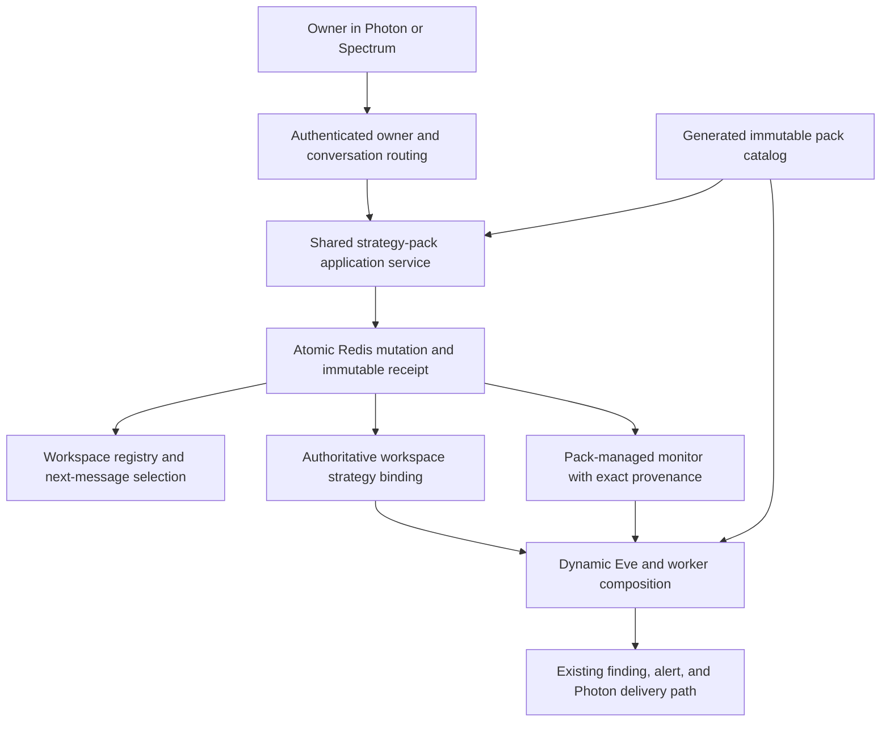
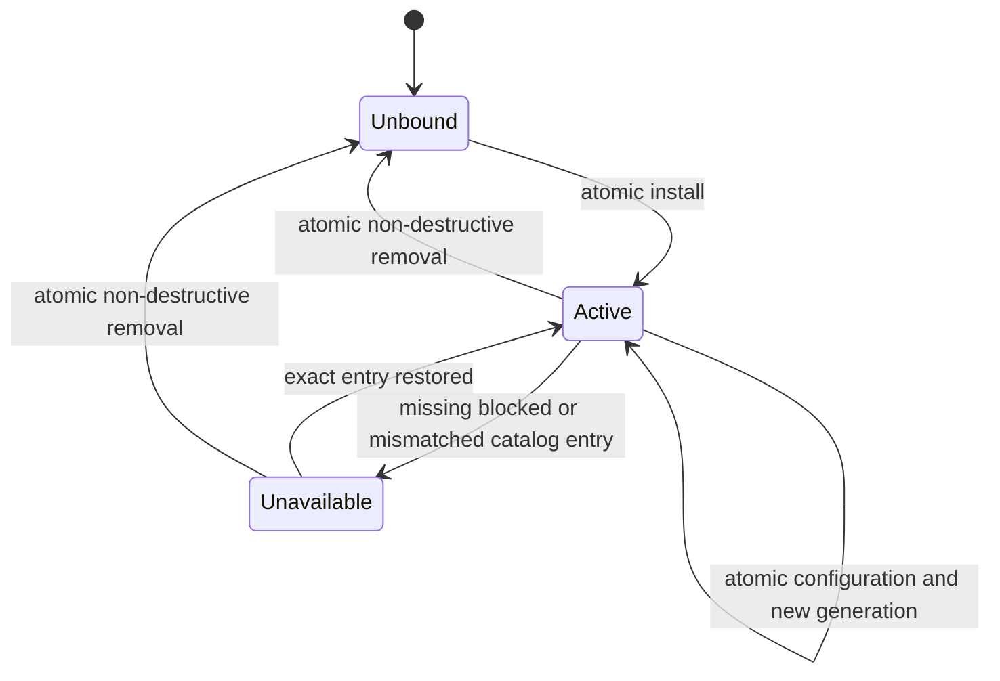

# feat: Complete workspace-runtime acceptance and deliver versioned strategy packs

## Goal Capsule

- **Objective:** Close Spec 1's two production code prerequisites while implementing the first local strategy-pack workflow; then, with owner authorization, complete Spec 1 live acceptance before activating pack features in production.
- **Authority:** `NORTH_STAR.md` is the product authority; `specs/01-independent-workspace-runtimes.md` and `specs/02-versioned-strategy-packs.md` are bounded contracts interpreted through this plan and verified against current code. When prose and code disagree, preserve North Star invariants and correct the spec before widening implementation.
- **Execution profile:** Product-first. Complete ordinary owner workflows and integration evidence before nonblocking crash, race, framework-internal, marketplace, update, or multi-pack hardening.
- **Stop when:** Spec 1 has recorded production acceptance and rollback evidence; a clean fork can deterministically build and verify `IPO Filings@1.0.0`; Eve and Spectrum create, inspect, configure, and remove the same pack-bound session; install-only starts no work; explicit scheduling produces the existing bounded SEC finding and alert path; general and pack-bound sessions remain isolated.
- **Tail ownership:** Production configuration, deployment, real Photon messages, and rollback require the owner's explicit authorization. Local Spec 2 implementation may proceed before that external action, but no pack feature is activated in production until Spec 1 live acceptance passes.

---

## Product Contract

### Summary

Spec 1's local polling foundation is implemented and green. This plan closes only the two code prerequisites exercised by rollout and implements the first reusable strategy pack locally by packaging the accepted IPO workflow rather than rebuilding it. Owner-authorized Spec 1 acceptance may run in parallel when available, but it gates production pack activation, not local U2-U6 work.

### Problem Frame

The repository already has one Eve identity, durable workspaces, schedules, isolated workers, findings, alerts, and an IPO polling workflow. It does not yet have owner-authorized production evidence, and its current strategy document records only an optional pack ID/version plus configuration. Spec 2 must add a deterministic repository catalog and a single authoritative binding without creating a parallel workspace system or pulling forward generalized lifecycle hardening.

### Requirements

**Spec 1 production acceptance**

- R1. Before deployment, schedule failures emit only fixed low-cardinality codes and no raw owner, workspace, monitor, message, prompt, or configuration data.
- R2. The SEC worker rejects a redirect outside its exact declared origin before making a second request; this is the narrow source fence needed for the live reference workflow, not Spec 3's generalized adapter platform.
- R3. Production acceptance proves the complete correlation chain: ingress and workspace assignment → monitor claim and run snapshot → finding → alert/outbox → delivery receipt → Discuss selection/context → next-turn assignment. The proof records bounded identifiers and no private content.
- R4. A monitor in a non-selected workspace continues to run, delivers exactly one workspace-labeled alert, and does not change the selected workspace until the owner invokes Discuss.
- R5. Discuss stores bounded alert context and selects the referenced workspace without starting a model turn; the owner's next message consumes that context in the selected workspace.
- R6. The session manager displays the same authoritative monitor schedule, sources, usage limits/current usage, and health observed by the worker and alert path.
- R7. Rollback independently stops new scheduled workspace-monitor dispatch and new alert-delivery attempts while preserving durable state and ordinary durable-ingress owner turns. Durable Photon ingress is controlled by complete owner-plus-Redis configuration, not by the workspace-state flag alone.

**Strategy-pack product**

- R8. A repository-owned catalog deterministically validates and pins every pack ID, version, content digest, bounded instruction/playbook, configuration schema, source contract, capability request, monitor template, finding contract, and eval-suite reference.
- R9. A workspace has zero or one authoritative pack binding. General-purpose workspaces remain valid; no parallel writable strategy store is introduced.
- R10. Catalog browsing and install-only cause no source fetch, run, paid access, or alert. Pack-managed monitors begin paused unless the same explicit owner request supplies and enables a schedule.
- R11. A concrete request such as “Create an IPO-filings session at 9 AM and 4 PM” creates one server-identified target workspace, one exact binding, and one managed monitor with two local times. Replay creates no duplicate.
- R12. The turn that requested creation remains assigned to its source workspace. Selection of the new session affects only the owner's next message, whose Eve generation resolves the new pack.
- R13. Pack content requests capabilities but never grants them. Effective access remains the intersection of deployment policy, owner authorization, workspace policy, monitor scope, exact pack/source contracts, and hard denials.
- R14. Interactive composition adds only the active pack's mission and playbook to shared Eve behavior. Scheduled workers receive the exact bound pack/resource snapshot and approved source/tool subset; no other pack or workspace context appears.
- R15. Eve natural-language operations and Spectrum controls call the same owner-authorized application services and report the same binding, configuration, resource, health, and mutation state.
- R16. Explicit configuration and non-destructive removal are revision-checked and replay-safe. They advance the session generation, pause or retire only pack-managed resources, and preserve findings, alerts, checkpoints, and owner-created resources.
- R17. `IPO Filings@1.0.0` reuses the existing SEC normalizer, fixture corpus, worker, finding, alert, and delivery code. Pack provenance belongs on run/finding envelopes, not inside reusable canonical SEC facts.
- R18. Missing, blocked, incompatible, or digest-mismatched packs and source contracts fail closed and pause managed work; they never fall back to another version or broaden tools.
- R19. Pack catalog, mutation, runtime composition, and managed dispatch can be disabled independently without deleting bindings or evidence.

### Actors

- A1. The single deployment owner using Eve in Photon/iMessage.
- A2. Eve, resolving pack-aware behavior from authenticated workspace routing.
- A3. Spectrum, presenting and mutating the same application state as Eve.
- A4. The deterministic scheduler and bounded workspace worker.
- A5. The operator performing owner-authorized deployment, evidence capture, and rollback.

### Key Flows

- F1. **Spec 1 live proof:** Configure durable ingress, enable the accepted runtime flags in order, run the IPO monitor while another session remains selected, receive one alert, invoke Discuss, send the next message, inspect manager state, and exercise rollback. Covers R1-R7.
- F2. **Browse or install only:** Inspect the compact catalog or create an IPO-bound session without a schedule; the binding exists, its managed monitor is paused, and no fetch or run occurs. Covers R8-R10, R13.
- F3. **Create with schedule:** From an authenticated source session, request a new IPO session with 9 AM/4 PM times; the service preallocates the target ID and atomically writes registry, binding, runtime state, managed resource, explicit activation, next-message selection, and receipt. Covers R11-R13, R15.
- F4. **Run in isolation:** The next message starts the target session's initial generation with IPO context; a scheduled occurrence revalidates the exact binding/capability/source snapshot and produces the accepted finding/alert. Covers R12-R14, R17-R18.
- F5. **Configure and remove:** Eve or Spectrum changes bounded configuration or removes the pack through the shared service; the other surface immediately shows the same result, old generations become stale, managed work pauses, and durable evidence remains. Covers R15-R16, R19.

### Acceptance Examples

- AE1. Given `Research` is selected and `IPO Filings` has a due monitor, when the monitor completes, then one `IPO Filings` alert arrives and `Research` remains selected until Discuss is invoked.
- AE2. Given a duplicate Photon webhook or mutation request, when it is replayed, then the original receipt is returned and no second model dispatch, workspace, monitor, run, finding, or alert is created.
- AE3. Given install-only with no schedule, when the owner opens the new session, then one exact binding and one paused managed monitor exist with zero fetches, runs, or alerts.
- AE4. Given “Create an IPO-filings session at 9 AM and 4 PM,” when creation succeeds, then the response completes in the source continuation and the next owner message is assigned to the new initial generation.
- AE5. Given a general session and an IPO-bound session, when both are active, then only the IPO session sees IPO mission/playbook content and only its worker receives the SEC source capability.
- AE6. Given explicit removal, when the atomic mutation completes, then pack-managed work is paused or retired while findings, alerts, checkpoints, history, and owner-created monitors remain.

### Scope Boundaries

**Deferred until a real need exists:** generalized pack update/downgrade/replacement, second-pack abstraction generalization, full interactive removal of shared root tools, cross-store archive/start-fresh atomicity, crash recovery outside the pack creation/configuration/removal boundaries, broader credential scanning, and framework-private API hardening.

**Owned by later specs:** generalized public-source adapters and event ingestion (Spec 3), strategy scoring for Congressional/Insider/Cramer workflows (Specs 4-5 and later), cross-workspace signals (Spec 6), paid-provider activation, private artifacts, Telegram/HTTP delivery, and live trading.

### Dependencies

- The local Spec 1 polling implementation and its deterministic/Redis/compiled-worker tests are the code baseline.
- Installed Eve 0.33 dynamic instructions, skills, and tools resolve at session lifecycle boundaries; dynamic tool executors must remain inline for replay.
- Upstash Redis remains the durable production store and memory clients remain deterministic fixtures.
- Real deployment, owner mapping, secrets, and Photon interaction remain owner-authorized external actions.

### Outstanding Questions

None block implementation. Production alert acceptance uses a bounded owner-authorized replay of one real filing already present in the live SEC feed: a disposable acceptance monitor begins immediately before that canonical item, follows the ordinary scheduler/worker/finding/alert path, and is retired after evidence capture. It is not a fixture bridge, fabricated filing, or persistent product endpoint. The first second pack/version will decide whether exact compatibility fields need a generalized semver-range engine and whether shared interactive root tools should become fully workspace-conditional.

---

## Planning Contract

### Product Decisions

- KD1. session-settled: Functionality and the ordinary owner workflow come before nonblocking hardening. Chosen over completing the historical hardening ledger first. Governs R1-R19.
- KD2. session-settled: The specs remain lean product contracts; this plan owns implementation sequencing and file-level detail. Chosen over duplicating sprint ledgers across specs and handoffs. Governs R8-R19.
- KD3. session-settled: Local Spec 2 work may proceed while the owner schedules Spec 1 production acceptance, but production pack activation waits for that evidence. Chosen over blocking all local development on an external action or silently rolling out without it. Governs R3-R7, R19.

### Key Technical Decisions

- KTD1. Evolve the existing `strategy` document in `agent/lib/workspace-state-store.ts` into the authoritative versioned binding with dual-version readers and explicit CAS migration. A v1 null pack becomes v2 unbound; a v1 non-null pack becomes unavailable/legacy-unverified and is never silently activated or used to adopt monitors. Keep migration separate from the other v1 workspace documents and store immutable mutation receipts separately. This avoids two writable truths and makes the reader-compatible release the rollback floor. Governs R9, R15-R16.
- KTD2. Generate a typed catalog from declarative repository packages using the existing generated-module pattern. Run generation before dev, typecheck, application build, and Eve build so a clean fork behaves identically. Governs R8, R17-R18.
- KTD3. Use one bounded atomic multi-key Redis mutation for create/install and one for configuration/removal. The workspace registry, strategy state, capabilities, monitors/indexes, selection, and receipts already share one Upstash Redis transaction domain, so a saga would add avoidable partial states. Prevalidate outside the transaction; the Lua/transaction boundary compares expected serialized revisions and either writes the complete new state plus immutable receipt or writes nothing. Reuse a saga only if implementation proves a concrete cross-system or transaction-size boundary. Governs R10-R12, R16.
- KTD4. Add a shared pack application-service layer used by Eve tools and Spectrum actions. Authenticated routing supplies owner, conversation, and current assignment; clients never supply authoritative ownership, grants, or arbitrary target IDs. Governs R11, R13, R15.
- KTD5. Preserve generation-exact boundaries: new bound workspaces start their initial generation; configuration/removal atomically advance generation with the new binding state; runtime resolves the exact workspace/generation/binding-revision/pack-digest tuple and unmatched tuples fail closed. Because Eve resolves dynamic instructions at session start, configuration/removal explicitly starts a fresh conversation generation for future messages; the owner sees that consequence before confirming. Durable brief/findings remain. A creation turn never changes its existing assignment. Governs R12, R14, R16.
- KTD6. Extend monitor provenance and worker/run/finding envelopes with an exact pack snapshot while leaving canonical SEC facts strategy-neutral. Revalidate before source access and commit. Governs R13-R14, R17-R18.
- KTD7. Narrow interactive isolation claims to what Eve 0.33 can prove: only the active pack's added mission/playbook is composed and pack executors reauthorize; shared static root tools remain governed by existing workspace authorization. Complete conditional removal of shared tools is deferred. Governs R13-R14.
- KTD8. Treat complete owner mapping plus a complete Redis credential pair as the durable-ingress cutover. Workspace flags then control state/writes/dispatch/alerts; rollback of dispatch is distinct from returning to legacy ingress. Governs R3-R7, R19.
- KTD9. Prove the real production alert without waiting indefinitely for a new SEC filing and without introducing a fixture endpoint. An owner-authorized operator smoke selects a canonical S-1 already present in the current live feed, initializes a disposable acceptance monitor immediately before it, and then lets the ordinary production path detect and deliver it. Evidence is retained and the monitor is retired; the filing is labeled as an acceptance replay. Governs R3-R7, R17.
- KTD10. Derive mutation identity in application code. Eve uses durable authenticated ingress/turn/step identity plus operation ordinal and canonical payload digest; Spectrum uses a server-minted signed one-time action identity. Persist the mapping in the same atomic mutation so transport or step replay reconstructs the same ID, while a later intentional request receives a new one. Governs R11-R12, R15-R16.

### High-Level Technical Design



```mermaid
sequenceDiagram
  participant O as Owner
  participant S as Source session
  participant P as Pack service
  participant W as New workspace
  O->>S: Create IPO session at 9 and 4
  S->>P: Authenticated request and stable request ID
  P->>P: Validate payload and preallocate target ID
  P->>W: Atomically create state, binding, resource, selection, receipt
  P-->>S: Creation result; current turn stays in S
  O->>W: Next message
  W->>W: Resolve initial generation and exact pack context
```



### System-Wide Impact

The durable mutation crosses registry, strategy binding, brief/budget/capabilities, managed monitors/indexes, generation routing, selection, and receipts. These records share one Redis transaction domain. A mutation prevalidates bounded canonical values, then one multi-key compare-and-write atomically commits the complete state or nothing. A target is routable only when its exact generation, binding revision, pack digest, capability revision, and reciprocal managed-resource provenance agree. Managed monitors remain paused when a binding is unavailable or unbound; runtime revalidates the coherence tuple before source access and finding/alert commit, so leased work cannot commit after configuration or removal.

Replay reads the immutable receipt only when its request identity and canonical payload digest match. A duplicate ID with different payload conflicts. There is no durable installing/configuring/removing state in v1: the UI may show a local pending state while the atomic request runs, then renders active, unavailable, unbound, conflict, or failure from authoritative state. Failure never deletes findings or adopts an unproven monitor.

| Mode | Required configuration | Allowed behavior |
| --- | --- | --- |
| Legacy ingress | Runtime flags off; complete owner mapping absent | Existing ordinary chat only; no durable ingress records |
| Durable ingress, runtime off | Complete owner mapping and Redis pair; runtime flags off | Owner-authorized ordinary turns and durable receipts; no workspace runtime work |
| Workspace state/writes | Durable ingress plus state, then monitor-write flags | Read/manage durable state; create/edit monitors; no worker until dispatch |
| Worker dispatch | Workspace state plus dispatch | Scheduled monitor claims and bounded workers; alert send still separately gated |
| Alert delivery | Workspace state plus Photon-alert flag | Staged alerts may send; disabling preserves outbox/receipts |
| Pack catalog/mutations | Durable ingress/state plus exact pack catalog and mutation flags | Inspect or mutate bindings; install-only remains paused |
| Pack runtime/managed dispatch | Exact active binding plus pack-runtime flag; managed dispatch also intersects workspace dispatch | Compose exact pack context and run managed monitors; disabling runtime makes bindings unavailable, never silently general-purpose |

Schema rollback is not arbitrary binary rollback. U3 first deploys dual readers with all pack writes disabled; only after mixed v1/v2 reads pass may v2 writes activate. The supported code rollback target is that reader-compatible release plus feature flags. Receipts, provenance, historical catalog entries, findings, alerts, and checkpoints remain durable while referenced.

### Sequencing

1. Correct the two Spec 1 production prerequisites and make rollout semantics/tests explicit.
2. Build the deterministic pack schema/catalog and flag resolver, then deploy dual readers before enabling any evolved strategy/source/monitor writes.
3. Implement only replay-safe create/install and the shared service.
4. Add dynamic Eve/worker composition, package IPO Filings, wire create/inspect through Eve and Spectrum, and prove the first local vertical flow.
5. Add atomic configuration/removal and the complete manager state model in U8.
6. With owner authorization, complete Spec 1 live acceptance, activate pack flags in stages, run the Spec 2 live smoke, and record rollback.

### Implementation Constraints

- Read relevant installed Eve and Next documentation before framework changes and search the Eve registry before implementing an integration.
- Reuse Spec 1 stores and execution paths; do not create a second workspace, monitor, finding, alert, capability, budget, or strategy authority.
- Keep pack manifests declarative and bounded: no credentials, owner data, scripts, arbitrary remote code, or live broker authority.
- Use exact IDs/digests and compare-and-set revisions at every durable pack mutation boundary.
- Keep pack-managed resources distinguishable from owner-created resources through immutable provenance.
- One temporary worktree/branch at a time; merge reviewed increments back to `main` and remove the worktree.

---

## Implementation Units

### U1. Close Spec 1 production prerequisites and rollout contract

- **Goal:** Make the live reference path safe and the deployment order truthful without reopening deferred hardening.
- **Requirements:** R1-R2, R7.
- **Files:** `agent/schedules/event-triggers.ts`, `agent/lib/workspace-runtime-observability.ts`, `agent/tools/fetch_public_source.ts`, `agent/lib/sec-ipo-evaluation.ts`, `specs/fixtures/01-independent-workspace-runtimes/feature-flags.md`, `scripts/verify-workspace-runtime-observability.mjs`, SEC fetch/evaluation fixtures.
- **Approach:** Replace free-form schedule error logging with the fixed catalog and privacy-safe fields. Add an exact allowed-origin fence that rejects an undeclared redirect before a follow-up request. Document owner-plus-Redis durable-ingress cutover separately from workspace runtime flags.
- **Test scenarios:** Raw identifiers/error text never reach the log sink; same-origin SEC behavior still works; off-origin redirect makes one request only; incomplete owner/Redis config fails closed; worker rollback preserves durable ingress/state.
- **Verification:** Focused observability, source-fence, Photon rollout, SEC fact/live-fixture, typecheck, and build tests.

### U2. Add the deterministic pack package and catalog

- **Goal:** Turn reviewed repository files into one immutable runtime catalog.
- **Requirements:** R8, R18-R19.
- **Files:** `strategy-packs/`, `scripts/fixtures/strategy-packs/`, `agent/lib/strategy-pack-schema.ts`, `agent/lib/strategy-pack-catalog.ts`, `agent/lib/strategy-pack-catalog.generated.ts`, `agent/lib/strategy-pack-flags.ts`, `scripts/generate-strategy-pack-catalog.mjs`, `scripts/verify-strategy-packs.mjs`, `.env.example`, `package.json`.
- **Approach:** Define only the v1 fields used by IPO Filings, validate confined bounded files and exact references, compute deterministic digests, and generate a model-safe listing plus full typed entries. Add `prepare:strategy-packs` to `predev`, `pretypecheck`, `prebuild`, and `prebuild:agent`. Implement catalog, mutation, runtime-composition, and managed-dispatch flags with the dependency intersections in System-Wide Impact.
- **Test scenarios:** Clean-fork generation is stable; duplicate IDs, path escape, oversize content, missing refs, incompatible versions, and digest drift fail; listing omits full instructions/config schemas; a minimal test-only second pack with distinct mission/configuration/source/resource identity proves generation has no IPO-specific branch; partial/invalid flag combinations fail closed; disabling runtime leaves an existing binding unavailable rather than general-purpose.
- **Verification:** `npm run verify:strategy-packs`, generation diff check, typecheck, application build, and Eve build.

### U3. Evolve authoritative workspace contracts

- **Goal:** Represent exact bindings, source contracts, and pack-managed resources in existing Spec 1 stores.
- **Requirements:** R9-R10, R13, R16-R18.
- **Files:** `agent/lib/workspace-state-store.ts`, `agent/lib/workspace-monitor-store.ts`, `agent/lib/ipo-filings-workspace-runtime.ts`, `scripts/verify-workspace-state-store.ts`, `scripts/verify-workspace-monitor-store.ts`, related Redis fixtures.
- **Approach:** Add dual-version strategy readers and explicit no-write-on-read CAS migration. A v1 null binding becomes v2 unbound; a v1 non-null binding becomes unavailable/legacy-unverified. The v2 record carries last-active and pending generation-exact snapshots, digest, lifecycle/revision, configuration/overrides, resource mapping, and bounded health. Add exact source contract version/digest to capability sources. Let deterministic monitor creation start paused and carry reciprocal immutable pack provenance; owner monitors retain `managedBy: null`.
- **Test scenarios:** v1 null/non-null, v2, mixed-deployment, CAS-conflict, interrupted migration, and rollback-reader fixtures pass in memory and Redis; one authoritative binding is enforced; invalid/mismatched source contracts fail; install-only monitor is paused; binding maps and monitor provenance must agree; removal never selects owner-created monitors.
- **Verification:** Workspace state/monitor/capability memory and Redis suites plus schema-size assertions.

### U4. Deliver the creation-only pack mutation service

- **Goal:** Create and install one pack-bound session as a replay-safe operation before expanding the lifecycle.
- **Requirements:** R10-R12, R15.
- **Files:** `agent/lib/photon-workspace-store.ts`, `agent/lib/strategy-pack-transaction.ts`, `agent/lib/strategy-pack-service.ts`, `scripts/verify-strategy-pack-mutations.mjs`, `scripts/verify-strategy-pack-mutations-redis.mjs`.
- **Approach:** Before the atomic write, load the exact catalog entry, canonicalize/validate the payload against that version, reject unknown/oversized or authority-expanding fields, preallocate the server UUID, and derive the stable mutation ID per KTD10. Preserve the pending-financial-approval guard both before validation and in the transaction's expected registry state. Reject duplicate normalized names or exhausted capacity with a stable terminal receipt and no target. The transaction writes brief, budget, capabilities, strategy binding, managed monitor/index, optional explicit schedule, registry/selection, mutation mapping, and receipt together. Every read/retry rederives current authority; a mutation ID is never a bearer capability.
- **Test scenarios:** Same-ID/same-payload replay returns one target and same-ID/different-payload conflicts; Photon/Eve/Spectrum transport or step replay derives the same ID while a later request gets a new one; forged/wrong-version/oversized/authority-expanding fields fail before persistence; pending financial approval blocks creation/selection; name/capacity rejection creates no target; an injected transaction failure leaves every key unchanged; all runtime revisions exist when the workspace first becomes routable; explicit two-time schedule enables once.
- **Verification:** Memory and real Redis mutation suites, workspace registry tests, monitor tests, and next-message assignment fixtures.

### U5. Compose pack-aware Eve and worker runtimes

- **Goal:** Apply the exact active pack at durable session/run boundaries without leaking other packs or expanding authority.
- **Requirements:** R13-R14, R17-R18.
- **Files:** `agent/instructions.md`, `agent/instructions/`, `agent/skills/`, `agent/lib/strategy-pack-runtime.ts`, `agent/lib/workspace-worker-auth.ts`, `agent/lib/workspace-worker-runner.ts`, `agent/lib/workspace-worker-control-plane.ts`, `agent/lib/workspace-finding-store.ts`, `agent/subagents/workspace-worker/`.
- **Approach:** Move shared instructions into the directory layout, add session-start dynamic mission/skill composition, and attach exact pack/resource snapshots to worker/run/finding envelopes. Resolve and revalidate the exact workspace/generation/binding-revision/pack-digest tuple plus capability, monitor, source, and reciprocal provenance before fetch and again before finding/alert commit. Preserve inline dynamic executors and the existing worker type.
- **Test scenarios:** General, IPO, and minimal test-pack sessions expose only their distinct added context/source/resource identity; other catalog contents stay absent; forged/stale snapshots fail; unavailable bindings fail closed; parallel workers do not leak context; canonical SEC facts remain pack-neutral.
- **Verification:** Eve capability fixtures, workspace isolation, worker auth/control-plane, compiled-worker, and finding-store suites.

### U6. Package IPO Filings and expose one service through Eve and Spectrum

- **Goal:** Prove the owner-visible create, inspect, next-message, and scheduled-result flow before building the rest of the lifecycle.
- **Requirements:** R8-R15, R17-R18.
- **Files:** `strategy-packs/ipo-filings/1.0.0/`, `agent/tools/`, `agent/lib/photon-workspace.ts`, `agent/channels/photon.ts`, `agent/channels/photon-workspace-app.ts`, `agent/instructions.md`, `scripts/fixtures/sec-ipo/`, strategy-pack and manager verification scripts.
- **Approach:** Package references to the existing SEC adapter/finding/eval IDs. Route concrete pack-plus-configuration creation to the pack-aware service while generic “create a session” continues to open the manager. Add Eve and Spectrum catalog/create/inspect surfaces over the same durable mutation. The existing session manager remains the entry point: pack identity/health first, managed schedule/source status next, and configuration/removal reserved for U8. Pack actions use the durable mutation ID rather than the legacy manager's pre-consumed one-shot claim.
- **Test scenarios:** Inspect and install-only are inert; concrete natural language creates/configures one session; generic session language opens the manager; Eve/Spectrum create/inspect parity holds; active healthy, pending, conflict/failure, and unavailable states render without duplicate actions; existing IPO match/amendment/dedupe/no-match/alert behavior is unchanged.
- **Verification:** `npm run verify:strategy-packs`, owner-workflow, Photon harness/manager, SEC fact/live-fixture, scheduled compiled-worker, and browser/mobile manager checks.

### U8. Add configuration, removal, and complete Spectrum states

- **Goal:** Complete the explicit lifecycle only after the first create-and-run vertical slice is proven.
- **Requirements:** R15-R16, R18-R19.
- **Files:** `agent/lib/strategy-pack-transaction.ts`, `agent/lib/strategy-pack-service.ts`, `agent/channels/photon-workspace-app.ts`, `agent/tools/`, mutation and manager verification scripts.
- **Approach:** Add generation-exact configure/remove transactions with reciprocal provenance and expected-revision checks. The same atomic write pauses/retires managed work, advances generation, updates/clears the binding, preserves evidence, and creates the receipt. Extend fixed low-cardinality observability to pack failures; log only enumerated codes and bounded correlation digests, never raw identity, request, configuration, catalog/source content, or exception text. Spectrum shows identity/health in the session summary, managed work next, configuration as a secondary action, and removal in a separated danger area; both confirmations state that future messages start a fresh conversation generation while durable research remains.
- **Test scenarios:** Same request replay returns its receipt and different payload conflicts; an injected transaction failure changes no key; configuration/removal prevent leased commits through generation-exact revalidation; provenance mismatch fails unavailable; owner resources/evidence survive. Spectrum covers loading/empty/pending/success/revision-conflict/failure/unavailable/removal-confirmation states with disabled conflicting controls, safe retry, status announcements, fresh-generation copy, and parity with Eve. Log-sink fixtures reject private/high-cardinality values at each failure boundary.
- **Verification:** Memory/Redis lifecycle suites, Eve/Spectrum entry-point parity, runtime stale-generation checks, privacy-sink assertions, and browser/mobile/accessibility checks.

### U7. Run integration, production acceptance, and rollback

- **Goal:** Prove the North Star owner experience locally and, with authorization, in the real deployment.
- **Requirements:** R3-R7, R11-R19. Depends on U8.
- **Files:** `scripts/verify-strategy-pack-acceptance.mjs`, a bounded owner-authorized live acceptance script/template, `agent/lib/workspace-monitor-store.ts`, `specs/01-independent-workspace-runtimes.md`, `specs/fixtures/01-independent-workspace-runtimes/feature-flags.md`, `HANDOFF.md`, `NORTH_STAR.md`, `BACKLOG.md` only for verified outcomes or genuinely deferred work.
- **Approach:** Add one high-signal local vertical test through production scheduler → compiled worker → durable finding/alert → production delivery adapter → Discuss → next ingress routing, plus pack creation and runtime composition. First deploy dual readers with pack writes disabled. After mixed-state checks, perform each flag stage as a deployment/propagation event. The operator-only acceptance initializer validates a selected item against the current live SEC feed and atomically creates the paused disposable monitor with a checkpoint immediately before that item; it is never exposed through Eve, Spectrum, or a persistent endpoint. Enable it, let the ordinary path produce the labeled replay, capture evidence, retire it, and test scheduled-dispatch/alert rollback while durable ingress and ordinary owner turns remain available.
- **Test scenarios:** The acceptance initializer rejects items absent from the current feed and seeds the exact prior checkpoint; a normal null checkpoint still establishes a no-alert baseline; owner-plus-Redis with runtime flags off uses durable ingress; partial config causes no model dispatch; duplicate webhooks dispatch once; selected workspace remains unchanged until Discuss; install-only makes zero fetches; explicit 9/4 schedule produces the reference result; dispatch off prevents new monitor claims while an owner turn works; alerts off preserves staged records without sending; in-flight work settles terminal/uncertain; manager/state remain readable; every pack kill switch leaves bindings/evidence intact and fails closed.
- **Verification:** Full contract below plus a timestamped owner-authorized acceptance record containing deployment ID/commit, resolved ingress mode and flags, catalog/pack digests, privacy-safe receipt correlations, smoke outcomes, rollback outcome, and final feature state.

---

## Verification Contract

| Gate | Commands or evidence | Applies after |
| --- | --- | --- |
| Static and builds | `npm run typecheck`; `npm run build:agent`; `npm run build -- --webpack` | Every implementation unit touching runtime code |
| Existing Spec 1 contracts | `npm run verify:workspace-runtime:contracts`; Photon rollout, harness, ingress, scope, owner, owner-workflow, manager, alert app/context/replies/delivery/subscription, flags, Redis, and observability commands from `package.json` | U1 and final regression |
| Reference worker | `npm run verify:workspace-runtime:sec-ipo-scheduled-compiled`; existing SEC fact/live-fixture and isolation commands from `package.json` | U1, U5-U7 |
| Pack catalog/runtime | `npm run verify:strategy-packs`; generated-catalog clean diff; pack runtime/isolation fixtures | U2-U7 |
| Durable mutations | `npm run verify:strategy-packs:redis`; replay, concurrent install, stale revision, and injected atomic-failure cases | U4-U8 |
| Local vertical acceptance | `npm run verify:strategy-packs:acceptance` through real production callers with fake external delivery/model boundaries | U6-U7 |
| Clean-fork adoption | From empty durable state and documented minimal configuration, generate the catalog, create the IPO-bound session, and run the paper-only fixture flow end to end with no paid credentials, inherited records, or maintainer-only setup | U6-U7 |
| UX | Authorized browser/mobile check of Spectrum plus natural-language routing fixtures; keyboard-only operation, visible focus/focus return, semantic health labels, live mutation-state announcements, and mobile touch targets | U6-U8 |
| Production | Owner-authorized Photon receipt chain, manager check, pack smoke, and rollback record | U7 only |

Tests must exercise production contracts/callers where the gate claims integration. Source-text assertions, mock-only helpers, typecheck, and builds may supplement but cannot substitute for the production path. Real owner identifiers, messages, prompts, source bodies, and credentials must not enter test output or acceptance records.

---

## Definition of Done

- U1-U8 meet their stated test scenarios and verification gates with no unresolved P0/P1 review findings.
- Spec 1's local implementation and production acceptance are labeled separately and its live evidence proves R3-R7.
- A clean fork with empty durable state and documented minimal configuration deterministically generates the same catalog/digest, creates the IPO-bound session, and completes the paper-only fixture workflow without paid credentials or maintainer-only setup.
- General-purpose, pack-bound, and differently bound sessions coexist without cross-workspace or cross-pack leakage.
- Install-only is inert; explicit schedule activation is exact; duplicate creation/run/delivery requests do not duplicate effects.
- Eve and Spectrum agree on one authoritative binding and mutation service.
- Non-destructive removal preserves durable evidence and owner-created resources.
- Rollback disables catalog exposure, new pack mutations, composition, scheduled managed dispatch, and alert delivery independently while preserving durable ingress, ordinary owner turns, and all durable state. Binary rollback never crosses below the dual-reader schema release.
- Specs and handoff documents state only verified implementation/production facts; deferred work sits once in its owning spec or `BACKLOG.md`.
- Abandoned approaches, temporary fixtures, duplicate stores, dead feature flags, and debug logging are removed from the final diff.
