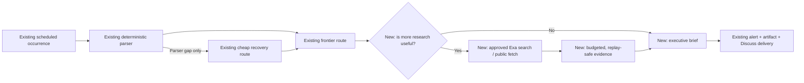

# Bounded Research Agency for Durable Monitors

## Goal Capsule

Extend Eve's existing durable-monitor pipeline at the frontier stage. After the current scheduled occurrence, deterministic parser, optional cheap recovery, and frontier materiality route have produced candidate facts, the frontier model may decide that supplementary research is useful. It can then use the existing Exa search integration and one bounded public-document fetch, with model and tool costs charged to the workspace's existing total paid budget. The result becomes a concise executive brief and, when research or multiple sources are involved, a readable artifact delivered through Eve's existing alert and Discuss plumbing.

The first implementation and Production proof is IPO Filings. Commentary, Earnings, and Congressional Signals migrate in separate follow-on sprints/specs only after IPO passes. This plan does not build a new scheduler, source-event system, hybrid engine, provider framework, Session Management redesign, artifact store, or trading system.

---

## Product Contract

### Existing foundation versus new work

| Existing and reused | New in this plan |
| --- | --- |
| Scheduled durable occurrence and duplicate-tick protection | Persisted frontier decision: report now or research needed |
| Deterministic source acquisition and parsing | Existing Exa search exposed only after `research_needed` |
| Registered cheap-model parser recovery | One occurrence-scoped bounded public-document fetch |
| Qualified frontier materiality route | Replay-safe paid-call claim and result receipt |
| Workspace budget ledger and cost reservations | Child model/tool spend enforced inside the occurrence's paid envelope |
| Findings, alerts, artifacts, and Discuss delivery | Shared executive brief and deterministic artifact threshold |
| Workspace isolation and approval-gated Coinbase | IPO reference adoption and one bounded Production acceptance |

### Requirements

#### Frontier research decision and tools

- **R1.** Keep the current scheduled occurrence, deterministic parser, registered cheap recovery, and qualified frontier route. Do not replace or generalize those systems in this implementation.
- **R2.** A cadence occurrence with no new eligible facts after the existing cursor and deduplication checks must complete as no-change without frontier reasoning, web search, document fetch, or artifact work.
- **R3.** When candidate facts reach the frontier route, the model must persist one structured decision: `report_now` or `research_needed`. A normal no-signal result continues through the existing semantic outcome.
- **R4.** A `research_needed` decision may expose only two reviewed read-only tools in the IPO reference sprint: the existing Exa-backed search and one bounded public-document fetch. There is no generic provider executor and no arbitrary built-in browsing.
- **R5.** A fetch URL must be either an existing IPO/SEC-approved URL or the exact normalized HTTPS URL from a validated Exa result in the same owner, workspace, occurrence, and research decision. Credentials, private/local addresses, unsafe redirects, unsupported content types, and oversized responses fail closed.
- **R6.** Research is optional context. Search/fetch failures or budget denial must not erase a valid primary IPO fact or create another occurrence; the frontier completes once with the limitation stated.

#### Combined budget and replay-safe receipts

- **R7.** Frontier inference, Exa search, and any paid document retrieval caused by the occurrence must reserve and reconcile against the workspace's existing total paid budget and the monitor's per-occurrence paid limit.
- **R8.** The scheduled occurrence owns the run and active-worker slot. Its model/tool child reservations count toward its paid envelope and category usage but do not consume additional scheduled-run or concurrent-worker slots.
- **R9.** Before a paid call, Eve must atomically claim a stable occurrence-scoped attempt identity. Duplicate workers reuse or wait for that attempt; they cannot both call the provider. A provider idempotency key is supplied when the provider supports one.
- **R10.** After a paid call, Eve must durably store the bounded normalized result, source/content digest, provider request or result identifier, and reserved/actual/uncertain cost before the frontier uses it. A crash after that receipt reuses it instead of searching, fetching, or paying again.
- **R11.** Trustworthy provider cost reconciles the reservation to actual spend. Ambiguous completion keeps the conservative reservation and suppresses automatic repetition. Receipts remain bounded and reuse existing storage conventions; this plan does not redesign the ledger or create a general retention framework.

#### Executive brief and artifact output

- **R12.** The frontier submits a structured executive result containing material facts, interpretation, implications, confidence/uncertainty, and direct sources without hidden chain-of-thought.
- **R13.** A simple primary-source result renders as a concise workspace-labeled alert. A readable artifact is required when supplementary research ran, more than one independently material fact/source is used, or the validated alert exceeds the existing Photon message envelope.
- **R14.** Artifact content is composed and published through the existing validated artifact service. The model may request artifact presentation through its structured result but does not receive arbitrary publication or filesystem authority.
- **R15.** Alert and artifact references flow through the existing workspace finding, Photon delivery, and Discuss context. They must not enter Main or another workspace's model context.

#### IPO-first rollout and compatibility

- **R16.** Ship the shared additions through a new immutable IPO Filings pack version. Existing IPO and other pack versions remain unchanged and are not automatically upgraded.
- **R17.** Perform exactly one bounded IPO Production acceptance with a fresh zero-usage workspace, one occurrence, terminal pause, cost/result/delivery verification, and cleanup. A failed first occurrence is not retried or followed by another fix in that acceptance.
- **R18.** Preserve current workspace isolation, source provenance, deduplication, scheduler behavior, and approval-gated Coinbase behavior. No research capability or budget is trading authority; future autonomous trading remains possible only through a separate owner-approved financial policy.
- **R19.** After IPO is green, migrate Commentary, Earnings, and Congressional Signals in separate sprints/specs with their own regression proof. Congressional migration cannot begin until the defect in `docs/congressional-monitor-retry-defect.md` is fixed independently.

### Key Decisions

1. **Use the existing monitor and hybrid pipeline.** *(session-settled: user-directed — chosen over rebuilding the scheduler or extraction system: these foundations already exist and are not the missing capability.)* Governs R1–R3.
2. **Initial tools are existing Exa search plus bounded public-document fetch.** *(session-settled: user-directed — chosen over a generic paid-provider framework: the first sprint should prove the requested agency with known plumbing.)* Governs R4–R6.
3. **Model and paid-tool costs share the current workspace budget.** *(session-settled: user-directed — chosen over inference-only accounting or a new provider budget: the configured workspace amount is the total background-agent envelope.)* Governs R7–R11.
4. **Executive output reuses existing alerts and artifacts.** *(session-settled: user-directed — chosen over a new report or delivery system: the missing piece is useful synthesis, not publication infrastructure.)* Governs R12–R15.
5. **Prove IPO first and migrate each remaining strategy separately.** *(session-settled: user-directed — chosen over one multi-pack release: each strategy needs independent regression proof.)* Governs R16–R19.
6. **Coinbase is compatibility-only in this work.** *(session-settled: user-directed — chosen over autonomous-trading implementation now: existing approval gating stays unchanged while a future separate policy remains possible.)* Governs R18.

### Scope Boundaries

#### In scope now

- Persisted frontier `research_needed` decision.
- Existing Exa search and one occurrence-scoped bounded public-document fetch.
- Atomic paid attempts, replay-safe receipts, nested budget enforcement, and actual-cost reconciliation.
- Shared structured executive brief and reuse of the existing artifact/alert/Discuss path.
- New immutable IPO pack version and one Production acceptance.
- Focused regression proof for research replay, atomic paid calls, budget nesting, safe fetch authorization, and zero-spend no-change occurrences.

#### Explicitly out of scope

- New scheduler or source-event wakeup architecture.
- Rewrite or broad refactor of the existing hybrid extraction engine.
- Generic provider registry/executor or integrations beyond existing Exa and public fetch.
- Migrating multiple strategy packs in the IPO sprint.
- Autonomous Coinbase implementation or financial-policy infrastructure.
- Broad Session Management redesign or new budget controls.
- Congressional retry-defect repair.
- Owner-private artifact storage.
- General credential, licensing, retention, or pricing architecture for unknown future providers.
- Broad ledger aggregation or retention redesign.

### Success Criteria

- **SC1.** No-new-facts IPO cadence checks complete without frontier, search, fetch, or artifact spend.
- **SC2.** The frontier can report the primary IPO signal directly or persist `research_needed`, use only Exa/public fetch within fixed bounds, and complete once.
- **SC3.** Duplicate workers and replay after research cannot repeat a provider call or charge.
- **SC4.** Child inference/tool reservations count toward the occurrence and workspace paid limits without consuming extra worker slots; actual and conservative spend reconcile through existing status surfaces.
- **SC5.** The IPO owner alert explains what was filed, why it may matter, uncertainty, and direct sources; researched/multi-source output includes a readable artifact and the existing Discuss action.
- **SC6.** Existing pack versions, unrelated monitors, Main context, and approval-gated Coinbase remain unchanged.

### Acceptance Examples

- **AE1 — No change:** The SEC feed contains no new eligible filings after cursoring. The occurrence completes with no frontier or tool call and advances exactly as the existing no-change policy requires.
- **AE2 — Report now:** A new S-1 is sufficiently understandable from the official filing. The frontier returns an executive brief without search and Eve delivers one useful alert/artifact outcome.
- **AE3 — Research needed:** The filing needs issuer or market context. The persisted decision exposes Exa, one exact search-result URL receives a same-occurrence fetch grant, and the final artifact distinguishes official filing facts from supplementary context.
- **AE4 — Crash after research:** Exa succeeds and its receipt/result is stored, then the worker crashes before the final report. Recovery uses the stored evidence and cost without another Exa call.
- **AE5 — Duplicate workers:** Two workers reach the same paid attempt simultaneously. One atomically owns the call and the other reuses/waits for its result; only one provider charge exists.
- **AE6 — Research unavailable:** Exa, fetch, or budget admission fails after a valid IPO signal. Eve reports the primary signal with a concise limitation and does not dispatch another occurrence.

---

## High-Level Technical Design

This is the exact intended boundary: four existing stages, three new capabilities, and the existing delivery path.

### Five required regression safeguards

1. **Research replay:** persist the research decision and normalized tool receipt before final synthesis; recovery reuses them.
2. **Atomic paid calls:** atomically claim one stable attempt before provider execution; duplicate workers cannot both call.
3. **Budget nesting:** child reservations share the parent occurrence's paid envelope without incrementing worker/run counters.
4. **Safe document retrieval:** fetch only an existing approved IPO/SEC URL or an exact URL from the same occurrence's validated Exa receipt.
5. **No-change efficiency:** stop before frontier/tool work when cursoring and deduplication produce no new facts.

---

## Implementation Units

### U1. Add the frontier research decision and bounded tools

**Status:** Done — 2026-08-20

**Goal:** Let the existing frontier route persist `report_now` or `research_needed` and, only for the latter, use existing Exa plus one safe public-document fetch.

**Requirements:** R1–R6; SC1–SC2; AE1–AE3, AE6.

**Dependencies:** None.

**Files:**

- `agent/lib/hybrid-evidence-semantic.ts`
- `agent/lib/hybrid-evidence-worker.ts`
- `agent/subagents/hybrid-evidence-worker/instructions.md`
- `agent/subagents/hybrid-evidence-worker/tools/capabilities.ts`
- `agent/lib/web-corroboration-search.ts`
- Focused IPO/frontier research helper under `agent/lib/`
- Focused verifier under `scripts/`

**Approach:**

1. Preserve the current model routes and source parser/recovery behavior.
2. Exit before frontier execution when the existing IPO cursor/deduplication result has no new eligible facts.
3. Persist the frontier research decision under the existing signed occurrence/job identity.
4. Dynamically expose existing Exa search only after `research_needed`.
5. Grant public fetch only to an existing approved IPO/SEC URL or an exact normalized URL from that occurrence's validated Exa receipt; enforce HTTPS, public-network, redirect, content-type, byte, and timeout bounds.
6. Treat search/fetch output as supplementary hostile evidence and keep official filing facts authoritative.

**Execution note:** Begin with focused failing tests for no-change zero spend, report-now without tools, and research-needed exact tool exposure. If IPO's current outer wrapper demonstrably spends before its deterministic evaluator, make only the smallest IPO adopter-path correction; do not generalize it into scheduler or hybrid-engine work.

**Test scenarios:**

- Covers AE1. No new IPO facts cause no frontier/search/fetch/artifact call.
- Covers AE2. `report_now` exposes no research tools.
- Covers AE3. `research_needed` exposes Exa and fetches only an exact same-occurrence validated URL.
- Search-result prompt injection, credentialed URLs, private/local destinations, unsafe redirects, oversized content, and unsupported media fail before fetch.
- Covers AE6. Research denial/unavailability preserves the primary IPO signal and completes once.

**Verification:** Focused hybrid and IPO tests prove that only the intended frontier branch changes and the existing parser/recovery/scheduler contracts remain intact.

### U2. Enforce combined spend with atomic replay-safe receipts

**Status:** Complete

**Progress:**

- [x] Trace the existing parent budget, dispatch, and paid-call seams.
- [x] Add red-first duplicate-worker and crash-after-receipt proofs.
- [x] Implement nested child reservations and atomic paid-attempt receipts.
- [x] Verify reconciliation, denial, uncertainty, replay, and worker-slot behavior.
- [x] Complete the scoped review and mark U2 done.

**Goal:** Count frontier/tool work inside the existing workspace paid envelope and prevent duplicate calls or charges across concurrency and replay.

**Requirements:** R7–R11; SC3–SC4; AE4–AE6.

**Dependencies:** U1.

**Files:**

- `agent/lib/workspace-budget-ledger.ts`
- `agent/lib/workspace-dispatch-budget.ts`
- `agent/lib/hybrid-evidence-budget.ts`
- `agent/lib/web-corroboration-search.ts`
- Focused bounded paid-attempt receipt helper under `agent/lib/`
- Focused budget/replay verifier under `scripts/`

**Approach:**

1. Treat the already-claimed scheduled occurrence as the only run/active-worker reservation.
2. Attach frontier/search/fetch child reservations to that parent, counting their cost against per-occurrence/day/month limits without incrementing worker or run counters.
3. Atomically create-or-read and claim the stable paid-attempt identity before calling Exa or another paid endpoint; contenders reuse/wait for the settled state.
4. Store the bounded normalized result and provider/cost receipt before returning evidence to the frontier.
5. Reconcile trustworthy actual cost; retain conservative uncertain cost and suppress repetition after ambiguous completion.
6. Keep receipts bounded using existing storage conventions. Do not redesign historical ledgers, monthly aggregation, or provider retention.

**Execution note:** Implement the simultaneous duplicate-worker and crash-after-receipt cases test-first.

**Test scenarios:**

- A one-worker IPO workspace can hold its parent occurrence plus sequential or concurrent child reservations without a false concurrency denial.
- Combined frontier and Exa reservations cannot exceed the occurrence, daily, or monthly paid limit.
- Covers AE4. Replay after a settled Exa receipt makes no second call or model research decision.
- Covers AE5. Simultaneous workers create one provider call and one reconciled charge.
- Covers AE6. A denied child call creates no child cost reservation for work that did not execute, while the parent occurrence remains counted and completes once.
- Ambiguous provider completion retains the reservation and does not retry automatically.

**Verification:** Focused ledger/dispatch/replay tests show one paid envelope, accurate actual versus reserved spend, no extra worker slots, and no duplicate charge.

### U3. Produce the shared executive brief and artifact output

**Status:** Complete

**Progress:**

- [x] Trace the existing IPO report, alert, artifact, and Discuss path.
- [x] Add focused red-first executive-output coverage.
- [x] Implement structured briefs and deterministic artifact selection.
- [x] Verify alert/Discuss parity, replay identity, and focused regressions.
- [x] Complete the scoped review and mark U3 done.

**Goal:** Convert the frontier result into a useful concise alert and reuse the existing artifact path for researched or multi-source analysis.

**Requirements:** R12–R15; SC5–SC6; AE2–AE4, AE6.

**Dependencies:** U1, U2.

**Files:**

- `agent/lib/sec-ipo-signal-report.ts`
- `agent/lib/sec-ipo-workspace-worker.ts`
- `agent/lib/workspace-alert-presentation.ts`
- `agent/lib/workspace-alert-store.ts`
- `agent/channels/photon-alert-app.ts`
- Focused executive-output and Discuss verifier under `scripts/`

**Approach:**

1. Validate structured fields for material facts, interpretation, implications, uncertainty, and direct sources.
2. Render a short workspace-labeled alert for a simple result.
3. Reuse the current deterministic report publisher when research ran, multiple independently material facts/sources are present, or the alert exceeds the existing message envelope.
4. Preserve official-source versus supplementary-context labeling and the existing artifact reference in alert and Discuss context.
5. Use a small fixture/evaluation set covering report-now, research-needed, conflicting evidence, and insufficient evidence; require factual grounding, useful implications, source support, and concise output.

**Execution note:** Extend the accepted IPO report and alert code; do not create a new artifact or delivery system.

**Test scenarios:**

- A simple filing produces a concise brief with no unnecessary second report system.
- Research or multiple material sources produce one readable existing-format artifact with direct links.
- Conflicting or insufficient evidence is expressed as uncertainty rather than fabricated certainty.
- Alert and Discuss resolve the same workspace/artifact and do not inject context into Main.
- Replay uses the same artifact/finding/delivery identity.

**Verification:** Focused output fixtures and existing artifact/alert/Discuss tests prove useful content, stable identities, and workspace isolation.

### U4. Roll out the IPO reference and perform one Production acceptance

**Goal:** Prove the focused shared additions through IPO before any other strategy migration begins.

**Status:** In progress.

**Progress:**

- [x] Trace the immutable IPO pack, semantic runtime, budget, artifact, alert, and backend-acceptance seams.
- [x] Add the focused red-first IPO adoption and compatibility proof (captured `MODULE_NOT_FOUND` for the not-yet-implemented IPO semantic contract).
- [x] Implement `ipo-filings@1.1.0` as an explicit opt-in adopter of the U1–U3 research, nested-budget, executive-brief, artifact, and alert plumbing while preserving `1.0.0`.
- [x] Run the focused local verification and one scoped diff review (U1-U4, IPO worker, strategy-pack, nested-budget, alert, isolation, Coinbase-compatibility, type, Eve build, and app build gates passed; scoped review found no blocking issue).
- [x] Commit `7091976`, push it to `main`, deploy Production as `dpl_3HkEz8RvMtNh8KBSaGZRcrgoTvSF`, and verify HTTP 200 for `/` and `/skill` with no bounded error logs.
- [x] Reproduce the first Production acceptance failures with focused red proof: the research prompt exhausted the task-mode cumulative input window before completion, and the operational failure write minted a new occurrence identity that allowed the same due time to dispatch twice.
- [x] Implement the immutable `ipo-filings@1.1.1` token-window patch, compact the signed research prompt, and preserve occurrence identity across ordinary failure recovery; the focused U1, U4, monitor-store, and attempt-2 recovery proofs pass.
- [x] Run the focused compatibility, catalog, type, Eve-build, and application-build gates and complete one concise fix-scoped diff review with no blocking findings.
- [ ] Run exactly one backend-controlled IPO acceptance and clean up its disposable workspace.
- [ ] Record the acceptance receipt and mark U4 complete.

**Acceptance blocker (2026-08-20):** Stopped before workspace creation. The
Production owner mapping, owner-alias secret, and workspace-store credentials
are sensitive Vercel variables and are intentionally unavailable to local
operators. The existing owner-authorized services therefore cannot be called
locally against Production without either an already-minted manager capability
or a deployed Production execution surface. Direct Redis access, a temporary
endpoint, and manual worker invocation remain prohibited, so no acceptance
workspace, occurrence, reservation, provider call, delivery, or spend was
created. Resume only when an existing Production-scoped owner operation
capability is available; do not weaken the boundary to complete the check.

**Requirements:** R16–R19; SC1–SC6.

**Dependencies:** U1–U3.

**Files:**

- New immutable version under `strategy-packs/ipo-filings/`
- `agent/lib/strategy-pack-reference-catalog.ts`
- `agent/lib/strategy-pack-catalog.generated.ts`
- Minimal existing runtime/provider flag modules, only if a rollback gate is required
- Focused IPO pack and acceptance verifiers under `scripts/`
- `HANDOFF.md`
- `docs/congressional-monitor-retry-defect.md`

**Approach:**

1. Create one new exact IPO pack version requesting only the shared frontier decision, Exa search, public fetch, combined budget, and executive output capabilities.
2. Keep every historical pack and workspace unchanged; require explicit owner creation/upgrade for the new version.
3. Run only the focused IPO, hybrid, budget, capability, artifact/alert/isolation, Coinbase compatibility, type, agent-build, and application-build gates needed by the changed files.
4. Deploy and verify Production health/logs.
5. Create one disposable zero-usage IPO workspace, allow one occurrence, observe source reads, frontier/research branch, finding/no-signal, artifact, delivery, actual versus reserved spend, then pause/archive immediately.
6. If the first occurrence fails, stop without another occurrence, unrelated repair, or retry.

**Execution note:** Use backend owner-authorized services for the disposable acceptance and leave every test monitor non-dispatchable after the proof.

**Test scenarios:**

- New IPO version exposes only the intended additions; historical versions retain their existing digest and behavior.
- One acceptance occurrence produces at most one provider attempt, terminal result, artifact, and Photon delivery.
- Actual and reserved costs are observable separately and remain within the zero-prior-usage workspace budget.
- Final disposable monitor is paused/archived, and unrelated workspaces are untouched.
- Interactive Coinbase preview/approval remains unchanged while monitor-side mutation remains denied.

**Verification:** Focused gates, clean Production health/logs, and one cleaned-up IPO occurrence establish readiness for the next migration sprint.

---

## Follow-On Migration Sprints

These are required migrations for the overall product direction but are not implementation units in the IPO sprint. Each receives its own focused spec/plan only after the preceding adopter is green.

1. **Commentary migration:** Move Inverse Cramer and the public-commentary tracker from fixed Exa enrichment to the shared frontier `research_needed` path while preserving X acquisition, semantics, thresholds, and alerts.
2. **Earnings migration:** Adopt the same decision/tools/budget/output contract while preserving the existing transcript parser, cheap recovery, comparison semantics, and citations.
3. **Congressional migration:** First repair and independently accept `docs/congressional-monitor-retry-defect.md`; only then adopt the shared research/output contract without changing delayed-disclosure semantics.
Each migration must prove no-change efficiency, tool/budget replay safety, strategy-specific semantic quality, existing version immutability, workspace isolation, alert/Discuss behavior, and unchanged Coinbase approval gating.

---

## Verification Contract

- Focused IPO/hybrid tests prove no-change zero spend and the persisted report-now/research-needed branches.
- Focused tool tests prove exact Exa exposure and same-occurrence safe-fetch authorization.
- Focused budget/replay tests prove parent/child nesting, atomic paid-call ownership, result reuse, actual reconciliation, and uncertain no-retry behavior.
- Focused executive-output tests prove concise useful briefs, deterministic artifact selection, direct sources, and uncertainty handling.
- Existing pack, capability, artifact, alert, Discuss, isolation, and Coinbase tests prove no regression outside the focused path.
- Minimum TypeScript, Eve agent build, and application build checks close packaging risk.
- One Production IPO acceptance proves one occurrence and cleanup; it is plumbing proof, while fixture/evaluation cases prove semantic usefulness even if the live occurrence naturally returns no signal.

---

## Definition of Done

- The existing scheduled/deterministic/recovery/frontier pipeline remains intact.
- The frontier can persist `research_needed` and use only existing Exa plus one safe bounded public fetch.
- Frontier/tool spend shares the existing workspace paid envelope and reconciles to actual or conservative uncertain cost.
- Duplicate workers, crashes, and replay cannot repeat paid research or delivery.
- No-new-facts occurrences create no frontier/tool/artifact spend.
- IPO produces a useful executive brief and reuses the current artifact/alert/Discuss path when additional context is warranted.
- One new immutable IPO version passes focused tests and exactly one cleaned-up Production acceptance.
- Historical packs, unrelated monitors, Main context, and approval-gated Coinbase remain unchanged.
- Commentary, Earnings, Congressional, and other migrations remain separate follow-on sprints/specs.

---

## Grounding

- `AGENTS.md`, `HANDOFF.md`, and `NORTH_STAR.md` define the existing bounded workspace runtime, model routing, isolation, artifacts, alerts, budgets, and Coinbase approval boundary.
- `specs/mermaid-diagram.svg` is the agreed target boundary visualized above.
- Existing implementations to reuse include `agent/lib/hybrid-evidence-*`, `agent/lib/web-corroboration-search.ts`, `agent/lib/workspace-budget-ledger.ts`, `agent/lib/sec-ipo-signal-report.ts`, and `agent/lib/workspace-alert-presentation.ts`.
- Installed Eve documentation under `node_modules/eve/docs/` confirms durable step replay and dynamic step capability patterns; no new Eve abstraction is required.
