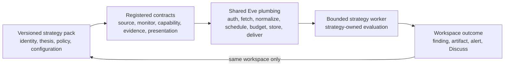
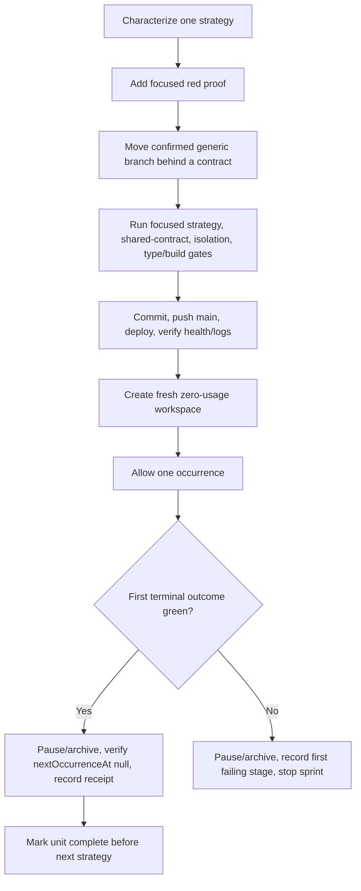

# Strategy Application Boundary and Per-Strategy Migrations - Plan

## Goal Capsule

**Objective:** Make every existing strategy pack a fully functional, isolated application on Eve's reusable platform plumbing, with no named-strategy behavioral branch in generic scheduling, workspace, worker-dispatch, research, or presentation decisions.

**Means:** Migrate and prove one strategy at a time through stable registered contracts, preserving each strategy's distinct policy and ending every strategy sprint with focused regression proof plus one cleaned-up Production acceptance. (KTD1–KTD5)

**Authority:** The Product Contract below governs behavior. `HANDOFF.md` and `NORTH_STAR.md` govern existing safety and product boundaries. The current catalog and code on `main` govern implementation facts. `specs/07-strategy-platform-boundary-and-continuity.md` is research input only and is not an implementation authority.

**Stop conditions:** Stop the active sprint if its first Production acceptance fails, a proposed shared contract would flatten strategy-specific behavior, a change would alter an unrelated workspace, or a new architecture is required. Record the exact blocker before starting another occurrence or strategy.

**Execution profile:** Run exactly one implementation unit at a time. Mark that unit's checklist complete only after code, focused verification, Production health, one bounded acceptance, and cleanup all pass. Do not begin the next unit while any prior gate is incomplete.

**Tail ownership:** Each sprint owns its commit, push to `main`, Production deployment, health/log check, disposable acceptance workspace, and final non-dispatchable cleanup. Durable Start Fresh continuity is a separate follow-up plan and is not implemented here.

## Product Contract

### Summary

Eve remains one owner-facing agent with many isolated strategy workspaces. Shared platform plumbing fetches and authenticates sources, normalizes evidence, schedules bounded work, enforces budgets, runs reviewed parsing and interpretation capabilities, stores findings, and delivers alerts. A versioned strategy pack defines how those capabilities are used for one investment thesis.

This plan completes the boundary incrementally across the five strategy IDs already in the catalog. IPO Filings is the accepted reference. Inverse Cramer, Public Commentary Tracker, Earnings Call Changes, and Congressional Signals migrate sequentially. Each must remain meaningfully different and fully operational after its migration.

### Problem Frame

The intended platform already exists, but some generic modules still branch on named pack IDs for initial scheduling, activation watermarks, evaluation windows, source eligibility, or worker behavior. Those branches make reusable plumbing understand a strategy's identity instead of a declared monitor, source, capability, or presentation contract.

Removing every strategy string is not the goal. Pack IDs remain valid provenance, registry keys, immutable binding identity, and guards inside strategy-owned workers. The defect is a named-strategy choice inside generic infrastructure when the behavior can be selected by a stable reviewed contract.

### Requirements

#### Shared platform boundary

- R1. Generic scheduling, workspace lifecycle, monitor storage, worker dispatch, research capability selection, and presentation dispatch must select behavior from validated contracts or declarations rather than enumerating named pack IDs.
- R2. Shared plumbing may know stable source, adapter, schema, capability, evidence, and presentation contract IDs. It must not interpret a pack's thesis or strategy-specific policy.
- R3. Strategy-owned pack files, policy assets, schemas, evaluations, and bounded worker adapters may retain strategy identities when validating their own immutable binding or provenance.
- R4. Adding a strategy that uses existing plumbing may require a reviewed catalog registration and pack definition, but must not require a new named branch in generic runtime code.
- R5. A strategy that needs genuinely new reusable plumbing may add one reviewed capability or source contract, then reference it from its pack. This plan adds no new connector or extension framework.

#### Strategy ownership and behavior

- R6. Each pack continues to own its monitored identities or issuers, source/tool requirements, thesis and instructions, watchlists or configuration, interpretation rules, affected assets and direction, schedules, thresholds, output schemas, evaluations, evidence requirements, counterevidence, and abstention policy.
- R7. Migration must not flatten different strategies into one generic prompt, score, threshold, or conclusion model.
- R8. Historical pack versions and installed workspaces remain immutable. A changed runtime contract ships through a new pack version only when the pack's declared behavior changes, and no workspace upgrades automatically.
- R9. The current catalog scope is exactly `ipo-filings`, `inverse-cramer`, `public-commentary-tracker`, `earnings-call-changes`, and `congressional-signals`. New strategies are outside this plan.

#### Per-strategy operational proof

- R10. Migrate one strategy at a time. A later strategy cannot start until the prior strategy's local gates, deployment, single Production acceptance, and cleanup are green.
- R11. Every migrated strategy must preserve its existing acquisition, deterministic extraction, cheap recovery where registered, semantic/materiality policy, provenance, deduplication, correction handling, no-change behavior, findings, artifacts, alerts, and Discuss routing.
- R12. Every remaining strategy must adopt the shared frontier research decision, bounded read-only tools, nested budget, replay-safe receipt, executive brief, and artifact contracts at its strategy-owned materiality boundary. A no-new-facts occurrence must not invoke frontier reasoning, research, or artifact publication.
- R13. Exactly one fresh zero-usage Production workspace is used for each strategy acceptance. Permit one occurrence, pause on its first terminal result, archive the disposable workspace, and verify no test monitor remains dispatchable.
- R14. A failed first acceptance stops that strategy sprint. Do not fix and retry within the same acceptance receipt, and do not proceed to another strategy.
- R15. Actual model/provider cost must be reported separately from reservations. Acceptance must also report source reads, extraction/semantic outcome, finding or correct no-signal result, artifact/alert delivery where applicable, and final paused/archived state.

#### Isolation and compatibility

- R16. One workspace must never receive another workspace's pack instructions, configuration, watchlist, source projection, findings, alerts, artifacts, budget state, or chat history.
- R17. Background alerts remain labeled and independently delivered without becoming an inbound turn in Main or another active workspace. Discuss may explicitly select the producing workspace and inject only its bounded alert context.
- R18. Existing owner-authorized backend services are the default for operational acceptance. Do not edit Redis directly, invoke workers manually, add temporary Production endpoints, or generate repeated owner-chat workflows.
- R19. Approval-gated Coinbase behavior remains unchanged. Monitor research authority is never trading authority, and this work must not block a separately designed autonomous-trading policy later.
- R20. Start Fresh continuity implementation is deferred to an independent plan. This plan must not restore old transcripts or add a memory framework while performing migrations.

### Key Decisions

1. **Prove one strategy at a time.** (session-settled: user-directed — chosen over a bulk migration: each strategy must remain fully functional and independently accepted before the next begins.) Governs R10–R15.
2. **Use stable contracts, not a generic plug-in framework.** (session-settled: user-directed — chosen over Spec 07's broad one-shot boundary refactor: the smallest existing declaration or registry seam should replace each confirmed named branch.) Governs R1–R5.
3. **Keep strategy-specific behavior strategy-owned.** (session-settled: user-directed — chosen over making strategies generic: shared X, SEC, earnings, research, and alert plumbing must not erase different theses or decision policies.) Governs R6–R9.
4. **Treat Start Fresh continuity as a required independent task.** (session-settled: user-directed — chosen over bundling continuity into the migrations: migration risk should be isolated while the continuity outcome remains explicitly tracked.) Governs R20.
5. **Use real Production proof and clean it up.** (session-settled: user-directed — chosen over UI-only or local-only confidence: each strategy needs one bounded backend-controlled end-to-end acceptance.) Governs R13–R18.

### Key Flows

- F1. A due monitor resolves its immutable pack binding and declared monitor/source/capability contracts, acquires only authorized evidence, runs its strategy-owned evaluation policy, commits one terminal outcome, and routes any resulting artifact/alert to the producing workspace.
- F2. A migration sprint characterizes current behavior, replaces only confirmed generic named branches, proves the strategy locally, deploys, runs one disposable Production occurrence, pauses/archives it, and records the receipt before another strategy begins.
- F3. An alert from a background strategy is delivered to the owner without becoming input to the active workspace. Discuss explicitly routes the next bounded turn to the producing workspace.

### Acceptance Examples

- AE1. Inverse Cramer and Public Commentary Tracker share public-commentary/X or official-web plumbing but retain different monitored identities, thresholds, semantic instructions, asset conclusions, and evaluation fixtures.
- AE2. Earnings Call Changes uses shared source, hybrid evidence, research, budget, artifact, and alert contracts while retaining transcript comparison, correction, materiality, and citation policy.
- AE3. A House disclosure acquisition failure terminalizes one Congressional occurrence once. It does not emit explanatory prose without an outcome or dispatch the same occurrence repeatedly.
- AE4. Main remains active and responsive while a migrated background strategy runs. Its alert does not enter Main's context; Discuss selects only the producing workspace.
- AE5. A duplicate scheduler tick or worker replay produces no duplicate source side effect, paid call, finding, artifact, alert, or cost.
- AE6. A no-new-facts occurrence completes successfully before frontier reasoning or research and records no avoidable model/tool/artifact spend.

### Scope Boundaries

#### In scope

- Contract-driven removal of confirmed strategy-name decisions from generic runtime modules.
- Separate migrations and acceptances for every remaining catalog strategy.
- The existing shared agentic-research, budget, executive-brief, artifact, alert, and Discuss plumbing where appropriate to each strategy.
- The known Congressional terminal-outcome/retry defect because Congressional cannot pass end to end without it.
- Final cross-strategy isolation and catalog-completeness proof.

#### Deferred to Follow-Up Work

- A separate durable Start Fresh continuity plan must implement same-turn persistence of explicit mission, thesis, watchlist, source, and open-question changes before Eve claims it will remember them.
- That plan must make Start Fresh clear only old messages, temporary conversational context, and temporary reasoning; the new generation must receive a bounded structured summary of the same workspace's durable state without receiving the old transcript.
- That plan must independently prove unsupported changes are not fabricated, background monitors survive generation rollover, and no durable state crosses workspace boundaries.

#### Outside this plan

- New schedulers, source-event architecture, connectors, strategy DSLs, remote pack loading, or arbitrary strategy code execution.
- New strategies, multiple packs per workspace, broad Session Management redesign, or owner-private artifact storage.
- Autonomous Coinbase trading, broker changes, approval changes, or financial-policy redesign.
- Cross-workspace memory, shared chat histories, or automatic convergence between strategies.
- Automatic upgrades or edits to owner workspaces unrelated to a disposable acceptance.

### Success Criteria

- SC1. All five catalog strategy IDs have a recorded green boundary/operation receipt: IPO as the accepted reference and four remaining strategy migrations from this plan.
- SC2. Generic runtime modules no longer branch on those pack IDs to choose behavior that a monitor, source, capability, worker, or presentation contract can own.
- SC3. Each strategy's focused regression corpus and one Production occurrence show unchanged or deliberately versioned behavior, correct cost accounting, and final non-dispatchability.
- SC4. A final multi-workspace proof demonstrates simultaneous isolation of Main and strategy workspaces without merging context.
- SC5. The only remaining part of the owner's stated target is the separately documented durable Start Fresh continuity implementation.

## Planning Contract

### Key Technical Decisions

- KTD1. Replace each named branch at its narrowest stable boundary: monitor scheduling behavior becomes a validated monitor lifecycle declaration; worker selection becomes a registered capability/worker contract; research/tool selection becomes a hybrid evidence contract; presentation becomes a presentation contract. (session-settled: user-directed — chosen over a new general extension abstraction: existing reviewed registries and declarations are sufficient.) Implements R1–R5.
- KTD2. Classify pack-ID reads before changing them. Provenance checks, immutable binding validation, catalog registration, and strategy-owned worker guards remain; only generic behavioral selection moves behind a contract. Implements R2–R4.
- KTD3. Preserve historical packs and add a new immutable version only when a migration changes the pack's declared capabilities, instructions, output, or operational contract. Internal contract dispatch that preserves a pack digest does not force a cosmetic version. Implements R8.
- KTD4. Treat Public Commentary as one bounded family milestone but execute its two strategy IDs serially: Inverse Cramer first, then Public Commentary Tracker. The shared vertical may change once, but each pack receives its own fixtures and Production acceptance before the family milestone closes. (session-settled: user-directed — chosen over either a bulk multi-strategy release or duplicating the shared vertical: the two packs share plumbing but still require independent proof.) Implements R7, R10–R15.
- KTD5. Use the existing owner-authorized application services for Production acceptance. A revision conflict permits rereading and retrying only the pause/archive mutation, never the occurrence. Implements R13–R18.
- KTD6. Repair the Congressional source-failure terminal outcome as the first step of the Congressional sprint, then migrate that same strategy. Do not generalize retry architecture beyond the reproduced failure. Implements R10–R14 and AE3.
- KTD7. End with a read-only boundary and isolation audit, not another live occurrence. Per-strategy Production receipts already prove dispatch; the final unit composes their local contracts and checks no named generic branch or dispatchable test state remains. Implements R1, R4, R16–R18.

### High-Level Technical Design

The diagrams are boundary maps, not prescriptions for new layers. Implementers should reuse the smallest current contract seam that satisfies them.





### Confirmed Boundary Inventory

The initial `origin/main` audit identified the following candidates. Each active sprint must re-read its relevant current code because earlier migrations may remove or reshape them.

- Generic monitor lifecycle decisions in `agent/lib/workspace-monitor-store.ts` currently enumerate Earnings and public-commentary pack IDs for empty-source eligibility, activation watermarks, initial occurrences, and due-window recovery.
- Generic installation timing in `agent/lib/strategy-pack-service.ts` currently enumerates public-commentary pack IDs for immediate first occurrence behavior.
- Generic evaluation-window selection in `agent/lib/workspace-worker-runner.ts` currently enumerates public-commentary pack IDs and versions for cadence-derived backfill.
- Strategy-owned workers in `agent/lib/public-commentary-workspace-worker.ts`, `agent/lib/earnings-call-workspace-worker.ts`, `agent/lib/congressional-workspace-worker.ts`, and `agent/lib/sec-ipo-workspace-worker.ts` validate their own bindings. Those checks are not automatically defects under KTD2.
- `agent/lib/hybrid-evidence-worker-contract-registry.ts` is the accepted shared contract-dispatch seam created by commit `58901f8`; it currently registers IPO research and commentary completion contracts without making the generic worker branch on a pack ID.

### Sequencing

1. Preserve the completed IPO and shared-contract receipts as the baseline.
2. Complete the Public Commentary family milestone serially: Inverse Cramer, then Public Commentary Tracker.
3. Complete Earnings Call Changes.
4. Repair and migrate Congressional Signals.
5. Run the final catalog boundary/isolation audit.
6. Start a new independent plan for durable Start Fresh continuity.

### Implementation Constraints

- Use one implementation worktree for the active unit and remove it after landing. Do not carry an unfinished unit's worktree into another strategy.
- Start from current `main`, re-read `AGENTS.md`, `HANDOFF.md`, and only the active strategy's code, pack files, relevant shared contracts, and focused tests.
- Use test-first characterization for each named generic decision before replacing it.
- Do not broadly revalidate Specs 1–4C. Run only the active strategy's focused corpus, directly changed shared-contract checks, minimum type/build gates, and one concise diff review.
- Do not alter or archive owner workspaces except the disposable acceptance created by that unit.
- Update the Progress Tracker and the active unit checklist only after the unit's acceptance and cleanup are complete.

## Implementation Units

### Progress Tracker

- [x] Baseline A — Shared durable-research U1–U4 implemented; `ipo-filings@1.1.1` passed one zero-usage Production acceptance and was cleaned up. Receipt is in `docs/plans/2026-08-20-1154-feat-agentic-durable-research-plan.md`.
- [x] Baseline B — Shared hybrid-evidence worker contract dispatch landed in commit `58901f8`; Production deploy trigger `f88d7c3` is healthy.
- [ ] U1 — Migrate and accept Inverse Cramer. Reopened for the focused direct-model actionability correction below.
- [x] U2 — Migrate and accept Public Commentary Tracker. Landed on `main` @ `e35ae74`; receipt `U2 Tracker Acceptance 0822` recorded under §U2.
- [ ] U3 — Migrate and accept Earnings Call Changes.
- [ ] U4 — Repair, migrate, and accept Congressional Signals.
- [ ] U5 — Complete the final catalog boundary and cross-workspace isolation audit.
- [ ] Deferred follow-up, not a completion gate for this plan — Create and execute the independent durable Start Fresh continuity plan after U5.

### U1. Migrate and accept Inverse Cramer

**Goal:** Make the current Inverse Cramer pack use contract-driven public-commentary scheduling, evaluation, research, budget, executive output, and presentation while preserving its Jim Cramer inverse-direction policy.

**Requirements:** R1–R19; AE1, AE4–AE6; SC1–SC3.

**Dependencies:** Baselines A and B.

**Primary files:**

- `agent/lib/strategy-pack-service.ts`
- `agent/lib/workspace-monitor-store.ts`
- `agent/lib/workspace-worker-runner.ts`
- `agent/lib/public-commentary-workspace-worker.ts`
- `agent/lib/public-commentary-semantics.ts`
- `agent/lib/public-commentary-product-contract.ts`
- `agent/lib/hybrid-evidence-worker-contract-registry.ts`
- `strategy-packs/inverse-cramer/`
- `scripts/verify-public-commentary-signals-*.ts`

**Approach:**

1. Characterize immediate first occurrence, cadence-derived lookback, activation watermark, duplicate tick, no-change, X acquisition, reply/quote filtering, semantic direction, finding, artifact, alert, Discuss, budget, and replay behavior for the latest Inverse Cramer version.
2. Replace only generic Inverse Cramer/public-commentary name checks with validated monitor lifecycle and worker/evidence contracts. Keep the strategy's identity, monitored user, inverse transform, thresholds, asset resolution, and evaluation fixtures strategy-owned.
3. Adopt shared agentic research and executive output through a new immutable pack version if its declared behavior changes; preserve every historical version and require explicit owner creation.
4. Run one backend-controlled fresh zero-usage Production occurrence, then pause/archive and record source reads, semantic/finding result, research/artifact/Photon result, actual versus reserved cost, and `nextOccurrenceAt: null`.

**Test scenarios:**

- A new cadence-derived monitor dispatches one immediate occurrence despite normal scheduler delay; a duplicate tick does not dispatch twice.
- A genuinely stale historical occurrence remains skipped.
- No new X facts finish before frontier/research/artifact spend.
- A material statement preserves Inverse Cramer direction, evidence, counterevidence, confidence, alert, artifact, and Discuss behavior.
- A crash after research reuses the stored receipt; duplicate workers do not duplicate paid calls or findings.
- Main remains active and receives no Inverse Cramer context.

**Verification:** Use the public-commentary sprint/follow-up, real-model fixture, tracker-reuse, shared research U1–U3, strategy-pack, workspace-isolation, TypeScript, Eve build, and application build gates listed in the Verification Contract. Complete one Production acceptance and cleanup.

**Completion checklist:**

- [x] Focused red characterization captured. `verify:public-commentary-signals:boundary` preserves the current immediate occurrence, cadence-derived window, and first-run lookback assertions, then fails on the first generic `inverse-cramer` strategy-name branch in `strategy-pack-service.ts`.
- [x] Smallest contract migration implemented. Inverse Cramer `1.4.0` declares its lifecycle and research contracts; generic scheduling and dispatch no longer select it by strategy name; final research, nested spend, executive output, and replay use the shared registered plumbing while historical pack versions remain immutable.
- [x] Focused verification and concise diff review green. Lifecycle dispatch/skip/deduplication, public-commentary Sprints 0–4/follow-up/tracker reuse, shared research U1–U3/contract dispatch, aggregate-versus-per-call budget enforcement, pack/runtime/owner surfaces, workspace/worker isolation, the frozen real-source fixture, one controlled real-model case, TypeScript, Eve build, application build, and `git diff --check` passed.
- [x] Commit pushed to `main`; Production health and bounded logs green. Implementation `f1c4749` and verified-author deploy trigger `8115d75` produced READY deployment `dpl_iUzzPpKvHyB2iCoHkpHicsPYRGPt`; `/`, `/skill`, and `/eve/v1/health` returned HTTP 200, and the bounded post-ready error/warning log scan was empty.
- [x] Creation-path blocker contained. Redaction-safe transaction diagnostics shipped in `d9998c0`; the original Upstash `storage_failure` did not reproduce on the next single paused diagnostic creation, so it is recorded as transient rather than claimed fixed. The diagnostic workspace was archived normally with `nextOccurrenceAt: null`, no occurrence, and no cost.
- [x] First-run selection hypothesis disproved before a code repair. A focused production-pipeline fixture now proves a declared 12-hour cadence contract sends one acquired original/final post into deterministic analysis while preserving the no-search/no-semantic path for non-actionable commentary. The prior live semantic count of zero therefore reflects the designed deterministic actionability gate, not loss at baseline selection.
- [x] One zero-usage Production occurrence terminal and reported. Fresh workspace `Inverse Cramer U1 Acceptance 0528` (`inverse-cramer@1.4.0`) acquired three complete original/final X posts in its cadence-derived interval and terminalized once as `no_match`. Deterministic extraction found no statement eligible for frontier interpretation, so semantic research, findings, artifacts, and Photon delivery were correctly not invoked. The scheduled occurrence reserved 25,000 input tokens, 12,000 output tokens, and `$3.500000`; its nested X call reserved `$1.000000`. Both reconciled to 5,746 input tokens, 859 output tokens, and `$0.015000` actual total spend (three billable X reads), with zero active workers.
- [x] Disposable monitor paused/archived and non-dispatchable. Monitor `ac472433-4336-539e-bf93-6ad3b56e5880` is `suspended_archived`, configuration revision 4, `lastCompletedAt: 2026-08-21T05:29:21.867Z`, `lastErrorCode: null`, and `nextOccurrenceAt: null`; Main was restored active.
- [x] U1 and Progress Tracker marked complete before U2 begins.

#### U1 focused correction — direct model actionability

The accepted `1.4.0` path still used deterministic asset/stance extraction as a
precondition for semantic evaluation. That can discard natural-language market
views before the model sees them. Correct only that ordering for a new immutable
Inverse Cramer pack version; do not change Public Commentary Tracker or any
historical pack.

- [x] Focused red proof captured. Sprint 3 failed because a natural-language Micron view without a cashtag or parser keyword completed without reaching semantic evaluation; Sprint 1 failed because a reply-excluding configuration still emitted `exclude=retweets` instead of `exclude=retweets,replies`.
- [x] Model contract returns the referenced asset/market and Cramer's stance; the signed semantic input includes the optional owner watchlist. The focused Micron fixture resolves `MU`, carries `selectedSymbols: ["MU"]`, and reaches the semantic contract without cashtags or parser sentiment keywords.
- [x] Existing inverse-direction policy, deterministic watchlist enforcement, thresholds, research, artifact, alert, budget, replay, and isolation behavior remain intact. The direct-model fixture produces the registered bearish inverse direction while the pre-existing watchlist, replay, correction, and workspace-isolation assertions remain green.
- [x] X acquisition requests only supported selected roles. Reposts remain provider-excluded; replies now join the provider `exclude` parameter when disabled. X's user-posts endpoint has no quote exclusion parameter, so disabled quote posts are discarded before semantic evaluation and are not registered for later paid rehydration.
- [x] Focused verification and concise diff review green. Public-commentary Sprints 1 and 3, follow-up, tracker reuse, strategy boundary, shared research contract dispatch and U1–U3, pack/catalog owner surfaces, TypeScript, Eve build, application build, and `git diff --check` passed. Review confirmed historical packs remain immutable, final watchlist enforcement remains deterministic, and disabled quotes cannot trigger semantic or paid rehydration work.
- [x] New immutable pack version committed, pushed, deployed, and Production health verified. Implementation `68e4000` is on `main`; direct Production deployment `dpl_AoTasmgvCNHrxkzqNhB9eWK3Tcv6` reached READY and was aliased to `adaam.vercel.app`. `/`, `/skill`, and `/eve/v1/health` returned HTTP 200, Eve reported `ready`, and the deployment-scoped bounded error log scan was empty.
- [ ] One fresh zero-usage Production occurrence terminal; disposable workspace paused/archived with `nextOccurrenceAt: null` and receipt recorded.
- [x] Production acceptance blocker recorded. The single owner-authorized paused `inverse-cramer@1.4.1` workspace creation attempt failed before registry commit at `2026-08-21T16:26:37.128Z`. The manager route returned HTTP 503 and Production logged `strategy_pack_mutation_failure_total` with `reasonCode: storage_failure`; the route diagnostic reported `provider_reason_code: unclassified` and `script_line: null`. Routing remained revision 86, Main remained active, no matching workspace or monitor exists, no occurrence dispatched, and no cost was incurred. Per the unit stop condition, no occurrence was retried and U2 did not begin.
- [x] Focused creation-transaction recovery repair implemented locally. Initial approval/replay storage reads are now classified safely, and a failed recovery inspection cannot replace the primary commit error. The focused regression reproduces the prior dual-failure masking, preserves the primary provider reason, proves initial read classification, and remains green without adding scheduler or occurrence retries.
- [x] Focused repair committed, pushed, deployed, and Production health verified. Commit `b07c41e` is on `main`; Production deployment `dpl_28Wz73twEdZ1JFNyrbtjX9fjA2ka` reached READY and was aliased to `adaam.vercel.app`. `/`, `/skill`, and `/eve/v1/health` returned HTTP 200, Eve reported `ready`, and the bounded deployment error scan was empty.
- [x] Post-repair Production acceptance failure recorded and contained. Fresh zero-usage workspace `Inverse Cramer 1.4.1 Acceptance 20260821` (`inverse-cramer@1.4.1`) was created successfully through the owner-authorized backend, confirming the repaired creation path. Its single immediate occurrence acquired and projected one complete original/final X post, then the semantic worker failed before committing an outcome with `SESSION_TOKEN_LIMIT_REACHED` (`hybrid_evidence_worker_failed`); the later tool-loop attempt was rejected as `source_already_attempted`. The monitor first surfaced `worker_outcome_missing`, then its normal recovery tick finalized `paused_failure` as `worker_recovery_not_applicable`. No semantic result, finding, artifact, or Photon delivery was produced. Worker-visible semantic usage was 12,000 input tokens, 2,000 output tokens, and `$0.250000`; the workspace ledger retained its conservative 25,000-input, 12,000-output, `$3.500000` occurrence reservation, while the X surface exposed only its `$0.005000` pay-per-use estimate rather than a reconciled actual receipt. The workspace was archived at registry revision 88, Main was restored active, and monitor `9affaa0c-62dd-5cd0-b0c4-d0fea9a9974d` is `suspended_archived` at configuration revision 4 with `nextOccurrenceAt: null`. Per the stop condition, the occurrence was not retried, no second fix began, U1 remains incomplete, and U2 remains blocked.
- [x] Focused semantic-session repair implemented and verified locally. Eve accounts provider input cumulatively across the signed task session, while the Inverse Cramer worker requires one model step to read evidence and a second to commit its candidate; the `1.4.1` 12,000-token session allowance could therefore terminate before commit. New immutable `inverse-cramer@1.4.2` binds semantic definition `1.0.1` with a 24,000-token cumulative allowance inside the unchanged 25,000-token occurrence ceiling. Historical `1.4.1` remains bound to semantic definition `1.0.0`. The focused follow-up, strategy boundary, Sprint 3, pack/catalog owner surfaces, TypeScript, Eve build, and diff review are green. Production deployment and one fresh zero-usage acceptance remain required before U1 completes.
- [x] Semantic-session repair committed, pushed, deployed, and Production health verified. Commit `9a2f519` is on `main`; direct Production deployment `dpl_FUGpYBQUxwhcZxUjj53Ae9rdmXht` reached READY and was aliased to `adaam.vercel.app`. `/`, `/skill`, and `/eve/v1/health` returned HTTP 200 with Eve `ready`, and the deployment-scoped pre-acceptance warning/error scan was empty.
- [x] `inverse-cramer@1.4.2` Production acceptance failure recorded and contained. Fresh zero-usage workspace `Inverse Cramer 1.4.2 Acceptance 20260821` dispatched exactly one immediate occurrence. X acquisition completed over one original/final post and advanced the public source cursor once. The `openai/gpt-5.4` semantic run read the signed evidence and its completion tool returned `state: completed`, proving the earlier `SESSION_TOKEN_LIMIT_REACHED` failure was removed; the outer evaluator then rejected the completed-job handoff with `job_lifecycle_invalid`. Its only later attempt was rejected as `source_already_attempted`, so the monitor terminalized as `worker_outcome_missing`. No semantic result committed, no finding or no-signal result was produced, and no artifact or Photon delivery was staged. The occurrence ledger retained conservative reservations of 25,000 input tokens, 12,000 output tokens, and `$3.500000`; Vercel observed actual model usage of 28,523 input/6,475 output tokens and `$0.1131365` for the semantic run plus 8,470 input/2,375 output tokens and `$0.01525875` for the outer run (`$0.12839525` actual model cost total). The monitor was paused immediately at configuration revision 3, then the workspace was archived at registry revision 90 with Main restored active. Monitor `03e21573-6ff5-54ec-8c60-46936747ba4d` is `suspended_archived`, `nextOccurrenceAt: null`, and non-dispatchable. Per the unit stop condition, no occurrence or fix was retried, U1 remains incomplete, and U2 remains blocked on the first incorrect semantic job-lifecycle transition.
- [x] Focused completed-job lifecycle repair implemented and verified locally. The delegated model can complete after the scheduled occurrence timestamp, so parent acceptance now preserves the durable job's later `updatedAt` instead of moving its lifecycle clock backward and failing schema validation. Identical accepted-result replay and genuine conflict checks remain unchanged. The exact stale-time acceptance regression, Spec 4C follow-up, Inverse Cramer strategy boundary, public-commentary Sprint 3, TypeScript, Eve build, and `git diff --check` are green. Production deployment, health proof, and one fresh zero-usage acceptance remain required before U1 completes.
- [x] Completed-job lifecycle repair committed, pushed, deployed, and Production health verified. Commit `25a81ef` is on `main`; direct Production deployment `dpl_BWuLLAuryDcaF8r1fHvBB9ykk55p` reached READY and was aliased to `adaam.vercel.app`. `/`, `/skill`, and `/eve/v1/health` returned HTTP 200 with Eve `ready`, and the deployment-scoped pre-acceptance error scan was empty.
- [x] Post-repair Production acceptance creation failure recorded and contained. The single owner-authorized attempt to create paused zero-usage workspace `Inverse Cramer Lifecycle Acceptance 20260821` (`inverse-cramer@1.4.2`) failed before registry commit at `2026-08-21T18:58:18.090Z`. The manager route returned HTTP 503 and Production logged `strategy_pack_mutation_failure_total` with `reasonCode: storage_failure`; route diagnostics reported `provider_reason_code: unclassified` and `script_line: null`. Registry revision remained 90, Main remained active, no matching workspace or monitor exists, no occurrence dispatched, and no cost was incurred. Per the unit stop condition, creation was not retried, no second lifecycle fix began, U1 remains incomplete, and U2 remains blocked on the strategy-pack creation transaction.
- [x] Misclassified creation failure repaired and deployed. The attempted session name was 44 characters: the strategy-pack request schemas accepted up to 80 characters, but the shared workspace registry correctly enforces 40. The later `PhotonWorkspaceValidationError` escaped the pack service and was therefore mislabeled as an unclassified storage outage. Commit `e885369` now applies the existing shared workspace-name normalizer at the pack boundary and maps invalid names to `strategy_pack_invalid_request`; the exact 44-character regression proves no registry, index, due, monitor, occurrence, or receipt state is written. Strategy-pack mutations, owner manager routing, Inverse Cramer boundary, public-commentary Sprint 3, Spec 4C follow-up, TypeScript, Eve build, and `git diff --check` passed. Production deployment `dpl_EmEMRK7G9ZA43t58oQoDXax1GtWR` reached READY and was aliased to `adaam.vercel.app`; `/`, `/skill`, and `/eve/v1/health` returned HTTP 200 with Eve `ready`, and the deployment-scoped error scan was empty.
- [x] Post-creation-repair `inverse-cramer@1.4.2` acceptance failure recorded and contained. Fresh zero-usage workspace `Inverse Cramer U1 Final 0821` dispatched exactly one immediate occurrence and acquired one complete original/final Jim Cramer X post. The semantic child read the signed evidence, but Eve correctly refused the next completion turn with `SESSION_TOKEN_LIMIT_REACHED`: the real task used 28,372 input and 6,664 output tokens before its required completion-tool call, exceeding the pack's 24,000-input/2,000-output semantic session limits. No semantic result, finding, artifact, or Photon delivery committed. Vercel observed `$0.113290` actual semantic-model cost plus `$0.01120125` for the outer worker (`$0.12449125` observable model cost total), while the workspace retained conservative reservations of 25,000 input tokens, 12,000 output tokens, and `$3.500000`. The workspace was paused/archived, Main remained active, and monitor `9870c645-19ee-53c6-8452-aaac6a197462` is `suspended_archived` with `nextOccurrenceAt: null`. The occurrence was not retried.
- [x] Focused semantic tool-loop sizing repair implemented and verified locally. New immutable `inverse-cramer@1.4.3` binds semantic definition `1.0.2` with 40,000 cumulative input tokens and 8,000 cumulative output tokens, leaving bounded headroom for the completion-tool turn demonstrated by the Production trace. The shared strategy-pack input ceiling now honors the reviewed 40,000-token pack limit; daily and paid-money ceilings are unchanged. Historical packs remain immutable and keep their prior semantic definitions. Public-commentary follow-up/boundary/Sprint 3, strategy-pack mutation/runtime/catalog/owner surfaces, TypeScript, Eve build, and `git diff --check` are green. Production deployment and one fresh zero-usage `1.4.3` acceptance remain required before U1 completes.
- [x] `inverse-cramer@1.4.3` Production acceptance failure recorded and contained. Fresh zero-usage workspace `Inverse Cramer U1 Green 0821` dispatched exactly one immediate occurrence and acquired/projected one complete original/final X post. The semantic run used 28,533 input and 9,137 output tokens before its completion-tool turn, so Eve correctly stopped the next call with `SESSION_TOKEN_LIMIT_REACHED` at the measured 8,000-output semantic cap. The later `source_already_attempted` error was only the outer worker's prohibited retry after that first failure. No semantic result, finding, artifact, or Photon delivery committed. Vercel observed `$0.1530915` semantic-model cost plus `$0.01151325` outer-worker model cost (`$0.16460475` observable actual model cost total), while the workspace retained conservative 40,000-input, 12,000-output, `$3.500000` occurrence reservations. The workspace was archived at registry revision 94 with Main active; monitor `8b4605a7-f167-5b4b-a286-432d59bf44f9` is `suspended_archived`, `nextOccurrenceAt: null`, and non-dispatchable. The occurrence was not retried.
- [x] Focused output-cap repair implemented and verified locally. New immutable `inverse-cramer@1.4.4` binds semantic definition `1.0.3` with the unchanged 40,000-input limit and a 12,000-output limit matching the existing occurrence ceiling, allowing the completion-tool turn after the measured 9,137-token reasoning output without widening paid cost, attempts, sources, or runtime. Historical versions remain unchanged. The exact red regression, public-commentary follow-up/boundary/Sprint 3, strategy-pack mutation/runtime/catalog/owner surfaces, TypeScript, Eve build, and `git diff --check` are green. Production deployment and one fresh zero-usage `1.4.4` acceptance remain required before U1 completes.
- [x] `inverse-cramer@1.4.4` Production acceptance failure recorded and contained. Fresh zero-usage workspace `Inverse Cramer U1 Pass 0821` dispatched exactly one immediate occurrence, completed X acquisition, and projected one original/final post. The semantic model completed its candidate, but the deterministic validation/quarantine path reused the earlier scheduled-occurrence timestamp after the delegated model had advanced the durable job clock; `quarantineHybridEvidenceJob` therefore failed schema validation with `job_lifecycle_invalid`. No semantic result, finding, artifact, or Photon alert committed. The workspace was paused and archived at registry revision 96 with Main active; monitor `391cc354-c53c-5597-bef9-25cf9b3ae980` is `suspended_archived` with `nextOccurrenceAt: null`. The occurrence was not retried.
- [x] Focused semantic quarantine-clock repair implemented and verified locally. Quarantine now applies the same monotonic durable timestamp rule already used by accepted semantic results, preserving the completed job clock when a scheduled caller retains an older occurrence timestamp. The exact regression fails before the fix with Production's `job_lifecycle_invalid`, then passes; hybrid-evidence Sprint 1, public-commentary follow-up, TypeScript, Eve build, catalog generation, and `git diff --check` are green. Production deployment and one fresh zero-usage acceptance remain required before U1 completes.
- [x] Quarantine-clock repair deployed and Production health verified. Commit `4bf281d` is READY in deployment `dpl_HgMRNH6irSn2W8LsFLSBxWNo64bc`; `/`, `/skill`, and `/eve/v1/health` returned HTTP 200 with Eve `ready`.
- [x] The next single zero-usage acceptance exposed a distinct semantic-attestation compatibility defect and was not reused. Fresh `inverse-cramer@1.4.4` workspace `Inverse Cramer U1 Verified 0821` dispatched once and acquired/projected one original/final X post, but `readAttestedCommentarySemanticResult` reconstructed semantic definition `1.0.3` as historical `1.0.1` and rejected the otherwise completed candidate with `public_commentary_semantic_attestation_invalid`; the outer model's later call was correctly rejected as `source_already_attempted`. No accepted semantic result, finding, artifact, or Photon delivery committed. Its next cadence is twelve hours later, so no second occurrence can dispatch while owner control is refreshed.
- [x] Focused semantic-version attestation repair implemented, verified, pushed, and deployed. The reader now validates and reconstructs the exact registered Inverse Cramer semantic definition version (`1.0.0`–`1.0.3`) instead of downgrading every newer result to `1.0.1`. The active `1.4.4`/`1.0.3` regression, public-commentary Sprint 3/follow-up, hybrid-evidence Sprint 1, TypeScript, Eve build, catalog generation, and `git diff --check` are green. Commit `0e51526` is READY in deployment `dpl_FCepUBqRa2j6TSEWD59miSQPAowk`; Production root, skill, and Eve health are HTTP 200 and Eve reports `ready`.
- [x] The attestation-repair acceptance exposed the first incorrect strategy-owned semantic boundary and was not retried. Fresh zero-usage `inverse-cramer@1.4.4` workspace `Inverse Cramer U1 Final Green 0821` dispatched once and acquired/projected one original/final X post. The frontier run read the signed bundle and formed an accepted market view, but its 90-second signed capability expired before `complete_hybrid_evidence_job` after 121.375 seconds (`hybrid_evidence_auth_invalid`). The same report-sized completion schema consumed 57,669 input and 14,937 output tokens for a 195-character statement, beyond the registered 40,000/12,000 semantic limits; the later `SESSION_TOKEN_LIMIT_REACHED` was secondary. No semantic result, finding, artifact, or Photon alert committed. Vercel observed 57,669 input/14,937 output and `$0.2795235` for the semantic child plus 7,827 input/1,315 output and `$0.0108015` for the outer worker (`$0.290325` observable model cost total), while the workspace retained conservative 40,000-input, 12,000-output, `$3.500000` reservations. The failed occurrence will not be reused.
- [x] Focused compact-actionability repair implemented and verified locally. New immutable `inverse-cramer@1.4.5` replaces the report-sized initial semantic tool with a strategy-owned compact contract containing only target, stance, confidence, horizon, rationale, uncertainty, counterevidence, and exact citations. It retains `openai/gpt-5.4` but uses low reasoning for this bounded classification, raises only its signed runtime to 180 seconds, and keeps rich executive research in the already separate final research worker. Historical packs keep their prior contracts and high-reasoning route. The exact red catalog regression, compact completion schema, current and historical reasoning selection, compact attestation/materialization, public-commentary Sprint 3/follow-up/boundary, pack/catalog/owner surfaces, and TypeScript checks are green. Production deployment and one fresh zero-usage `1.4.5` acceptance remain required before U1 completes.
- [x] Compact-actionability repair deployed and the prior failed workspace cleaned up. Commit `39299c0` is on `main`; Production deployment `dpl_4hd7RA9eCHgffs8L1M6gt4wNW6He` reached READY and is aliased to `adaam.vercel.app`. Root, `/skill`, and `/eve/v1/health` returned HTTP 200 with Eve `ready`, and the deployment-scoped pre-acceptance error scan was empty. `Inverse Cramer U1 Final Green 0821` is archived and its monitor is `suspended_archived` with `nextOccurrenceAt: null`.
- [x] The single fresh `inverse-cramer@1.4.5` Production occurrence exposed a distinct downstream citation-compatibility defect and was not retried. Zero-usage workspace `Inverse Cramer U1 145 2115` acquired two complete original/final X posts and the new compact `inverse-cramer-market-view-actionability@1.0.0` child completed in 21.627 seconds with one accepted Micron/Samsung market view. Materialization then failed first with `public_commentary_citation_invalid`: the accepted semantic text-span citation digest did not match the source statement's registered text-locator digest. No finding, final research artifact, or Photon delivery was staged. Vercel observed 29,302 input/1,306 output tokens and `$0.050221` for the semantic child plus 7,271 input/3,176 output tokens and `$0.01736325` for the outer worker (`$0.06758425` observable model cost total). The workspace ledger reconciled its conservative 40,000-input, 12,000-output, `$3.500000` occurrence reservation to 31,271 input, 7,176 output, and `$0.260000`; X exposes a `$0.005000` pay-per-use estimate but no separate actual receipt. The workspace was archived at registry revision 102 with Main restored active; monitor `40c95779-ec24-5fc9-add9-20416e9c10e3` is `suspended_archived`, configuration revision 4, `nextOccurrenceAt: null`, and non-dispatchable.
- [x] Focused semantic-citation/source-locator compatibility repair implemented and verified locally. A canonical X statement registers its text locator with the canonical-JSON digest it already uses for `contentDigest`, while the signed evidence slice the model cites is digested over the artifact's exact UTF-8 bytes, which the hybrid artifact store re-reads to verify a slice. Materialization compared those two digest namespaces directly and rejected the accepted Micron/Samsung view with `public_commentary_citation_invalid`. The shared verified identity of a span is now its position plus the actual verified text it covers, resolved through the already-proven plaintext, so both layers agree without either changing its stored digest, canonical fact payload, or provenance. Genuine mismatch detection is strictly stronger: a citation whose digest does not attest the cited text, a span the source never registered, and a registered locator that does not attest the verified statement all remain rejected. Public-commentary Sprint 1 (source-side identity) and Sprint 3 (production-shaped handoff plus the three mismatch regressions) fail before the fix with Production's exact error and pass after; Sprints 0/2/4-reuse, follow-up, tracker, strategy boundary, hybrid-evidence Sprints 1/3, shared research U1-U3, strategy-pack/runtime/owner surfaces, workspace and worker isolation, TypeScript, Eve build, and `git diff --check` are green. Production deployment and one fresh zero-usage acceptance remain required before U1 completes.
- [x] Citation repair deployed and Production health verified. Commit `32d6849` is on `main`; direct Production deployment `dpl_BiEbgFUCMicK9kY6Nv9Xgw4KLngA` reached READY and is aliased to `adaam.vercel.app`. `/`, `/skill`, and `/eve/v1/health` returned HTTP 200 with Eve `ready`, and the deployment-scoped pre-acceptance log scan contained only `info` records.
- [x] The next single zero-usage acceptance exposed a distinct nested-budget fan-out defect and was not retried. Fresh zero-usage workspace `Inverse Cramer U1 Citation 0821` (`2037d2d2-8b5b-4390-9f19-77c7782a3705`, `inverse-cramer@1.4.5`, pack digest `96e7484`, binding revision 1) was created paused at registry revision 103 with zero runs, zero tokens, zero paid spend, and zero active workers. Main was restored active at revision 104 before the monitor was armed, and Main stayed active for the whole occurrence. Resuming monitor `98662f74-c949-5c2a-9a4a-1faf2220bb9a` dispatched exactly one immediate cadence-derived occurrence over the preceding 12 hours. X acquisition completed and projected two original/final Jim Cramer posts. The compact `inverse-cramer-market-view-actionability@1.0.0` child accepted one market view whose text-span citation used the signed evidence-slice digest `a825f28f…` over a 40-character statement, so the repaired locator boundary did not reject it. The occurrence still failed before materialization: `prepareProjected` evaluates the projected statements at the declared semantic concurrency of two, and each compact child reserves 24,000 input tokens, so the second nested reservation exceeded the occurrence's 40,000-input parent envelope and `reserveHybridEvidenceAttempt` threw `WorkspaceBudgetError: budget_exhausted` at 2026-08-21T22:10:28.207Z. The worker terminalized as `evaluation_failed` without committing an outcome; its recovery tick finalized `paused_failure` with `worker_recovery_not_applicable`. No finding, executive artifact, or Photon alert was staged. The occurrence reserved 40,000 input tokens, 12,000 output tokens, and `$3.500000`, and its one accepted nested semantic call reserved 24,000 input tokens, 4,000 output tokens, and `$0.250000`; the workspace ledger reconciled to 29,420 input tokens, 4,998 output tokens, and `$0.265000` actual spend with zero active workers. Nested output (8,000 of 12,000), nested paid (`$0.500000` of `$3.500000`), daily input (40,000 of 100,000), and daily paid (`$3.500000` of `$5.000000`) were all within policy, so the nested per-run input aggregate is the only binding constraint. The shared source layer additionally recorded two `public_source_correction_total` creations for the re-acquired posts, which did not block the run and is recorded as an observation rather than a diagnosed defect. Per the unit stop condition the occurrence was not retried and no second fix began.
- [x] Disposable acceptance workspace paused/archived and non-dispatchable. The monitor auto-paused on its own terminal failure; the workspace was archived at registry revision 105 with Main active. Monitor `98662f74-c949-5c2a-9a4a-1faf2220bb9a` is `suspended_archived` at configuration revision 4 with `nextOccurrenceAt: null`, `lastRunAt: 2026-08-21T22:11:23.754Z`, and `lastCompletedAt: null`.
- [x] Focused nested fan-out sizing repair implemented and verified locally. The owner directed a real fix rather than a deferral and accepted higher token ceilings. An occurrence reserves its whole per-run allowance as the parent envelope and every nested semantic child draws from it, so the shared strategy-pack ceilings now fund a fan-out across one cadence window instead of a single model call: 280,000 input and 56,000 output per run, with the coupled daily ceilings raised to 1,400,000 and 280,000 because a run whose reservation exceeds the daily allowance can never dispatch. Real money is unaffected: the paid-per-call, paid-per-day, and paid-per-month ceilings are unchanged, so `$5.000000` daily and `$10.000000` monthly still bound spend. New immutable `inverse-cramer@1.4.6` declares the funded envelope; `1.0.0`-`1.4.5` keep their original `suggestedBudget` and content digests. The exact Production reproduction now lives in the strategy boundary corpus: reserving the occurrence envelope and then one compact child per concurrent statement succeeds on `1.4.6` and still raises `budget_exhausted` on the superseded 40,000-token envelope. Public-commentary Sprints 0-4/follow-up/tracker/boundary, hybrid-evidence Sprints 1/3, shared research U1-U3, strategy-pack catalog/mutations/runtime/owner surfaces/observability/configuration kinds, workspace and worker isolation, TypeScript, Eve build, and `git diff --check` are green. `verify:strategy-packs:acceptance` fails identically on unmodified `main` and is recorded as pre-existing and unrelated. Production deployment and one fresh zero-usage `1.4.6` acceptance remain required before U1 completes.
- [x] Fan-out repair deployed and Production health verified. Commit `b2d9213` is on `main`; direct Production deployment `dpl_5XbRSuzSwhcM7zdj8G4yLW8Dndqi` reached READY and is aliased to `adaam.vercel.app`. `/`, `/skill`, and `/eve/v1/health` returned HTTP 200 with Eve `ready`, and the bounded pre-acceptance log scan found zero error or warning records.
- [x] The `inverse-cramer@1.4.6` acceptance proved the citation and fan-out repairs and exposed one further downstream defect. Fresh zero-usage workspace `Inverse Cramer U1 Fanout 0821` (`544cd558-729c-47d1-b122-d16c67fd5978`, binding revision 1) was created paused at registry revision 106 with the funded 280,000-input/56,000-output envelope, unchanged `$1.000000` per-call, `$5.000000` daily, and `$10.000000` monthly money ceilings, and zero runs, tokens, paid spend, and active workers. Main was restored active at revision 107 before arming and stayed active throughout. Resuming monitor `150067d5-75e8-5ea4-ac61-7c2c6d1450db` dispatched exactly one immediate cadence-derived occurrence, which acquired and projected two original/final Jim Cramer posts. Both compact semantic children then ran concurrently and both were accepted, and the frontier research child was accepted as well: three accepted hybrid jobs totalling 48,000 then 72,000 nested input tokens, 12,000 nested output tokens, and `$0.750000` nested paid reservation, all inside one occurrence envelope. The 48,000-token concurrent pair is the exact combination that raised `budget_exhausted` against the superseded 40,000-token envelope, so the fan-out repair is proven in Production. Reaching the research stage also proves materialization succeeded for the first time and that the repaired semantic-citation locator boundary accepted the signed evidence-slice digest. The occurrence still failed before committing an outcome: `commentaryFindingSchema` pins `analysisIdentity.pack` to the strict immutable provenance triple, while the worker passes the monitor lifecycle contract alongside the pack reference so generic scheduling can select behavior by contract, and that runtime hint reached the finding identity as `ZodError: Unrecognized key: "lifecycleContractId"` at 2026-08-21T22:59:06.224Z. The worker terminalized as `evaluation_failed` and its recovery tick finalized `paused_failure` with `worker_recovery_not_applicable`. No finding, executive artifact, or Photon alert committed. The occurrence reserved 280,000 input tokens, 56,000 output tokens, and `$3.500000`, reconciled to 94,736 input tokens, 18,216 output tokens, and `$0.760000` actual spend with zero active workers. Per the unit stop condition the occurrence was not retried.
- [x] Disposable acceptance workspace paused/archived and non-dispatchable. The monitor auto-paused on its own terminal failure, so the explicit pause returned HTTP 503 against the already-terminal revision and was not retried; the workspace was archived at registry revision 108 with Main active. Monitor `150067d5-75e8-5ea4-ac61-7c2c6d1450db` is `suspended_archived` at configuration revision 4 with `nextOccurrenceAt: null` and `lastCompletedAt: null`.
- [x] Focused pack-identity repair implemented and verified locally. A finding's analysis identity is the immutable pack provenance triple, so `materializePublicCommentarySignal` now narrows its pack reference once at that boundary and cannot let any caller's runtime routing hint enter a finding identity or change a finding digest. The exact Production `ZodError` reproduces before the repair in public-commentary Sprint 3 and passes after, with an added assertion that the routed and unrouted references produce the same `findingId`. Public-commentary Sprints 0-4/follow-up/tracker/boundary, hybrid-evidence Sprints 1/3, shared research U1-U3, strategy-pack catalog/runtime/owner surfaces, workspace and worker isolation, TypeScript, Eve build, and `git diff --check` are green. No pack version change is required because no declared pack behavior changed. Production deployment and one fresh zero-usage acceptance remain required before U1 completes.
- [x] Pack-identity repair deployed and Production health verified. Commit `f777db5` is on `main`; direct Production deployment `dpl_224Kvv9s4UCQoQjmoeN1YZ4iZoA8` reached READY and is aliased to `adaam.vercel.app`; `/`, `/skill`, and `/eve/v1/health` returned HTTP 200 with Eve `ready`.
- [x] The pack-identity acceptance reached findings for the first time and exposed the final research session sizing defect. Fresh zero-usage workspace `Inverse Cramer U1 Identity 0821` (`50baa5d3-cb01-4b7e-bf76-8c95bd2d8c21`, `inverse-cramer@1.4.6`) was created paused at registry revision 109 with zero usage; Main was restored active at revision 110 before arming and stayed active throughout. One immediate cadence-derived occurrence acquired and projected two original/final posts, both compact semantic children were accepted concurrently, and materialization then succeeded: durable finding `commentary-finding.f2dab44fe626d0869c484977bb8ffaa71112a526040c162492fdd4e183e5db57` committed for statement `2090908547705946534` with the correct `abstained` outcome and the registered no-direction disclosure, proving both the semantic-citation locator repair and the pack-identity repair in Production. The occurrence then failed inside `runInverseCramerExecutiveResearch` with `hybrid_evidence_worker_failed:SESSION_TOKEN_LIMIT_REACHED:The session reached its configured output token limit` at 2026-08-21T23:07:24.719Z: research definition `1.0.0` sized the entire research session at 2,000 cumulative output tokens. Four nested jobs ran (three accepted, one uncertain) totalling 84,000 input tokens, 14,000 output tokens, and `$1.000000` nested paid reservation, all inside the funded occurrence envelope. No executive artifact or Photon alert committed. The workspace retained its 280,000-input, 56,000-output, `$3.500000` occurrence reservation because the worker failed before reconciling. Per the unit stop condition the occurrence was not retried.
- [x] Disposable acceptance workspace paused/archived and non-dispatchable. The monitor auto-paused on its terminal failure; the workspace was archived at registry revision 111 with Main active. Monitor `8c400c74-d7e4-546f-8df1-4c31a521e153` is `suspended_archived` at configuration revision 4 with `nextOccurrenceAt: null` and `lastCompletedAt: null`.
- [x] Focused research session sizing repair implemented and verified locally. Research definition `1.0.1` sizes the whole session for a bounded supplementary pass plus the completion-tool brief at 40,000 input and 12,000 output tokens, matching the same lesson already applied to the SEC IPO research definition. Its `$0.250000` paid ceiling is unchanged, and `1.0.0` keeps its exact prior limits and digest `1092e9c2`. New immutable `inverse-cramer@1.4.7` binds research `1.0.1` (digest `1ca5a450`); `1.0.0`-`1.4.6` keep their contracts and content digests, and the worker resolves whichever version its pack declares. The exact red regression lives in the strategy boundary corpus. Public-commentary Sprints 0-4/follow-up/tracker/boundary, hybrid-evidence Sprints 1/3, shared research U1-U3, strategy-pack catalog/mutations/runtime/owner surfaces, workspace and worker isolation, TypeScript, Eve build, and `git diff --check` are green. Production deployment and one fresh zero-usage `1.4.7` acceptance remain required before U1 completes.
- [x] Research sizing repair deployed and Production health verified. Commit `aec122c` is on `main`; direct Production deployment `dpl_6kxdkkx5CdeDzadRteWpeQqfrsCv` reached READY and is aliased to `adaam.vercel.app`; `/`, `/skill`, and `/eve/v1/health` returned HTTP 200 with Eve `ready`.
- [x] The `inverse-cramer@1.4.7` acceptance proved the research sizing repair and exposed a source-fence defect on a corrected cadence window. Fresh zero-usage workspace `Inverse Cramer U1 Brief 0821` (`6134e900-4d86-4642-a506-1fce09e1050c`) was created paused at registry revision 112 with zero usage; Main was restored active at revision 113 before arming and stayed active throughout. One immediate occurrence acquired and projected two original/final posts, both compact semantic children were accepted concurrently, materialization committed durable finding `commentary-finding.8bee67e896f26a80d0dc281c96f45dcdc2974806525c9503eb0ca7ff912e71a8` with the correct `no_view` outcome, and the research child was accepted rather than exhausting its session, proving research definition `1.0.1`. Three nested jobs totalled 72,000 input tokens, 12,000 output tokens, and `$0.750000` nested paid reservation. The occurrence still failed before committing an outcome: its first `evaluate_public_commentary_signals` call raised `WorkspaceSourceCoverageError: source_outside_fence` from `authorizeWorkspaceSourceFetch` inside `acquireAndProject` at 2026-08-21T23:16:12.300Z, immediately after acquisition completed and recorded two fact revisions, two corrections, and two projections. The outer model retried, the retry produced the findings above, and the monitor then terminalized as `evaluation_failed` with `worker_recovery_not_applicable`. No executive artifact or Photon alert committed. The occurrence reserved 280,000 input tokens, 56,000 output tokens, and `$3.500000`, reconciled to 95,466 input tokens, 18,700 output tokens, and `$0.760000` actual spend with zero active workers. Per the unit stop condition the occurrence was not retried.
- [x] Disposable acceptance workspace paused/archived and non-dispatchable. The monitor auto-paused on its terminal failure; the workspace was archived at registry revision 114 with Main active. Monitor `b991e2a2-6a84-5b00-8631-919e12eb384b` is `suspended_archived` at configuration revision 4 with `nextOccurrenceAt: null` and `lastCompletedAt: null`.
- [x] Local production-path coverage widened to a realistic cadence window. The Sprint 3 production fixture projected exactly one post per occurrence, so no local gate exercised the two-statement fan-out that Production routinely produces. It now projects two original/final posts through one occurrence with their own edit chains, and its bounded rehydration, external-read, and paid-reconciliation assertions were corrected to the honest two-post arithmetic (three edit-chain lookups, five external reads, `$0.010000` reconciled timeline spend). This closes the coverage gap that let the fan-out, pack-identity, and research-sizing defects reach Production one at a time, but it does not yet reproduce `source_outside_fence`, so that defect remains un-root-caused.
- [x] `source_outside_fence` root-caused and repaired. The corrections were a red herring: the defect is that a repeated `evaluate_public_commentary_signals` invocation for one occurrence could never reach its own replay path. The worker read its committed run outcome but still ran the whole pipeline first, so `acquireAndProject` re-entered `authorizeWorkspaceSourceFetch`, which correctly refuses any second acquisition once the run's coverage record leaves `evaluating`. The occurrence therefore died on the fence before the commit boundary where replay was handled. The worker now finalizes from its committed outcome and returns `replayed: true` before the pipeline is constructed, mirroring the pattern `evaluateEarningsCallChangesForWorker` already proves, so a duplicate invocation performs no repeated source read, model call, paid cost, finding, artifact, or alert. The fence itself is unchanged and still refuses re-acquisition. Sprint 3 now pins Production's exact `source_outside_fence` on a completed occurrence, asserts a refused re-entry performs zero billable source reads, and fails before the repair.
- [x] Artifact and Photon delivery coverage added and green. The boundary corpus only exercised the text-only path where a single-source no-research brief correctly publishes nothing. It now also proves a completed supplementary research pass publishes exactly one readable artifact, references it from the alert, keeps the Photon presentation within the executive summary bound rather than emitting the full brief, and refuses a supplementary source the research grant never approved. No defect was found in these stages.
- [x] Replay repair deployed and Production health verified. Commit `10d22fe` is on `main`; deployment `dpl_2rWet3PnQW2zEhLXnBNoeKknmT1C` reached READY and is aliased to `adaam.vercel.app` with `/`, `/skill`, and `/eve/v1/health` at HTTP 200. The owner also widened the manager-link operational window to two hours in `51724bf`.
- [x] The `inverse-cramer@1.4.7` occurrence terminalized successfully for the first time, and its Production log exposed one further defect that the harness retry had masked. Fresh zero-usage workspace `Inverse Cramer U1 Green 0822` (`f14aebce-2ab6-4841-b928-e143505e2d38`) was created paused at registry revision 115 with zero usage; Main was restored active at revision 116 before arming and stayed active throughout. One immediate occurrence acquired and projected two original/final posts, both compact semantic children were accepted concurrently, the frontier research child was accepted, and the worker committed a terminal outcome with `lastCompletedAt: 2026-08-22T00:55:53.523Z`, `lastErrorCode: null`, an advanced source checkpoint, and the next cadence twelve hours later. Three nested jobs totalled 72,000 input tokens, 12,000 output tokens, and `$0.750000` nested paid reservation inside the funded envelope. The occurrence reserved 280,000 input tokens, 56,000 output tokens, and `$3.500000`, and reconciled to 80,760 input tokens, 13,901 output tokens, and `$0.765000` actual spend with zero active workers.
- [x] Masked alert-bound defect found and repaired. The occurrence's first `evaluate_public_commentary_signals` call threw `ZodError: Too big: expected string to have <=1000 characters` at `path: ["whyMatched"]` inside `stageWorkspaceAlert` at 2026-08-22T00:54:41.099Z. `materializePublicCommentarySignal` composes its alert text from eleven segments including an unbounded model rationale, uncertainty list, and counterevidence list, while the shared workspace alert store caps `whyMatched` at 1,000 characters. Because materialization persists its finding before the alert is staged, the throw left the finding stored, the harness retry then deduplicated that finding, and the occurrence committed as a clean no-signal result. A material signal was therefore found and silently dropped while the run reported success, which directly defeats the product's purpose. The composed text is now bounded to the shared alert limit, always preserving the exact citation and the registered direction disclosure and fitting as much interpretation as the cap allows. The exact red regression lives in public-commentary Sprint 3 and fails before the repair.
- [x] Disposable acceptance workspace paused/archived and non-dispatchable. The monitor was paused on its first terminal result at configuration revision 3 as a healthy `paused`, not `paused_failure`; the workspace was archived at registry revision 117 with Main active. Monitor `b8c08cf8-d916-5586-ae19-fce888031931` is `suspended_archived` at configuration revision 4 with `nextOccurrenceAt: null` and `lastErrorCode: null`.
- [x] Photon delivery is proven in Production, and the earlier no-signal reading was wrong. The owner's iMessage screenshot from `Inverse Cramer U1 Green 0822` shows a delivered `Workspace alert` card reporting `1 validated public-commentary research candidate` for `commentary-finding.e9dfba97ef...` with a Discuss control. That occurrence therefore did produce a material finding and did deliver an alert; the acceptance note above misread `publicCommentary.latestAnalysis`, which reflects only the most recent statement, as the whole occurrence outcome. Photon alert delivery and Discuss routing are accepted.
- [x] The delivered alert also confirmed the alert-bound defect's user-visible cost. The message carried the generic `finding.summary` fallback of raw finding, fact-revision, and interpretation identifiers instead of the executive brief, and carried no artifact reference, because `stageWorkspaceAlert` falls back to `input.finding.summary` when no presentation is supplied. The oversized `whyMatched` threw, the retry deduplicated the already-persisted finding, and the occurrence committed with no alert presentation attached. The repair in `5252611` addresses exactly this.
- [x] Alert-bound repair deployed. Commit `5252611` is on `main`; deployment `dpl_DPrzfaRQSrTR5XuroUtbeu2HZ8rf` reached READY and is aliased to `adaam.vercel.app` with `/`, `/skill`, and `/eve/v1/health` at HTTP 200.
- [x] A widened 24-hour window exposed a distinct higher-volume defect and was not retried. Workspace `Inverse Cramer U1 Alert 0822` projected five statements; four semantic children plus the research child were accepted (120,000 nested input tokens, 20,000 output, `$1.250000` nested paid), but the outer worker never committed an outcome and terminalized as `worker_outcome_missing` then `worker_recovery_not_applicable`. No exception was raised; Production logged only two `empty model response; reissuing the model call once` warnings. The occurrence therefore fails to close once a cadence window carries roughly five or more statements, which is a real ceiling for a busy commentary day. Archived at registry revision 120 with Main active and `nextOccurrenceAt: null`.
- [x] A repeat 12-hour occurrence on the deployed repair completed cleanly. Workspace `Inverse Cramer U1 Brief 0822` projected four statements, accepted four semantic children, committed a terminal outcome at 2026-08-22T01:37:17.269Z with `lastErrorCode: null`, advanced its checkpoint, and reconciled 280,000/56,000/`$3.500000` reservations to 101,769 input tokens, 16,896 output tokens, and `$1.010000` actual spend. Every statement in that window was non-material, so no alert was due and no alert was staged, which is correct behavior. Archived at registry revision 123 with Main active.
- [ ] Prove one alert carrying the executive brief and artifact reference. Everything else in U1 is accepted; this needs one occurrence whose window contains a material Jim Cramer statement, which no window has contained since `5252611` deployed. At owner direction this is now running unattended rather than through repeated disposable acceptances: workspace `Inverse Cramer Live` (`c7ddd74b-3085-4d26-a93e-2cbb69ccaf3f`, `inverse-cramer@1.4.7`) was created at registry revision 124 and its monitor `4a699d5a-b726-5d96-83b0-79cff0ce640c` armed at revision 125 on the normal twelve-hour cadence with alerts enabled, replies and quotes excluded, and Main restored active. It is deliberately left enabled and unarchived, unlike every prior acceptance workspace, so the next material Cramer statement exercises the alert path on its own. Deployment `dpl_7L8qD64uMnRC7uaoGQidaSVFozWm` carries every repair through `996de7d`. When it fires, confirm the delivered alert carries the executive summary and artifact reference rather than the raw finding-identifier fallback, then U1 is complete.
- [x] Higher-volume `worker_outcome_missing` ceiling repaired. The shared workspace worker declared `maxInputTokensPerSession: 32_000` and `maxOutputTokensPerSession: 8_000` under `reasoning: "high"`, but one occurrence adds a turn per evaluated statement, so a five-statement window could exhaust the session before its commit tool ran and terminalize with no error at all. Production logs confirm empty-model-response reissues occur in successful and failed runs alike, so they are normal provider behavior rather than the discriminator; the failed run simply carried twice as many turns. The session now declares 64,000 input and 16,000 output tokens, which fits inside the 280,000/56,000 occurrence envelope alongside eight nested compact children plus the research child. The strategy boundary corpus pins the reviewed values and asserts the session plus a realistic fan-out fits both occurrence envelopes; it fails at the superseded limits. Paid ceilings are unchanged.
- [ ] U1 and Progress Tracker marked complete again before U2 begins.

### U2. Migrate and accept Public Commentary Tracker

**Goal:** Prove a differently configured commentary strategy can reuse the same contracts without an Inverse Cramer exception.

**Requirements:** R1–R19; AE1, AE4–AE6; SC1–SC3.

**Dependencies:** U1.

**Primary files:**

- `agent/lib/public-commentary-workspace-worker.ts`
- `agent/lib/public-commentary-tracker.ts`
- `agent/lib/public-commentary-vertical.ts`
- `agent/lib/public-commentary-source-contract.ts`
- `agent/lib/hybrid-evidence-worker-contract-registry.ts`
- `strategy-packs/public-commentary-tracker/`
- `scripts/verify-public-commentary-tracker.ts`
- `scripts/verify-public-commentary-signals-sprint-4-reuse.ts`

**Approach:**

1. Reuse U1's generic monitor and worker contracts without adding a tracker-specific branch.
2. Keep the tracker's official-web/X source configuration, monitored identity, thesis, interpretation, assets, thresholds, and abstention policy in its pack and strategy-owned policy assets.
3. Add a new immutable version only if declared research/output behavior changes.
4. Run its own local corpus and one separate backend-controlled zero-usage Production acceptance; do not treat the Inverse Cramer receipt as proof for this pack.

**Test scenarios:**

- The tracker runs through the same generic contracts with its own configuration and produces its own strategy result.
- Inverse and tracker conclusions can differ for the same normalized statement without changing shared plumbing.
- No new facts produce no frontier/research/artifact spend.
- Replay, duplicate ticks, alert/Discuss isolation, and budget nesting remain correct.
- A tracker alert does not enter Main or the Inverse Cramer workspace.

**Verification:** Run the tracker, commentary reuse/follow-up, directly affected shared-contract, pack, isolation, type/build gates, then one Production acceptance and cleanup.

**Completion checklist:**

- [x] Tracker-specific characterization captured without duplicating U1 plumbing. Commit `76f398d`: `scripts/verify-public-commentary-tracker.ts` characterizes contract resolution from the declaration (including an unrelated pack ID that declares the tracker's contract), opposite policy directions for one normalized extraction, the declared lifecycle contract, and the per-run envelope against the shared worker session's own declared limits; `scripts/verify-strategy-pack-configuration-kinds.ts` characterizes the pinned-identity install rule.
- [x] Pack/contract migration implemented with no new named generic branch. Commit `76f398d`: `agent/lib/public-commentary-interpretation-contract.ts` (declared contract + immutable-version legacy bindings) replaces four `pack.id` branches in `agent/lib/public-commentary-vertical.ts`; the install-time identity rule in `agent/lib/strategy-pack-service.ts` and the `explain_public_commentary_signal` gate are now selected by declared configuration kind and declared capability; `public-commentary-tracker@1.2.0` declares the interpretation and monitor lifecycle contracts.
- [x] Focused verification and concise diff review green. Green: `verify:strategy-packs`, `:strategy-pack-runtime`, `:strategy-pack-owner-surfaces`, `:strategy-pack-mutations`, `:strategy-pack-configuration-kinds`, `:public-commentary-tracker`, `:public-commentary-signals:sprint-0/1/2/3/4-reuse/follow-up/boundary`, `:agentic-durable-research:u1/u2/u3`, `verify-workspace-isolation`, `verify-workspace-worker-isolation`, `verify-shared-research-contract-dispatch`, `tsc`, `eve build`, `next build`, `git diff --check`. `verify:strategy-packs:acceptance` fails identically on unmodified `main` (`sec_ipo_monitor_invalid`) and is already recorded as a Sprint 8 item.
- [x] Commit pushed to `main`; Production health and bounded logs green. `main` @ `e35ae74`, deployment `dpl_HzGpPuertindUerKyPXQoXqw77to` (`earnings-call-analyser-9hr4nlf7h.vercel.app`, aliased to `adaam.vercel.app`). `/` and `/skill` returned HTTP 200 before and after. Bounded logs across the occurrence: 35 rows, zero non-info levels, zero responses >= 400.
- [x] One zero-usage Production occurrence terminal and reported. Receipt `U2 Tracker Acceptance 0822` below.
- [x] Disposable monitor paused/archived and non-dispatchable. Monitor `2b85ab4e-f146-502c-9c58-ba9555decf52` paused on the first terminal result, then the workspace was archived: `status: archived`, `lifecycleState: suspended_archived`, `nextOccurrenceAt: null`. A full registry sweep at revision 133 shows the owner's `Inverse Cramer Live` and `IPO Live` as the only dispatchable monitors.
- [x] U2 and Progress Tracker marked complete before U3 begins.

**Receipt — `U2 Tracker Acceptance 0822` (2026-08-22).** Workspace
`9787bafe-5817-484c-adfa-4952b02c2cd4`, monitor
`2b85ab4e-f146-502c-9c58-ba9555decf52`, bound to
`public-commentary-tracker@1.2.0` (digest `7a007c605994b5c1...`), created from
`Main` and initially paused.

- Zero-usage baseline before arming: 0 runs, 0 input tokens, 0 output tokens,
  0 active workers, $0 paid.
- One occurrence armed at `2026-08-22T19:31:47.079Z`, terminal at
  `2026-08-22T19:32:35.867Z` with `lastErrorCode: null` and 0 active workers.
- Source: the pack's first-party White House feed via `official-web-statements`
  (the sensitive-event gate correctly kept the Trump-Iran preset off paid X).
  30 statements acquired, extraction `complete`, source health `healthy`,
  no correction and no failure stage.
- Result: a correct no-signal outcome. None of the 30 statements matched the
  configured impact hypotheses, so the strategy-owned actionability rule
  abstained before frontier interpretation: outcomes accepted 0, abstained 0,
  corrected 0, noView 0, quarantined 0, and every hybrid-evidence count 0.
  No finding, no artifact, no alert, and therefore nothing to leak into `Main`
  or `Inverse Cramer Live`.
- Cost: reserved 160,000 input / 32,000 output for the run; actual 5,945 input
  / 773 output. Paid spend $0 - the source is first-party and the pack resolves
  no paid ceiling. Install-time X identity resolution ran untracked by owner
  decision (see `0990fa2`).
- Honest limit of this receipt: because no statement was actionable there was
  no per-statement fan-out, so actual usage would also have fit the old
  12,000 / 2,000 envelope. The resize is justified by the shared worker
  session's own declared 64,000 / 16,000 limits, which cap an occurrence that
  does evaluate statements; this occurrence did not by itself prove the resize
  necessary.

**Two install-path defects found and fixed during the U2 acceptance
(2026-08-22).** Neither was introduced by the migration; together they meant no
pack declaring a pinned public X identity could ever be installed, which is why
no Public Commentary Tracker workspace had ever existed in Production.

- `0990fa2`: `POST /resolve-x-identity` reserved its $0.005 lookup against the
  active workspace's budget document. `Main` has none, so installing from the
  owner's normal active session failed with
  `public_commentary_budget_policy_unresolved`. Owner decision: treat the
  install-time lookup as an untracked one-time setup cost and remove the
  reserve/reconcile from that path. Autonomous monitor spend is unchanged and
  still fully reserved and reconciled.
- `e35ae74`: the manager `pack-action` route accepted
  `xIdentityResolutionReceipt` in its schema and the session-manager UI sent
  it, but never forwarded it to `createStrategyPackWorkspaceFromSelection`, so
  the service saw no receipt and rejected the install with
  `strategy_pack_invalid_request`. The wiring is now asserted in
  `verify:strategy-pack-configuration-kinds`.

**U2 boundary classification (2026-08-22).** Remaining occurrences of the two
commentary pack IDs after this migration, classified per KTD2:

- `agent/lib/public-commentary-workspace-worker.ts` family binding guard and its
  pack-ID type union: binding validation in a strategy-owned worker. Retained.
  A third commentary pack would need this family list widened; noted in
  `BACKLOG.md`.
- `agent/lib/workspace-monitor-lifecycle-contract.ts` and
  `agent/lib/public-commentary-interpretation-contract.ts` legacy bindings:
  registry keys for immutable published versions. Retained by design.
- `agent/lib/inverse-cramer-research.ts` `isInverseCramerAgenticResearchPack`:
  strategy-owned research runtime selection, additionally gated on the declared
  research evidence contract. Retained.
- `agent/lib/strategy-pack-source-resolution.ts`: branches on the pack's
  declared `sourceId`, not a pack ID. Retained.
- `agent/channels/photon-workspace-app.ts` workspace-presentation selection
  still enumerates commentary and earnings pack IDs. Behavioral selection that a
  presentation contract could own, but it spans U3's pack as well; left for the
  U5 audit to classify with the earnings site.

**U1 blocker found during U2 characterization (2026-08-22).** Commit `e6c3dc5`
repairs a regression introduced by `aec122c`: that commit added research
contract version `1.0.1` and taught the worker's candidate selection to accept
it, but left `isInverseCramerAgenticResearchPack` pinned to `1.0.0`.
`inverse-cramer@1.4.7` — the pack bound to `Inverse Cramer Live` — declares
`1.0.1`, so `resolveInverseCramerResearchRuntime` returned `null` and the live
monitor skipped the executive brief and artifact entirely. The U1 alert proof
could not have passed as deployed. The gate and the candidate filter now share
one supported-version list, characterized across the 1.4.x lineage in
`scripts/verify-inverse-cramer-strategy-boundary.ts`.

### U3. Migrate and accept Earnings Call Changes

**Goal:** Move Earnings Call Changes onto the same contract-driven research/output boundary while preserving its reviewed issuer discovery, transcript comparison, correction, materiality, and citation behavior.

**Requirements:** R1–R19; AE2, AE4–AE6; SC1–SC3.

**Dependencies:** U2.

**Primary files:**

- `agent/lib/workspace-monitor-store.ts`
- `agent/lib/earnings-call-workspace-worker.ts`
- `agent/lib/earnings-call-semantic.ts`
- `agent/lib/earnings-call-hybrid-evidence-recovery.ts`
- `agent/lib/earnings-call-source-lifecycle-store.ts`
- `agent/lib/hybrid-evidence-worker-contract-registry.ts`
- `strategy-packs/earnings-call-changes/`
- `scripts/verify-earnings-call-changes-*.ts`

**Approach:**

1. Characterize the current empty-source eligibility, reviewed-source admission, activation watermark, comparison window, parser/recovery, semantic materiality, corrections, citations, no-change, alert, and replay paths.
2. Replace generic Earnings pack-name checks with monitor/source/capability declarations while keeping issuer/source-family and comparison policy strategy-owned.
3. Register the strategy's worker/research completion contract and create a new immutable pack version only for declared behavior changes.
4. Run one backend-controlled fresh zero-usage Production occurrence. Preserve accepted behavior if the live source naturally yields no change; use the existing fixture/evaluation corpus for semantic-signal proof.

**Test scenarios:**

- A reviewed earnings source is admitted by source contract, while an unreviewed source remains rejected without checking the pack name.
- No new transcript/comparison facts produce no frontier/research/artifact spend.
- Parser failure uses the existing bounded recovery route; semantic comparison retains exact citations and correction policy.
- Duplicate workers and replay do not duplicate provider calls, findings, artifacts, alerts, or cost.
- Main and commentary workspaces cannot read earnings configuration, evidence, or alert context.

**Verification:** Run Earnings sprints 0–5, production-wiring, source-lifecycle, recovery/corrections, directly affected hybrid/shared-contract, pack, isolation, type/build gates, then one Production acceptance and cleanup.

**Completion checklist:**

- [x] Earnings characterization and named-branch red proof captured. Commit `52c150b`: `scripts/verify-earnings-call-changes-boundary.ts` (registered as `verify:earnings-call-changes:boundary` and added to the sprint-5 aggregate) characterizes empty-source eligibility, reviewed-source admission, the activation watermark, deferred source retry, and research-contract resolution from the declaration alone - including an unrelated pack id that declares the earnings lifecycle contract and an earnings pack id that declares nothing - plus the strategy-owned issuer/source-family selection, the comparison policy identity, the executive-output boundary, and the per-run envelope against the shared worker session's own declared limits. It was red before the migration.
- [x] Contract migration implemented without changing comparison semantics. Commit `52c150b`. See the boundary classification below.
- [x] Focused verification and concise diff review green. Green locally: `verify:earnings-call-changes:sprint-0/1/2/3/4/5` (49 gates, which include `typecheck`, `build:agent`, `build`), `:boundary`, `:production-wiring`, `:worker-recovery-corrections`, `:source-lifecycle`, `verify:strategy-packs`, `:strategy-pack-runtime`, `:strategy-pack-owner-surfaces`, `:strategy-pack-mutations`, `:strategy-pack-configuration-kinds`, `verify:agentic-durable-research:u1/u2/u3`, `verify:agentic-durable-research:contract-dispatch`, `verify:public-commentary-signals:sprint-0/1/2/3/4-reuse/follow-up/boundary`, `verify:public-commentary-tracker`, `verify:congressional-signals:sprint-5`, `verify:workspace-runtime:monitor-tools/sec-ipo-worker/start-fresh`, `verify:official-web-statement-source`, `verify:interactive-tool-capabilities`, `verify-workspace-isolation`, `git diff --check`. Not pushed or deployed: another agent holds `main`.
- [ ] Commit pushed to `main`; Production health and bounded logs green.
- [ ] One zero-usage Production occurrence terminal and reported. **Attempted twice on 2026-08-23; both failed on the same root cause, which is a Production configuration gap rather than a code defect. The strategy is parked at the owner's direction.** Receipts `U3 Earnings Acceptance FAILED 0823` and `U3 Earnings Acceptance FAILED 0823b` below.
- [x] Disposable monitor paused/archived and non-dispatchable. Workspace `06589d09-8b7f-41eb-acce-4e6ee66b397c` archived at registry revision 180; monitor `8ae3c03f-eabf-59b9-a37d-58574a9a08eb` is `suspended_archived` with `nextOccurrenceAt: null`. The owner's `Inverse Cramer Live`, `IPO Live`, and `Tracker Live` are the only dispatchable monitors. Creating the pack workspace had made it the active session, so the archive handed the active session back to `Main`.
- [ ] U3 and Progress Tracker marked complete before U4 begins.

**Receipt — `U3 Earnings Acceptance FAILED 0823` (2026-08-23).** Workspace
`Earnings U3 Acceptance 0823` (`06589d09-8b7f-41eb-acce-4e6ee66b397c`), monitor
`8ae3c03f-eabf-59b9-a37d-58574a9a08eb`, bound to `earnings-call-changes@1.1.0`
(digest `78a8cdab1748ea2b...`), created from `Main` initially paused, source
`earnings-call-transcripts.0000019617` (JPM - the only issuer whose reviewed
source family declares a supported discovery policy).

- Deployed commit under test: `d0b17bc`, later `9aa0ee0`; occurrence ran on
  deployment `dpl_2J9cZaRva2GS5W2HrhooSzuFajW2`.
- Zero-usage baseline before arming: 0 runs, 0 input tokens, 0 output tokens,
  0 active workers, $0 paid.
- One occurrence armed for `2026-08-23T02:00:00.000Z`.
- **First failing stage: source acquisition.** The workspace's source cursor
  stayed at revision 0 with a null watermark, `lastOutcome` null and extraction
  count 0 - nothing was ever acquired, so the deterministic parse, the
  comparison, and the research lane were never reached.
- Terminal state: `lastRunAt 2026-08-23T02:03:51.687Z`, `lastCompletedAt: null`,
  `lastErrorCode: worker_recovery_outcome_missing`, `lifecycleState:
  paused_failure`. No outcome was committed, so no finding, artifact, or alert.
- Cost: reserved 160,000 input / 32,000 output for the run, plus the declared
  research ceilings ($0.25 per call, $2.00 per day, $8.00 per month). Actual
  6,697 input and 1,056 output tokens and **$0.00 paid** - no paid call was ever
  made. Model usage was well inside the envelope, so this was not a sizing or
  budget failure.
- Not a deploy-killed worker: the most recent deployment was 01:32:30Z, 31
  minutes before the failure, and none landed during the occurrence.
- Deviation recorded: the owner directed that `Inverse Cramer Live`, `IPO Live`,
  and `Tracker Live` stay enabled, so this acceptance ran without the plan's
  "pause both live monitors first" step. The occurrence was scheduled at 02:00Z
  to avoid overlapping Inverse Cramer's 01:52Z run, because the runtime
  observation counters carry no workspace id and concurrent occurrences would be
  ambiguous in logs.

**Receipt — `U3 Earnings Acceptance FAILED 0823b` (2026-08-23), and the root
cause of both attempts.** Workspace `Earnings U3 Acceptance 0823b`
(`cd8a76e0-ea22-4ac8-ba51-b88911cb8740`), monitor
`0e54a6df-1d16-5d4f-b748-b1ba63aa3b7b`, bound to `earnings-call-changes@1.2.0`
(digest `cfb3cf57b58eb356...`), JPM, installed paused then resumed. Deployment
`dpl_84qpebFTbMat2SaWzN5fLS6mNAWy` serving `3b63fd3`.

- Zero-usage baseline confirmed before arming, and the derived per-run envelope
  read 200,000 input / 48,000 output with the research contract's paid ceilings,
  confirming the deployed catalog served 1.2.0.
- One occurrence armed for `04:45:00Z`. Attempt one dispatched at `04:45:17Z`
  and failed about three seconds later with `worker_outcome_missing`; attempt
  two at `04:46:02Z` took the recovery path and auto-paused the monitor with
  `worker_recovery_outcome_missing` and `nextOccurrenceAt: null`.
- **Root cause, captured directly this time:**
  `EarningsCallWorkspaceWorkerError: earnings_call_execution_disabled`, thrown
  by `evaluateEarningsCallChangesForWorker` before any work begins.
  `resolveEarningsCallFlags(...).execution` is false in Production.
- Cost: reserved 200,000 input / 48,000 output and $1.00 paid for the run;
  actual **4,265 input, 1,598 output, $0.00 paid**, reconciled after the
  failure.
- Cleanup: workspace archived at registry revision 196, monitor
  `suspended_archived` with `nextOccurrenceAt: null`, active session handed back
  to `Main`, and the owner's three live monitors are the only dispatchable ones.

`execution` requires `EVE_EARNINGS_CALL_CHANGES_EXECUTION_ENABLED` **and**
`EVE_EARNINGS_CALL_SOURCE_ADAPTER_ENABLED`,
`EVE_PUBLIC_SOURCE_ACQUISITION_ENABLED`,
`EVE_PUBLIC_SOURCE_PROJECTIONS_ENABLED`, the strategy runtime-composition flag,
workspace dispatch, hybrid evidence, and hybrid semantic reasoning. Dispatch,
hybrid evidence, semantic reasoning, and the public-source parents are
demonstrably on, since IPO, Inverse Cramer, and Tracker all run through them.
The gap is therefore in the earnings flags or the runtime-composition flag; the
values are encrypted in the Vercel project and were not read.

This also revises the first receipt's diagnosis. That attempt showed the same
signature - no committed outcome, no acquisition, tiny token usage, $0 paid -
and its `lastRunAt` was the recovery write rather than a long-running attempt.
The "terminated mid-flight during acquisition" reading recorded below was
inference from an aged-out log window and is superseded: both attempts almost
certainly threw `earnings_call_execution_disabled` immediately. The measured
evidence gathered while investigating it stands and is worth keeping: real
acquisition fetches total about one second, and deterministic parse takes about
two seconds per transcript, so neither was ever a plausible timeout.

**Superseded diagnosis of the first attempt, retained for the record.** `worker_recovery_outcome_missing` is
produced only by the control-plane recovery path, which handles a repeat
attempt (`occurrence.attempt > 1`) that carries no source-retry record. Attempt
one therefore ended *without* running the worker's normal failure path - a
thrown tool error would have recorded `workspace_worker_failed` or
`worker_outcome_missing` against the default five-failure threshold and left the
monitor enabled, not paused after a single occurrence. Combined with the ~231
seconds between the 02:00:00 schedule and the 02:03:51 recovery record, the
evidence points to the acquisition being terminated mid-flight rather than
failing fast. Earnings is the heaviest acquisition path in the catalog: it reads
a first-party JSON listing and then multi-megabyte transcript PDFs (up to 8 MB
and 64 pages each by policy) and needs two events before it can compare.

This is inferred, not observed: the 02:00-02:04 runtime logs had aged out
(`vercel logs` caps at 50 rows and `--since` does not extend the window), so the
proximate kill reason was not recovered. Settling it needs the invocation's own
log line or acquisition-duration instrumentation.

Two candidate causes were ruled out by test rather than assertion:

- The contract migration dropping the activation watermark. Reproduced the exact
  acceptance path locally - create paused, then resume - against `1.1.0`: the
  record stores `lifecycleContractId: monitor.earnings-call-transcripts/v1` and
  the resume sets `activationWatermark`. That failure would also have thrown
  immediately with a different error code.
- The per-run envelope. Reserved 160,000/32,000 against 6,697/1,056 actual.

Honest limit on attribution: this is the first Earnings Call Changes occurrence
ever executed in Production - no earnings workspace existed before this one - so
there is no prior successful run against which to call the failure pre-existing.
What can be said precisely is that the failing stage is acquisition, which this
migration does not modify. `docs/plans/2026-08-22-earnings-hardening-spec.md`
already records separate, unrelated defects in this strategy and is sequenced to
run after U3.

**Coverage gap this exposed.** `verify:earnings-call-changes:production-wiring`
installs every fixture workspace with `activateManagedMonitor: true`. The real
acceptance path is create-paused then resume, which no gate exercised. That path
is correct (verified above), but it was unverified when the acceptance ran and
should get a regression case before U3 is retried.

**U3 boundary classification (2026-08-22).** Occurrences of
`earnings-call-changes` in generic modules, classified per KTD2:

- `agent/lib/workspace-monitor-store.ts` (4 sites) and
  `agent/schedules/event-triggers.ts` (1 site): removed. All five now resolve
  `monitor.earnings-call-transcripts/v1` through
  `resolveManagedMonitorLifecycleContract` and read a declared property
  (`sourcelessInstall`, `sourceAdmission`, `activationWatermark`,
  `deferredSourceRetry`). The monitor store no longer imports
  `EARNINGS_CALL_ISSUER_CATALOG` at all.
- `agent/tools/explain_earnings_call_change.ts`: removed. Admission is now the
  declared `evaluate_earnings_call_changes` capability, matching U2's treatment
  of the commentary explain tool.
- `agent/lib/workspace-monitor-lifecycle-contract.ts` legacy bindings for
  `1.0.0`/`1.0.1`: registry keys for immutable published versions. Retained by
  design, as for commentary.
- `agent/lib/earnings-call-workspace-worker.ts` binding guards (`assertMonitor`,
  the recovery guard, the strategy-document check, the pack-identity literal
  type) and `agent/lib/earnings-call-research.ts`
  `isEarningsCallAgenticResearchPack`: binding validation and research-runtime
  selection inside the strategy-owned worker, the latter additionally gated on
  the declared research evidence contract. Retained.
- `agent/lib/earnings-call-{policy,schema,materiality,finding-store,status-store}.ts`:
  strategy-owned policy identity and storage key prefixes. Retained.
- `agent/lib/strategy-pack-source-resolution.ts`: branches on the pack's
  declared `sourceId`, not a pack id. Retained.
- `agent/tools/get_workspace_status.ts` selects an earnings presentation
  section by pack id. This is the same presentation decision U2 recorded for
  `agent/channels/photon-workspace-app.ts` and deferred to the U5 audit;
  migrating one half without the other would leave the pair inconsistent, so
  both are left for U5 to classify together.

**Two pre-existing verifier failures found during U3 (2026-08-22).** Both
reproduce identically on unmodified `main` and are recorded in `BACKLOG.md`:
`verify:agentic-durable-research:u4` (asserts the latest `ipo-filings` is
`1.1.1`; `44d83c6` published `1.1.2`) and
`verify:workspace-runtime:sec-ipo-scheduled-compiled` (reaches real DNS for
`fixture.invalid`). A third was blocking a required U3 gate and was repaired in
commit `2c5a577`: `scripts/verify-adaptive-model-routing-sprint-1.ts` had been
missing the `definitionId` that `0656ff0` added to the envelope schema on
2026-08-19, which made `verify:earnings-call-changes:sprint-5` red on `main`.
`tsconfig.json` excludes `scripts/`, so none of these fail at typecheck.

### U4. Repair, migrate, and accept Congressional Signals

**Goal:** Make Congressional Signals terminalize one source-acquisition failure once, then move it onto contract-driven shared plumbing while preserving baseline, ordinal bands, committee evidence, delayed-disclosure semantics, and neutral alerts.

**Requirements:** R1–R19; AE3–AE6; SC1–SC3.

**Dependencies:** U3 and `docs/congressional-monitor-retry-defect.md`.

**Primary files:**

- `agent/lib/congressional-workspace-worker.ts`
- `agent/lib/congressional-strategy.ts`
- `agent/lib/congressional-history.ts`
- `agent/lib/house-hybrid-evidence-recovery.ts`
- `agent/lib/workspace-worker-runner.ts`
- `agent/lib/hybrid-evidence-worker-contract-registry.ts`
- `strategy-packs/congressional-signals/`
- `scripts/verify-congressional-signals-sprint-*.ts`
- `docs/congressional-monitor-retry-defect.md`

**Approach:**

1. Reproduce the recorded failure where House ZIP acquisition returns prose but no deterministic outcome, causing repeated dispatch and spend.
2. Make only that deterministic source-acquisition result terminal once. Preserve retry behavior for infrastructure interruption that has not produced a worker outcome.
3. Prove the repair before adopting shared research/output contracts. Then replace confirmed generic strategy-name dispatch with contracts while keeping House roster, member selection, ordinal bands, committee rules, history, corrections, and abstention strategy-owned.
4. Run one backend-controlled fresh zero-usage Production occurrence and stop on its first terminal result. Do not run a second acceptance if source availability or another stage fails.

**Test scenarios:**

- A deterministic House acquisition failure commits one failed/uncertain outcome and does not redispatch the same occurrence.
- A genuine pre-outcome infrastructure interruption retains the existing bounded recovery behavior.
- First acquisition establishes history without a false alert; later eligible facts preserve record-only/review/priority semantics.
- No new eligible facts produce no frontier/research/artifact spend.
- Duplicate ticks/replay do not duplicate cost, findings, artifacts, or alerts.
- Congressional evidence and alert context remain isolated from Main, commentary, and earnings workspaces.

**Verification:** Run Congressional sprints 0–5, the new retry regression, directly affected hybrid/shared-contract, pack, isolation, type/build gates, then one Production acceptance and cleanup.

**Completion checklist:**

- [x] Exact retry defect reproduced with focused red proof (2026-08-23).
  `scripts/verify-congressional-signals-retry-defect.ts` (`verify:congressional-signals:retry-defect`)
  drives `evaluateCongressionalSignalsForWorker` directly with a House index
  response classified `terminal_failure` (wrong archive content-type,
  `archive_invalid`) and asserted red: the monitor stayed `enabled` with
  `consecutiveFailures: 0` after the failure, i.e. eligible for the same
  redispatch-until-threshold-five behavior the defect doc records.
- [x] One-terminal-outcome repair green before migration begins (2026-08-23).
  `congressional-workspace-worker.ts` now classifies the shared House
  acquisition result: a deterministic `terminal_failure` status calls
  `recordWorkspaceMonitorFailure` with `failureThreshold: 1` before throwing,
  pausing the monitor on this first attempt instead of the scheduler's default
  five-attempt threshold. An `uncertain` status (no HTTP response to classify,
  e.g. a transport timeout) is deliberately left untouched, falling through to
  the scheduler's existing bounded-recovery path unchanged - proven by a
  second scenario in the same verifier asserting the monitor record is
  byte-for-byte unchanged. `workspace-monitor-store.ts`'s
  `recordWorkspaceMonitorFailure` was generalized in the same commit so a
  `failureThreshold: 1` pause preserves the caller's specific error code
  (previously only codes prefixed `worker_recovery_` survived pausing; the
  condition is now `threshold === 1`, which is exactly the existing recovery-
  quarantine caller plus this new one - no other caller passes threshold 1).
  Green: all six `verify:congressional-signals:sprint-0..5`, the new
  `verify:congressional-signals:retry-defect`, `verify:strategy-packs`,
  `verify:strategy-pack-runtime`, `verify:workspace-runtime:monitors`,
  `verify:workspace-runtime:recovery-schedule`, `typecheck`, `build:agent`,
  `build`, `git diff --check`.
- [x] Congressional contract migration implemented without changing policy
  (2026-08-23). `congressional-signals@1.4.0` declares
  `monitor.congressional-house-disclosures/v1`
  (`activationWatermark: "none"`, `deferredSourceRetry: "none"`,
  `initialEvaluationWindow: "created_at"`, `initialOccurrence: "scheduled"`,
  `sourceAdmission: "any_declared_source"`, `sourcelessInstall: "forbidden"`),
  each value verified against its one real consumer to reproduce Congressional's
  prior "no contract resolves" default exactly. Evidence contracts, catalogs,
  and policy are byte-identical to 1.3.0. `scripts/verify-congressional-signals-sprint-5.ts`
  gained a fifth workspace on 1.4.0 proving, via an order-independent
  content-fingerprint comparison (identity-scoped fields stripped), that 1.4.0
  reaches the same eligibility/band/committee/cluster/pattern conclusions as
  1.3.0 for the same facts. The one remaining generic-module
  `congressional-signals` reference (`photon-workspace-app.ts`'s
  presentation-selection switch) is left alone, per its existing U2-recorded
  deferral to U5 (it spans multiple packs in one shared switch).
- [x] Focused verification and concise diff review green (2026-08-23). All six
  congressional sprints, the retry-defect verifier, `verify:strategy-packs`,
  `verify:strategy-pack-runtime`, `verify:strategy-pack-owner-surfaces`,
  `verify:workspace-runtime:monitors`, `verify:workspace-runtime:recovery-schedule`,
  workspace isolation, `typecheck`, `build:agent`, `build`, `git diff --check`.
- [x] Commit pushed to `main`; Production health and bounded logs green
  (2026-08-23). Commits `14c7626` (retry-defect repair) and `899cba1`
  (1.4.0 contract migration) pushed; deployed via `vercel deploy --prod --yes`
  to `dpl_287xqrBVfFaBPzdbugsjaktsqkUu`, aliased at `adaam.vercel.app`. `/` and
  `/skill` returned 200. A read-only pre-deploy scan of every workspace-monitor
  record confirmed `Inverse Cramer Live` and `IPO Live` enabled with
  `nextOccurrenceAt` hours away (not in flight); `Tracker Live` was found
  already `paused_failure` (4 consecutive failures, unrelated to this unit) -
  recorded as a discovery, not investigated further here.
- [x] One zero-usage Production occurrence terminal and reported (2026-08-23;
  owner accepted this as satisfying the item without a second attempt).
  Through the owner's Manage
  Sessions capability, workspace `Congressional U4 Acceptance`
  (`634306b8-032b-4004-b189-766fd2eb6f43`, `congressional-signals@1.4.0`,
  monitor `0a33180a-e78f-53a0-909c-4b239b2e2427`, `lifecycleContractId:
  monitor.congressional-house-disclosures/v1`) was created paused at registry
  revision 230 with zero runs, zero tokens, zero paid spend, and zero active
  workers; its budget, capabilities, and strategy binding all installed
  correctly. Armed with a fresh 10-minute interval schedule (not the reused
  stale-anchor pattern `docs/workspace-runtime-pitfalls.md` warns about) and
  resumed at revision 3; Main was restored active before arming and stayed
  active throughout. The occurrence fired on schedule and acquired against the
  live House disclosures endpoint, which returned a genuine transport-level
  ambiguity (`public_source_acquisition_total outcome: "uncertain"`,
  `errorCode: "acquisition_uncertain"`, `stage: "transport"` - confirmed from
  Production logs, not inferred). Per the repaired classification this
  correctly did **not** trigger the new immediate-pause path (that path is
  `terminal_failure`-only); it fell through unchanged to the pre-existing
  default path, recording `consecutiveFailures: 1` with the monitor left
  `enabled` - proving the "genuine infrastructure interruption keeps bounded
  recovery" half of the repair holds against a real external failure, not
  just the verifier's fixture. No outcome was ever committed, so ~15 seconds
  later the scheduler's own pre-existing (unmodified) recovery-quarantine path
  found the settled reservation still missing an outcome and paused the
  monitor immediately as `worker_recovery_outcome_missing` -
  `quarantineWorkspaceRecoveryFailure`'s existing `failureThreshold: 1`
  behavior, not the new congressional-specific branch, which never fired.
  Actual spend: 3,959 input tokens, 1,996 output tokens, $0 paid (House
  disclosures is an unpaid public source); zero active workers at the end.
  Contract-migration wiring (install, capability grant, lifecycle-contract
  binding, schedule/resume, delivery-subscription creation) all completed
  without any defect; the only failure was the live source's own transport
  ambiguity. No finding, artifact, or alert was produced or expected to be.
  Per the stop condition the occurrence was not retried and no second
  acceptance began in the same session.
- [x] Disposable monitor paused/archived and non-dispatchable (2026-08-23).
  Workspace `634306b8-032b-4004-b189-766fd2eb6f43` archived at registry
  revision 232 (Main restored/confirmed active throughout); monitor
  `0a33180a-e78f-53a0-909c-4b239b2e2427` is `suspended_archived`,
  `nextOccurrenceAt: null`, confirmed by direct read-only store query (not the
  manager API's own report).
- [x] U4 and Progress Tracker marked complete before U5 begins (2026-08-23).

**Follow-up investigation, 2026-08-23, `main@4881b18`/`2601607`/`a631998`.**
The owner asked whether the acceptance's transport failure was diagnosed or
just accepted as external. It was not fully diagnosed - fixed the gap
instead. `house-public-source-adapter.ts` and `x-public-statement-adapter.ts`
both collapsed "a non-200 HTTP response" and "the fetch itself threw" into an
identical `acquisition_uncertain`/`transport` log line with no distinguishing
detail (`4881b18`, `2601607`). A second live disposable acceptance
(`Congressional U4 Acceptance 2`, same procedure as the first) reproduced the
identical failure independently, and the new logging showed
`detail: 'exception_Error'` - not a status, not a timeout name. Traced this to
the real cause: `fetchOfficialPublicSourceBytes` (the actual `fetchIndex`/
`fetchDocument` implementation, not a hypothetical one) validates the response
status itself and threw a bare `Error` with the status only interpolated into
a message string, before `house-public-source-adapter.ts`'s own status check
ever saw a response object - so that check was unreachable dead code from the
real fetch path. Fixed by throwing a typed `PublicSourceHttpStatusError`
carrying the status as a real field (`a631998`). The actual status code for
both live occurrences remains unrecoverable (Vercel's log retention had
rolled past the first by the time this was investigated, and the second's was
destroyed by this exact discard before being logged) - the mechanism is fixed
and proven with a test reproducing `fetchOfficialPublicSourceBytes`'s exact
shape, so the next occurrence will show the real number. Second disposable
workspace (`Congressional U4 Acceptance 2`,
`e76e93c9-8574-4f4e-9bfa-1dcb3e6ab597`, monitor
`d14131f6-9f83-535c-8ff4-3e4c40db52ce`) reached `paused_failure`,
`nextOccurrenceAt: null` (non-dispatchable, confirmed by direct store read);
archiving the workspace itself is deferred - the manager token expired
mid-investigation and a fresh one is needed. $0 paid, actual model spend not
separately queried for this occurrence. Whether House.gov itself is having a
sustained problem, versus a determinate response this fix will now surface
plainly, remains open until the next occurrence - live or a third acceptance -
runs with the fix in place.

### U5. Complete the final catalog boundary and isolation audit

**Goal:** Prove the catalog now composes isolated strategy applications on shared contracts and no test state or named generic behavior remains.

**Requirements:** R1–R20; AE1–AE6; SC1–SC5.

**Dependencies:** U1–U4.

**Primary files:**

- `agent/lib/strategy-pack-catalog.generated.ts`
- `agent/lib/strategy-pack-reference-catalog.ts`
- `agent/lib/hybrid-evidence-worker-contract-registry.ts`
- `agent/lib/strategy-pack-service.ts`
- `agent/lib/workspace-monitor-store.ts`
- `agent/lib/workspace-worker-runner.ts`
- `scripts/verify-strategy-packs.mjs`
- `scripts/verify-strategy-pack-runtime.ts`
- `scripts/verify-workspace-isolation.ts`
- `HANDOFF.md`

**Approach:**

1. Scan generic modules for the five production pack IDs and classify every remaining occurrence under KTD2. Remove only behavioral branches still located in generic plumbing; do not erase valid catalog/provenance/strategy-owned checks.
2. Add or update one composition fixture proving multiple differently shaped packs resolve through contracts without core exceptions. Reuse the existing alpha/beta pack fixtures rather than inventing a plug-in system.
3. Prove Main plus multiple strategy workspaces retain independent instructions, configuration, budgets, findings, alerts, and Discuss targets. Do not dispatch another paid Production occurrence.
4. Read the existing per-strategy acceptance receipts, verify every disposable monitor is paused/archived with no next occurrence, update `HANDOFF.md`, and record Start Fresh continuity as the sole remaining architecture phase.

**Test scenarios:**

- All five catalog packs validate and resolve only their declared sources/capabilities/presentations.
- Generic module scanning finds no unclassified named-strategy behavior.
- Two strategy workspaces can hold contradictory instructions and separate findings without context leakage.
- A background alert targets its producing workspace while Main remains selected and unchanged.
- No acceptance workspace remains active or dispatchable; no unrelated owner workspace was modified.

**Verification:** Run strategy-pack generation/validation/runtime/owner-surface checks, workspace isolation, shared contract dispatch, focused per-strategy smoke verifiers, TypeScript, Eve build, application build, and a read-only Production health/non-dispatchability audit.

**Completion checklist:**

- [ ] Remaining named-pack occurrences classified; generic behavioral exceptions removed.
- [ ] Cross-pack composition and strict isolation proof green.
- [ ] All per-strategy Production receipts and cleanup states verified read-only.
- [ ] Minimum type/build and concise final diff review green.
- [ ] `HANDOFF.md` records the completed migration state and independent Start Fresh follow-up.
- [ ] U5 and Progress Tracker marked complete.

## Verification Contract

### Per-unit local gates

Run only the active unit's applicable commands plus directly changed shared-contract checks.

**Shared gates used when their owning code changes:**

```bash
npm run verify:strategy-packs
npm run verify:strategy-pack-runtime
npm run verify:strategy-pack-owner-surfaces
npm run verify:agentic-durable-research:u1
npm run verify:agentic-durable-research:u2
npm run verify:agentic-durable-research:u3
npx jiti scripts/verify-workspace-isolation.ts
npm run typecheck
npm run build:agent
npm run build
git diff --check
```

**U1–U2 commentary gates:**

```bash
npm run verify:public-commentary-signals:sprint-0
npm run verify:public-commentary-signals:sprint-1
npm run verify:public-commentary-signals:sprint-2
npm run verify:public-commentary-signals:sprint-3
npm run verify:public-commentary-signals:sprint-4-reuse
npm run verify:public-commentary-signals:follow-up
npm run verify:public-commentary-tracker
```

Use the frozen real-source and real-model acceptors only when the active diff touches their semantics. Do not use live X calls as routine regression testing.

**U3 Earnings gates:**

```bash
npm run verify:earnings-call-changes:sprint-0
npm run verify:earnings-call-changes:sprint-1
npm run verify:earnings-call-changes:sprint-2
npm run verify:earnings-call-changes:sprint-3
npm run verify:earnings-call-changes:sprint-4
npm run verify:earnings-call-changes:sprint-5
npm run verify:earnings-call-changes:production-wiring
npm run verify:earnings-call-changes:worker-recovery-corrections
npm run verify:earnings-call-changes:source-lifecycle
```

**U4 Congressional gates:**

```bash
npm run verify:congressional-signals:sprint-0
npm run verify:congressional-signals:sprint-1
npm run verify:congressional-signals:sprint-2
npm run verify:congressional-signals:sprint-3
npm run verify:congressional-signals:sprint-4
npm run verify:congressional-signals:sprint-5
```

Add one focused retry/terminal-outcome verifier and include it in `package.json` before U4 is marked complete.

### Production gate for U1–U4

For each strategy independently:

1. Deploy the reviewed `main` commit and verify `/` and `/skill` return HTTP 200.
2. Query bounded Production logs for new errors before creating test state.
3. Through owner-authorized backend services, create one uniquely named workspace initially paused and bound to the new exact pack version.
4. Verify zero runs, zero tokens, zero active workers, and zero actual paid spend.
5. Configure the pack's normal realistic cadence/alerts and arm one near-future scheduled occurrence.
6. Observe the scheduler, acquisition, deterministic/recovery/semantic branch, finding or correct no-signal result, artifact/alert/Photon delivery, and actual versus reserved cost.
7. On the first terminal result, pause immediately using the latest revision. A revision conflict permits rereading and retrying only pause/archive.
8. Archive the disposable workspace and verify its monitor has `nextOccurrenceAt: null` and no acceptance monitor is dispatchable.
9. If any first occurrence fails, record the first failing stage and stop the unit without another occurrence.

### Review gate

Each unit receives one concise active-diff review for correctness, regressions, isolation, replay/spend safety, and scope. Do not run a broad reviewer fleet or historical revalidation.

## Definition of Done

### Global completion

- Baseline IPO and shared contract-dispatch receipts remain valid.
- Inverse Cramer, Public Commentary Tracker, Earnings Call Changes, and Congressional Signals each have focused green regression proof and one cleaned-up Production acceptance.
- Generic scheduling, workspace, worker, research, and presentation decisions no longer enumerate those pack IDs when a declared contract owns the behavior.
- Every strategy retains its distinct thesis, configuration, source/tool requirements, interpretation, affected assets, thresholds, evidence, counterevidence, abstention, output, and evaluations.
- Historical pack versions and unrelated owner workspaces remain unchanged.
- No duplicate scheduler tick, replay, or worker race duplicates paid calls, findings, artifacts, alerts, or spend.
- Main and all strategy workspaces remain strictly isolated, including alert and Discuss routing.
- Every disposable test monitor is paused/archived, has `nextOccurrenceAt: null`, and is non-dispatchable.
- Approval-gated Coinbase behavior is unchanged.
- Dead-end or experimental implementation code is removed from every landed sprint.
- `HANDOFF.md` records the completed strategy-platform boundary and names durable Start Fresh continuity as the independent remaining task.

### Per-unit completion

- The unit's completion checklist and Progress Tracker entry are marked only after local proof, deploy, single Production acceptance, and cleanup.
- A failed acceptance leaves the unit unchecked and records the exact first failing stage.
- The next unit does not begin until the current unit is complete.

### Deferred continuity completion contract

This plan does not claim the owner's full continuity target is complete. A subsequent implementation-ready plan must deliver and accept all of the following before Eve reaches that final form:

- Explicit supported mission, thesis, watchlist, source, and open-question changes persist in the same turn before Eve claims they will be remembered.
- Start Fresh clears only the selected workspace's old messages, temporary conversational context, and temporary reasoning.
- The replacement generation receives a bounded structured summary of that workspace's durable task and operational state, never the old transcript.
- Monitors, schedules, checkpoints, findings, alerts, pack binding, configuration, budget, and workspace isolation survive unchanged.
- No state from another strategy workspace can enter the fresh generation.
