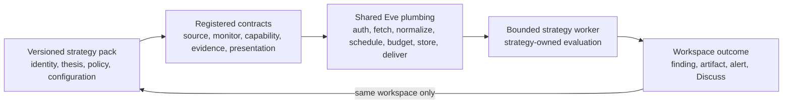
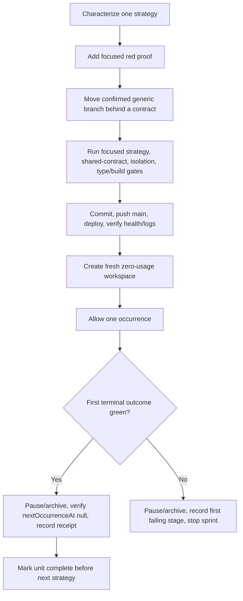

# Strategy Application Boundary and Per-Strategy Migrations - Plan

## Goal Capsule

**Objective:** Make every existing strategy pack a fully functional, isolated application on Eve's reusable platform plumbing, with no named-strategy behavioral branch in generic scheduling, workspace, worker-dispatch, research, or presentation decisions.

**Means:** Migrate and prove one strategy at a time through stable registered contracts, preserving each strategy's distinct policy and ending every strategy sprint with focused regression proof plus one cleaned-up Production acceptance. (KTD1–KTD5)

**Authority:** The Product Contract below governs behavior. `HANDOFF.md` and `NORTH_STAR.md` govern existing safety and product boundaries. The current catalog and code on `main` govern implementation facts. `specs/07-strategy-platform-boundary-and-continuity.md` is research input only and is not an implementation authority.

**Stop conditions:** Stop the active sprint if its first Production acceptance fails, a proposed shared contract would flatten strategy-specific behavior, a change would alter an unrelated workspace, or a new architecture is required. Record the exact blocker before starting another occurrence or strategy.

**Execution profile:** Run exactly one implementation unit at a time. Mark that unit's checklist complete only after code, focused verification, Production health, one bounded acceptance, and cleanup all pass. Do not begin the next unit while any prior gate is incomplete.

**Tail ownership:** Each sprint owns its commit, push to `main`, Production deployment, health/log check, disposable acceptance workspace, and final non-dispatchable cleanup. Durable Start Fresh continuity is a separate follow-up plan and is not implemented here.

## Product Contract

### Summary

Eve remains one owner-facing agent with many isolated strategy workspaces. Shared platform plumbing fetches and authenticates sources, normalizes evidence, schedules bounded work, enforces budgets, runs reviewed parsing and interpretation capabilities, stores findings, and delivers alerts. A versioned strategy pack defines how those capabilities are used for one investment thesis.

This plan completes the boundary incrementally across the five strategy IDs already in the catalog. IPO Filings is the accepted reference. Inverse Cramer, Public Commentary Tracker, Earnings Call Changes, and Congressional Signals migrate sequentially. Each must remain meaningfully different and fully operational after its migration.

### Problem Frame

The intended platform already exists, but some generic modules still branch on named pack IDs for initial scheduling, activation watermarks, evaluation windows, source eligibility, or worker behavior. Those branches make reusable plumbing understand a strategy's identity instead of a declared monitor, source, capability, or presentation contract.

Removing every strategy string is not the goal. Pack IDs remain valid provenance, registry keys, immutable binding identity, and guards inside strategy-owned workers. The defect is a named-strategy choice inside generic infrastructure when the behavior can be selected by a stable reviewed contract.

### Requirements

#### Shared platform boundary

- R1. Generic scheduling, workspace lifecycle, monitor storage, worker dispatch, research capability selection, and presentation dispatch must select behavior from validated contracts or declarations rather than enumerating named pack IDs.
- R2. Shared plumbing may know stable source, adapter, schema, capability, evidence, and presentation contract IDs. It must not interpret a pack's thesis or strategy-specific policy.
- R3. Strategy-owned pack files, policy assets, schemas, evaluations, and bounded worker adapters may retain strategy identities when validating their own immutable binding or provenance.
- R4. Adding a strategy that uses existing plumbing may require a reviewed catalog registration and pack definition, but must not require a new named branch in generic runtime code.
- R5. A strategy that needs genuinely new reusable plumbing may add one reviewed capability or source contract, then reference it from its pack. This plan adds no new connector or extension framework.

#### Strategy ownership and behavior

- R6. Each pack continues to own its monitored identities or issuers, source/tool requirements, thesis and instructions, watchlists or configuration, interpretation rules, affected assets and direction, schedules, thresholds, output schemas, evaluations, evidence requirements, counterevidence, and abstention policy.
- R7. Migration must not flatten different strategies into one generic prompt, score, threshold, or conclusion model.
- R8. Historical pack versions and installed workspaces remain immutable. A changed runtime contract ships through a new pack version only when the pack's declared behavior changes, and no workspace upgrades automatically.
- R9. The current catalog scope is exactly `ipo-filings`, `inverse-cramer`, `public-commentary-tracker`, `earnings-call-changes`, and `congressional-signals`. New strategies are outside this plan.

#### Per-strategy operational proof

- R10. Migrate one strategy at a time. A later strategy cannot start until the prior strategy's local gates, deployment, single Production acceptance, and cleanup are green.
- R11. Every migrated strategy must preserve its existing acquisition, deterministic extraction, cheap recovery where registered, semantic/materiality policy, provenance, deduplication, correction handling, no-change behavior, findings, artifacts, alerts, and Discuss routing.
- R12. Every remaining strategy must adopt the shared frontier research decision, bounded read-only tools, nested budget, replay-safe receipt, executive brief, and artifact contracts at its strategy-owned materiality boundary. A no-new-facts occurrence must not invoke frontier reasoning, research, or artifact publication.
- R13. Exactly one fresh zero-usage Production workspace is used for each strategy acceptance. Permit one occurrence, pause on its first terminal result, archive the disposable workspace, and verify no test monitor remains dispatchable.
- R14. A failed first acceptance stops that strategy sprint. Do not fix and retry within the same acceptance receipt, and do not proceed to another strategy.
- R15. Actual model/provider cost must be reported separately from reservations. Acceptance must also report source reads, extraction/semantic outcome, finding or correct no-signal result, artifact/alert delivery where applicable, and final paused/archived state.

#### Isolation and compatibility

- R16. One workspace must never receive another workspace's pack instructions, configuration, watchlist, source projection, findings, alerts, artifacts, budget state, or chat history.
- R17. Background alerts remain labeled and independently delivered without becoming an inbound turn in Main or another active workspace. Discuss may explicitly select the producing workspace and inject only its bounded alert context.
- R18. Existing owner-authorized backend services are the default for operational acceptance. Do not edit Redis directly, invoke workers manually, add temporary Production endpoints, or generate repeated owner-chat workflows.
- R19. Approval-gated Coinbase behavior remains unchanged. Monitor research authority is never trading authority, and this work must not block a separately designed autonomous-trading policy later.
- R20. Start Fresh continuity implementation is deferred to an independent plan. This plan must not restore old transcripts or add a memory framework while performing migrations.

### Key Decisions

1. **Prove one strategy at a time.** (session-settled: user-directed — chosen over a bulk migration: each strategy must remain fully functional and independently accepted before the next begins.) Governs R10–R15.
2. **Use stable contracts, not a generic plug-in framework.** (session-settled: user-directed — chosen over Spec 07's broad one-shot boundary refactor: the smallest existing declaration or registry seam should replace each confirmed named branch.) Governs R1–R5.
3. **Keep strategy-specific behavior strategy-owned.** (session-settled: user-directed — chosen over making strategies generic: shared X, SEC, earnings, research, and alert plumbing must not erase different theses or decision policies.) Governs R6–R9.
4. **Treat Start Fresh continuity as a required independent task.** (session-settled: user-directed — chosen over bundling continuity into the migrations: migration risk should be isolated while the continuity outcome remains explicitly tracked.) Governs R20.
5. **Use real Production proof and clean it up.** (session-settled: user-directed — chosen over UI-only or local-only confidence: each strategy needs one bounded backend-controlled end-to-end acceptance.) Governs R13–R18.

### Key Flows

- F1. A due monitor resolves its immutable pack binding and declared monitor/source/capability contracts, acquires only authorized evidence, runs its strategy-owned evaluation policy, commits one terminal outcome, and routes any resulting artifact/alert to the producing workspace.
- F2. A migration sprint characterizes current behavior, replaces only confirmed generic named branches, proves the strategy locally, deploys, runs one disposable Production occurrence, pauses/archives it, and records the receipt before another strategy begins.
- F3. An alert from a background strategy is delivered to the owner without becoming input to the active workspace. Discuss explicitly routes the next bounded turn to the producing workspace.

### Acceptance Examples

- AE1. Inverse Cramer and Public Commentary Tracker share public-commentary/X or official-web plumbing but retain different monitored identities, thresholds, semantic instructions, asset conclusions, and evaluation fixtures.
- AE2. Earnings Call Changes uses shared source, hybrid evidence, research, budget, artifact, and alert contracts while retaining transcript comparison, correction, materiality, and citation policy.
- AE3. A House disclosure acquisition failure terminalizes one Congressional occurrence once. It does not emit explanatory prose without an outcome or dispatch the same occurrence repeatedly.
- AE4. Main remains active and responsive while a migrated background strategy runs. Its alert does not enter Main's context; Discuss selects only the producing workspace.
- AE5. A duplicate scheduler tick or worker replay produces no duplicate source side effect, paid call, finding, artifact, alert, or cost.
- AE6. A no-new-facts occurrence completes successfully before frontier reasoning or research and records no avoidable model/tool/artifact spend.

### Scope Boundaries

#### In scope

- Contract-driven removal of confirmed strategy-name decisions from generic runtime modules.
- Separate migrations and acceptances for every remaining catalog strategy.
- The existing shared agentic-research, budget, executive-brief, artifact, alert, and Discuss plumbing where appropriate to each strategy.
- The known Congressional terminal-outcome/retry defect because Congressional cannot pass end to end without it.
- Final cross-strategy isolation and catalog-completeness proof.

#### Deferred to Follow-Up Work

- A separate durable Start Fresh continuity plan must implement same-turn persistence of explicit mission, thesis, watchlist, source, and open-question changes before Eve claims it will remember them.
- That plan must make Start Fresh clear only old messages, temporary conversational context, and temporary reasoning; the new generation must receive a bounded structured summary of the same workspace's durable state without receiving the old transcript.
- That plan must independently prove unsupported changes are not fabricated, background monitors survive generation rollover, and no durable state crosses workspace boundaries.

#### Outside this plan

- New schedulers, source-event architecture, connectors, strategy DSLs, remote pack loading, or arbitrary strategy code execution.
- New strategies, multiple packs per workspace, broad Session Management redesign, or owner-private artifact storage.
- Autonomous Coinbase trading, broker changes, approval changes, or financial-policy redesign.
- Cross-workspace memory, shared chat histories, or automatic convergence between strategies.
- Automatic upgrades or edits to owner workspaces unrelated to a disposable acceptance.

### Success Criteria

- SC1. All five catalog strategy IDs have a recorded green boundary/operation receipt: IPO as the accepted reference and four remaining strategy migrations from this plan.
- SC2. Generic runtime modules no longer branch on those pack IDs to choose behavior that a monitor, source, capability, worker, or presentation contract can own.
- SC3. Each strategy's focused regression corpus and one Production occurrence show unchanged or deliberately versioned behavior, correct cost accounting, and final non-dispatchability.
- SC4. A final multi-workspace proof demonstrates simultaneous isolation of Main and strategy workspaces without merging context.
- SC5. The only remaining part of the owner's stated target is the separately documented durable Start Fresh continuity implementation.

## Planning Contract

### Key Technical Decisions

- KTD1. Replace each named branch at its narrowest stable boundary: monitor scheduling behavior becomes a validated monitor lifecycle declaration; worker selection becomes a registered capability/worker contract; research/tool selection becomes a hybrid evidence contract; presentation becomes a presentation contract. (session-settled: user-directed — chosen over a new general extension abstraction: existing reviewed registries and declarations are sufficient.) Implements R1–R5.
- KTD2. Classify pack-ID reads before changing them. Provenance checks, immutable binding validation, catalog registration, and strategy-owned worker guards remain; only generic behavioral selection moves behind a contract. Implements R2–R4.
- KTD3. Preserve historical packs and add a new immutable version only when a migration changes the pack's declared capabilities, instructions, output, or operational contract. Internal contract dispatch that preserves a pack digest does not force a cosmetic version. Implements R8.
- KTD4. Treat Public Commentary as one bounded family milestone but execute its two strategy IDs serially: Inverse Cramer first, then Public Commentary Tracker. The shared vertical may change once, but each pack receives its own fixtures and Production acceptance before the family milestone closes. (session-settled: user-directed — chosen over either a bulk multi-strategy release or duplicating the shared vertical: the two packs share plumbing but still require independent proof.) Implements R7, R10–R15.
- KTD5. Use the existing owner-authorized application services for Production acceptance. A revision conflict permits rereading and retrying only the pause/archive mutation, never the occurrence. Implements R13–R18.
- KTD6. Repair the Congressional source-failure terminal outcome as the first step of the Congressional sprint, then migrate that same strategy. Do not generalize retry architecture beyond the reproduced failure. Implements R10–R14 and AE3.
- KTD7. End with a read-only boundary and isolation audit, not another live occurrence. Per-strategy Production receipts already prove dispatch; the final unit composes their local contracts and checks no named generic branch or dispatchable test state remains. Implements R1, R4, R16–R18.

### High-Level Technical Design

The diagrams are boundary maps, not prescriptions for new layers. Implementers should reuse the smallest current contract seam that satisfies them.





### Confirmed Boundary Inventory

The initial `origin/main` audit identified the following candidates. Each active sprint must re-read its relevant current code because earlier migrations may remove or reshape them.

- Generic monitor lifecycle decisions in `agent/lib/workspace-monitor-store.ts` currently enumerate Earnings and public-commentary pack IDs for empty-source eligibility, activation watermarks, initial occurrences, and due-window recovery.
- Generic installation timing in `agent/lib/strategy-pack-service.ts` currently enumerates public-commentary pack IDs for immediate first occurrence behavior.
- Generic evaluation-window selection in `agent/lib/workspace-worker-runner.ts` currently enumerates public-commentary pack IDs and versions for cadence-derived backfill.
- Strategy-owned workers in `agent/lib/public-commentary-workspace-worker.ts`, `agent/lib/earnings-call-workspace-worker.ts`, `agent/lib/congressional-workspace-worker.ts`, and `agent/lib/sec-ipo-workspace-worker.ts` validate their own bindings. Those checks are not automatically defects under KTD2.
- `agent/lib/hybrid-evidence-worker-contract-registry.ts` is the accepted shared contract-dispatch seam created by commit `58901f8`; it currently registers IPO research and commentary completion contracts without making the generic worker branch on a pack ID.

### Sequencing

1. Preserve the completed IPO and shared-contract receipts as the baseline.
2. Complete the Public Commentary family milestone serially: Inverse Cramer, then Public Commentary Tracker.
3. Complete Earnings Call Changes.
4. Repair and migrate Congressional Signals.
5. Run the final catalog boundary/isolation audit.
6. Start a new independent plan for durable Start Fresh continuity.

### Implementation Constraints

- Use one implementation worktree for the active unit and remove it after landing. Do not carry an unfinished unit's worktree into another strategy.
- Start from current `main`, re-read `AGENTS.md`, `HANDOFF.md`, and only the active strategy's code, pack files, relevant shared contracts, and focused tests.
- Use test-first characterization for each named generic decision before replacing it.
- Do not broadly revalidate Specs 1–4C. Run only the active strategy's focused corpus, directly changed shared-contract checks, minimum type/build gates, and one concise diff review.
- Do not alter or archive owner workspaces except the disposable acceptance created by that unit.
- Update the Progress Tracker and the active unit checklist only after the unit's acceptance and cleanup are complete.

## Implementation Units

### Progress Tracker

- [x] Baseline A — Shared durable-research U1–U4 implemented; `ipo-filings@1.1.1` passed one zero-usage Production acceptance and was cleaned up. Receipt is in `docs/plans/2026-08-20-1154-feat-agentic-durable-research-plan.md`.
- [x] Baseline B — Shared hybrid-evidence worker contract dispatch landed in commit `58901f8`; Production deploy trigger `f88d7c3` is healthy.
- [ ] U1 — Migrate and accept Inverse Cramer. Reopened for the focused direct-model actionability correction below.
- [ ] U2 — Migrate and accept Public Commentary Tracker.
- [ ] U3 — Migrate and accept Earnings Call Changes.
- [ ] U4 — Repair, migrate, and accept Congressional Signals.
- [ ] U5 — Complete the final catalog boundary and cross-workspace isolation audit.
- [ ] Deferred follow-up, not a completion gate for this plan — Create and execute the independent durable Start Fresh continuity plan after U5.

### U1. Migrate and accept Inverse Cramer

**Goal:** Make the current Inverse Cramer pack use contract-driven public-commentary scheduling, evaluation, research, budget, executive output, and presentation while preserving its Jim Cramer inverse-direction policy.

**Requirements:** R1–R19; AE1, AE4–AE6; SC1–SC3.

**Dependencies:** Baselines A and B.

**Primary files:**

- `agent/lib/strategy-pack-service.ts`
- `agent/lib/workspace-monitor-store.ts`
- `agent/lib/workspace-worker-runner.ts`
- `agent/lib/public-commentary-workspace-worker.ts`
- `agent/lib/public-commentary-semantics.ts`
- `agent/lib/public-commentary-product-contract.ts`
- `agent/lib/hybrid-evidence-worker-contract-registry.ts`
- `strategy-packs/inverse-cramer/`
- `scripts/verify-public-commentary-signals-*.ts`

**Approach:**

1. Characterize immediate first occurrence, cadence-derived lookback, activation watermark, duplicate tick, no-change, X acquisition, reply/quote filtering, semantic direction, finding, artifact, alert, Discuss, budget, and replay behavior for the latest Inverse Cramer version.
2. Replace only generic Inverse Cramer/public-commentary name checks with validated monitor lifecycle and worker/evidence contracts. Keep the strategy's identity, monitored user, inverse transform, thresholds, asset resolution, and evaluation fixtures strategy-owned.
3. Adopt shared agentic research and executive output through a new immutable pack version if its declared behavior changes; preserve every historical version and require explicit owner creation.
4. Run one backend-controlled fresh zero-usage Production occurrence, then pause/archive and record source reads, semantic/finding result, research/artifact/Photon result, actual versus reserved cost, and `nextOccurrenceAt: null`.

**Test scenarios:**

- A new cadence-derived monitor dispatches one immediate occurrence despite normal scheduler delay; a duplicate tick does not dispatch twice.
- A genuinely stale historical occurrence remains skipped.
- No new X facts finish before frontier/research/artifact spend.
- A material statement preserves Inverse Cramer direction, evidence, counterevidence, confidence, alert, artifact, and Discuss behavior.
- A crash after research reuses the stored receipt; duplicate workers do not duplicate paid calls or findings.
- Main remains active and receives no Inverse Cramer context.

**Verification:** Use the public-commentary sprint/follow-up, real-model fixture, tracker-reuse, shared research U1–U3, strategy-pack, workspace-isolation, TypeScript, Eve build, and application build gates listed in the Verification Contract. Complete one Production acceptance and cleanup.

**Completion checklist:**

- [x] Focused red characterization captured. `verify:public-commentary-signals:boundary` preserves the current immediate occurrence, cadence-derived window, and first-run lookback assertions, then fails on the first generic `inverse-cramer` strategy-name branch in `strategy-pack-service.ts`.
- [x] Smallest contract migration implemented. Inverse Cramer `1.4.0` declares its lifecycle and research contracts; generic scheduling and dispatch no longer select it by strategy name; final research, nested spend, executive output, and replay use the shared registered plumbing while historical pack versions remain immutable.
- [x] Focused verification and concise diff review green. Lifecycle dispatch/skip/deduplication, public-commentary Sprints 0–4/follow-up/tracker reuse, shared research U1–U3/contract dispatch, aggregate-versus-per-call budget enforcement, pack/runtime/owner surfaces, workspace/worker isolation, the frozen real-source fixture, one controlled real-model case, TypeScript, Eve build, application build, and `git diff --check` passed.
- [x] Commit pushed to `main`; Production health and bounded logs green. Implementation `f1c4749` and verified-author deploy trigger `8115d75` produced READY deployment `dpl_iUzzPpKvHyB2iCoHkpHicsPYRGPt`; `/`, `/skill`, and `/eve/v1/health` returned HTTP 200, and the bounded post-ready error/warning log scan was empty.
- [x] Creation-path blocker contained. Redaction-safe transaction diagnostics shipped in `d9998c0`; the original Upstash `storage_failure` did not reproduce on the next single paused diagnostic creation, so it is recorded as transient rather than claimed fixed. The diagnostic workspace was archived normally with `nextOccurrenceAt: null`, no occurrence, and no cost.
- [x] First-run selection hypothesis disproved before a code repair. A focused production-pipeline fixture now proves a declared 12-hour cadence contract sends one acquired original/final post into deterministic analysis while preserving the no-search/no-semantic path for non-actionable commentary. The prior live semantic count of zero therefore reflects the designed deterministic actionability gate, not loss at baseline selection.
- [x] One zero-usage Production occurrence terminal and reported. Fresh workspace `Inverse Cramer U1 Acceptance 0528` (`inverse-cramer@1.4.0`) acquired three complete original/final X posts in its cadence-derived interval and terminalized once as `no_match`. Deterministic extraction found no statement eligible for frontier interpretation, so semantic research, findings, artifacts, and Photon delivery were correctly not invoked. The scheduled occurrence reserved 25,000 input tokens, 12,000 output tokens, and `$3.500000`; its nested X call reserved `$1.000000`. Both reconciled to 5,746 input tokens, 859 output tokens, and `$0.015000` actual total spend (three billable X reads), with zero active workers.
- [x] Disposable monitor paused/archived and non-dispatchable. Monitor `ac472433-4336-539e-bf93-6ad3b56e5880` is `suspended_archived`, configuration revision 4, `lastCompletedAt: 2026-08-21T05:29:21.867Z`, `lastErrorCode: null`, and `nextOccurrenceAt: null`; Main was restored active.
- [x] U1 and Progress Tracker marked complete before U2 begins.

#### U1 focused correction — direct model actionability

The accepted `1.4.0` path still used deterministic asset/stance extraction as a
precondition for semantic evaluation. That can discard natural-language market
views before the model sees them. Correct only that ordering for a new immutable
Inverse Cramer pack version; do not change Public Commentary Tracker or any
historical pack.

- [x] Focused red proof captured. Sprint 3 failed because a natural-language Micron view without a cashtag or parser keyword completed without reaching semantic evaluation; Sprint 1 failed because a reply-excluding configuration still emitted `exclude=retweets` instead of `exclude=retweets,replies`.
- [x] Model contract returns the referenced asset/market and Cramer's stance; the signed semantic input includes the optional owner watchlist. The focused Micron fixture resolves `MU`, carries `selectedSymbols: ["MU"]`, and reaches the semantic contract without cashtags or parser sentiment keywords.
- [x] Existing inverse-direction policy, deterministic watchlist enforcement, thresholds, research, artifact, alert, budget, replay, and isolation behavior remain intact. The direct-model fixture produces the registered bearish inverse direction while the pre-existing watchlist, replay, correction, and workspace-isolation assertions remain green.
- [x] X acquisition requests only supported selected roles. Reposts remain provider-excluded; replies now join the provider `exclude` parameter when disabled. X's user-posts endpoint has no quote exclusion parameter, so disabled quote posts are discarded before semantic evaluation and are not registered for later paid rehydration.
- [x] Focused verification and concise diff review green. Public-commentary Sprints 1 and 3, follow-up, tracker reuse, strategy boundary, shared research contract dispatch and U1–U3, pack/catalog owner surfaces, TypeScript, Eve build, application build, and `git diff --check` passed. Review confirmed historical packs remain immutable, final watchlist enforcement remains deterministic, and disabled quotes cannot trigger semantic or paid rehydration work.
- [x] New immutable pack version committed, pushed, deployed, and Production health verified. Implementation `68e4000` is on `main`; direct Production deployment `dpl_AoTasmgvCNHrxkzqNhB9eWK3Tcv6` reached READY and was aliased to `adaam.vercel.app`. `/`, `/skill`, and `/eve/v1/health` returned HTTP 200, Eve reported `ready`, and the deployment-scoped bounded error log scan was empty.
- [ ] One fresh zero-usage Production occurrence terminal; disposable workspace paused/archived with `nextOccurrenceAt: null` and receipt recorded.
- [x] Production acceptance blocker recorded. The single owner-authorized paused `inverse-cramer@1.4.1` workspace creation attempt failed before registry commit at `2026-08-21T16:26:37.128Z`. The manager route returned HTTP 503 and Production logged `strategy_pack_mutation_failure_total` with `reasonCode: storage_failure`; the route diagnostic reported `provider_reason_code: unclassified` and `script_line: null`. Routing remained revision 86, Main remained active, no matching workspace or monitor exists, no occurrence dispatched, and no cost was incurred. Per the unit stop condition, no occurrence was retried and U2 did not begin.
- [x] Focused creation-transaction recovery repair implemented locally. Initial approval/replay storage reads are now classified safely, and a failed recovery inspection cannot replace the primary commit error. The focused regression reproduces the prior dual-failure masking, preserves the primary provider reason, proves initial read classification, and remains green without adding scheduler or occurrence retries.
- [x] Focused repair committed, pushed, deployed, and Production health verified. Commit `b07c41e` is on `main`; Production deployment `dpl_28Wz73twEdZ1JFNyrbtjX9fjA2ka` reached READY and was aliased to `adaam.vercel.app`. `/`, `/skill`, and `/eve/v1/health` returned HTTP 200, Eve reported `ready`, and the bounded deployment error scan was empty.
- [x] Post-repair Production acceptance failure recorded and contained. Fresh zero-usage workspace `Inverse Cramer 1.4.1 Acceptance 20260821` (`inverse-cramer@1.4.1`) was created successfully through the owner-authorized backend, confirming the repaired creation path. Its single immediate occurrence acquired and projected one complete original/final X post, then the semantic worker failed before committing an outcome with `SESSION_TOKEN_LIMIT_REACHED` (`hybrid_evidence_worker_failed`); the later tool-loop attempt was rejected as `source_already_attempted`. The monitor first surfaced `worker_outcome_missing`, then its normal recovery tick finalized `paused_failure` as `worker_recovery_not_applicable`. No semantic result, finding, artifact, or Photon delivery was produced. Worker-visible semantic usage was 12,000 input tokens, 2,000 output tokens, and `$0.250000`; the workspace ledger retained its conservative 25,000-input, 12,000-output, `$3.500000` occurrence reservation, while the X surface exposed only its `$0.005000` pay-per-use estimate rather than a reconciled actual receipt. The workspace was archived at registry revision 88, Main was restored active, and monitor `9affaa0c-62dd-5cd0-b0c4-d0fea9a9974d` is `suspended_archived` at configuration revision 4 with `nextOccurrenceAt: null`. Per the stop condition, the occurrence was not retried, no second fix began, U1 remains incomplete, and U2 remains blocked.
- [x] Focused semantic-session repair implemented and verified locally. Eve accounts provider input cumulatively across the signed task session, while the Inverse Cramer worker requires one model step to read evidence and a second to commit its candidate; the `1.4.1` 12,000-token session allowance could therefore terminate before commit. New immutable `inverse-cramer@1.4.2` binds semantic definition `1.0.1` with a 24,000-token cumulative allowance inside the unchanged 25,000-token occurrence ceiling. Historical `1.4.1` remains bound to semantic definition `1.0.0`. The focused follow-up, strategy boundary, Sprint 3, pack/catalog owner surfaces, TypeScript, Eve build, and diff review are green. Production deployment and one fresh zero-usage acceptance remain required before U1 completes.
- [x] Semantic-session repair committed, pushed, deployed, and Production health verified. Commit `9a2f519` is on `main`; direct Production deployment `dpl_FUGpYBQUxwhcZxUjj53Ae9rdmXht` reached READY and was aliased to `adaam.vercel.app`. `/`, `/skill`, and `/eve/v1/health` returned HTTP 200 with Eve `ready`, and the deployment-scoped pre-acceptance warning/error scan was empty.
- [x] `inverse-cramer@1.4.2` Production acceptance failure recorded and contained. Fresh zero-usage workspace `Inverse Cramer 1.4.2 Acceptance 20260821` dispatched exactly one immediate occurrence. X acquisition completed over one original/final post and advanced the public source cursor once. The `openai/gpt-5.4` semantic run read the signed evidence and its completion tool returned `state: completed`, proving the earlier `SESSION_TOKEN_LIMIT_REACHED` failure was removed; the outer evaluator then rejected the completed-job handoff with `job_lifecycle_invalid`. Its only later attempt was rejected as `source_already_attempted`, so the monitor terminalized as `worker_outcome_missing`. No semantic result committed, no finding or no-signal result was produced, and no artifact or Photon delivery was staged. The occurrence ledger retained conservative reservations of 25,000 input tokens, 12,000 output tokens, and `$3.500000`; Vercel observed actual model usage of 28,523 input/6,475 output tokens and `$0.1131365` for the semantic run plus 8,470 input/2,375 output tokens and `$0.01525875` for the outer run (`$0.12839525` actual model cost total). The monitor was paused immediately at configuration revision 3, then the workspace was archived at registry revision 90 with Main restored active. Monitor `03e21573-6ff5-54ec-8c60-46936747ba4d` is `suspended_archived`, `nextOccurrenceAt: null`, and non-dispatchable. Per the unit stop condition, no occurrence or fix was retried, U1 remains incomplete, and U2 remains blocked on the first incorrect semantic job-lifecycle transition.
- [x] Focused completed-job lifecycle repair implemented and verified locally. The delegated model can complete after the scheduled occurrence timestamp, so parent acceptance now preserves the durable job's later `updatedAt` instead of moving its lifecycle clock backward and failing schema validation. Identical accepted-result replay and genuine conflict checks remain unchanged. The exact stale-time acceptance regression, Spec 4C follow-up, Inverse Cramer strategy boundary, public-commentary Sprint 3, TypeScript, Eve build, and `git diff --check` are green. Production deployment, health proof, and one fresh zero-usage acceptance remain required before U1 completes.
- [x] Completed-job lifecycle repair committed, pushed, deployed, and Production health verified. Commit `25a81ef` is on `main`; direct Production deployment `dpl_BWuLLAuryDcaF8r1fHvBB9ykk55p` reached READY and was aliased to `adaam.vercel.app`. `/`, `/skill`, and `/eve/v1/health` returned HTTP 200 with Eve `ready`, and the deployment-scoped pre-acceptance error scan was empty.
- [x] Post-repair Production acceptance creation failure recorded and contained. The single owner-authorized attempt to create paused zero-usage workspace `Inverse Cramer Lifecycle Acceptance 20260821` (`inverse-cramer@1.4.2`) failed before registry commit at `2026-08-21T18:58:18.090Z`. The manager route returned HTTP 503 and Production logged `strategy_pack_mutation_failure_total` with `reasonCode: storage_failure`; route diagnostics reported `provider_reason_code: unclassified` and `script_line: null`. Registry revision remained 90, Main remained active, no matching workspace or monitor exists, no occurrence dispatched, and no cost was incurred. Per the unit stop condition, creation was not retried, no second lifecycle fix began, U1 remains incomplete, and U2 remains blocked on the strategy-pack creation transaction.
- [ ] U1 and Progress Tracker marked complete again before U2 begins.

### U2. Migrate and accept Public Commentary Tracker

**Goal:** Prove a differently configured commentary strategy can reuse the same contracts without an Inverse Cramer exception.

**Requirements:** R1–R19; AE1, AE4–AE6; SC1–SC3.

**Dependencies:** U1.

**Primary files:**

- `agent/lib/public-commentary-workspace-worker.ts`
- `agent/lib/public-commentary-tracker.ts`
- `agent/lib/public-commentary-vertical.ts`
- `agent/lib/public-commentary-source-contract.ts`
- `agent/lib/hybrid-evidence-worker-contract-registry.ts`
- `strategy-packs/public-commentary-tracker/`
- `scripts/verify-public-commentary-tracker.ts`
- `scripts/verify-public-commentary-signals-sprint-4-reuse.ts`

**Approach:**

1. Reuse U1's generic monitor and worker contracts without adding a tracker-specific branch.
2. Keep the tracker's official-web/X source configuration, monitored identity, thesis, interpretation, assets, thresholds, and abstention policy in its pack and strategy-owned policy assets.
3. Add a new immutable version only if declared research/output behavior changes.
4. Run its own local corpus and one separate backend-controlled zero-usage Production acceptance; do not treat the Inverse Cramer receipt as proof for this pack.

**Test scenarios:**

- The tracker runs through the same generic contracts with its own configuration and produces its own strategy result.
- Inverse and tracker conclusions can differ for the same normalized statement without changing shared plumbing.
- No new facts produce no frontier/research/artifact spend.
- Replay, duplicate ticks, alert/Discuss isolation, and budget nesting remain correct.
- A tracker alert does not enter Main or the Inverse Cramer workspace.

**Verification:** Run the tracker, commentary reuse/follow-up, directly affected shared-contract, pack, isolation, type/build gates, then one Production acceptance and cleanup.

**Completion checklist:**

- [ ] Tracker-specific characterization captured without duplicating U1 plumbing.
- [ ] Pack/contract migration implemented with no new named generic branch.
- [ ] Focused verification and concise diff review green.
- [ ] Commit pushed to `main`; Production health and bounded logs green.
- [ ] One zero-usage Production occurrence terminal and reported.
- [ ] Disposable monitor paused/archived and non-dispatchable.
- [ ] U2 and Progress Tracker marked complete before U3 begins.

### U3. Migrate and accept Earnings Call Changes

**Goal:** Move Earnings Call Changes onto the same contract-driven research/output boundary while preserving its reviewed issuer discovery, transcript comparison, correction, materiality, and citation behavior.

**Requirements:** R1–R19; AE2, AE4–AE6; SC1–SC3.

**Dependencies:** U2.

**Primary files:**

- `agent/lib/workspace-monitor-store.ts`
- `agent/lib/earnings-call-workspace-worker.ts`
- `agent/lib/earnings-call-semantic.ts`
- `agent/lib/earnings-call-hybrid-evidence-recovery.ts`
- `agent/lib/earnings-call-source-lifecycle-store.ts`
- `agent/lib/hybrid-evidence-worker-contract-registry.ts`
- `strategy-packs/earnings-call-changes/`
- `scripts/verify-earnings-call-changes-*.ts`

**Approach:**

1. Characterize the current empty-source eligibility, reviewed-source admission, activation watermark, comparison window, parser/recovery, semantic materiality, corrections, citations, no-change, alert, and replay paths.
2. Replace generic Earnings pack-name checks with monitor/source/capability declarations while keeping issuer/source-family and comparison policy strategy-owned.
3. Register the strategy's worker/research completion contract and create a new immutable pack version only for declared behavior changes.
4. Run one backend-controlled fresh zero-usage Production occurrence. Preserve accepted behavior if the live source naturally yields no change; use the existing fixture/evaluation corpus for semantic-signal proof.

**Test scenarios:**

- A reviewed earnings source is admitted by source contract, while an unreviewed source remains rejected without checking the pack name.
- No new transcript/comparison facts produce no frontier/research/artifact spend.
- Parser failure uses the existing bounded recovery route; semantic comparison retains exact citations and correction policy.
- Duplicate workers and replay do not duplicate provider calls, findings, artifacts, alerts, or cost.
- Main and commentary workspaces cannot read earnings configuration, evidence, or alert context.

**Verification:** Run Earnings sprints 0–5, production-wiring, source-lifecycle, recovery/corrections, directly affected hybrid/shared-contract, pack, isolation, type/build gates, then one Production acceptance and cleanup.

**Completion checklist:**

- [ ] Earnings characterization and named-branch red proof captured.
- [ ] Contract migration implemented without changing comparison semantics.
- [ ] Focused verification and concise diff review green.
- [ ] Commit pushed to `main`; Production health and bounded logs green.
- [ ] One zero-usage Production occurrence terminal and reported.
- [ ] Disposable monitor paused/archived and non-dispatchable.
- [ ] U3 and Progress Tracker marked complete before U4 begins.

### U4. Repair, migrate, and accept Congressional Signals

**Goal:** Make Congressional Signals terminalize one source-acquisition failure once, then move it onto contract-driven shared plumbing while preserving baseline, ordinal bands, committee evidence, delayed-disclosure semantics, and neutral alerts.

**Requirements:** R1–R19; AE3–AE6; SC1–SC3.

**Dependencies:** U3 and `docs/congressional-monitor-retry-defect.md`.

**Primary files:**

- `agent/lib/congressional-workspace-worker.ts`
- `agent/lib/congressional-strategy.ts`
- `agent/lib/congressional-history.ts`
- `agent/lib/house-hybrid-evidence-recovery.ts`
- `agent/lib/workspace-worker-runner.ts`
- `agent/lib/hybrid-evidence-worker-contract-registry.ts`
- `strategy-packs/congressional-signals/`
- `scripts/verify-congressional-signals-sprint-*.ts`
- `docs/congressional-monitor-retry-defect.md`

**Approach:**

1. Reproduce the recorded failure where House ZIP acquisition returns prose but no deterministic outcome, causing repeated dispatch and spend.
2. Make only that deterministic source-acquisition result terminal once. Preserve retry behavior for infrastructure interruption that has not produced a worker outcome.
3. Prove the repair before adopting shared research/output contracts. Then replace confirmed generic strategy-name dispatch with contracts while keeping House roster, member selection, ordinal bands, committee rules, history, corrections, and abstention strategy-owned.
4. Run one backend-controlled fresh zero-usage Production occurrence and stop on its first terminal result. Do not run a second acceptance if source availability or another stage fails.

**Test scenarios:**

- A deterministic House acquisition failure commits one failed/uncertain outcome and does not redispatch the same occurrence.
- A genuine pre-outcome infrastructure interruption retains the existing bounded recovery behavior.
- First acquisition establishes history without a false alert; later eligible facts preserve record-only/review/priority semantics.
- No new eligible facts produce no frontier/research/artifact spend.
- Duplicate ticks/replay do not duplicate cost, findings, artifacts, or alerts.
- Congressional evidence and alert context remain isolated from Main, commentary, and earnings workspaces.

**Verification:** Run Congressional sprints 0–5, the new retry regression, directly affected hybrid/shared-contract, pack, isolation, type/build gates, then one Production acceptance and cleanup.

**Completion checklist:**

- [ ] Exact retry defect reproduced with focused red proof.
- [ ] One-terminal-outcome repair green before migration begins.
- [ ] Congressional contract migration implemented without changing policy.
- [ ] Focused verification and concise diff review green.
- [ ] Commit pushed to `main`; Production health and bounded logs green.
- [ ] One zero-usage Production occurrence terminal and reported.
- [ ] Disposable monitor paused/archived and non-dispatchable.
- [ ] U4 and Progress Tracker marked complete before U5 begins.

### U5. Complete the final catalog boundary and isolation audit

**Goal:** Prove the catalog now composes isolated strategy applications on shared contracts and no test state or named generic behavior remains.

**Requirements:** R1–R20; AE1–AE6; SC1–SC5.

**Dependencies:** U1–U4.

**Primary files:**

- `agent/lib/strategy-pack-catalog.generated.ts`
- `agent/lib/strategy-pack-reference-catalog.ts`
- `agent/lib/hybrid-evidence-worker-contract-registry.ts`
- `agent/lib/strategy-pack-service.ts`
- `agent/lib/workspace-monitor-store.ts`
- `agent/lib/workspace-worker-runner.ts`
- `scripts/verify-strategy-packs.mjs`
- `scripts/verify-strategy-pack-runtime.ts`
- `scripts/verify-workspace-isolation.ts`
- `HANDOFF.md`

**Approach:**

1. Scan generic modules for the five production pack IDs and classify every remaining occurrence under KTD2. Remove only behavioral branches still located in generic plumbing; do not erase valid catalog/provenance/strategy-owned checks.
2. Add or update one composition fixture proving multiple differently shaped packs resolve through contracts without core exceptions. Reuse the existing alpha/beta pack fixtures rather than inventing a plug-in system.
3. Prove Main plus multiple strategy workspaces retain independent instructions, configuration, budgets, findings, alerts, and Discuss targets. Do not dispatch another paid Production occurrence.
4. Read the existing per-strategy acceptance receipts, verify every disposable monitor is paused/archived with no next occurrence, update `HANDOFF.md`, and record Start Fresh continuity as the sole remaining architecture phase.

**Test scenarios:**

- All five catalog packs validate and resolve only their declared sources/capabilities/presentations.
- Generic module scanning finds no unclassified named-strategy behavior.
- Two strategy workspaces can hold contradictory instructions and separate findings without context leakage.
- A background alert targets its producing workspace while Main remains selected and unchanged.
- No acceptance workspace remains active or dispatchable; no unrelated owner workspace was modified.

**Verification:** Run strategy-pack generation/validation/runtime/owner-surface checks, workspace isolation, shared contract dispatch, focused per-strategy smoke verifiers, TypeScript, Eve build, application build, and a read-only Production health/non-dispatchability audit.

**Completion checklist:**

- [ ] Remaining named-pack occurrences classified; generic behavioral exceptions removed.
- [ ] Cross-pack composition and strict isolation proof green.
- [ ] All per-strategy Production receipts and cleanup states verified read-only.
- [ ] Minimum type/build and concise final diff review green.
- [ ] `HANDOFF.md` records the completed migration state and independent Start Fresh follow-up.
- [ ] U5 and Progress Tracker marked complete.

## Verification Contract

### Per-unit local gates

Run only the active unit's applicable commands plus directly changed shared-contract checks.

**Shared gates used when their owning code changes:**

```bash
npm run verify:strategy-packs
npm run verify:strategy-pack-runtime
npm run verify:strategy-pack-owner-surfaces
npm run verify:agentic-durable-research:u1
npm run verify:agentic-durable-research:u2
npm run verify:agentic-durable-research:u3
npx jiti scripts/verify-workspace-isolation.ts
npm run typecheck
npm run build:agent
npm run build
git diff --check
```

**U1–U2 commentary gates:**

```bash
npm run verify:public-commentary-signals:sprint-0
npm run verify:public-commentary-signals:sprint-1
npm run verify:public-commentary-signals:sprint-2
npm run verify:public-commentary-signals:sprint-3
npm run verify:public-commentary-signals:sprint-4-reuse
npm run verify:public-commentary-signals:follow-up
npm run verify:public-commentary-tracker
```

Use the frozen real-source and real-model acceptors only when the active diff touches their semantics. Do not use live X calls as routine regression testing.

**U3 Earnings gates:**

```bash
npm run verify:earnings-call-changes:sprint-0
npm run verify:earnings-call-changes:sprint-1
npm run verify:earnings-call-changes:sprint-2
npm run verify:earnings-call-changes:sprint-3
npm run verify:earnings-call-changes:sprint-4
npm run verify:earnings-call-changes:sprint-5
npm run verify:earnings-call-changes:production-wiring
npm run verify:earnings-call-changes:worker-recovery-corrections
npm run verify:earnings-call-changes:source-lifecycle
```

**U4 Congressional gates:**

```bash
npm run verify:congressional-signals:sprint-0
npm run verify:congressional-signals:sprint-1
npm run verify:congressional-signals:sprint-2
npm run verify:congressional-signals:sprint-3
npm run verify:congressional-signals:sprint-4
npm run verify:congressional-signals:sprint-5
```

Add one focused retry/terminal-outcome verifier and include it in `package.json` before U4 is marked complete.

### Production gate for U1–U4

For each strategy independently:

1. Deploy the reviewed `main` commit and verify `/` and `/skill` return HTTP 200.
2. Query bounded Production logs for new errors before creating test state.
3. Through owner-authorized backend services, create one uniquely named workspace initially paused and bound to the new exact pack version.
4. Verify zero runs, zero tokens, zero active workers, and zero actual paid spend.
5. Configure the pack's normal realistic cadence/alerts and arm one near-future scheduled occurrence.
6. Observe the scheduler, acquisition, deterministic/recovery/semantic branch, finding or correct no-signal result, artifact/alert/Photon delivery, and actual versus reserved cost.
7. On the first terminal result, pause immediately using the latest revision. A revision conflict permits rereading and retrying only pause/archive.
8. Archive the disposable workspace and verify its monitor has `nextOccurrenceAt: null` and no acceptance monitor is dispatchable.
9. If any first occurrence fails, record the first failing stage and stop the unit without another occurrence.

### Review gate

Each unit receives one concise active-diff review for correctness, regressions, isolation, replay/spend safety, and scope. Do not run a broad reviewer fleet or historical revalidation.

## Definition of Done

### Global completion

- Baseline IPO and shared contract-dispatch receipts remain valid.
- Inverse Cramer, Public Commentary Tracker, Earnings Call Changes, and Congressional Signals each have focused green regression proof and one cleaned-up Production acceptance.
- Generic scheduling, workspace, worker, research, and presentation decisions no longer enumerate those pack IDs when a declared contract owns the behavior.
- Every strategy retains its distinct thesis, configuration, source/tool requirements, interpretation, affected assets, thresholds, evidence, counterevidence, abstention, output, and evaluations.
- Historical pack versions and unrelated owner workspaces remain unchanged.
- No duplicate scheduler tick, replay, or worker race duplicates paid calls, findings, artifacts, alerts, or spend.
- Main and all strategy workspaces remain strictly isolated, including alert and Discuss routing.
- Every disposable test monitor is paused/archived, has `nextOccurrenceAt: null`, and is non-dispatchable.
- Approval-gated Coinbase behavior is unchanged.
- Dead-end or experimental implementation code is removed from every landed sprint.
- `HANDOFF.md` records the completed strategy-platform boundary and names durable Start Fresh continuity as the independent remaining task.

### Per-unit completion

- The unit's completion checklist and Progress Tracker entry are marked only after local proof, deploy, single Production acceptance, and cleanup.
- A failed acceptance leaves the unit unchecked and records the exact first failing stage.
- The next unit does not begin until the current unit is complete.

### Deferred continuity completion contract

This plan does not claim the owner's full continuity target is complete. A subsequent implementation-ready plan must deliver and accept all of the following before Eve reaches that final form:

- Explicit supported mission, thesis, watchlist, source, and open-question changes persist in the same turn before Eve claims they will be remembered.
- Start Fresh clears only the selected workspace's old messages, temporary conversational context, and temporary reasoning.
- The replacement generation receives a bounded structured summary of that workspace's durable task and operational state, never the old transcript.
- Monitors, schedules, checkpoints, findings, alerts, pack binding, configuration, budget, and workspace isolation survive unchanged.
- No state from another strategy workspace can enter the fresh generation.
