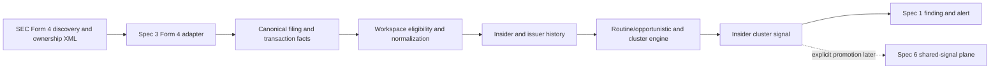

# Spec 5: Insider Clusters

Status: Draft for implementation after Specs 1–3

Date: 2026-08-14

Product target: `NORTH_STAR.md`

Strategy research:

- `idea/insider-buying-clusters.md`
- `idea/informed-traders-watchlist.json`

Dependencies:

- `specs/01-independent-workspace-runtimes.md`
- `specs/02-versioned-strategy-packs.md`
- `specs/03-public-source-adapters.md`

Pack target: `insider-clusters@1.0.0`

## Plain-language objective

Create an isolated strategy agent that monitors official SEC Form 4 filings,
keeps a durable history for each corporate insider, distinguishes routine or
non-conviction transactions from potentially opportunistic open-market
purchases, and alerts when at least three distinct insiders at one issuer form a
qualified buying cluster within a configured 60–90 day window.

The strategy is intentionally skeptical. A single purchase is not a cluster,
transaction code alone does not prove motive, and missing 10b5-1/history/entity
evidence cannot be filled by model intuition. The output is a sourced research
signal, not an instruction to buy the security.

## How to use this specification

Implement using Spec 3's adapter/fact contracts and Specs 1–2's runtime/pack
contracts. This specification adds the source-specific SEC Form 4 adapter and
the insider-strategy records, classification, scoring, alerts, and evals. It
must not create a parallel scheduler, source store, pack system, or alert path.

Every implementation item is a checklist. Deterministic parsing and transaction
classification precede model interpretation. Historical backfill must complete
to a declared coverage level before the routine/opportunistic policy can label a
purchase with high confidence.

## Goal and acceptance experience

The completed strategy must support this scenario:

1. The owner installs `insider-clusters@1.0.0` in an `Insider Clusters` session
   and explicitly enables daily Form 4 monitoring with a 90-day cluster window.
2. The pack consumes official SEC filing/index facts and fetches each new Form 4
   ownership document through a reviewed Spec 3 adapter.
3. It normalizes issuer, reporting owner, role, security, transaction code,
   acquisition/disposition, shares, price, ownership form, 10b5-1 disclosure,
   filing/transaction dates, footnote references, and amendments.
4. Only qualifying non-derivative open-market purchases enter the cluster
   candidate set. Exercises, grants, gifts, dispositions, derivatives, routine
   purchases, duplicates, and sufficiently identified 10b5-1 transactions do
   not count.
5. Three distinct insiders make qualifying opportunistic purchases in the same
   issuer inside the configured window. The deterministic cluster engine creates
   one versioned signal with full membership and factor trace.
6. Eve sends one **Insider Clusters** alert showing what was disclosed, why the
   cluster qualified, important unknowns/counterevidence, and the SEC sources.
7. Corrections, late amendments, replay, and additional insiders revise the
   cluster without duplicate alerts or lost history.

## Agreed product decisions

- [ ] Official SEC EDGAR Form 4 ownership filings are the primary source.
- [ ] Third-party insider feeds may be evaluated later as explicit enrichment or
  fallback; they cannot silently replace official filings.
- [ ] Version 1 detects insider-buying clusters. It does not implement activist
  13D, super-investor 13F, congressional, valuation, or social-signal strategies.
- [ ] A cluster requires at least three distinct canonical reporting owners at
  the same issuer within an owner-configurable 60–90 day transaction-date window.
- [ ] The default cluster window is 90 days.
- [ ] Only transactions deterministically classified as qualifying open-market
  purchases can count toward the core cluster.
- [ ] Transactions identified as 10b5-1/planned do not count. Unknown plan status
  is preserved and cannot receive the strongest conviction treatment.
- [ ] Routine/opportunistic classification requires sufficient historical
  coverage. Insufficient history produces `unknown`, not opportunistic.
- [ ] The strategy preserves indirect ownership, trusts, entities, and owner
  roles as disclosed and does not infer who controlled a transaction.
- [ ] Disclosed shares and price may calculate reported transaction value only
  when both are present and valid. Missing values are not estimated.
- [ ] Market cap, price decline, compensation, analyst coverage, valuation, and
  news are optional reviewed enrichments, never fabricated required fields.
- [ ] No strategy score or alert constitutes personalized advice, guaranteed
  performance, evidence of illegal trading, or broker authorization.
- [ ] Cross-strategy convergence is deferred to Spec 6.
- [ ] No private artifact system is required; official public document URLs,
  hashes, bounded facts, and workspace strategy records are sufficient.

## Vocabulary

| Term | Meaning |
| --- | --- |
| Form 4 | SEC ownership filing reporting changes in beneficial ownership by reporting persons. |
| Reporting owner | Person or entity identified in the filing as subject to reporting obligations. |
| Issuer | Company whose securities are reported in the filing. |
| Transaction | One non-derivative or derivative transaction row with source codes and amounts. |
| Qualifying purchase | Transaction satisfying the versioned core eligibility policy; not a claim about motive. |
| Routine purchase | Purchase matching a sufficiently established recurring historical pattern under policy v1. |
| Opportunistic purchase | Qualifying purchase that breaks a sufficiently covered routine pattern under policy v1. |
| Unknown pattern | Purchase whose historical coverage cannot support routine/opportunistic classification. |
| Cluster | At least three distinct qualifying insiders at one canonical issuer within the configured window. |
| Cluster revision | Immutable recalculation after a new filing, amendment, correction, expiry, or policy/reference change. |
| Local cluster score | Deterministic score using only Insider Clusters evidence, before Spec 6 convergence. |

## Scope

### In scope

- `insider-clusters@1.0.0` under the Spec 2 pack framework.
- A reviewed, versioned SEC Form 4 public-source adapter under Spec 3.
- SEC index/feed discovery, exact filing-document retrieval, ownership XML
  parsing, canonical filing and transaction facts, and amendments.
- Issuer and reporting-owner identity with explicit ambiguity.
- Durable workspace insider transaction history and coverage state.
- Transaction eligibility and reason-coded exclusions.
- Versioned routine/opportunistic pattern policy.
- Rolling issuer cluster membership, correction, expiry, and revision logic.
- Local factor scoring and alert bands.
- Optional, separately capability-gated public enrichments when existing reviewed
  adapters are available.
- Natural-language configuration, Spectrum visibility, alerts, and pack evals.

### Out of scope

- Schedule 13D/13G activist monitoring.
- 13F institutional holdings or super-investor monitoring.
- Congressional, political, social, earnings-language, valuation, or news packs.
- Universal multi-signal convergence scoring; Spec 6 owns promoted signals.
- Employee compensation or personal net-worth estimation.
- Claims that purchase size exceeds a percentage of compensation unless a later
  authoritative, versioned input explicitly supplies it.
- Broad historical backtesting or return/alpha claims.
- OpenInsider scraping or unreviewed aggregation websites.
- Paid SEC parsing vendors in the required acceptance path.
- Model-generated transaction codes, insider identities, issuer mappings,
  historical patterns, or cluster membership.
- Automatic order proposals, sizing, live trading, or broker access.

## Non-negotiable invariants

- [ ] SEC source access occurs only through a reviewed Spec 3 adapter with exact
  official origins, fair-access identity, response bounds, and checkpoints.
- [ ] Raw Form 4/XML never enters interactive model history. Workers receive
  bounded authorized facts and strategy records.
- [ ] Canonical filing/transaction facts remain source-global and immutable;
  workspace classifications/signals remain isolated workspace state.
- [ ] Each canonical transaction is consumed exactly once per workspace,
  binding, and classification-policy version.
- [ ] Issuer and reporting-owner identity use stable canonical identifiers where
  present. Name similarity alone cannot merge insiders or issuers.
- [ ] A cluster counts distinct reporting-owner identities, not filing rows,
  titles, aliases, trusts, or repeated amendments.
- [ ] Transaction code, acquisition/disposition, derivative status, ownership,
  and 10b5-1 state are separate typed fields. No single heuristic overwrites the
  source fields.
- [ ] Insufficient history cannot become `opportunistic`; ambiguous plan status
  cannot become `not_10b5_1`.
- [ ] A cluster revision is reproducible from immutable member transactions,
  policy version, window, and as-of time.
- [ ] Corrections/amendments replace contributions through explicit lineage and
  never double-count the original and amendment.
- [ ] The score stores a complete factor trace. The model cannot provide numeric
  contributions, cluster membership, or alert band.
- [ ] Historical backfill emits no live alert and does not consume live-monitor
  notification budget as new activity.
- [ ] Alerts use neutral public-disclosure language and state material unknowns.
- [ ] The pack cannot access another workspace, Coinbase, broker mutations,
  interactive approvals, shell, filesystem, or undeclared sources/providers.
- [ ] Logs/metrics never contain insider names, issuer/ticker, CIK, accession,
  filing URL, transaction quantities/prices/values, cluster IDs, workspace IDs,
  or owner IDs.

## Target architecture

## Pack definition

`insider-clusters@1.0.0` declares:

- compact mission and load-on-demand insider-cluster playbook;
- SEC Form 4 adapter/version and exact official source instances;
- one new-filing monitor template plus an explicit bounded historical-baseline
  operation;
- configurable cluster window from 60 through 90 days, default 90;
- configurable minimum alert band and correction alerts;
- optional issuer/watchlist scope, defaulting to the explicitly selected
  monitored universe rather than an unbounded implicit crawl until capacity is
  proven;
- required fact, strategy-state, finding, alert, and completion tools;
- optional reviewed enrichment capabilities, default disabled;
- explicit denial of paid fallback, general search, Coinbase, shell, filesystem,
  and financial mutations; and
- versioned Form 4, transaction, history, classification, cluster, factor, and
  alert schemas/evals.

- [ ] Installing/browsing the pack starts no monitor or historical backfill.
- [ ] An all-market scope requires explicit owner activation plus capacity/rate
  checks and a proven bounded SEC discovery strategy.
- [ ] Selected issuer scope resolves CIK/security identity before saving; ticker
  text alone is not authoritative.
- [ ] Configuration cannot change core eligibility, minimum distinct insiders,
  routine policy, or shared safety limits.

## SEC Form 4 source adapter

Register a versioned adapter through Spec 3 rather than embedding fetching in
the pack.

### Discovery

- [ ] Use an official SEC current/latest filing source or reviewed index path
  capable of discovering Form 4 and Form 4/A filings under the configured scope.
- [ ] Preserve accession number, form type, acceptance/filing times, issuer CIK,
  reporting-owner identity references, and canonical filing/document URLs.
- [ ] Establish an initial checkpoint without alerting on the full current feed.
- [ ] Use accession plus exact document identity for dedupe; a Form 4/A is a
  related amendment, not an unrelated new filing.
- [ ] Respect SEC identifying user agent and aggregate request-rate policy across
  every Eve adapter.

### Ownership document parsing

Parse official ownership XML deterministically with disabled external entities
and bounded records/text. Canonical facts preserve:

- issuer CIK, name, and trading symbol as reported;
- reporting-owner CIK/name/address fields where public and required for identity;
- director/officer/ten-percent/other relationship flags and officer title;
- filing accession/form/period/acceptance information;
- non-derivative and derivative table distinction;
- security title;
- transaction date;
- transaction code, equity-swap flag, acquisition/disposition code;
- shares/securities amount, price, post-transaction holdings;
- direct/indirect ownership and nature of indirect ownership;
- 10b5-1/planned-trade indicator when the source schema supplies it;
- footnote IDs/references as bounded text references, not model-interpreted facts;
- amendment/correction lineage; and
- extraction/schema status and source provenance.

- [ ] Decimal quantities/prices remain decimal strings or scaled integers, never
  binary floating point.
- [ ] Missing XML elements remain absent/unknown; parser defaults never create a
  purchase, price, role, plan status, or ownership type.
- [ ] Resolve repeated reporting-owner and transaction nodes without multiplying
  rows accidentally.
- [ ] Bound/normalize footnotes separately; a strategy factor cannot depend on
  unparsed prose without a reviewed extractor and fixture.
- [ ] A partial document cannot be marked complete or contribute to a cluster.

### Adapter fixtures

- [ ] Form 4 with one non-derivative code-P acquisition.
- [ ] Multiple reporting owners and multiple transactions.
- [ ] Form 4/A correcting shares, price, owner, code, or transaction date.
- [ ] Option exercise, award, gift, sale, tax withholding, derivative, and other
  non-qualifying codes.
- [ ] Direct and indirect ownership, trust/entity owner, and unknown relationship.
- [ ] Explicit 10b5-1 yes/no and absent/unknown plan indicator.
- [ ] Missing ticker, missing price, zero/null value, decimals, footnotes, and
  malformed/partial XML.
- [ ] Duplicate feed observation, duplicate document, reordered nodes, oversized
  document, XXE attempt, stale correction, and retry.
- [ ] Read-only live smoke of one current official filing without strategy alert.

## Durable strategy records

### Insider transaction

`InsiderStrategyTransaction` stores:

- workspace/pack/policy identity and source fact/revision;
- canonical issuer and reporting-owner IDs plus resolution status;
- reported relationship flags/title and normalized role class;
- non-derivative/derivative status;
- source transaction/acquisition-disposition codes;
- transaction date, filing/acceptance date, and lag;
- decimal shares/price/value where source-complete;
- direct/indirect ownership and plan status;
- eligibility, routine/opportunistic classification, evidence/coverage, and
  exclusion reasons;
- amendment/correction relationship; and
- record revision/timestamps.

### Insider history

`InsiderIssuerHistory` is keyed by canonical issuer and reporting owner and
contains:

- source coverage window and completeness;
- all qualifying and excluded purchase observations needed for classification;
- recurring month/quarter patterns;
- prior purchase dates, intervals, sizes, direction, roles, and plan status;
- long-silence and first-observed indicators; and
- history/policy revision.

- [ ] Keep history issuer-specific. The same person at another issuer is a
  separate behavioral context unless a later policy explicitly needs both.
- [ ] Backfill at least the policy-required window before assigning high-
  confidence routine/opportunistic status.
- [ ] Store coverage gaps and source availability; absence during an uncovered
  period is not proof of no purchase.

### Cluster and signal

`InsiderCluster` contains issuer/security identity, window/policy/as-of time,
distinct qualifying owner IDs, exact transaction IDs/revisions, role mix,
aggregate decimal shares/value only where comparable/complete, member factor
traces, cluster score/band, correction/expiry lineage, and alert state.

`InsiderClusterSignal` contains the bounded workspace finding and optional later
Spec 6 promotion metadata. It never contains an order.

## Eligibility policy v1

A transaction can count toward the core cluster only when all required evidence
passes:

- official Form 4/Form 4-A source is complete;
- canonical issuer and distinct reporting owner resolve;
- non-derivative transaction;
- transaction code `P` under the reviewed SEC code mapping;
- acquisition code indicates acquisition;
- positive shares and a valid transaction date;
- not superseded by amendment/correction;
- not explicitly reported as a 10b5-1/planned transaction; and
- routine/opportunistic status equals `opportunistic` with sufficient history.

Additional fields such as price, direct ownership, officer role, or market cap
affect scoring/description but do not silently substitute for required evidence.

- [ ] Store reason codes for every failed/unknown requirement.
- [ ] Treat unknown 10b5-1 status as a separate lower-confidence candidate that
  cannot enter the strongest core cluster; policy fixtures decide whether it is
  excluded entirely or tracked in an `unverified` companion count.
- [ ] Do not treat transaction code `P` as proof of personal conviction, legality,
  information advantage, or future performance.
- [ ] Exclude routine purchases from core membership but keep them as
  counterevidence/history.

## Routine versus opportunistic policy v1

Operationalize the research thesis deterministically:

- history is `sufficient` only when the source coverage meets the declared
  multi-year period and gap limits;
- a recurring purchase pattern requires repeated qualifying purchases in the
  same calendar period across the configured prior years with comparable size
  bands under the versioned policy;
- a sufficiently covered purchase matching that pattern is `routine`;
- a sufficiently covered qualifying purchase not matching the routine pattern
  is `opportunistic`;
- long inactivity, first purchase after a long covered silence, unusual size, or
  unusual timing are separate explainable modifiers; and
- insufficient/partial coverage is `unknown`.

- [ ] Freeze exact calendar tolerance, required prior years, comparable-size
  bands, silence threshold, and gap tolerance in policy code and fixtures.
- [ ] Keep the model out of pattern classification.
- [ ] A policy change creates explicit versioned reclassification/rescore jobs
  and no retroactive live alerts.
- [ ] Corrected historical transactions deterministically recompute affected
  patterns and clusters.

## Cluster engine

- [ ] Use transaction date for the rolling 60–90 day window and filing/observed
  time for freshness and alert timing.
- [ ] Count each canonical reporting owner once per active cluster, using their
  qualifying transaction set for evidence.
- [ ] Require at least three distinct insiders; multiple titles, rows, entities,
  or filings for one owner do not increase the count.
- [ ] Keep overlapping-window behavior deterministic through a stable cluster
  anchor and recomputation policy.
- [ ] Add a new cluster revision when a fourth/fifth insider joins, a member is
  corrected/removed, or the as-of window expires.
- [ ] Deduplicate alerts by cluster/revision/band/correction policy.
- [ ] Preserve role mix and ownership/plan unknowns as context rather than
  silently excluding them from the alert narrative.

## Local scoring policy v1

Use a versioned local score derived only from Insider Clusters records. The
initial research contribution model is:

- three distinct qualifying insiders: base 30;
- four: base 45;
- five or more: base 60;
- CEO or CFO among qualifying purchasers: additional factor;
- long covered buying silence/pattern break: additional factor;
- meaningful disclosed purchase value when complete: additional factor;
- verified small/micro-cap or low-coverage context from an optional reviewed
  source: additional factor;
- verified price decline before purchases from an optional reviewed source:
  additional factor; and
- routine purchases, unknown plan status, only-director role mix, heavy coverage,
  performative-timing indicators, and incomplete enrichment as counterevidence.

Compensation-relative purchase size, 13D, 13F, congressional, social, valuation,
and other cross-strategy contributions are unavailable in v1 local scoring and
belong in later reviewed inputs or Spec 6.

- [ ] Store each contribution/counterevidence item with ID/version, evidence,
  applicability, raw value, contribution, and confidence.
- [ ] Keep exact weights/bands in policy code with sensitivity/overflow tests.
- [ ] Separate local cluster band from future shared convergence band.
- [ ] Never convert the score into a probability, expected return, position size,
  or order instruction.

## Alert contract

A qualifying alert includes:

- workspace/strategy and issuer/security;
- number of distinct qualifying insiders and configured window;
- each member's public role, transaction date, shares/price/value only when
  reported, ownership form, and SEC filing link;
- why each purchase qualified as opportunistic and not explicitly planned;
- local score band and factor trace summary;
- exclusions, unknown 10b5-1 states, missing price/role/history/enrichment, and
  other material counterevidence;
- filing/observed freshness and strategy as-of time;
- statement that Form 4 purchases are public disclosures and the cluster is a
  research signal, not proof of motive or a trade recommendation; and
- **Discuss in Insider Clusters** plus Spec 1 manager actions.

- [ ] One cluster alert summarizes the cluster rather than sending one alert per
  underlying Form 4 row.
- [ ] A fourth/fifth member triggers an update only when configured materiality
  or band-change rules pass.
- [ ] Corrections that invalidate a delivered cluster generate at most one clear
  correction alert under workspace policy.

## Deterministic fixture suite

- [ ] Initial multi-year baseline creates history and no alerts.
- [ ] Three distinct opportunistic code-P non-derivative acquisitions form one
  cluster.
- [ ] Three rows from one owner do not form a cluster.
- [ ] Exercise, award, gift, sale, derivative, tax, and planned transactions do
  not count and retain exclusion reasons.
- [ ] Routine annual buyer remains counterevidence and does not count.
- [ ] Insufficient history produces unknown, not opportunistic.
- [ ] CEO/CFO role and long-silence factors apply only with required evidence.
- [ ] Missing price/ticker/title does not invent a value/security/role.
- [ ] Direct/indirect/trust ownership is labeled without merging distinct owners.
- [ ] Form 4/A correction changes/removes a member and revises the cluster once.
- [ ] Fourth/fifth member, window expiry, policy rescore, and late filing produce
  deterministic revisions.
- [ ] Same canonical facts in two differently configured workspaces create
  isolated history, clusters, thresholds, findings, and alerts.
- [ ] Forged model input cannot add an owner, mark a transaction opportunistic,
  change a score, or access forbidden tools.

## Implementation sprints

### Sprint 0 — contracts, policy, and failing fixtures

- [ ] Define schemas/state diagrams for Form 4 facts, strategy transactions,
  owner/issuer history, coverage, eligibility, pattern classification, clusters,
  factors, signals, corrections, expiry, and rescoring.
- [ ] Freeze core eligibility, routine/opportunistic, window, distinct-owner,
  score-band, alert, baseline, and correction policy v1.
- [ ] Add failing source/parser, classification, history, cluster, score,
  amendment, replay, isolation, and forbidden-capability fixtures.
- [ ] Define pack configuration, error codes, feature flags, capacity limits,
  retention, rebaseline, and rollback.

Exit gate:

- [ ] Every parser/classification/cluster/alert transition and forbidden outcome
  is represented by deterministic failing fixtures before implementation.

### Sprint 1 — SEC Form 4 adapter and canonical facts

- [ ] Register the versioned official SEC discovery/document adapter through
  Spec 3.
- [ ] Implement bounded Form 4/4-A discovery, ownership XML parsing, canonical
  filing/transaction identities, and amendment lineage.
- [ ] Implement exact decimal/time/code/ownership/role/10b5-1 preservation and
  explicit partial status.
- [ ] Complete SEC fair-access, initial checkpoint, duplicate, malformed,
  oversized, XXE, correction, retry, Redis race, and live-read tests.
- [ ] Emit no strategy signal from the source adapter.

Exit gate:

- [ ] Official Form 4 fixtures and one read-only live filing produce complete,
  bounded, deduplicated canonical facts with no inferred transaction fields.

### Sprint 2 — pack, normalization, baseline, and history

- [ ] Author `insider-clusters@1.0.0` and validate its scoped capabilities,
  monitor template, configuration, schemas, and eval declarations.
- [ ] Implement exactly-once workspace fact consumption and normalized strategy
  transactions with eligibility/exclusion reasons.
- [ ] Implement bounded historical backfill, coverage/gap accounting, and member-
  issuer history.
- [ ] Implement deterministic routine/opportunistic/unknown classification and
  policy-version reclassification.
- [ ] Complete baseline/no-alert, partial history, duplicate, amendment, and
  concurrent-workspace tests.

Exit gate:

- [ ] Every source transaction becomes one auditable strategy record, and no
  purchase becomes opportunistic without sufficient deterministic history.

### Sprint 3 — clusters and local scoring

- [ ] Implement rolling 60–90 day distinct-owner cluster construction,
  membership, anchors, revisions, correction, and expiry.
- [ ] Implement local scoring/factor trace and counterevidence with exact policy
  versions and bounded bands.
- [ ] Implement signal/finding records, correction lineage, freshness, and
  idempotent rescore jobs.
- [ ] Complete owner dedupe, overlap, fourth/fifth member, expiry, correction,
  score sensitivity/overflow, and adversarial injection tests.

Exit gate:

- [ ] Cluster membership and scores are exactly reproducible from versioned SEC
  facts/history/policy and cannot be changed by model prose.

### Sprint 4 — alerts, natural language, and Spectrum

- [ ] Implement bounded neutral cluster alerts through the Spec 1 outbox.
- [ ] Add owning-workspace natural-language controls for scope, cadence, window,
  threshold, corrections, baseline status, pause, and resume.
- [ ] Extend Spectrum with pack/source/history coverage, cluster window,
  thresholds, latest clusters, unknown/exclusion counts, and monitor health.
- [ ] Add **Discuss**, non-selected workspace, duplicate/uncertain delivery,
  archive/restore, start-fresh, stale manager action, and correction-alert tests.
- [ ] Add read-only cluster explanation tools scoped to exact workspace records.

Exit gate:

- [ ] A qualifying cluster produces one clear sourced alert while routine,
  insufficient, duplicate, expired, and corrected cases behave exactly as
  configured.

### Sprint 5 — end-to-end validation and rollout

- [ ] Run adapter, pack, baseline, history, classification, cluster, score,
  correction, Redis race, Photon integration, Spec 1–3 regression, typecheck,
  Eve build, and application build suites.
- [ ] Execute the official SEC read-only smoke and a controlled post-baseline
  fixture through real Photon alert/discuss/manager behavior.
- [ ] Verify Insider Clusters and Congressional Signals run concurrently without
  context, tools, state, budget, or alert leakage.
- [ ] Deploy behind Form 4 adapter, baseline, classification, cluster, alert, and
  enrichment flags with rollback evidence.
- [ ] Update `HANDOFF.md`, `NORTH_STAR.md`, and `BACKLOG.md` only after acceptance
  with exact commits and verification.

Exit gate:

- [ ] Insider Clusters operates continuously as an isolated installable pack,
  produces explainable low-noise public signals, and cannot reach financial
  execution or unreviewed data providers.

## Planned code areas

- `strategy-packs/insider-clusters/1.0.0/`: manifest, instructions, playbook,
  monitor instructions, and fixtures.
- `agent/lib/source-adapters/sec-form4.ts`: reviewed Spec 3 adapter.
- `agent/lib/sec-form4-schema.ts`: canonical ownership filing/transaction facts.
- `agent/lib/insider-transaction-schema.ts`: strategy normalization and policy.
- `agent/lib/insider-transaction-store.ts`: scoped history and coverage.
- `agent/lib/insider-patterns.ts`: pure routine/opportunistic classification.
- `agent/lib/insider-clusters.ts`: pure window/membership/revision logic.
- `agent/lib/insider-cluster-scoring.ts`: pure local factors and bands.
- `agent/lib/insider-cluster-store.ts`: signals, corrections, expiry, and alerts.
- `agent/tools/`: scoped cluster inspection and configuration.
- `evals/strategy-packs/insider-clusters/`: source and strategy evals.

Do not duplicate Spec 3 fact/checkpoint stores, Spec 1 monitors/alerts, or Spec 2
pack bindings.

## Verification matrix

| Boundary | Required proof |
| --- | --- |
| SEC source | Only official reviewed origins and bounded Form 4/4-A documents produce facts. |
| Parsing | Codes, decimals, ownership, roles, plan state, tables, footnotes, and partials remain typed and source-faithful. |
| Identity | Canonical issuer/owner IDs prevent name-based merging and duplicate-owner inflation. |
| Eligibility | Every included/excluded/unknown transaction has deterministic reason codes. |
| History | Routine/opportunistic requires explicit multi-year coverage and gap policy. |
| Cluster | At least three distinct qualifying owners occur inside the exact transaction-date window. |
| Corrections | Amendments replace contributions and revise/withdraw clusters without double count. |
| Score | Local factors are versioned/traced and never include unavailable convergence inputs. |
| Baseline | Backfill builds history without live alerts. |
| Isolation | Workspaces sharing source facts retain separate history, configuration, clusters, and alerts. |
| Language | Alerts do not claim motive, illegality, certainty, exact missing value, or recommendation. |
| Financial safety | No pack/source/runtime path can create or approve an order. |

## Observability and operations

- [ ] Emit low-cardinality counts for Form 4 observed/parsed/partial, transaction
  eligible/excluded/unknown, baseline coverage, routine/opportunistic/unknown,
  cluster created/revised/expired, signal band, alert, correction, and rescore.
- [ ] Never tag issuer, owner, CIK, accession, ticker, filing URL, quantity, price,
  value, cluster, workspace, or owner identifiers.
- [ ] Show owner-visible source health, baseline coverage/gaps, last filing,
  classification counts, active clusters, next expiry, alert threshold, and
  degraded reasons.
- [ ] Add operator reports for source partials, identity conflicts, incomplete
  histories, stuck rescoring, and correction backlogs without payload contents.
- [ ] Add independent kill switches for discovery, backfill, live classification,
  clusters, alerts, and optional enrichments.
- [ ] Document SEC rebaseline, adapter/policy version migration, pack block,
  cluster rebuild, correction recovery, and rollback.

## Definition of done

- [ ] Every sprint exit gate passes.
- [ ] `insider-clusters@1.0.0` installs and runs only after explicit owner
  activation.
- [ ] Official Form 4/4-A discovery and parsing produce bounded canonical facts
  with correct replay/amendment behavior.
- [ ] Historical coverage and routine/opportunistic classification are
  deterministic and uncertainty-aware.
- [ ] At least three distinct qualifying insiders are required for a cluster;
  one owner/duplicate/amendment cannot inflate membership.
- [ ] Local scores and alerts explain evidence, exclusions, unknowns, policy, and
  freshness without convergence or performance claims.
- [ ] Baseline, correction, expiry, rescore, concurrency, archive, restore,
  start-fresh, and rollback tests pass.
- [ ] Insider Clusters and Congressional Signals can run concurrently without
  context/tool/state/budget leakage.
- [ ] The pack cannot access live broker mutations, paid fallback, or undeclared
  sources.
- [ ] All Specs 1–3 regressions, typecheck, Eve build, and application build stay
  green.

## Follow-on work

- Spec 6 enables explicit promotion and convergence with other strategy signals.
- Activist 13D and super-investor 13F monitoring should be separate packs or
  focused pack extensions with their own source/scoring evals.
- Market-cap, price-decline, analyst-coverage, valuation, and compensation inputs
  require reviewed versioned adapters before affecting score.
- Financial order proposals and execution remain separate safety specifications.
