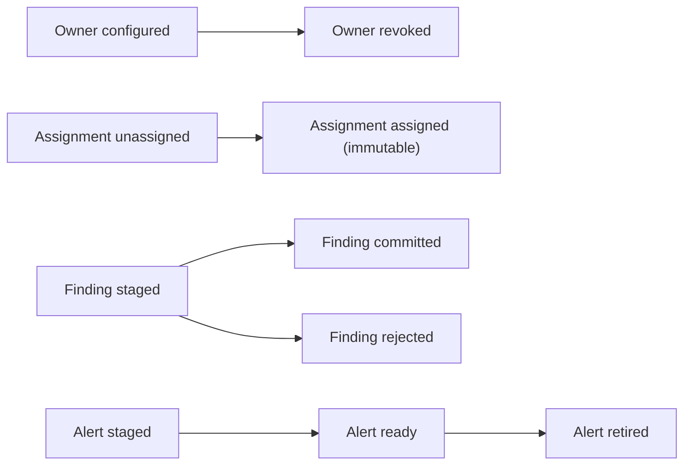
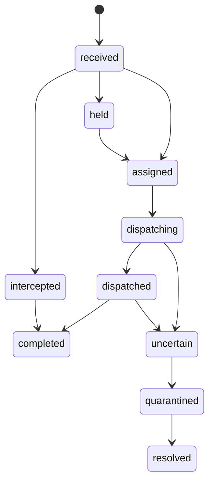
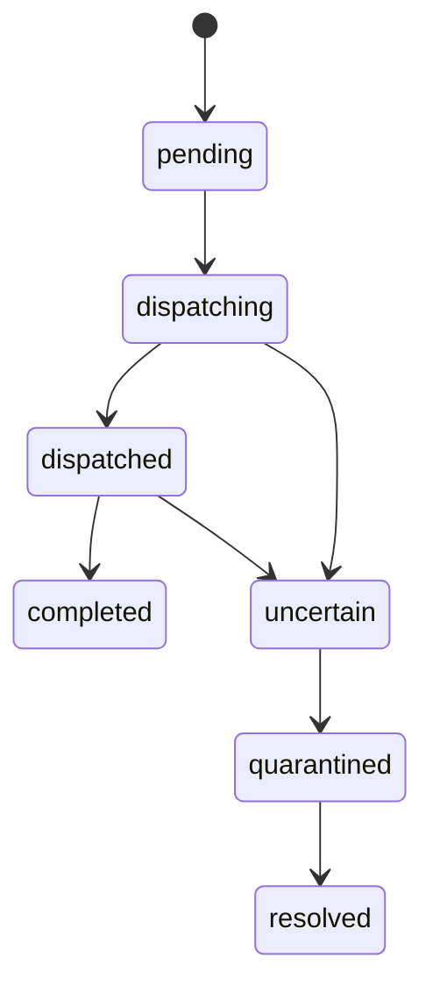
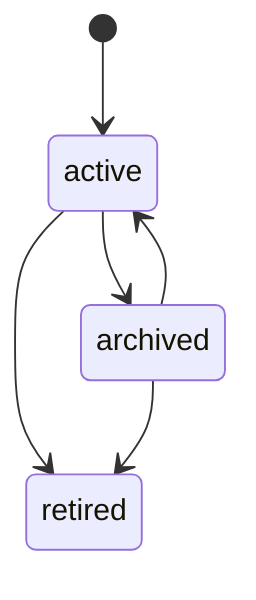
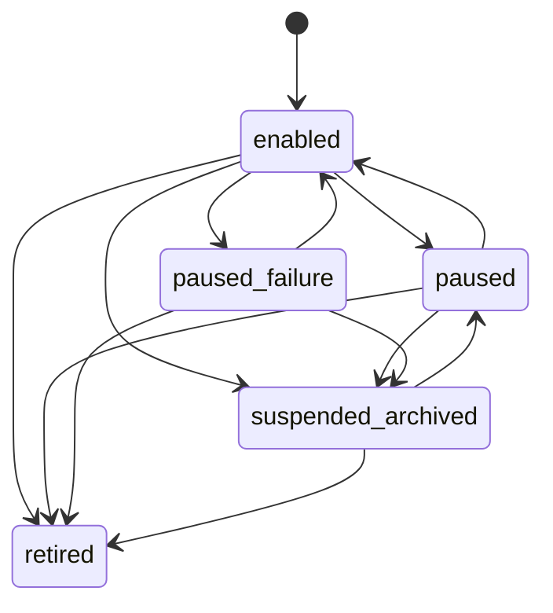
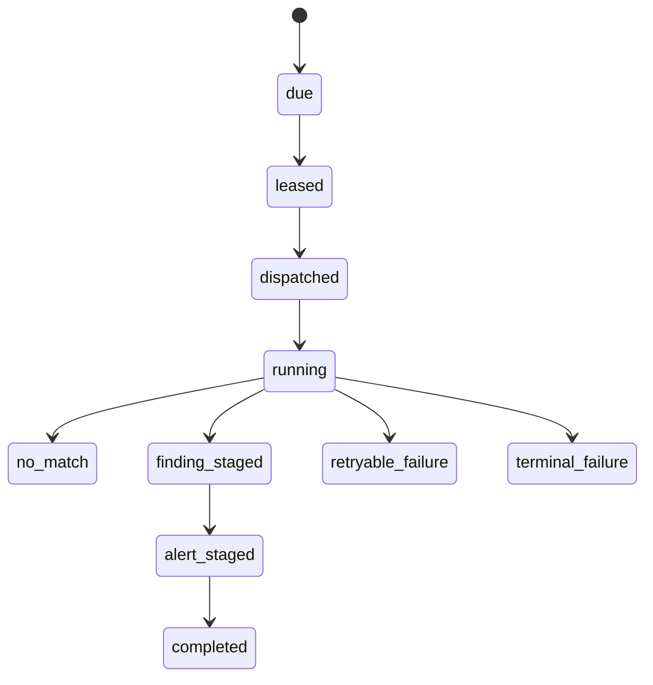
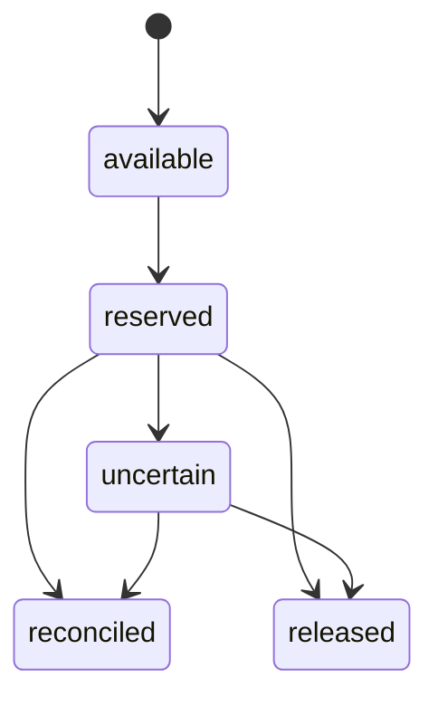
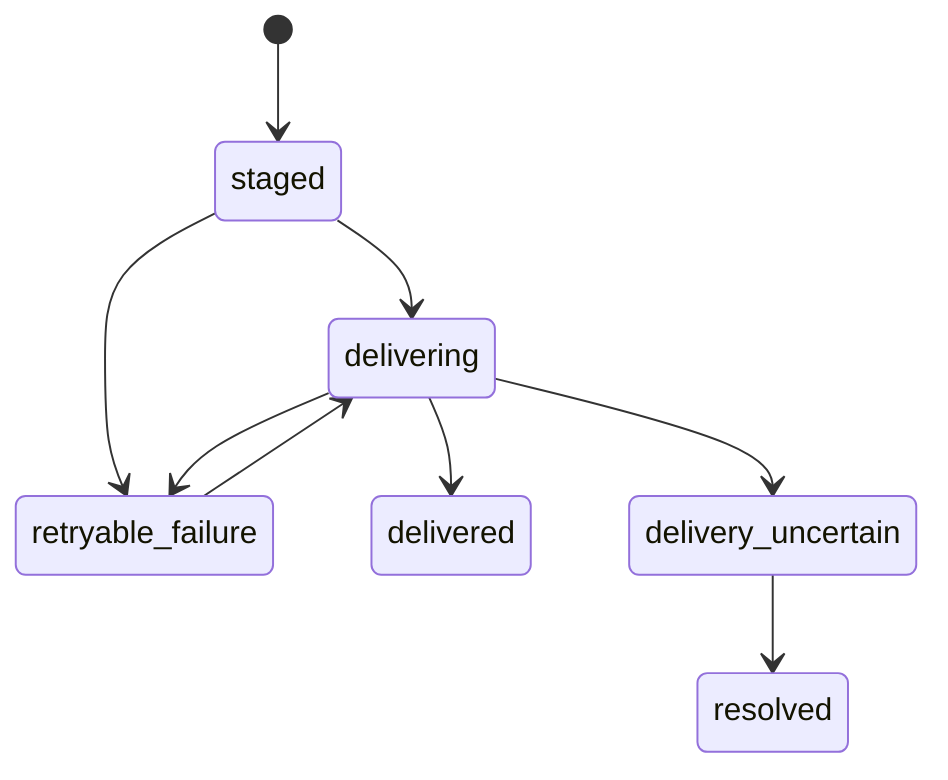
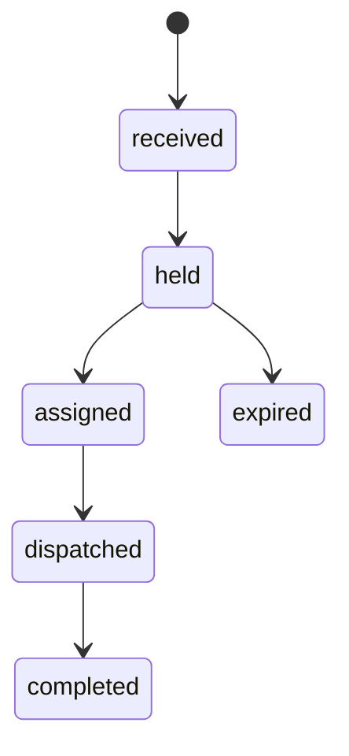

# Spec 1 durable state diagrams

These diagrams freeze the contract exercised by `state-machines.json`. They are
not evidence that the production stores exist yet. A transition absent from the
machine manifest is denied by default.

## `owner_mapping`, `workspace_assignment`, `finding`, and `alert`

## `photon_ingress`

## `dispatch`

## `workspace`

## `monitor`

## `run`

## `budget`

## `delivery`

## `routing_decision`

