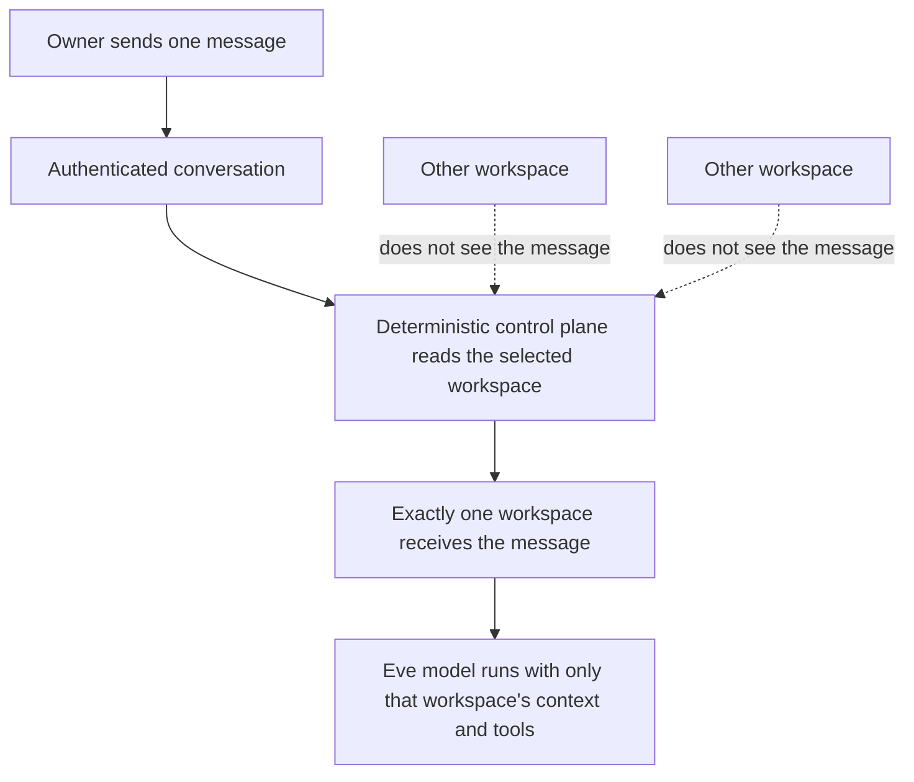
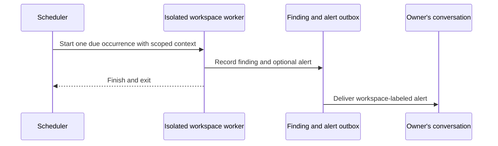

# How Eve Manages Specialized Agents and Workspaces

## The short answer

There is one user-facing Eve, but Eve can maintain many independent specialized
workspaces. A workspace may feel like a separate agent because it has its own
purpose, history, durable research, monitors, budget, tools, and strategy pack.

There is not a “mother agent” reading every message and forwarding it to another
model. Application code selects exactly one workspace before a model sees the
message. Other workspaces never receive that message or its conversation
history.

## The parts

| Term | What it means |
| --- | --- |
| Eve | The single identity the owner talks to through iMessage or another channel. |
| Conversation | One authenticated channel, person, and thread. It stores which workspace is currently selected. |
| Workspace | An isolated durable container with its own chat history, instructions, strategy, findings, monitors, budgets, and tool permissions. |
| Strategy pack | A reusable definition installed into a workspace, such as IPO Filings or Congressional Signals. |
| Worker | A short-lived internal task started for one scheduled occurrence. It is not another user-facing agent. |
| Control plane | Deterministic application code that handles identity, workspace selection, routing, authorization, schedules, and alerts. It does not perform research. |

## How an ordinary message is routed

The conversation has one selected-workspace pointer. An ordinary message goes
to that workspace unless the owner explicitly selects another one. The model is
not asked to decide where its own message belongs.

## How background agents work

A workspace does not need to remain selected for its monitors to run. The
scheduler notices a due occurrence, starts a bounded worker with a fresh context,
and gives it only that workspace's exact strategy, source projections, limits,
and permitted tools. The worker records its result and exits. No model process
stays alive between occurrences.

## How alerts avoid routing confusion

An alert arrives in the same physical conversation with a workspace heading,
event title, reason, time, and source. Receiving it does not silently change the
selected workspace.

The alert offers two actions:

- **Discuss** securely selects the alert's workspace and stores a one-time,
  bounded reference to that alert. The next owner message goes to that workspace
  with the alert reference. Tapping the action alone does not start a model turn.
- **Manage sessions** opens the Spectrum manager, where the owner can select,
  create, rename, archive, restore, or inspect workspaces and their monitors.

The small alert app exists to authorize and apply those actions. It is not a
shared agent brain and it does not expose workspace histories.

## What happens when the owner replies directly

The current routing guard handles replies that clearly refer to a recent alert
from a different workspace. It may inspect only:

- the new message;
- the selected workspace's small manifest; and
- recent alert envelopes containing a workspace name, title, time, and alert ID.

It cannot read another workspace's history or run research tools. A strong match
causes Eve to hold the message outside every workspace and ask whether to switch
or stay. A weak match continues in the selected workspace. Eve never silently
switches based on vague topical similarity.

This is deliberately narrower than a general “guess which agent I meant” model.
A broader topic-mismatch suggestion card is a future North Star feature.

## What the workspaces know about one another

They do not directly know about one another. The control plane keeps a small
index of workspace identities, selection state, manifests, and recent alert
envelopes so it can route safely. It does not merge histories, findings, files,
instructions, or tools.

This separation allows several specialized agents to work in parallel while the
owner experiences one Eve and one inbox.

## Channel boundary

Photon/iMessage is the first interface. Workspace state, routing, workers,
strategy packs, findings, and source facts are not fundamentally Photon-specific.
A Telegram or web interface would need its own authenticated ingress, message
rendering, and action adapter, but it would reuse the same workspace and strategy
runtime rather than recreating the agents.
