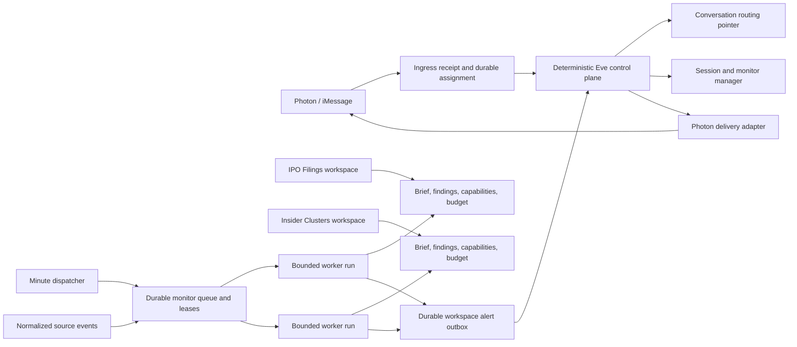

# Spec 1: Independent workspace runtimes

> **Status note:** The polling-first application is implemented, independently
> reviewed, merged, and pushed to `main`. Owner-authorized production rollout
> remains in Sprint 6. Deferred crash/race/framework hardening is recorded in
> this specification's deferred-hardening phase; source-event ingestion is owned
> by Spec 3 Sprint 4.

Status: Polling implementation complete locally; production acceptance pending

Date: 2026-08-13

Last reconciled: 2026-08-15

Product target: `NORTH_STAR.md`

Reference acceptance workspace: `IPO Filings`

## How to use this specification

This is the first bounded implementation specification on the path to the Eve
North Star. It covers the shared foundation that lets multiple specialized
workspace agents remain continuously active without permanently running model
processes. It does not implement the complete Congressional Signals, Insider
Clusters, or Cramer Inverse strategies.

Every implementation item is a checklist entry. Complete the sprints in order.
Do not mark an item complete until its tests and the sprint exit gate pass. If
implementation reveals a product decision that contradicts this specification,
stop and resolve it with the owner instead of silently widening the scope.

## Goal

Allow every enabled workspace to own durable monitors that wake bounded,
isolated workers on schedules, even when another workspace is
selected for the owner's current iMessage conversation.

The selected workspace controls only where an ordinary unqualified iMessage is
routed. It does not start, stop, or pause background work in other workspaces.

The completed foundation must support this experience:

1. The owner creates an `IPO Filings` workspace.
2. In that workspace, the owner asks Eve to check for new SEC S-1 filings every
   day at 9:00 AM in the owner's timezone.
3. The owner later says, “Also run this at 4:00 PM,” and Eve edits the same
   workspace-owned monitor.
4. The owner switches to `Insider Clusters`; the IPO monitor continues running.
5. A bounded IPO worker detects a new filing and sends an iMessage alert headed
   **IPO Filings** without changing the selected workspace.
6. The owner taps **Discuss in IPO Filings**. Eve atomically selects that
   workspace and makes the referenced alert available to its next turn.
7. The session manager shows the monitor's schedule, sources, budget, status,
   last run, next run, and pause/resume controls.
8. Starting the workspace fresh preserves its monitors, brief, and findings.
   Archiving it pauses its monitors; restoring it leaves them paused until the
   owner explicitly resumes them.

## Agreed product decisions

- [x] Use one user-facing Eve identity and a deterministic control plane. Do
  not introduce a model-powered “mother agent” with access to every workspace.
- [x] Treat each workspace as the durable specialized agent. A workspace owns
  its goal, bounded brief, structured findings, monitors, capabilities, and
  budget.
- [x] Execute background work through bounded Eve task sessions that wake for
  one run and then exit. Do not keep idle model processes alive.
- [x] Implement Photon/iMessage only. Keep core records independent of Photon
  delivery mechanics so another delivery adapter can be added later.
- [x] Bind each monitor immutably to one workspace. Its schedule, sources,
  instruction, status, capabilities, and budget may be edited; moving it to
  another workspace requires an explicit clone or replacement operation.
- [x] Support natural-language monitor management inside the owning workspace
  and monitor visibility/control in the existing session manager.
- [x] Allow paid research only when the workspace explicitly permits the
  provider and has sufficient configured budget.
- [x] Never allow a background worker to submit a live broker mutation. It may
  produce research, signals, and a proposed order, but live execution retains
  fresh preview, revalidation, and exact owner approval.
- [x] Deliver alerts from non-selected workspaces without silently changing the
  conversation's selected workspace.
- [x] Implement recurring polling first. Source-event ingestion is deferred to
  a follow-on after Spec 3's versioned source-adapter foundation.

## Vocabulary

| Term | Meaning |
| --- | --- |
| Owner | The one person who controls this deployment. Approved Photon principals may be aliases of that owner. |
| Conversation | One authenticated Photon principal and physical iMessage thread. |
| Selected workspace | The workspace that receives ordinary unqualified messages in a conversation. This is a routing pointer, not a runtime status. |
| Workspace | A durable specialized agent container with isolated state, monitors, tools, skills, and budget. |
| Session generation | Temporary Eve conversation history for a workspace. `Start fresh` replaces it without deleting workspace state. |
| Monitor | An editable, durable instruction and trigger configuration owned by one workspace. |
| Worker | A stateless, bounded Eve task session for one monitor occurrence. It is not user-facing and cannot read workspace chat history. |
| Finding | A structured, provenance-bearing result written by a worker to its workspace. |
| Alert | A workspace-labeled notification derived from a durable finding and delivered through the control plane. |
| Control plane | Deterministic application code for identity, routing, lifecycle, budgets, monitor control, alert delivery, and approvals. It runs no strategy. |

## Scope

### In scope

- Stable owner and workspace identity for Photon-created background work.
- Deployment-owner authorization across Photon session routing, session and
  monitor management, background dispatch, and alert delivery.
- Immutable Photon ingress receipts, one durable workspace assignment before
  model dispatch, idempotent completion, and uncertain-delivery quarantine.
- Workspace-owned durable briefs and structured findings.
- Default-deny workspace capability manifests.
- Configurable per-workspace run, concurrency, token, and paid-research budgets.
- Editable one-time, interval, and local-time daily schedules.
- Concurrent runs across different workspaces using isolated Eve task sessions.
- Exact source fencing, source checkpoints, idempotent run state, and durable
  alert delivery.
- Workspace-labeled Photon alerts with **Discuss in workspace** and **Manage
  sessions** actions.
- Safe confirmation for a likely reply to an alert from a non-selected
  workspace.
- Natural-language monitor CRUD in the owning workspace.
- Monitor and budget controls in the Spectrum session manager.
- Explicit migration of existing owner/conversation event triggers.
- A polling-first `IPO Filings` reference implementation and deterministic SEC
  Atom fixtures.
- A handoff requirement that Spec 3 source events reuse the same monitor queue,
  worker, budget, finding, alert, and delivery contracts as polling.

### Out of scope

- Complete Pelosi/Congressional copy-trading logic.
- Complete Insider Clusters, Cramer Inverse, or other strategy packs under
  `idea/`.
- Automatic live trading or any relaxation of financial approval invariants.
- General topic-change detection for all ordinary messages. This spec adds only
  the bounded alert-reply routing guard needed for workspace alerts.
- Telegram or HTTP workspace routing and delivery.
- Sharing one workspace across multiple Photon conversations. This spec creates
  stable owner and delivery abstractions but retains one originating Photon
  conversation per workspace subscription.
- Cross-workspace chat-history access or automatic merging of workspace notes.
- Cross-workspace convergence scoring. A later spec may promote typed public
  signals through a reviewed shared-evidence plane.
- Full conversion of the `idea/` research corpus into versioned strategy packs.
- Production activation of a specific paid provider in task-mode workers. This
  spec delivers the capability, budget, and reservation contracts plus a fake
  provider test adapter; each real provider requires a focused security review.
- Owner-private storage for large files or raw paid outputs. This project does
  not need that capability for this foundation; findings stay bounded and
  public source files are referenced by canonical URL.
- Permanent model processes, model-managed queues, or model-owned scheduling.
- Source-event HTTP ingress, conditional RSS/WebSub ingestion, and adapter
  fan-out; these are implemented in Spec 3 Sprint 4 after the adapter foundation.

## Non-negotiable invariants

- [ ] Every authenticated Photon message that can cause a control-plane or model
  action receives one immutable ingress receipt. An ordinary message is assigned
  to exactly one workspace before any workspace model sees it.
- [x] Duplicate Photon webhooks reuse the original ingress receipt and cannot
  cause a second model dispatch, control action, paid call, or response.
- [x] A dispatch or outbound delivery whose completion cannot be proven is
  quarantined for reconciliation; it is never replayed blindly.
- [x] The selected-workspace pointer affects interactive routing only. It never
  controls whether another workspace's monitors run.
- [x] A worker receives only its workspace ID, monitor configuration, bounded
  brief, approved structured findings, declared sources, and allowed
  capabilities.
- [x] A worker cannot read any workspace's raw chat history, including its own.
- [x] No workspace can read or mutate another workspace's brief, findings,
  monitors, budget, runs, or alerts.
- [x] Model-supplied owner IDs and arbitrary workspace IDs are never trusted.
  Interactive tools derive the current workspace from authenticated routing
  context; runtime tools derive it from signed control-plane auth.
- [x] A session manager action changes control-plane state only and cannot
  authorize a financial mutation.
- [x] Background runtime capabilities always deny live broker mutations,
  transfers, withdrawals, leverage, credential changes, and interactive HITL.
- [x] A workspace capability setting may tighten deployment limits but cannot
  loosen a hard global safety limit.
- [ ] Paid operations reserve budget before execution. An uncertain paid result
  is not automatically retried.
- [ ] Every ingress, assignment, dispatch, run, source event, finding, alert,
  delivery, and control action has a durable idempotency key.
- [ ] At-least-once Eve delivery must not create duplicate alerts or duplicate
  paid calls.
- [x] Alerts do not silently switch the selected workspace.
- [x] Public-source facts preserve canonical URL, source identity, observed time,
  published/updated time when available, content hash, and access classification.
- [ ] Logs and metrics never include message bodies, alert bodies, source URLs,
  owner/principal IDs, workspace IDs, monitor IDs, or other high-cardinality or
  private values.

## Target architecture



The control plane knows workspace manifests and routing metadata, not strategy
histories. Workers run in separate Eve task sessions. Two workspaces may run at
the same time; the same monitor is single-flight.

## Durable records

All records are versioned schemas validated at every read boundary. Storage
keys must include the stable owner and workspace scope where applicable.

### Owner identity

`OwnerIdentity` provides one stable deployment owner ID and an explicit set of
approved Photon principal aliases.

- [x] Add a server-side owner mapping that fails closed for an unmapped Photon
  principal.
- [x] Keep real principals in encrypted deployment configuration, never tracked
  source or Redis values that are returned to the model.
- [x] Store a non-reversible stable alias for ownership checks and indexes.
- [x] Enforce the owner mapping before reading or mutating Photon session state,
  monitor state, runtime state, manager capabilities, or alert destinations.
- [x] Add negative tests proving an authenticated but unmapped Photon principal
  cannot list sessions, select a workspace, manage monitors, start workers, or
  receive owner-only workspace data.
- [x] Keep the existing Coinbase allowlist separate; it is not the general
  deployment owner boundary.

### Conversation routing record

`ConversationRoutingRecord` remains scoped to the authenticated Photon
conversation and contains:

- owner ID;
- physical conversation address stored only in the delivery layer;
- selected workspace ID;
- revision and last mutation ID; and
- recent alert-routing candidates containing IDs and timestamps, not bodies.

The existing workspace registry may remain conversation-originated in this
spec. A later cross-conversation session-broker spec can make workspaces
shareable across owner conversations without changing monitor or alert identity.

### Photon ingress and workspace dispatch receipts

Every authenticated Photon webhook that can cause a control-plane or model
action first creates or reuses an immutable `PhotonIngressReceipt`. Ordinary
messages then receive one immutable workspace assignment before dispatch.
Approval replies and explicit session-management requests may be intercepted by
their deterministic control protocols, but they use the same ingress dedupe and
completion contract.

The ingress and dispatch records include:

- ingress ID, Photon webhook/event dedupe key, owner ID, conversation ID, and
  received time;
- input classification of ordinary message, approval reply, session-management
  request, or held alert reply, without copying message text into indexes or
  logs;
- for ordinary or held messages, the assigned workspace ID, session generation,
  routing-pointer revision, assignment reason, and assignment time;
- dispatch request ID, attempt state, Eve continuation target, and timestamps;
- control-action, model-dispatch, response-delivery, and completion receipt IDs
  where applicable; and
- bounded failure code, quarantine reason, and operator resolution metadata.

The durable state machines are:

```text
received -> assigned -> dispatching -> dispatched -> completed
received -> intercepted -> completed
received -> held -> assigned -> dispatching -> dispatched -> completed
dispatching|dispatched -> uncertain -> quarantined -> resolved
```

- [x] Authenticate and authorize the Photon principal before creating an
  owner-scoped receipt or reading any workspace state.
- [x] Atomically create the receipt by Photon event dedupe key so concurrent
  duplicate webhooks cannot both continue.
- [x] Resolve and persist the target workspace and session generation before
  constructing the workspace model turn. Once dispatch begins, that assignment
  is immutable even if the conversation's selected-workspace pointer changes.
- [x] Make dispatch completion idempotent by ingress and dispatch request IDs.
- [x] Record outbound response delivery separately from model dispatch so an
  uncertain Photon send is not mistaken for an unexecuted model turn.
- [x] Quarantine uncertain model dispatch or response delivery instead of
  replaying it. Recovery may resume only after authoritative reconciliation or
  an explicit owner/operator resolution recorded on the receipt.
- [ ] Bound receipt payloads and retention. Store only the references or digests
  needed for dedupe, routing, recovery, and audit; never emit message content in
  logs or metrics.

### Workspace record

Extend the current `PhotonWorkspace` contract or add an adjacent versioned
record with:

- stable owner ID and workspace ID;
- display name and lifecycle state;
- optional strategy-pack reference and version;
- current session generation;
- brief revision;
- capability-manifest revision;
- budget-policy revision;
- created/updated timestamps; and
- optimistic concurrency revision.

Do not embed monitor arrays, findings, source payloads, or Photon destinations
inside the workspace record.

### Workspace brief

`WorkspaceBrief` is bounded durable rehydration state, independent of session
history:

- workspace goal and thesis;
- approved strategy-pack configuration;
- watchlist/entity references;
- source policy;
- bounded current findings summary;
- open questions and last material change;
- schema and content revision; and
- provenance for every machine-promoted fact.

- [x] Define a strict serialized byte ceiling and per-field bounds.
- [x] Update through compare-and-set so concurrent workers cannot overwrite a
  newer brief.
- [x] Do not let a worker rewrite safety policy, its capability manifest, or its
  budget through a brief update.
- [x] Keep bounded structured findings in owner-scoped storage. Reference public
  filings by canonical URL and reject private or unbounded large outputs.

### Capability manifest

`WorkspaceCapabilityManifest` is default-deny and names only what the workspace
may use:

- skill IDs and versions;
- model-facing tool IDs;
- source IDs and exact source URL origins;
- optional connection/provider IDs;
- whether paid research is allowed;
- maximum data access classification;
- worker model policy; and
- hard-denied capabilities inherited from the shared core.

Default-deny means an omitted tool, skill, source, provider, or data class is
unavailable. It does not prevent the owner from explicitly expanding the
workspace's research abilities within hard deployment limits.

- [x] Compare each connected provider's current tool inventory and schemas with
  the reviewed manifest. Report removed, newly discovered, and schema-changed
  tools; never expose a new or changed tool automatically.
- [x] Keep newly discovered mutations disabled even when a provider dynamically
  registers them.
- [x] Return a typed unavailable-capability reason—authorization, safety policy,
  runtime restriction, missing integration, or provider drift—rather than
  hallucinating a result or claiming the provider lacks the capability.
- [x] Add deterministic drift fixtures for a removed tool, a new read tool, a
  new mutation, and a schema-changing existing tool.

### Workspace budget policy

`WorkspaceBudgetPolicy` includes:

- maximum scheduled runs per day;
- maximum concurrently running workers;
- maximum input/output tokens per run and per day;
- optional paid-research ceiling per call;
- optional paid-research ceiling per day and per calendar month;
- unknown-price fallback ceiling;
- owner timezone for calendar windows; and
- policy revision and effective time.

Money is stored and compared as decimal strings or integer minor units, never
binary floating point. `null` means “inherit the deployment cap,” not unlimited.

### Workspace monitor

`WorkspaceMonitor` includes:

- stable monitor ID, owner ID, and immutable workspace ID;
- name and bounded evidence-based instruction;
- lifecycle state and reason;
- schedule or source-event trigger;
- timezone and next occurrence;
- optional owner-defined end time (no automatic 90-day expiry);
- declared source IDs and canonical URLs;
- required skill/tool/provider capabilities;
- optional monitor-level limits that only tighten the workspace budget;
- configuration revision;
- source checkpoint/window;
- last/next run metadata and consecutive failures;
- originating delivery-subscription ID; and
- created/updated timestamps.

Supported schedule variants:

```text
one_time(at)
interval(anchor, everyMinutes)
daily_local(timezone, times[HH:mm])
source_event(subscriptionIds[])   # enabled in the later source-event sprint
```

The `daily_local` form is required for “9 AM and 4 PM” and must not be reduced
to a drifting interval. A recurring monitor continues until the owner pauses,
archives, retires, or explicitly time-bounds it.

### Monitor run

`WorkspaceMonitorRun` snapshots everything needed for deterministic execution:

- run ID and deterministic occurrence key;
- owner, workspace, and monitor IDs;
- monitor configuration revision;
- brief, capability, and budget revisions;
- scheduled/event occurrence and evaluation window;
- lease owner and expiry;
- reserved run/token/paid budget;
- source-attempt and source-success sets;
- outcome and bounded error code; and
- finding/alert IDs created by the run.

### Finding and alert

`WorkspaceFinding` contains structured public or private evidence with schema
version, producer workspace, monitor/run IDs, provenance, as-of time, access
classification, content hash, and optional durable artifact references.

`WorkspaceAlert` references a finding and contains bounded presentation data,
workspace display metadata, source references, and a stable alert ID. It never
contains a Photon thread ID.

`AlertDeliverySubscription` and `AlertDeliveryReceipt` live in the delivery
layer. This spec supports one originating Photon conversation subscription per
workspace monitor while keeping the core alert channel-independent.

## State and transition contracts

### Workspace lifecycle

```text
active -> archived -> active
active|archived -> retired
```

- [ ] Archiving atomically prevents new interactive routing, pauses/suspends all
  monitors, revokes pending workspace approvals, and selects a replacement if
  the archived workspace was selected.
- [x] Restoring returns the workspace to `active` but converts its monitors to
  manual `paused`; none resume automatically.
- [x] Starting fresh advances the session generation and revokes approvals tied
  to the old generation while preserving briefs, findings, monitors,
  capabilities, budgets, and delivery subscriptions.
- [x] Retirement is recoverable product state. Do not claim hard deletion of
  Eve or external provider records.

### Monitor lifecycle

```text
enabled -> paused
enabled|paused -> suspended_archived
suspended_archived -> paused
enabled -> paused_failure
paused|paused_failure -> enabled
any nonterminal state -> retired
```

- [x] Store why and when a monitor paused.
- [x] Pause automatically after the configured consecutive-failure threshold.
- [x] Require an explicit owner action to resume after archive restoration,
  budget exhaustion requiring policy change, or uncertain alert checkpoint.
- [x] Updating a monitor increments its revision; an old claimed run must fail
  revalidation before executing tools or committing results.

### Run lifecycle

```text
due -> leased -> dispatched -> running
running -> no_match | finding_staged | retryable_failure | terminal_failure
finding_staged -> alert_staged -> completed
```

- [x] Claims are atomic, leases expire, and expired work is recoverable.
- [x] The same occurrence key can never produce two committed findings or
  alerts.
- [x] Different workspaces may run concurrently.
- [x] A monitor is single-flight. Default workspace concurrency is one worker;
  the owner may raise it only within a hard deployment cap.
- [ ] Concurrent writes to one workspace use compare-and-set and retry only the
  state merge, never an already-completed paid call.

### Alert delivery lifecycle

```text
staged -> delivering -> delivered
staged|delivering -> retryable_failure
delivering -> delivery_uncertain
```

- [x] A delivered alert is deduplicated by stable alert and destination IDs.
- [x] If the Photon adapter returns an explicit ambiguous-acceptance error,
  quarantine the delivery and pause the monitor instead of sending it again.
- [ ] A failed alert does not advance the source checkpoint until safe retry or
  explicit operator resolution.

## Scheduling semantics

- [x] Retain one static minute dispatcher. It atomically claims due monitor
  occurrences and dispatches bounded Eve task sessions through the existing
  internal runner pattern.
- [x] Represent local daily schedules as timezone plus unique sorted `HH:mm`
  values.
- [x] On a spring-forward nonexistent local time, run once at the next valid
  local instant.
- [x] On a fall-back repeated local time, run once using a local-date/time
  occurrence key.
- [x] Editing a schedule recomputes the next occurrence without replaying a
  time already completed under the new revision.
- [x] After downtime, execute at most the newest missed occurrence inside a
  configured recovery window; record older occurrences as skipped so recovery
  cannot create a catch-up storm.
- [x] Reserve daily run capacity when enabling or expanding a schedule. Reject
  a change whose projected cadence exceeds the workspace or deployment cap.
- [x] Preserve existing global trigger limits until explicitly replaced by
  equal or stricter deployment limits.

Eve provides durable task sessions, but dynamic schedules remain application
state. Delivery is at least once, so occurrence keys and application-level
idempotency are mandatory.

## Worker execution contract

Each occurrence starts a new isolated Eve task session addressed by the stable
run ID. It must not send a message to the workspace's interactive continuation.

The control plane provides signed runtime auth containing only opaque owner,
workspace, monitor, run, and revision claims. Runtime tools re-read authoritative
records and verify all claims before acting.

The worker receives:

- shared safety instructions;
- the workspace's allowed strategy skill(s);
- a bounded workspace brief;
- the monitor instruction and evaluation window;
- exact configured sources;
- bounded relevant prior findings; and
- dynamically registered tools permitted by the capability manifest.

The worker does not receive:

- raw interactive chat history;
- another workspace's manifest, state, or alerts;
- arbitrary web/search access unless explicitly allowed;
- user OAuth that could pause for authorization;
- session-manager or approval capabilities;
- broker mutation tools; or
- shell/filesystem tools unless a later reviewed capability explicitly needs
  them and the shared core permits them.

- [x] Build worker prompts from typed records, not concatenated model prose from
  another session.
- [x] Enforce exact source fencing in both prompt and tool execution.
- [x] Require every configured source to be attempted at most once per run and
  successfully covered before committing no-match or alert state.
- [x] Keep provider result normalization and transport byte limits in force.
- [x] Write findings through a scoped control-plane tool that derives workspace
  and run identity from runtime auth.
- [x] Treat a final model answer without the required completion/finding tool as
  a failed evaluation, not a successful checkpoint.

## Capability and budget enforcement

Capabilities are resolved dynamically for each worker step from the current
manifest and the run's snapshotted revision. A revoked capability makes an old
run stale before tool execution.

- [x] Separate control-plane capabilities, research capabilities, and financial
  capabilities in code and schemas.
- [x] Make the runtime guard authoritative even when a tool is accidentally
  registered elsewhere.
- [x] Add a provider-independent paid-research reservation interface.
- [x] Reserve the known maximum or configured unknown-price ceiling before a
  paid call.
- [x] Reconcile reservation versus actual cost when the provider returns a
  trustworthy charge.
- [ ] Keep an uncertain charge reserved until reconciled or expired through an
  owner-visible process.
- [x] When a budget blocks a run, record a bounded reason and notify the owner
  once; do not generate an alert on every minute tick.
- [x] Let the owner change workspace budgets through authenticated manager
  actions and natural-language tools operating in that workspace.
- [x] Make paid providers disabled by default. Enabling one requires an existing
  noninteractive authorization, explicit capability grant, and sufficient
  budget.
- [x] Test paid budget behavior with a deterministic fake provider. Enabling
  Masterkey for scheduled runtime work is a later provider-specific change and
  must not be assumed by this foundation.

## Monitor management contract

Interactive monitor tools derive the current workspace from authenticated
Photon routing context. The model never chooses an arbitrary workspace ID.

The Photon router must project typed internal metadata containing owner,
conversation, workspace, and generation identity. Tools read that metadata or
signed auth through Eve's channel context; they must not parse a workspace name,
synthetic thread suffix, or model-visible routing sentence to establish scope.

Required operations:

- create a monitor in the current workspace;
- list current-workspace monitors;
- update instruction, schedule, sources, and tightening limits;
- pause and resume;
- clone explicitly into another owner-selected workspace;
- retire/delete through an approved recoverable operation; and
- inspect last run, next run, source checkpoint, failure, and budget status.

- [x] Replace generic event-trigger wording with user-facing **monitor** wording
  while retaining a compatibility layer for existing tools during migration.
- [x] Align create and update validation with the authoritative store limit of
  eight combined sources. UI, tool schemas, and storage must reject the same
  ninth source with the same bounded error code.
- [x] Replace the order-specific trigger-deletion success and denial copy with
  monitor-specific confirmation, or remove deletion from the rich approval
  protocol and use a dedicated recoverable monitor-retirement action.
- [x] Resolve ambiguous monitor references by listing candidates or asking the
  owner; never edit the nearest name match silently.
- [x] Support additive schedule language such as “also run at 4 PM” without
  replacing the existing 9 AM occurrence.
- [x] Require an explicit timezone for local schedules and preserve it on edits.
- [x] Normalize and validate added sources before committing a configuration
  revision.
- [x] Keep source credentials out of URLs and workspace/model state.
- [x] Use Eve call IDs as idempotency keys for natural-language mutations.

## Photon alert and routing UX

An alert is delivered into the physical iMessage conversation with a clear
workspace header. It does not rename the iMessage thread and does not switch the
selected workspace.

The alert card provides:

- workspace name;
- concise event title and why it matched;
- published/observed time and safe source link(s);
- **Discuss in <workspace>**; and
- **Manage sessions**.

### Discuss action

- [x] Mint a short-lived owner-, conversation-, workspace-, alert-, and revision-
  bound capability in the URL fragment.
- [x] On tap, atomically select the alert's workspace using the current
  conversation revision.
- [x] Store a one-time pending alert-context reference for the selected
  workspace; do not inject the full alert into another workspace.
- [x] On the next user message, load the bounded finding/alert reference into
  that workspace's turn context and consume the pending reference.
- [x] Do not start a model turn merely because the owner tapped **Discuss**.
- [x] If the workspace is archived, retired, or no longer belongs to the owner,
  fail closed and open the manager with a clear status.
- [x] Make stale and repeated taps harmless.

### Ambiguous plain-text reply

Add a bounded alert-reply routing guard, not a general mother agent.

- [x] It may inspect only the new message, the selected workspace manifest, and
  recent alert envelopes containing workspace name, title, time, and alert ID.
- [x] It cannot read workspace histories or invoke research tools.
- [x] A quoted Photon reply to a known alert is treated as a strong binding when
  Photon supplies stable reply metadata.
- [x] A high-confidence reference to a recent alert from another workspace is
  held outside all workspace histories and prompts the owner to choose that
  workspace or remain in the selected one.
- [x] The held message is dispatched exactly once after an owner choice using a
  durable assignment and dispatch receipt.
- [x] Low-confidence text continues to the selected workspace; never silently
  route based on weak topical similarity.

## Session manager additions

Extend the existing Spectrum manager; do not create a second unrelated admin
surface.

Each workspace view shows:

- lifecycle and selected status;
- monitor count and enabled/paused/error counts;
- each monitor's name, schedule, timezone, sources, status, last run, next run,
  and latest bounded failure;
- workspace run/token/paid budget and current usage;
- pause/resume controls;
- schedule editor for supported schedule variants; and
- workspace budget editor constrained by deployment caps.

- [x] Keep the existing owner-bound short-lived manager capability and URL
  fragment transport.
- [x] Add request IDs, expected revisions, expirations, and one-time durable
  consumption to every manager mutation.
- [x] Keep monitor and session actions separate from financial approval
  protocols.
- [x] Make status inspection read-only and safe to refresh.
- [x] Preserve the manager's current minimal visual language and button layout
  hierarchy.
- [x] Provide plain-text/natural-language fallbacks for every essential monitor
  operation.

## Reference acceptance workspace: IPO Filings

The reference is deliberately smaller than a full investment strategy. Its job
is to prove the foundation with an authoritative, inexpensive source.

### Source and behavior

- Use an official SEC EDGAR latest-filings RSS/Atom search filtered to new
  `S-1` registration statements.
- Follow the [SEC developer resources](https://www.sec.gov/about/developer-resources)
  and fair-access policy, including an identifying user agent and aggregate
  request rate below the SEC limit.
- Treat `S-1` as a potential IPO registration, not proof that an IPO will occur.
- Treat `S-1/A` as an update to an existing registration, not a new company.
- Deduplicate each filing by accession number and form type; preserve CIK,
  company name, filing/file number when available, canonical filing URL, and
  observed time.
- Use public data only and no paid provider for the reference monitor.

The reference workspace capability manifest allows only the public-event
monitoring skill, the exact SEC source, source fetch, structured finding write,
alert staging, and run completion. It denies general web search, Masterkey,
Coinbase, private history, shell, and filesystem.

### Deterministic fixtures

- [x] Add a fixture with an initial SEC Atom page containing known S-1 entries.
- [x] First run establishes the checkpoint without alerting on the entire
  historical page.
- [x] Add one later S-1 entry and verify exactly one structured finding and one
  alert.
- [x] Replay the same feed and run occurrence; verify no duplicate finding,
  alert, or delivery.
- [x] Add an S-1/A associated by filer CIK and registration file number and
  verify it is classified as an update rather than a new IPO candidate.
- [x] Add malformed, oversized, stale, redirected, and incomplete source cases.
- [x] Add a second fixture workspace due at the same time and prove both workers
  run independently with no shared context or state.

### Live smoke

- [x] Perform a read-only fetch of the real SEC feed with the configured user
  agent.
- [x] Verify parsing and checkpoint creation without requiring a new real filing
  to arrive.
- [x] Use an injected post-checkpoint fixture event to exercise the production
  Photon delivery caller through a fixture adapter.
- [x] Keep live-source availability outside the deterministic CI pass/fail gate.

## Source-event contract handoff

Source-event ingestion is not part of the completed polling milestone. The
normalized envelope, conditional RSS, optional verified WebSub, authenticated
ingress, subscription fan-out, shared-public-fact boundary, replay tests, and
independent kill switch are owned by
[`Spec 3 Sprint 4`](03-public-source-adapters.md#sprint-4--spec-1-polling-and-source-event-integration).
Spec 1 remains the owner of occurrence, lease, worker, budget, finding, alert,
and delivery contracts that Spec 3 reuses.

## Migration and compatibility

Existing event triggers are owner/conversation-scoped and cannot be assigned to
a workspace safely by guessing.

- [x] Introduce a new versioned workspace-monitor schema without rewriting
  legacy records in place.
- [x] Stop creating legacy records after the feature flag is enabled.
- [x] Continue legacy execution temporarily through the existing restricted
  runner, labeled as a legacy monitor, without granting workspace state or new
  capabilities.
- [x] Preserve the store's maximum of eight combined sources during migration;
  do not accept records through a tool schema that the store cannot represent.
- [x] Show unassigned legacy monitors in the manager and require the owner to
  choose a target workspace.
- [x] On assignment, atomically create the workspace monitor, carry forward the
  safe source checkpoint and schedule, and disable the legacy trigger.
- [x] Never copy old runtime session history into the workspace brief.
- [x] Preserve current workspace IDs and generations; add adjacent versioned
  state rather than resetting confirmed conversations.
- [x] Provide a rollback mode that disables new dispatch while preserving all
  new records for later recovery.
- [x] Add Redis-backed migration and runtime coverage for leasing, competing
  claims, run budgets, retries, watermarks/checkpoints, consecutive-failure
  pause, expiration, archive/pause races, and uncertain alert delivery.
- [x] Add a local schedule-test runbook that explains the internal runner's
  deliberate 404 behavior and that Eve development mode does not run cron
  automatically.

## Photon integration coverage

The feature is not accepted from isolated store tests alone. Add a deterministic
Photon integration harness that exercises webhook authentication and owner
authorization, ingress dedupe, Chat SDK state, workspace assignment, Eve
dispatch, response delivery, and the Spectrum session manager without reaching
real Coinbase mutation endpoints.

- [x] Cover an ordinary message routed to the selected workspace and prove the
  assignment is durable before the workspace model sees it.
- [x] Cover concurrent duplicate webhooks and prove only one dispatch and one
  response-delivery attempt can begin.
- [x] Cover session switching, archive/restore, and `Start fresh`, including a
  stale generation and a selected-pointer change after assignment.
- [x] Cover an alert from a non-selected workspace, **Discuss**, an ambiguous
  reply, a stale/replayed action, and an uncertain Photon delivery.
- [x] Cover owner-denied access to session, monitor, manager, runtime, and alert
  state.
- [x] Use fixture-backed Eve and Photon adapters and keep all live financial
  mutation capabilities unavailable in the harness.

## Implementation sprints

### Sprint 0 — contracts and failure fixtures

- [x] Add state diagrams and schema fixtures for owner mapping, Photon ingress,
  assignment, dispatch, workspace, monitor, run, budget, finding, alert,
  delivery, and routing-decision records.
- [x] Write failing tests for cross-workspace access, duplicate dispatch,
  duplicate webhooks, immutable assignment, dispatch/delivery uncertainty,
  duplicate alert delivery, stale configuration, capability drift, budget
  exhaustion, archive, restore, start-fresh, and ambiguous alert replies.
- [x] Define the fixture-backed Photon integration harness and prove it cannot
  reach real Coinbase mutation endpoints.
- [x] Define low-cardinality error codes and operational counters.
- [x] Document feature flags and rollback behavior.

Exit gate:

- [x] Every state transition and forbidden transition is represented by a
  deterministic failing test before production implementation begins.

### Sprint 1 — owner, workspace state, capabilities, and budgets

- [x] Add stable deployment-owner mapping for approved Photon principals.
- [x] Enforce that mapping before Photon session, monitor, manager, worker, and
  alert access; add negative tests for an authenticated unmapped principal.
- [x] Project typed owner/conversation/workspace/generation metadata from the
  Photon router and reject missing or mismatched tool scope.
- [x] Add versioned, bounded workspace brief, durable strategy configuration,
  capability manifest, and budget stores.
- [x] Add owner/workspace-scoped authorization helpers used by every store.
- [x] Add atomic run and paid-budget reservation/reconciliation primitives.
- [x] Add default-deny dynamic capability resolution for runtime sessions.
- [x] Add provider tool-inventory/schema drift reporting and typed unavailable-
  capability reasons; newly discovered tools remain disabled.
- [x] Verify `Start fresh` retains the new workspace state and revokes stale
  generation-bound approvals.

Exit gate:

- [x] Two workspaces can hold different briefs, skills, tools, sources, and
  budgets, and adversarial tests cannot cross either boundary.

### Sprint 2 — workspace monitor store and polling dispatcher

- [x] Add the workspace-monitor schema, indexes, CRUD, revisions, leases, and
  occurrence keys.
- [x] Add local-time daily schedules with DST and missed-run behavior.
- [x] Adapt the existing minute dispatcher to claim workspace monitor runs.
- [x] Enforce workspace and global concurrency/run budgets before dispatch.
- [x] Preserve exact source fencing and complete-coverage checkpoints.
- [x] Align monitor create/update tools, manager validation, and storage on the
  maximum of eight combined sources.
- [x] Add legacy trigger compatibility and explicit immutable-workspace
  assignment flow.
- [x] Add Redis-backed tests for leases, competing claims, budgets, retries,
  checkpoints, failure pause, archive/pause races, expiration, and uncertain
  alert delivery.

Exit gate:

- [x] Polling occurrences are deterministic, single-flight per monitor,
  concurrent across workspaces, recoverable after lease expiry, and unable to
  exceed configured budgets.

### Sprint 3 — isolated worker and IPO reference

- [x] Build the typed worker envelope and signed runtime auth.
- [x] Dynamically expose only the workspace's permitted skills and tools.
- [x] Add scoped finding and completion tools.
- [x] Implement the `IPO Filings` reference manifest and SEC Atom normalizer.
- [x] Complete all reference fixture tests, including concurrent workspaces.
- [x] Prove the worker has no interactive history or cross-workspace state.

Exit gate:

- [x] A scheduled IPO fixture occurrence produces one correct durable finding or
  no-match checkpoint with bounded context and no duplicate side effects.

### Sprint 4 — durable alerts and reply-safe Photon routing

- [x] Add immutable ingress, workspace-assignment, dispatch, completion, and
  outbound response-delivery receipts for every actionable Photon webhook.
- [x] Deduplicate concurrent Photon webhooks before dispatch and quarantine
  uncertain model dispatch or response delivery for reconciliation.
- [x] Add channel-independent alert/outbox records and Photon delivery receipts.
- [x] Render workspace-headed alert cards with **Discuss** and **Manage**.
- [x] Implement atomic workspace selection and one-time pending alert context.
- [x] Route held alert replies through the same ingress assignment and dispatch
  state machine as ordinary messages.
- [x] Add delivery uncertainty quarantine and explicit recovery controls.
- [x] Complete the deterministic Photon integration harness for routing,
  duplicate webhooks, session switching, `Start fresh`, alerts, and stale
  actions.

Exit gate:

- [x] Every fixture Photon message has one durable outcome, duplicate or
  uncertain delivery cannot cause blind replay, and an IPO alert arriving while
  another workspace is selected can be discussed safely without cross-routing.

### Sprint 5 — natural-language and Spectrum management

- [x] Add workspace-derived monitor CRUD tools and compatibility aliases.
- [x] Support “also run at 4 PM,” source additions, budget changes, and status
  questions through natural language.
- [x] Extend the session manager with monitor details, pause/resume, schedule,
  and workspace budget controls.
- [x] Implement archive/restore/start-fresh monitor lifecycle behavior.
- [x] Correct trigger-deletion approval copy or replace it with the dedicated
  recoverable monitor-retirement action.
- [x] Add stale/replayed mini-app action tests and plain-text fallbacks.

Exit gate:

- [x] The complete agreed owner workflow works without editing Redis,
  environment variables, or tracked files.

### Sprint 6 — polling production smoke and hardening

- [x] Run all deterministic suites, Redis-backed race tests, typecheck, Eve
  build, and application build.
- [x] Publish and execute the local schedule-test runbook.
- [x] Verify two simultaneous workspace runs and controlled budget exhaustion.
- [x] Run the SEC read-only live smoke.
- [ ] With owner authorization, deploy behind flags and execute the real Photon
  IPO alert/discuss/manager flow.
- [ ] Verify event streams and delivery receipts, not only the final iMessage.
- [ ] Record rollback evidence before enabling by default.

Exit gate:

- [ ] Polling is proven end to end in Photon with no context leakage, duplicate
  alerts, unexpected workspace switch, or unauthorized capability.

### Deferred hardening — after Specs 2–6

These items are real reliability and operations work discovered during the
independent Spec 1 review. They are deliberately outside the completed ordinary
polling milestone and should not block the remaining product specs unless one
becomes an observed ordinary-path failure.

#### Source and compiled-runtime boundaries

- [ ] Reject exact-fenced redirects before any second outbound request.
- [ ] Require explicit acceptance-only fixture-bridge opt-in, loopback-only
  transport, strong ephemeral credentials, and a built-output negative test.
- [ ] Strengthen cross-field SEC identity relationships among accession, CIK,
  form/file number, registration/amendment identity, classification, and URL.
- [ ] Overlap two production-path compiled workers and prove isolated state,
  clean terminal outcomes, and clean runtime teardown.

#### Durable alert and Photon crash recovery

- [ ] Make finding, alert/outbox staging, checkpoint advancement, and retry state
  one discoverable durable relationship so a checkpoint cannot hide alert loss.
- [ ] Recover or quarantine alert delivery stranded in `delivering`, including
  crashes before Photon send and after ambiguous Photon acceptance.
- [ ] Recover or quarantine ingress dispatch stranded in `dispatching` and
  response delivery stranded in `staged`.
- [ ] Recover pending Discuss context and held replies across failures between
  consumption, workspace selection, assignment, and model dispatch.
- [ ] Give intercepted approval and session-manager actions explicit durable
  terminal outcomes, with crash/lifecycle tests at each write/side-effect edge.

#### Worker accounting and authoritative freshness

- [ ] Reconcile expired global and workspace reservations after process death.
- [ ] Persist and recover failures that occur before a worker session starts.
- [ ] Revalidate brief, strategy, and budget revisions before outcome commit.
- [ ] Distinguish known-not-started work from an ambiguous start that may already
  have incurred model or provider cost; retain uncertainty when required.

#### Lifecycle, privacy, and framework maintenance

- [ ] Make archive/restore converge atomically or through a durable idempotent
  lifecycle intent.
- [ ] Remove raw workspace/monitor IDs and arbitrary exception messages from
  runtime logs; use the fixed low-cardinality catalog and call-site tests.
- [ ] Replace Eve private runtime imports with a public API when available;
  until then pin/guard the compatible Eve version and keep the compiled-worker
  upgrade gate.

Source-event/RSS/WebSub implementation moved to
[`Spec 3 Sprint 4`](03-public-source-adapters.md#sprint-4--spec-1-polling-and-source-event-integration),
where it can share versioned adapter and canonical-fact contracts.

## Planned code areas

Prefer adjacent versioned modules over turning the existing trigger store into a
single oversized file. Final names may change, but ownership must remain clear.

- `agent/lib/owner-identity.ts`: stable owner and Photon alias mapping.
- `agent/lib/photon-ingress-store.ts`: immutable ingress, assignment, dispatch,
  completion, delivery, and quarantine receipts.
- `agent/lib/workspace-state-store.ts`: briefs and structured workspace state.
- `agent/lib/workspace-capabilities.ts`: manifest schema, runtime resolution,
  provider drift reports, and unavailable-capability reasons.
- `agent/lib/workspace-budget-store.ts`: atomic run/token/paid reservations.
- `agent/lib/workspace-monitor-store.ts`: monitor configuration, indexes, leases,
  schedules, and checkpoints.
- `agent/lib/workspace-finding-store.ts`: scoped structured findings.
- `agent/lib/workspace-alert-store.ts`: alerts, outbox, and delivery receipts.
- `agent/lib/workspace-runtime-auth.ts`: signed worker claims and validation.
- `agent/channels/workspace-monitor-runner.ts`: isolated Eve task dispatch.
- `agent/schedules/workspace-monitors.ts`: static minute dispatcher.
- `agent/channels/photon.ts`: selected-workspace routing and alert-reply guard.
- `agent/channels/photon-workspace-app.ts`: monitor and budget management UI.
- `agent/lib/photon-workspace-store.ts`: lifecycle integration and conversation
  pointer revisions.
- `agent/tools/`: workspace monitor CRUD, scoped finding/alert/completion, and
  budget tools.
- `agent/lib/public-feeds.ts` and `agent/tools/fetch_public_source.ts`: SEC
  reference source and normalization.
- `scripts/verify-*.mjs` and `evals/`: deterministic, Redis, and model behavior
  coverage.

Do not duplicate the shared MCP normalizer, bounded transport, artifact store,
approval state machine, or Photon mini-app capability helpers.

## Verification matrix

| Boundary | Required proof |
| --- | --- |
| Identity | Unmapped Photon principals fail closed before session, monitor, worker, manager, or alert state is read; aliases resolve only to the configured owner. |
| Ingress | Every actionable Photon webhook has one immutable receipt and, when model-bound, one workspace/generation assignment recorded before dispatch. |
| Dispatch | Concurrent duplicate webhooks cause one model dispatch; completion is idempotent; uncertain dispatch or response delivery is quarantined instead of blindly replayed. |
| Isolation | A worker cannot read or write another workspace even with forged IDs in model input. |
| Scheduling | Daily local times, DST, edits, downtime, leases, and stale revisions behave deterministically. |
| Concurrency | Different workspaces run concurrently; the same monitor remains single-flight. |
| Context | Worker prompt/history contains no interactive transcript or unrelated skill/tool. |
| Capabilities | Omitted tools/providers are unavailable; hard runtime denials cannot be loosened; new or schema-changed provider tools remain disabled and are reported accurately. |
| Budgets | Reservations are atomic; concurrent runs cannot overspend; uncertain cost remains reserved. |
| Sources | Exact source fencing, at-most-once fetch per run, complete coverage, and provenance survive retries. |
| Findings | Duplicate occurrences cannot create duplicate structured findings. |
| Alerts | Duplicate/uncertain delivery cannot spam the owner or advance an unsafe checkpoint. |
| Routing | Alert receipt does not switch workspaces; Discuss and held-message choices are one-time and revision-bound. |
| Lifecycle | Archive pauses, restore stays paused, and start-fresh retains durable workspace state. |
| UX | Natural-language and Spectrum operations agree on authoritative state. |
| Photon integration | Fixture webhooks cover routing, duplicate delivery, switching, Start fresh, alerts, stale actions, and owner denial without access to real broker mutations. |
| Financial safety | Runtime workers cannot access live mutation tools; proposed orders still require fresh approval. |
| Migration | Legacy triggers are never guessed into a workspace and can be explicitly assigned without replaying history. |

## Observability and operations

- [ ] Emit low-cardinality counters for claimed, started, completed, no-match,
  retryable failure, terminal failure, budget-deferred, alert delivered, alert
  uncertain, ingress deduplicated, dispatch quarantined, response delivery
  quarantined, and routing-confirmation outcomes.
- [ ] Emit bounded error codes rather than exception bodies or provider payloads.
- [x] Provide owner-visible monitor health in the manager.
- [x] Add kill switches for all workspace dispatch, paid runtime research,
  Photon workspace alerts, and source-event ingestion.
- [ ] Add an operator command/report that lists quarantined ingress dispatches,
  response deliveries, runs, and uncertain alert deliveries without exposing
  private content.
- [ ] Define retention for runs, findings, alerts, receipts, and budget ledgers;
  never use model context as the only retained record.

## Definition of done

The local polling implementation is complete when the applicable Sprint 0–6
local gates below pass. Production rollout checks remain owner-authorized, and
the deferred source-event follow-on is not part of this milestone.

The local milestone checks are complete. Unchecked entries below are explicitly
owner-authorized rollout gates or deferred post-Spec-6 hardening, not blockers to
beginning Spec 2. The complete status ledger is:

- [x] Every applicable local polling exit gate through Sprint 6 passes.
- [ ] Deferred crash-hardening gate: every actionable Photon webhook receives
  one immutable ingress receipt;
  every model-bound message is durably assigned before dispatch; duplicates and
  uncertain outcomes cannot cause blind replay.
- [x] The `IPO Filings` fixture and live-source smoke pass.
- [ ] Deferred compiled-concurrency gate: two production-path workspace workers
  overlap without cross-context, cross-tool, budget, or state leakage.
- [ ] In owner-authorized production Photon, the owner can create and edit the
  9 AM/4 PM monitor conversationally.
- [x] The session manager accurately shows and controls monitors and budgets in
  the local deterministic application path.
- [ ] In owner-authorized production Photon, an alert from a non-selected
  workspace is labeled, delivered once, and
  does not change routing until the owner taps **Discuss** or confirms a held
  reply.
- [x] Archive, restore, and start-fresh follow the agreed lifecycle in the local
  deterministic application path.
- [x] Paid research is impossible without both an explicit capability and
  available budget.
- [x] Background live trading is impossible even if a model requests it.
- [x] Existing approved financial and Photon safety tests remain green.
- [x] The fixture-backed Photon integration harness passes routing, duplicate
  webhook, switching, `Start fresh`, alert, stale-action, and owner-denial cases.
- [x] Rollback can stop new dispatch without deleting durable state.
- [x] `HANDOFF.md`, `NORTH_STAR.md`, and the focused verification map describe
  the merged local implementation and distinguish it from production rollout.
- [ ] After owner-authorized rollout, record the deployed commit and real Photon
  acceptance evidence in `HANDOFF.md` and this specification.

## Follow-on specifications

Completion of this foundation does not authorize these projects. Each needs its
own bounded implementation spec:

1. [`Spec 2: Versioned strategy packs and workspace installation`](02-versioned-strategy-packs.md).
2. [`Spec 3: Versioned public-source adapters and canonical facts`](03-public-source-adapters.md).
3. [`Spec 4: Congressional Signals v1 — House PTRs`](04-congressional-signals-house.md).
4. [`Spec 5: Insider Clusters`](05-insider-clusters.md).
5. [`Spec 6: Typed shared-signal plane`](06-shared-signal-plane.md).
6. Cramer Inverse source acquisition, quote attribution, and signal rules.
7. Workspace-aware proposed-order, reservation, preview, approval, and broker
   reconciliation.
8. General topic-change detection and held-message recovery.
9. Telegram migration to the workspace broker.

## Implementation progress

| Date | Checklist item | Verification |
| --- | --- | --- |
| 2026-08-15 | Reconcile the temporary Spec 1 handoff/review ledgers into this canonical specification, Spec 3, `BACKLOG.md`, `HANDOFF.md`, and `NORTH_STAR.md` | Documentation reference scan, unchecked-item destination audit, and `git diff --check` — passed |
| 2026-08-15 | Resolve final-review blockers in legacy monitoring, fail-closed rollout parsing, maximum-feed durability, and manager correctness | Owner/rollout, schema-maximum findings, budget, manager, Photon regressions, typecheck, live SEC smoke, compiled scheduled worker, Eve build, and Next.js webpack build — passed |
| 2026-08-15 | Complete production scheduled-outcome delivery with authenticated Photon subscriptions, authoritative alert metadata, and Discuss/Manage actions | Alert subscription, delivery, presentation, app, context, reply, recovery, and compiled scheduled SEC verifiers — passed |
| 2026-08-15 | Prove bounded 40-fact SEC durability, render complete manager status/usage, and preserve legacy Photon behavior behind a fail-closed rollout matrix | Findings, budget-ledger, manager, rollout, Photon workspace, approval, typecheck, Eve build, and Next.js webpack build — passed |
| 2026-08-15 | Independently review the polling completion diff and reconcile Spec 1 into product-complete versus deferred hardening/rollout work | Two independent ordinary-path reviews found no remaining local product blocker |
| 2026-08-14 | Add state diagrams and schema fixtures for durable workspace-runtime records | `node scripts/verify-workspace-runtime-contracts.mjs` and `jq empty specs/fixtures/01-independent-workspace-runtimes/*.json` — passed |
| 2026-08-14 | Write deterministic pre-implementation failure fixtures for isolation, idempotency, uncertainty, drift, budgets, lifecycle, and alert routing | `node scripts/verify-workspace-runtime-failures.mjs` — passed |
| 2026-08-14 | Define a fixture-backed Photon integration harness with no live broker or network surface | `node scripts/verify-workspace-photon-harness.mjs` — passed |
| 2026-08-14 | Define fixed runtime error codes, counters, and routing-confirmation outcomes | `node scripts/verify-workspace-runtime-observability.mjs` and `tsc --noEmit` — passed |
| 2026-08-14 | Document and enforce fail-closed rollout flags and non-destructive rollback behavior | `node scripts/verify-workspace-runtime-flags.mjs` and `tsc --noEmit` — passed |
| 2026-08-14 | Sprint 0 exit gate: exercise every declared allowed and forbidden transition | All `verify:workspace-runtime:*`, `verify:workspaces`, `verify:approvals`, and `tsc --noEmit` — passed |
| 2026-08-14 | Add fail-closed deployment-owner mapping with HMAC-derived Photon aliases | `node scripts/verify-owner-identity.mjs` and `tsc --noEmit` — passed |
| 2026-08-14 | Enforce deployment-owner authorization before Photon session, monitor, manager, worker, and alert access | `node scripts/verify-owner-identity.mjs`, `node scripts/verify-photon-workspaces.mjs`, `node scripts/verify-photon-approval.mjs`, and `tsc --noEmit` — passed |
| 2026-08-14 | Project typed Photon runtime scope through signed auth and reject missing or mismatched tool scope | `jiti scripts/verify-workspace-runtime-scope.ts`, `node scripts/verify-photon-workspaces.mjs`, `node scripts/verify-photon-approval.mjs`, and `tsc --noEmit` — passed |
| 2026-08-14 | Add versioned, byte-bounded CAS stores for workspace briefs, strategy configuration, capability manifests, and budget policies | `jiti scripts/verify-workspace-state-store.ts` and `tsc --noEmit` — passed |
| 2026-08-14 | Require non-serializable owner/workspace authorization scopes for every workspace state-store read and write | `jiti scripts/verify-workspace-state-store.ts` and `tsc --noEmit` — passed |
| 2026-08-14 | Add CAS-atomic run/token/paid-budget reservations with exact decimal reconciliation and retained uncertainty | `jiti scripts/verify-workspace-budget-ledger.ts`, `jiti scripts/verify-workspace-state-store.ts`, and `tsc --noEmit` — passed |
| 2026-08-14 | Add step-level default-deny runtime capability resolution with shared hard denials and reviewed provider schemas | `jiti scripts/verify-workspace-runtime-capabilities.ts` and `tsc --noEmit` — passed |
| 2026-08-14 | Report bounded provider inventory drift and return typed unavailable-capability reasons without auto-enabling discoveries | `jiti scripts/verify-workspace-capability-drift.ts`, `jiti scripts/verify-workspace-runtime-capabilities.ts`, and `tsc --noEmit` — passed |
| 2026-08-14 | Verify `Start fresh` preserves workspace-owned documents while rejecting stale approval and tool generations | `jiti scripts/verify-workspace-start-fresh.ts`, `node scripts/verify-photon-workspaces.mjs`, `node scripts/verify-photon-approval.mjs`, and `tsc --noEmit` — passed |
| 2026-08-14 | Sprint 1 exit gate: prove distinct workspace state/capabilities/budgets and adversarial owner/workspace isolation | `jiti scripts/verify-workspace-isolation.ts` and `tsc --noEmit` — passed |
| 2026-08-14 | Add the scoped workspace-monitor schema, durable indexes, CAS CRUD, lifecycle revisions, leases, and occurrence keys | `jiti scripts/verify-workspace-monitor-store.ts` and `tsc --noEmit` — passed |
| 2026-08-14 | Add anchored and local-time schedule resolution with DST gap/fold and bounded newest-missed recovery semantics | `jiti scripts/verify-workspace-monitor-schedule.ts`, `jiti scripts/verify-workspace-monitor-store.ts`, and `tsc --noEmit` — passed |
| 2026-08-14 | Adapt the single legacy minute schedule to claim bounded workspace-monitor occurrences with inflight lease recovery | `jiti scripts/verify-workspace-monitor-store.ts`, `jiti scripts/verify-workspace-monitor-schedule.ts`, and `tsc --noEmit` — passed |
| 2026-08-14 | Enforce CAS-atomic workspace and deployment concurrency/run admission before workspace worker handoff | `jiti scripts/verify-workspace-dispatch-budget.ts`, `jiti scripts/verify-workspace-monitor-store.ts`, `jiti scripts/verify-workspace-budget-ledger.ts`, and `tsc --noEmit` — passed |
| 2026-08-14 | Preserve exact configured-source fences, at-most-once attempts, and all-sources-success durable checkpoints | `jiti scripts/verify-workspace-source-coverage.ts`, `jiti scripts/verify-workspace-monitor-store.ts`, and `tsc --noEmit` — passed |
| 2026-08-14 | Align workspace and compatibility monitor create/update schemas, manager validation, and storage on the same eight-source ceiling and bounded ninth-source code | `jiti scripts/verify-workspace-monitor-input.ts`, `jiti scripts/verify-workspace-monitor-store.ts`, `node scripts/verify-photon-workspaces.mjs`, `tsc --noEmit`, and `eve build` with fixture-only storage configuration — passed |
| 2026-08-14 | Add labeled legacy compatibility and explicit current-workspace assignment with one atomic monitor-create/legacy-disable transaction | `jiti scripts/verify-workspace-legacy-assignment.ts`, `node scripts/verify-workspace-runtime-flags.mjs`, `jiti scripts/verify-workspace-monitor-store.ts`, `jiti scripts/verify-workspace-monitor-input.ts`, and `tsc --noEmit` — passed |
| 2026-08-14 | Exercise workspace leases, competing claims, retry recovery, budgets, checkpoints, failure pause, lifecycle races, expiration, uncertain-alert pause, and assignment against ephemeral Redis | `REDIS_SERVER_BIN=<ephemeral redis-server> jiti scripts/verify-workspace-runtime-redis.ts`, focused deterministic suites, and `tsc --noEmit` — passed |
| 2026-08-14 | Sprint 2 exit gate: prove deterministic polling, per-monitor single flight, concurrent cross-workspace claims, recovery, and duplicate-work prevention | All Sprint 0–2 workspace-runtime fixtures, ephemeral-Redis runtime matrix, Photon workspace/approval regressions, and `tsc --noEmit` — passed |
| 2026-08-14 | Build a bounded typed worker envelope, dedicated HMAC runtime token, runtime-auth projection, and verified worker store scope | `jiti scripts/verify-workspace-worker-auth.ts`, monitor/dispatch/scope/state regressions, `tsc --noEmit`, and `eve build` with fixture-only configuration — passed |
| 2026-08-14 | Re-resolve the isolated worker's exact source scope and default-deny skill/tool registry from the authoritative capability revision | `jiti scripts/verify-workspace-runtime-capabilities.ts`, `tsc --noEmit`, and `eve build` with fixture-only configuration — passed |
| 2026-08-14 | Add capability-gated worker completion and structured-finding tools backed by one CAS-atomic, source-complete run outcome | `jiti scripts/verify-workspace-finding-store.ts`, source-coverage/worker-auth/capability/monitor regressions, `tsc --noEmit`, and `eve build` with fixture-only configuration — passed |
| 2026-08-14 | Add the public-only IPO Filings capability manifest, exact filtered SEC source, and bounded versioned S-1/S-1/A Atom normalizer | `jiti scripts/verify-sec-ipo-reference.ts`, finding regression, `tsc --noEmit`, and `eve build` with fixture-only configuration — passed |
| 2026-08-14 | Complete the SEC IPO baseline/new/replay/amendment/failure/concurrent-workspace corpus and occurrence-key retry-safe checkpoint semantics | `jiti scripts/verify-sec-ipo-fixtures.ts`, finding/monitor regressions, ephemeral-Redis checkpoint matrix, `tsc --noEmit`, and `eve build` with fixture-only configuration — passed |
| 2026-08-14 | Dispatch each occurrence directly to a fresh declared worker task with typed bounded context, exact source-tool fencing, scoped terminal outcomes, and no interactive or cross-workspace state | `jiti scripts/verify-workspace-worker-isolation.ts`, worker auth/source coverage/finding/capability/SEC fixture regressions, `tsc --noEmit`, and `eve build` with fixture-only configuration — passed |
| 2026-08-14 | Sprint 3 exit gate: prove a bounded scheduled IPO baseline/no-match and new-filing outcome are occurrence-idempotent with one durable side-effect set | `jiti scripts/verify-sec-ipo-fixtures.ts`, `jiti scripts/verify-workspace-worker-isolation.ts`, source/finding/monitor regressions, `tsc --noEmit`, and `eve build` with fixture-only configuration — passed |
| 2026-08-14 | Add content-free immutable Photon ingress/assignment/dispatch/completion and response-delivery receipts before model dispatch or outbound delivery | `jiti scripts/verify-photon-ingress-store.ts`, Photon harness/workspace/approval/scope regressions, `tsc --noEmit`, and `eve build` with fixture-only configuration — passed |
| 2026-08-14 | Atomically gate duplicate Photon events before any action and quarantine ambiguous model dispatch or response delivery without replay | `jiti scripts/verify-photon-ingress-store.ts`, concurrent Photon harness regression, workspace/approval regressions, `tsc --noEmit`, and `eve build` with fixture-only configuration — passed |
| 2026-08-14 | Stage one channel-independent workspace alert per durable finding and one content-free Photon delivery receipt per subscription | `jiti scripts/verify-workspace-alert-store.ts`, `jiti scripts/verify-workspace-finding-store.ts`, Photon receipt regressions, `tsc --noEmit`, and `eve build` with fixture-only configuration — passed |
| 2026-08-14 | Render a bounded workspace-headed alert presentation with explicit **Discuss in workspace** and **Manage sessions** card actions plus a plain-text fallback | `jiti scripts/verify-workspace-alert-presentation.ts`, alert-store and Photon presentation regressions, `tsc --noEmit`, and `eve build` with fixture-only configuration — passed |
| 2026-08-14 | Mint short-lived owner/conversation/workspace/alert/revision-bound Discuss capabilities in URL fragments, atomically select and stage one pending alert reference, and make stale taps and consumption harmless | `jiti scripts/verify-photon-alert-context.ts`, Photon workspace/ingress/alert regressions, ephemeral Redis runtime verification, `tsc --noEmit`, and `eve build` with fixture-only configuration — passed |
| 2026-08-14 | Hold only strong quoted or exact workspace-and-title alert replies outside workspace history, require an explicit workspace choice, and dispatch the original ingress exactly once through immutable assignment and dispatch receipts | `jiti scripts/verify-photon-alert-replies.ts`, alert-context/store regressions, Photon workspace and ingress regressions, `tsc --noEmit`, and `eve build` with fixture-only configuration — passed |
| 2026-08-14 | Add CAS alert-delivery transitions, never replay uncertain Photon sends, pause the owning monitor on ambiguity, and require an explicit recorded reconciliation outcome | `jiti scripts/verify-workspace-alert-store.ts`, `jiti scripts/verify-photon-alert-delivery.ts`, monitor and alert-reply regressions, `tsc --noEmit`, and `eve build` with fixture-only configuration — passed |
| 2026-08-14 | Expand the network- and broker-free Photon harness across routing, concurrent duplicate webhooks, switching, Start fresh, alert dedupe, uncertain-delivery denial, stale actions, Discuss routing, and owner denial | `node scripts/verify-workspace-photon-harness.mjs` and `tsc --noEmit` — passed |
| 2026-08-14 | Add the fragment-token Photon alert action route so Discuss performs only the atomic workspace/pending-context mutation and never starts a model turn | `node scripts/verify-photon-alert-app.mjs`, alert-context regression, `tsc --noEmit`, and `eve build` with fixture-only configuration — passed |
| 2026-08-14 | Sprint 4 exit gate: prove durable Photon ingress outcomes, alert dedupe/uncertainty quarantine, safe non-selected-workspace alerts, explicit Discuss routing, and no cross-routing | Photon approval/workspace/ingress/alert/action/harness regressions, ephemeral Redis runtime verification, `tsc --noEmit`, and `eve build` with fixture-only configuration — passed |
| 2026-08-14 | Complete workspace-derived monitor create/list/update/pause/resume/recoverable-retire tools while retaining the isolated legacy event-trigger compatibility surface | `jiti scripts/verify-workspace-monitor-tools.mjs`, monitor store/input regressions, `tsc --noEmit`, and `eve build` with fixture-only configuration — passed |
| 2026-08-14 | Add deterministic additive daily-time/source updates, authenticated workspace budget mutation, read-only workspace status, and monitor-first natural-language guidance | `jiti scripts/verify-workspace-monitor-tools.mjs`, monitor/state-store regressions, `tsc --noEmit`, and `eve build` with fixture-only configuration — passed |
| 2026-08-14 | Extend the existing Spectrum session manager with scoped monitor health/schedule/source details, pause/resume and daily-schedule controls, and revision-bound workspace budget controls | `node scripts/verify-photon-workspace-runtime-manager.mjs`, Photon workspace and monitor/state-store regressions, `tsc --noEmit`, and `eve build` with fixture-only configuration — passed |
| 2026-08-14 | Suspend monitors before workspace archive, restore them to manual pause without auto-resume, and preserve monitor state across Start fresh generation changes | manager/lifecycle verification, monitor-store and Start-fresh regressions, Photon approval regression, `tsc --noEmit`, and `eve build` with fixture-only configuration — passed |
| 2026-08-14 | Remove legacy trigger deletion from the Photon rich-approval protocol and direct new workspace monitors to authenticated recoverable retirement without altering Coinbase approval behavior | `node scripts/verify-photon-approval.mjs`, monitor-tool compatibility verification, and `tsc --noEmit` — passed |
| 2026-08-14 | Require one-time UUID request claims for every Spectrum mutation, reject stale or replayed actions, and expose chat fallbacks for essential monitor operations | Photon workspace/manager/monitor-tool regressions, `tsc --noEmit`, and `eve build` with fixture-only configuration — passed |
| 2026-08-14 | Sprint 5 exit gate: initialize the exact public-only IPO reference runtime from the owner’s monitor request, use Eve call IDs for retry-safe creation, and fail closed for unconfigured generic runtimes | Owner-workflow, monitor, monitor-tool, SEC reference/fixture, worker-isolation, Photon manager/workspace regressions, `tsc --noEmit`, and `eve build` with fixture-only configuration — passed |
| 2026-08-14 | Run the complete deterministic verification matrix, ephemeral-Redis runtime races, typecheck, Eve build, and application production build | All package-mapped non-live verification scripts, `REDIS_SERVER_BIN=<ephemeral redis-server> jiti scripts/verify-workspace-runtime-redis.ts`, `tsc --noEmit`, fixture-configured `eve build`, and `next build --webpack` (documented fallback for a Turbopack worktree-symlink panic) — passed |
| 2026-08-14 | Publish and execute the local schedule-test runbook with disposable Redis and the real Eve development dispatch route | Runbook contract verification, local REST-proxy command/pipeline check, `POST /eve/v1/dev/schedules/event-triggers` returning an empty successful dispatch, and deliberate internal-runner 404 — passed |
| 2026-08-14 | Hold two isolated workspace runs concurrently, deny a third at the global cap, reconcile both, and prove controlled admission recovery | Dispatch-budget overlap/barrier verification, ephemeral-Redis concurrent claims, SEC concurrent-workspace fixtures, worker-isolation regression, and `tsc --noEmit` — passed |
| 2026-08-14 | Run one bounded, declared, read-only SEC IPO feed smoke and establish a local no-alert baseline checkpoint | Fixture-tested live-smoke contract plus one configured-user-agent GET of the exact SEC S-1 Atom feed; 10 entries parsed and checkpoint watermark `2026-08-14T21:23:15.000Z` created without remote writes — passed |
| 2026-08-14 | Disable undeclared provider-managed web search in the workspace worker and lock its compiled Gateway tool surface | `jiti scripts/verify-workspace-worker-compiled-tools.ts`, capability/isolation regressions, `tsc`, and fixture-configured `eve build` — passed |
| 2026-08-14 | Re-prove Sprint 3 by putting deterministic SEC evaluation and versioned filing facts on the durable scheduled compiled-worker path, including terminal reservation replay | Compiled scheduled-worker acceptance; SEC parser/fact/fixture/live-smoke-safe, worker isolation/tool/capability, finding/source/alert, schedule/dispatch regressions; `tsc --noEmit`; fixture-configured `eve build`; and `next build --webpack` — passed |
