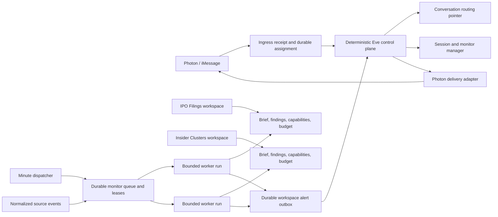

# Spec 1: Independent workspace runtimes

> **Status note:** The polling-first application is implemented, independently
> reviewed, merged, and pushed to `main`. Owner-authorized production rollout
> remains in Sprint 6. Deferred crash/race/framework hardening is recorded in
> this specification's deferred-hardening phase; source-event ingestion is owned
> by Spec 3 Sprint 4.

Status: Polling implementation complete locally; production acceptance pending

Date: 2026-08-13

Last reconciled: 2026-08-15

Product target: `NORTH_STAR.md`

Reference acceptance workspace: `IPO Filings`

## How to use this specification

This is the first bounded implementation specification on the path to the Eve
North Star. It covers the shared foundation that lets multiple specialized
workspace agents remain continuously active without permanently running model
processes. It does not implement the complete Congressional Signals, Insider
Clusters, or Cramer Inverse strategies.

The detailed contracts describe the target behavior. The implementation-status
table distinguishes locally shipped behavior, production acceptance, and
explicitly deferred hardening; Git and verification output are the evidence.
If implementation reveals a product decision that contradicts this
specification, stop and resolve it with the owner instead of silently widening
the scope.

## Goal

Allow every enabled workspace to own durable monitors that wake bounded,
isolated workers on schedules, even when another workspace is
selected for the owner's current iMessage conversation.

The selected workspace controls only where an ordinary unqualified iMessage is
routed. It does not start, stop, or pause background work in other workspaces.

The completed foundation must support this experience:

1. The owner creates an `IPO Filings` session.
2. In that session, the owner asks Eve to check for new SEC S-1 filings every
   day at 9:00 AM in the owner's timezone.
3. The owner later says, “Also run this at 4:00 PM,” and Eve edits the same
   workspace-owned monitor.
4. The owner switches to the `Insider Clusters` session; the IPO monitor
   continues running.
5. A bounded IPO worker detects a new filing and sends an iMessage alert headed
   **IPO Filings** without changing the selected workspace.
6. The owner taps **Discuss in IPO Filings**. Eve atomically selects that
   workspace and makes the referenced alert available to its next turn.
7. The session manager shows the monitor's schedule, sources, budget, status,
   last run, next run, and pause/resume controls.
8. Starting the workspace fresh preserves its monitors, brief, and findings.
   Archiving it pauses its monitors; restoring it leaves them paused until the
   owner explicitly resumes them.

## Agreed product decisions

- [x] Use one user-facing Eve identity and a deterministic control plane. Do
  not introduce a model-powered “mother agent” with access to every workspace.
- [x] Treat each workspace as the durable specialized agent. A workspace owns
  its goal, bounded brief, structured findings, monitors, capabilities, and
  budget.
- [x] Execute background work through bounded Eve task sessions that wake for
  one run and then exit. Do not keep idle model processes alive.
- [x] Implement Photon/iMessage only. Keep core records independent of Photon
  delivery mechanics so another delivery adapter can be added later.
- [x] Bind each monitor immutably to one workspace. Its schedule, sources,
  instruction, status, capabilities, and budget may be edited; moving it to
  another workspace requires an explicit clone or replacement operation.
- [x] Support natural-language monitor management inside the owning workspace
  and monitor visibility/control in the existing session manager.
- [x] Allow paid research only when the workspace explicitly permits the
  provider and has sufficient configured budget.
- [x] Never allow a background worker to submit a live broker mutation. It may
  produce research, signals, and a proposed order, but live execution retains
  fresh preview, revalidation, and exact owner approval.
- [x] Deliver alerts from non-selected workspaces without silently changing the
  conversation's selected workspace.
- [x] Implement recurring polling first. Source-event ingestion is deferred to
  a follow-on after Spec 3's versioned source-adapter foundation.

## Vocabulary

| Term | Meaning |
| --- | --- |
| Owner | The one person who controls this deployment. Approved Photon principals may be aliases of that owner. |
| Conversation | One authenticated Photon principal and physical iMessage thread. |
| Selected workspace | The workspace that receives ordinary unqualified messages in a conversation. This is a routing pointer, not a runtime status. |
| Workspace | The internal durable specialized-agent record, shown to the owner as a session, with isolated state, monitors, tools, skills, and budget. |
| Session generation | Temporary Eve conversation history for a workspace. `Start fresh` replaces it without deleting workspace state. |
| Monitor | An editable, durable instruction and trigger configuration owned by one workspace. |
| Worker | A stateless, bounded Eve task session for one monitor occurrence. It is not user-facing and cannot read workspace chat history. |
| Finding | A structured, provenance-bearing result written by a worker to its workspace. |
| Alert | A workspace-labeled notification derived from a durable finding and delivered through the control plane. |
| Control plane | Deterministic application code for identity, routing, lifecycle, budgets, monitor control, alert delivery, and approvals. It runs no strategy. |

## Scope

### In scope

- Stable owner and workspace identity for Photon-created background work.
- Deployment-owner authorization across Photon session routing, session and
  monitor management, background dispatch, and alert delivery.
- Immutable Photon ingress receipts, one durable workspace assignment before
  model dispatch, idempotent completion, and uncertain-delivery quarantine.
- Workspace-owned durable briefs and structured findings.
- Default-deny workspace capability manifests.
- Configurable per-workspace run, concurrency, token, and paid-research budgets.
- Editable one-time, interval, and local-time daily schedules.
- Concurrent runs across different workspaces using isolated Eve task sessions.
- Exact source fencing, source checkpoints, idempotent run state, and durable
  alert delivery.
- Workspace-labeled Photon alerts with **Discuss in workspace** and **Manage
  sessions** actions.
- Safe confirmation for a likely reply to an alert from a non-selected
  workspace.
- Natural-language monitor CRUD in the owning workspace.
- Monitor and budget controls in the Spectrum session manager.
- Explicit migration of existing owner/conversation event triggers.
- A polling-first `IPO Filings` reference implementation and deterministic SEC
  Atom fixtures.
- A handoff requirement that Spec 3 source events reuse the same monitor queue,
  worker, budget, finding, alert, and delivery contracts as polling.

### Out of scope

- Complete Pelosi/Congressional copy-trading logic.
- Complete Insider Clusters, Cramer Inverse, or other strategy packs under
  `idea/`.
- Automatic live trading or any relaxation of financial approval invariants.
- General topic-change detection for all ordinary messages. This spec adds only
  the bounded alert-reply routing guard needed for workspace alerts.
- Telegram or HTTP workspace routing and delivery.
- Sharing one workspace across multiple Photon conversations. This spec creates
  stable owner and delivery abstractions but retains one originating Photon
  conversation per workspace subscription.
- Cross-workspace chat-history access or automatic merging of workspace notes.
- Cross-workspace convergence scoring. A later spec may promote typed public
  signals through a reviewed shared-evidence plane.
- Full conversion of the `idea/` research corpus into versioned strategy packs.
- Production activation of a specific paid provider in task-mode workers. This
  spec delivers the capability, budget, and reservation contracts plus a fake
  provider test adapter; each real provider requires a focused security review.
- Owner-private storage for large files or raw paid outputs. This project does
  not need that capability for this foundation; findings stay bounded and
  public source files are referenced by canonical URL.
- Permanent model processes, model-managed queues, or model-owned scheduling.
- Source-event HTTP ingress, conditional RSS/WebSub ingestion, and adapter
  fan-out; these are implemented in Spec 3 Sprint 4 after the adapter foundation.

## Non-negotiable invariants

- [x] In durable ingress mode, every authenticated Photon message that can cause
  a control-plane or model action receives one immutable ingress receipt. An
  ordinary message is assigned to exactly one workspace before any workspace
  model sees it. Explicit legacy compatibility mode creates no such records.
- [x] Duplicate Photon webhooks reuse the original ingress receipt and cannot
  cause a second model dispatch, control action, paid call, or response.
- [x] A dispatch or outbound delivery whose completion cannot be proven is
  quarantined for reconciliation; it is never replayed blindly.
- [x] The selected-workspace pointer affects interactive routing only. It never
  controls whether another workspace's monitors run.
- [x] A worker receives only its workspace ID, monitor configuration, bounded
  brief, approved structured findings, declared sources, and allowed
  capabilities.
- [x] A worker cannot read any workspace's raw chat history, including its own.
- [x] No workspace can read or mutate another workspace's brief, findings,
  monitors, budget, runs, or alerts.
- [x] Model-supplied owner IDs and arbitrary workspace IDs are never trusted.
  Interactive tools derive the current workspace from authenticated routing
  context; runtime tools derive it from signed control-plane auth.
- [x] A session manager action changes control-plane state only and cannot
  authorize a financial mutation.
- [x] Background runtime capabilities always deny live broker mutations,
  transfers, withdrawals, leverage, credential changes, and interactive HITL.
- [x] A workspace capability setting may tighten deployment limits but cannot
  loosen a hard global safety limit.
- [x] Paid operations reserve budget before execution and an uncertain paid
  result is not automatically retried. Expired-reservation reconciliation is
  deferred below.
- [x] Every implemented polling-path ingress, assignment, dispatch, run,
  finding, alert, delivery, and control action has a durable idempotency key.
  Spec 3 owns source-event receipts.
- [x] At-least-once Eve delivery does not create duplicate alerts or duplicate
  paid calls in the implemented ordinary path.
- [x] Alerts do not silently switch the selected workspace.
- [x] Public-source facts preserve canonical URL, source identity, observed time,
  published/updated time when available, content hash, and access classification.
- [ ] Logs and metrics never include message bodies, alert bodies, source URLs,
  owner/principal IDs, workspace IDs, monitor IDs, or other high-cardinality or
  private values.

## Target architecture



The control plane knows workspace manifests and routing metadata, not strategy
histories. Workers run in separate Eve task sessions. Two workspaces may run at
the same time; the same monitor is single-flight.

## Durable records

All records are versioned schemas validated at every read boundary. Storage
keys must include the stable owner and workspace scope where applicable.

### Owner identity

`OwnerIdentity` provides one stable deployment owner ID and an explicit set of
approved Photon principal aliases.

- [x] Add a server-side owner mapping that fails closed for an unmapped Photon
  principal.
- [x] Keep real principals in encrypted deployment configuration, never tracked
  source or Redis values that are returned to the model.
- [x] Store a non-reversible stable alias for ownership checks and indexes.
- [x] Enforce the owner mapping before reading or mutating Photon session state,
  monitor state, runtime state, manager capabilities, or alert destinations.
- [x] Add negative tests proving an authenticated but unmapped Photon principal
  cannot list sessions, select a workspace, manage monitors, start workers, or
  receive owner-only workspace data.
- [x] Keep the existing Coinbase allowlist separate; it is not the general
  deployment owner boundary.

### Conversation routing record

`ConversationRoutingRecord` remains scoped to the authenticated Photon
conversation and contains:

- owner ID;
- physical conversation address stored only in the delivery layer;
- selected workspace ID;
- revision and last mutation ID; and
- recent alert-routing candidates containing IDs and timestamps, not bodies.

The existing workspace registry may remain conversation-originated in this
spec. A later cross-conversation session-broker spec can make workspaces
shareable across owner conversations without changing monitor or alert identity.

### Photon ingress and workspace dispatch receipts

Every authenticated Photon webhook that can cause a control-plane or model
action first creates or reuses an immutable `PhotonIngressReceipt`. Ordinary
messages then receive one immutable workspace assignment before dispatch.
Approval replies and explicit session-management requests may be intercepted by
their deterministic control protocols, but they use the same ingress dedupe and
completion contract.

The ingress and dispatch records include:

- ingress ID, Photon webhook/event dedupe key, owner ID, conversation ID, and
  received time;
- input classification of ordinary message, approval reply, session-management
  request, or held alert reply, without copying message text into indexes or
  logs;
- for ordinary or held messages, the assigned workspace ID, session generation,
  routing-pointer revision, assignment reason, and assignment time;
- dispatch request ID, attempt state, Eve continuation target, and timestamps;
- control-action, model-dispatch, response-delivery, and completion receipt IDs
  where applicable; and
- bounded failure code, quarantine reason, and operator resolution metadata.

The durable state machines are:

```text
received -> assigned -> dispatching -> dispatched -> completed
received -> intercepted -> completed
received -> held -> assigned -> dispatching -> dispatched -> completed
dispatching|dispatched -> uncertain -> quarantined -> resolved
```

- [x] Authenticate and authorize the Photon principal before creating an
  owner-scoped receipt or reading any workspace state.
- [x] Atomically create the receipt by Photon event dedupe key so concurrent
  duplicate webhooks cannot both continue.
- [x] Resolve and persist the target workspace and session generation before
  constructing the workspace model turn. Once dispatch begins, that assignment
  is immutable even if the conversation's selected-workspace pointer changes.
- [x] Make dispatch completion idempotent by ingress and dispatch request IDs.
- [x] Record outbound response delivery separately from model dispatch so an
  uncertain Photon send is not mistaken for an unexecuted model turn.
- [x] Quarantine uncertain model dispatch or response delivery instead of
  replaying it. Recovery may resume only after authoritative reconciliation or
  an explicit owner/operator resolution recorded on the receipt.
Receipt payloads are bounded to the references needed for dedupe, routing,
recovery, and audit. Long-term retention policy remains deferred below.

### Workspace record

Extend the current `PhotonWorkspace` contract or add an adjacent versioned
record with:

- stable owner ID and workspace ID;
- display name and lifecycle state;
- optional strategy-pack reference and version;
- current session generation;
- brief revision;
- capability-manifest revision;
- budget-policy revision;
- created/updated timestamps; and
- optimistic concurrency revision.

Do not embed monitor arrays, findings, source payloads, or Photon destinations
inside the workspace record.

### Workspace brief

`WorkspaceBrief` is bounded durable rehydration state, independent of session
history:

- workspace goal and thesis;
- approved strategy-pack configuration;
- watchlist/entity references;
- source policy;
- bounded current findings summary;
- open questions and last material change;
- schema and content revision; and
- provenance for every machine-promoted fact.

- [x] Define a strict serialized byte ceiling and per-field bounds.
- [x] Update through compare-and-set so concurrent workers cannot overwrite a
  newer brief.
- [x] Do not let a worker rewrite safety policy, its capability manifest, or its
  budget through a brief update.
- [x] Keep bounded structured findings in owner-scoped storage. Reference public
  filings by canonical URL and reject private or unbounded large outputs.

### Capability manifest

`WorkspaceCapabilityManifest` is default-deny and names only what the workspace
may use:

- skill IDs and versions;
- model-facing tool IDs;
- source IDs and exact source URL origins;
- optional connection/provider IDs;
- whether paid research is allowed;
- maximum data access classification;
- worker model policy; and
- hard-denied capabilities inherited from the shared core.

Default-deny means an omitted tool, skill, source, provider, or data class is
unavailable. It does not prevent the owner from explicitly expanding the
workspace's research abilities within hard deployment limits.

- [x] Compare each connected provider's current tool inventory and schemas with
  the reviewed manifest. Report removed, newly discovered, and schema-changed
  tools; never expose a new or changed tool automatically.
- [x] Keep newly discovered mutations disabled even when a provider dynamically
  registers them.
- [x] Return a typed unavailable-capability reason—authorization, safety policy,
  runtime restriction, missing integration, or provider drift—rather than
  hallucinating a result or claiming the provider lacks the capability.
- [x] Add deterministic drift fixtures for a removed tool, a new read tool, a
  new mutation, and a schema-changing existing tool.

### Workspace budget policy

`WorkspaceBudgetPolicy` includes:

- maximum scheduled runs per day;
- maximum concurrently running workers;
- maximum input/output tokens per run and per day;
- optional paid-research ceiling per call;
- optional paid-research ceiling per day and per calendar month;
- unknown-price fallback ceiling;
- owner timezone for calendar windows; and
- policy revision and effective time.

Money is stored and compared as decimal strings or integer minor units, never
binary floating point. `null` means “inherit the deployment cap,” not unlimited.

### Workspace monitor

`WorkspaceMonitor` includes:

- stable monitor ID, owner ID, and immutable workspace ID;
- name and bounded evidence-based instruction;
- lifecycle state and reason;
- schedule or source-event trigger;
- timezone and next occurrence;
- optional owner-defined end time (no automatic 90-day expiry);
- declared source IDs and canonical URLs;
- required skill/tool/provider capabilities;
- optional monitor-level limits that only tighten the workspace budget;
- configuration revision;
- source checkpoint/window;
- last/next run metadata and consecutive failures;
- originating delivery-subscription ID; and
- created/updated timestamps.

Supported schedule variants:

```text
one_time(at)
interval(anchor, everyMinutes)
daily_local(timezone, times[HH:mm])
source_event(subscriptionIds[])   # enabled in the later source-event sprint
```

The `daily_local` form is required for “9 AM and 4 PM” and must not be reduced
to a drifting interval. A recurring monitor continues until the owner pauses,
archives, retires, or explicitly time-bounds it.

### Monitor run

`WorkspaceMonitorRun` snapshots everything needed for deterministic execution:

- run ID and deterministic occurrence key;
- owner, workspace, and monitor IDs;
- monitor configuration revision;
- brief, capability, and budget revisions;
- scheduled/event occurrence and evaluation window;
- lease owner and expiry;
- reserved run/token/paid budget;
- source-attempt and source-success sets;
- outcome and bounded error code; and
- finding/alert IDs created by the run.

### Finding and alert

`WorkspaceFinding` contains structured public or private evidence with schema
version, producer workspace, monitor/run IDs, provenance, as-of time, access
classification, content hash, and optional durable artifact references.

`WorkspaceAlert` references a finding and contains bounded presentation data,
workspace display metadata, source references, and a stable alert ID. It never
contains a Photon thread ID.

`AlertDeliverySubscription` and `AlertDeliveryReceipt` live in the delivery
layer. This spec supports one originating Photon conversation subscription per
workspace monitor while keeping the core alert channel-independent.

## State and transition contracts

### Workspace lifecycle

```text
active -> archived -> active
active|archived -> retired
```

- [x] Archiving prevents new interactive routing, pauses/suspends monitors,
  revokes pending workspace approvals, and selects a replacement if needed in
  the ordinary path. Cross-store atomic convergence is deferred below.
- [x] Restoring returns the workspace to `active` but converts its monitors to
  manual `paused`; none resume automatically.
- [x] Starting fresh advances the session generation and revokes approvals tied
  to the old generation while preserving briefs, findings, monitors,
  capabilities, budgets, and delivery subscriptions.
- [x] Retirement is recoverable product state. Do not claim hard deletion of
  Eve or external provider records.

### Monitor lifecycle

```text
enabled -> paused
enabled|paused -> suspended_archived
suspended_archived -> paused
enabled -> paused_failure
paused|paused_failure -> enabled
any nonterminal state -> retired
```

- [x] Store why and when a monitor paused.
- [x] Pause automatically after the configured consecutive-failure threshold.
- [x] Require an explicit owner action to resume after archive restoration,
  budget exhaustion requiring policy change, or uncertain alert checkpoint.
- [x] Updating a monitor increments its revision; an old claimed run must fail
  revalidation before executing tools or committing results.

### Run lifecycle

```text
due -> leased -> dispatched -> running
running -> no_match | finding_staged | retryable_failure | terminal_failure
finding_staged -> alert_staged -> completed
```

- [x] Claims are atomic, leases expire, and expired work is recoverable.
- [x] The same occurrence key can never produce two committed findings or
  alerts.
- [x] Different workspaces may run concurrently.
- [x] A monitor is single-flight. Default workspace concurrency is one worker;
  the owner may raise it only within a hard deployment cap.
- [x] Concurrent workspace-state writes use compare-and-set; already-completed
  paid calls are never replayed as a state-merge retry.

### Alert delivery lifecycle

```text
staged -> delivering -> delivered
staged|delivering -> retryable_failure
delivering -> delivery_uncertain
```

- [x] A delivered alert is deduplicated by stable alert and destination IDs.
- [x] If the Photon adapter returns an explicit ambiguous-acceptance error,
  quarantine the delivery and pause the monitor instead of sending it again.
The ordinary staged-alert path creates discoverable delivery work before run
completion. Crash-atomic alert/checkpoint recovery remains deferred below.

## Scheduling semantics

- [x] Retain one static minute dispatcher. It atomically claims due monitor
  occurrences and dispatches bounded Eve task sessions through the existing
  internal runner pattern.
- [x] Represent local daily schedules as timezone plus unique sorted `HH:mm`
  values.
- [x] On a spring-forward nonexistent local time, run once at the next valid
  local instant.
- [x] On a fall-back repeated local time, run once using a local-date/time
  occurrence key.
- [x] Editing a schedule recomputes the next occurrence without replaying a
  time already completed under the new revision.
- [x] After downtime, execute at most the newest missed occurrence inside a
  configured recovery window; record older occurrences as skipped so recovery
  cannot create a catch-up storm.
- [x] Reserve daily run capacity when enabling or expanding a schedule. Reject
  a change whose projected cadence exceeds the workspace or deployment cap.
- [x] Preserve existing global trigger limits until explicitly replaced by
  equal or stricter deployment limits.

Eve provides durable task sessions, but dynamic schedules remain application
state. Delivery is at least once, so occurrence keys and application-level
idempotency are mandatory.

## Worker execution contract

Each occurrence starts a new isolated Eve task session addressed by the stable
run ID. It must not send a message to the workspace's interactive continuation.

The control plane provides signed runtime auth containing only opaque owner,
workspace, monitor, run, and revision claims. Runtime tools re-read authoritative
records and verify all claims before acting.

The worker receives:

- shared safety instructions;
- the workspace's allowed strategy skill(s);
- a bounded workspace brief;
- the monitor instruction and evaluation window;
- exact configured sources;
- bounded relevant prior findings; and
- dynamically registered tools permitted by the capability manifest.

The worker does not receive:

- raw interactive chat history;
- another workspace's manifest, state, or alerts;
- arbitrary web/search access unless explicitly allowed;
- user OAuth that could pause for authorization;
- session-manager or approval capabilities;
- broker mutation tools; or
- shell/filesystem tools unless a later reviewed capability explicitly needs
  them and the shared core permits them.

- [x] Build worker prompts from typed records, not concatenated model prose from
  another session.
- [x] Enforce exact source fencing in both prompt and tool execution.
- [x] Require every configured source to be attempted at most once per run and
  successfully covered before committing no-match or alert state.
- [x] Keep provider result normalization and transport byte limits in force.
- [x] Write findings through a scoped control-plane tool that derives workspace
  and run identity from runtime auth.
- [x] Treat a final model answer without the required completion/finding tool as
  a failed evaluation, not a successful checkpoint.

## Capability and budget enforcement

Capabilities are resolved dynamically for each worker step from the current
manifest and the run's snapshotted revision. A revoked capability makes an old
run stale before tool execution.

- [x] Separate control-plane capabilities, research capabilities, and financial
  capabilities in code and schemas.
- [x] Make the runtime guard authoritative even when a tool is accidentally
  registered elsewhere.
- [x] Add a provider-independent paid-research reservation interface.
- [x] Reserve the known maximum or configured unknown-price ceiling before a
  paid call.
- [x] Reconcile reservation versus actual cost when the provider returns a
  trustworthy charge.
Uncertain charges are not automatically released or retried; durable expiry and
owner-visible reconciliation remain deferred below.
- [x] When a budget blocks a run, record a bounded reason and notify the owner
  once; do not generate an alert on every minute tick.
- [x] Let the owner change workspace budgets through authenticated manager
  actions and natural-language tools operating in that workspace.
- [x] Make paid providers disabled by default. Enabling one requires an existing
  noninteractive authorization, explicit capability grant, and sufficient
  budget.
- [x] Test paid budget behavior with a deterministic fake provider. Enabling
  Masterkey for scheduled runtime work is a later provider-specific change and
  must not be assumed by this foundation.

## Monitor management contract

Interactive monitor tools derive the current workspace from authenticated
Photon routing context. The model never chooses an arbitrary workspace ID.

The Photon router must project typed internal metadata containing owner,
conversation, workspace, and generation identity. Tools read that metadata or
signed auth through Eve's channel context; they must not parse a workspace name,
synthetic thread suffix, or model-visible routing sentence to establish scope.

Required operations:

- create a monitor in the current workspace;
- list current-workspace monitors;
- update instruction, schedule, sources, and tightening limits;
- pause and resume;
- clone explicitly into another owner-selected workspace;
- retire/delete through an approved recoverable operation; and
- inspect last run, next run, source checkpoint, failure, and budget status.

- [x] Replace generic event-trigger wording with user-facing **monitor** wording
  while retaining a compatibility layer for existing tools during migration.
- [x] Align create and update validation with the authoritative store limit of
  eight combined sources. UI, tool schemas, and storage must reject the same
  ninth source with the same bounded error code.
- [x] Replace the order-specific trigger-deletion success and denial copy with
  monitor-specific confirmation, or remove deletion from the rich approval
  protocol and use a dedicated recoverable monitor-retirement action.
- [x] Resolve ambiguous monitor references by listing candidates or asking the
  owner; never edit the nearest name match silently.
- [x] Support additive schedule language such as “also run at 4 PM” without
  replacing the existing 9 AM occurrence.
- [x] Require an explicit timezone for local schedules and preserve it on edits.
- [x] Normalize and validate added sources before committing a configuration
  revision.
- [x] Keep source credentials out of URLs and workspace/model state.
- [x] Use Eve call IDs as idempotency keys for natural-language mutations.

## Photon alert and routing UX

An alert is delivered into the physical iMessage conversation with a clear
workspace header. It does not rename the iMessage thread and does not switch the
selected workspace.

The alert card provides:

- workspace name;
- concise event title and why it matched;
- published/observed time and safe source link(s);
- **Discuss in <workspace>**; and
- **Manage sessions**.

### Discuss action

- [x] Mint a short-lived owner-, conversation-, workspace-, alert-, and revision-
  bound capability in the URL fragment.
- [x] On tap, atomically select the alert's workspace using the current
  conversation revision.
- [x] Store a one-time pending alert-context reference for the selected
  workspace; do not inject the full alert into another workspace.
- [x] On the next user message, load the bounded finding/alert reference into
  that workspace's turn context and consume the pending reference.
- [x] Do not start a model turn merely because the owner tapped **Discuss**.
- [x] If the workspace is archived, retired, or no longer belongs to the owner,
  fail closed and open the manager with a clear status.
- [x] Make stale and repeated taps harmless.

### Ambiguous plain-text reply

Add a bounded alert-reply routing guard, not a general mother agent.

- [x] It may inspect only the new message, the selected workspace manifest, and
  recent alert envelopes containing workspace name, title, time, and alert ID.
- [x] It cannot read workspace histories or invoke research tools.
- [x] A quoted Photon reply to a known alert is treated as a strong binding when
  Photon supplies stable reply metadata.
- [x] A high-confidence reference to a recent alert from another workspace is
  held outside all workspace histories and prompts the owner to choose that
  workspace or remain in the selected one.
- [x] The held message is dispatched exactly once after an owner choice using a
  durable assignment and dispatch receipt.
- [x] Low-confidence text continues to the selected workspace; never silently
  route based on weak topical similarity.

## Session manager additions

Extend the existing Spectrum manager; do not create a second unrelated admin
surface.

Each workspace view shows:

- lifecycle and selected status;
- monitor count and enabled/paused/error counts;
- each monitor's name, schedule, timezone, sources, status, last run, next run,
  and latest bounded failure;
- workspace run/token/paid budget and current usage;
- pause/resume controls;
- schedule editor for supported schedule variants; and
- workspace budget editor constrained by deployment caps.

Spectrum state behavior is explicit:

- while loading or mutating, keep the last authoritative state visible and
  disable only actions that could conflict;
- a workspace with no monitors shows a valid empty state with the create-monitor
  entry point;
- a read failure shows a bounded reason and retry action without presenting
  stale data as current; and
- successful, stale, replayed, and failed mutations produce distinct bounded
  outcomes.

- [x] Keep the existing owner-bound short-lived manager capability and URL
  fragment transport.
- [x] Add request IDs, expected revisions, expirations, and one-time durable
  consumption to every manager mutation.
- [x] Keep monitor and session actions separate from financial approval
  protocols.
- [x] Make status inspection read-only and safe to refresh.
- [x] Preserve the manager's current minimal visual language and button layout
  hierarchy.
- [x] Provide plain-text/natural-language fallbacks for every essential monitor
  operation.

## Reference acceptance workspace: IPO Filings

The reference is deliberately smaller than a full investment strategy. Its job
is to prove the foundation with an authoritative, inexpensive source.

### Source and behavior

- Use an official SEC EDGAR latest-filings RSS/Atom search filtered to new
  `S-1` registration statements.
- Follow the [SEC developer resources](https://www.sec.gov/about/developer-resources)
  and fair-access policy, including an identifying user agent and aggregate
  request rate below the SEC limit.
- Treat `S-1` as a potential IPO registration, not proof that an IPO will occur.
- Treat `S-1/A` as an update to an existing registration, not a new company.
- Deduplicate each filing by accession number and form type; preserve CIK,
  company name, filing/file number when available, canonical filing URL, and
  observed time.
- Use public data only and no paid provider for the reference monitor.

The reference workspace capability manifest allows only the public-event
monitoring skill, the exact SEC source, source fetch, structured finding write,
alert staging, and run completion. It denies general web search, Masterkey,
Coinbase, private history, shell, and filesystem.

### Deterministic fixtures

- [x] Add a fixture with an initial SEC Atom page containing known S-1 entries.
- [x] First run establishes the checkpoint without alerting on the entire
  historical page.
- [x] Add one later S-1 entry and verify exactly one structured finding and one
  alert.
- [x] Replay the same feed and run occurrence; verify no duplicate finding,
  alert, or delivery.
- [x] Add an S-1/A associated by filer CIK and registration file number and
  verify it is classified as an update rather than a new IPO candidate.
- [x] Add malformed, oversized, stale, redirected, and incomplete source cases.
- [x] Add a second fixture workspace due at the same time and prove both workers
  run independently with no shared context or state.

### Live smoke

- [x] Perform a read-only fetch of the real SEC feed with the configured user
  agent.
- [x] Verify parsing and checkpoint creation without requiring a new real filing
  to arrive.
- [x] Use an injected post-checkpoint fixture event to exercise the production
  Photon delivery caller through a fixture adapter.
- [x] Keep live-source availability outside the deterministic CI pass/fail gate.

## Source-event contract handoff

Source-event ingestion is not part of the completed polling milestone. The
normalized envelope, conditional RSS, optional verified WebSub, authenticated
ingress, subscription fan-out, shared-public-fact boundary, replay tests, and
independent kill switch are owned by
[`Spec 3 Sprint 4`](03-public-source-adapters.md#sprint-4--spec-1-polling-and-source-event-integration).
Spec 1 remains the owner of occurrence, lease, worker, budget, finding, alert,
and delivery contracts that Spec 3 reuses.

## Migration and compatibility

Existing event triggers are owner/conversation-scoped and cannot be assigned to
a workspace safely by guessing.

- [x] Introduce a new versioned workspace-monitor schema without rewriting
  legacy records in place.
- [x] Stop creating legacy records after the feature flag is enabled.
- [x] Continue legacy execution temporarily through the existing restricted
  runner, labeled as a legacy monitor, without granting workspace state or new
  capabilities.
- [x] Preserve the store's maximum of eight combined sources during migration;
  do not accept records through a tool schema that the store cannot represent.
- [x] Show unassigned legacy monitors in the manager and require the owner to
  choose a target workspace.
- [x] On assignment, atomically create the workspace monitor, carry forward the
  safe source checkpoint and schedule, and disable the legacy trigger.
- [x] Never copy old runtime session history into the workspace brief.
- [x] Preserve current workspace IDs and generations; add adjacent versioned
  state rather than resetting confirmed conversations.
- [x] Provide a rollback mode that disables new dispatch while preserving all
  new records for later recovery.
- [x] Add Redis-backed migration and runtime coverage for leasing, competing
  claims, run budgets, retries, watermarks/checkpoints, consecutive-failure
  pause, expiration, archive/pause races, and uncertain alert delivery.
- [x] Add a local schedule-test runbook that explains the internal runner's
  deliberate 404 behavior and that Eve development mode does not run cron
  automatically.

## Photon integration coverage

The feature is not accepted from isolated store tests alone. Add a deterministic
Photon integration harness that exercises webhook authentication and owner
authorization, ingress dedupe, Chat SDK state, workspace assignment, Eve
dispatch, response delivery, and the Spectrum session manager without reaching
real Coinbase mutation endpoints.

- [x] Cover an ordinary message routed to the selected workspace and prove the
  assignment is durable before the workspace model sees it.
- [x] Cover concurrent duplicate webhooks and prove only one dispatch and one
  response-delivery attempt can begin.
- [x] Cover session switching, archive/restore, and `Start fresh`, including a
  stale generation and a selected-pointer change after assignment.
- [x] Cover an alert from a non-selected workspace, **Discuss**, an ambiguous
  reply, a stale/replayed action, and an uncertain Photon delivery.
- [x] Cover owner-denied access to session, monitor, manager, runtime, and alert
  state.
- [x] Use fixture-backed Eve and Photon adapters and keep all live financial
  mutation capabilities unavailable in the harness.

## Implementation status

The detailed contracts above are authoritative. This table records completion
without duplicating each requirement.

| Sprint | Delivered scope | Status |
| --- | --- | --- |
| 0 | Contracts, state transitions, failure fixtures, flags, and rollback design | Local gate passed |
| 1 | Owner/workspace identity, state, capabilities, budgets, and Start fresh | Local gate passed |
| 2 | Monitor store, scheduling, dispatch, leases, budgets, checkpoints, and legacy assignment | Local gate passed |
| 3 | Isolated worker runtime and IPO/SEC reference implementation | Local gate passed |
| 4 | Durable-mode Photon receipts, alert delivery, Discuss/Manage routing, and deterministic integration harness | Local gate passed |
| 5 | Natural-language and Spectrum monitor/budget management plus lifecycle controls | Local gate passed |
| 6 | Deterministic suites, Redis races, builds, local runbook, simultaneous runs, budget exhaustion, and SEC live smoke | Local gate passed; production acceptance remains |

### Local production prerequisites

- [x] Remove raw workspace/monitor identifiers and arbitrary exception text from
  workspace schedule/worker logs, enforce the fixed low-cardinality catalog,
  and pass negative log-sink tests through the production schedule caller.
- [ ] Before Spec 2 activates a pack-managed source, reject exact-fenced
  redirects before issuing any second outbound request, including redirects to
  private or undeclared origins.

This is the only remaining local code prerequisite. Verify it through the real
fetch caller and its focused SEC regression tests; it does not reopen Sprints
0–6 or require the full Photon/Redis/manager suite.

### Remaining owner-authorized production acceptance

- [ ] With owner authorization, deploy behind flags and execute the real Photon
  IPO alert/Discuss/manager flow. To avoid waiting indefinitely for a new filing,
  use a disposable acceptance monitor positioned immediately before one real
  canonical S-1 already present in the live SEC feed; label it as an acceptance
  replay, retire it afterward, and introduce no fixture endpoint.
- [ ] Correlate bounded evidence across ingress and assignment, monitor claim and
  run snapshot, finding, alert/outbox, Photon delivery receipt, Discuss
  selection/context, and next-turn assignment. Record no private content.
- [ ] Prove the non-selected workspace remains selected until Discuss, duplicate
  delivery is inert, the manager agrees with durable state, and rollback stops
  new dispatch/alerts without deleting workspace records.

Exit gate:

- [ ] Polling is proven end to end in Photon with no context leakage, duplicate
  alerts, unexpected session switch, or unauthorized capability.

### Deferred hardening — after Specs 2–6

These items are real reliability and operations work discovered during the
independent Spec 1 review. They are deliberately outside the completed ordinary
polling milestone and should not block the remaining product specs unless one
becomes an observed ordinary-path failure.

#### Source and compiled-runtime boundaries

- [ ] Require explicit acceptance-only fixture-bridge opt-in, loopback-only
  transport, strong ephemeral credentials, and a built-output negative test.
- [ ] Strengthen cross-field SEC identity relationships among accession, CIK,
  form/file number, registration/amendment identity, classification, and URL.
- [ ] Overlap two production-path compiled workers and prove isolated state,
  clean terminal outcomes, and clean runtime teardown.

#### Durable alert and Photon crash recovery

- [ ] Make finding, alert/outbox staging, checkpoint advancement, and retry state
  one discoverable durable relationship so a checkpoint cannot hide alert loss.
- [ ] Recover or quarantine alert delivery stranded in `delivering`, including
  crashes before Photon send and after ambiguous Photon acceptance.
- [ ] Recover or quarantine ingress dispatch stranded in `dispatching` and
  response delivery stranded in `staged`.
- [ ] Recover pending Discuss context and held replies across failures between
  consumption, workspace selection, assignment, and model dispatch.
- [ ] Give intercepted approval and session-manager actions explicit durable
  terminal outcomes, with crash/lifecycle tests at each write/side-effect edge.
- [ ] Add a privacy-safe operator report and resolution path for quarantined
  ingress dispatches, response deliveries, runs, and uncertain alert deliveries.

#### Worker accounting and authoritative freshness

- [ ] Reconcile expired global and workspace reservations after process death.
- [ ] Persist and recover failures that occur before a worker session starts.
- [ ] Revalidate brief, strategy, and budget revisions before outcome commit.
- [ ] Distinguish known-not-started work from an ambiguous start that may already
  have incurred model or provider cost; retain uncertainty when required.

#### Lifecycle, privacy, and framework maintenance

- [ ] Make archive/restore converge atomically or through a durable idempotent
  lifecycle intent.
- [ ] Complete low-cardinality counter emission for recovery/quarantine outcomes
  when those deferred paths are implemented.
- [ ] Replace raw session, turn, and approval-request identifiers in legacy
  Photon logs with approved bounded correlations and production-caller sink
  tests before private or paid-provider outputs are activated.
- [ ] Define retention for runs, findings, alerts, receipts, and budget ledgers;
  never use model context as the only retained record.
- [ ] Replace Eve private runtime imports with a public API when available;
  until then pin/guard the compatible Eve version and keep the compiled-worker
  upgrade gate.

Source-event/RSS/WebSub implementation moved to
[`Spec 3 Sprint 4`](03-public-source-adapters.md#sprint-4--spec-1-polling-and-source-event-integration),
where it can share versioned adapter and canonical-fact contracts.

## Verification matrix

This matrix distinguishes the completed ordinary path from the one remaining
local prerequisite and explicitly deferred crash/operations work. A deferred
tail does not reopen a locally passed boundary.

| Boundary | Required proof | Current status |
| --- | --- | --- |
| Identity | Unmapped Photon principals fail closed before session, monitor, worker, manager, or alert state is read; aliases resolve only to the configured owner. | Local gate passed |
| Durable-mode ingress | Every actionable Photon webhook has one immutable receipt and, when model-bound, one workspace/generation assignment recorded before dispatch. Legacy compatibility mode is covered separately and creates no durable ingress records. | Local gate passed |
| Dispatch | Concurrent duplicate webhooks cause one model dispatch; completion is idempotent; uncertain dispatch or response delivery is quarantined instead of blindly replayed. | Ordinary path passed; crash recovery deferred |
| Isolation | A worker cannot read or write another workspace even with forged IDs in model input. | Local gate passed |
| Scheduling | Daily local times, DST, edits, downtime, leases, and stale revisions behave deterministically. | Local gate passed |
| Concurrency | Different workspaces run concurrently; the same monitor remains single-flight. | Ordinary path passed; compiled overlap/teardown deferred |
| Context | Worker prompt/history contains no interactive transcript or unrelated skill/tool. | Local gate passed |
| Capabilities | Omitted tools/providers are unavailable; hard runtime denials cannot be loosened; new or schema-changed provider tools remain disabled and are reported accurately. | Local gate passed |
| Budgets | Reservations are atomic; concurrent runs cannot overspend; uncertain cost remains reserved. | Ordinary path passed; stale/ambiguous recovery deferred |
| Sources | Exact source fencing, at-most-once fetch per run, complete coverage, and provenance survive retries. | Exact pre-request redirect fence pending |
| Findings | Duplicate occurrences cannot create duplicate structured findings. | Local gate passed |
| Alerts | Duplicate/uncertain delivery cannot spam the owner or advance an unsafe checkpoint. | Ordinary path passed; crash recovery deferred |
| Routing | Alert receipt does not switch workspaces; Discuss and held-message choices are one-time and revision-bound. | Ordinary path passed; crash recovery deferred |
| Lifecycle | Archive pauses, restore stays paused, and start-fresh retains durable workspace state. | Ordinary path passed; atomic convergence deferred |
| UX | Natural-language and Spectrum operations agree on authoritative state. | Local gate passed |
| Photon integration | Fixture webhooks cover routing, duplicate delivery, switching, Start fresh, alerts, stale actions, and owner denial without access to real broker mutations. | Local gate passed; real Photon acceptance pending |
| Financial safety | Runtime workers cannot access live mutation tools; proposed orders still require fresh approval. | Local gate passed |
| Migration | Legacy triggers are never guessed into a workspace and can be explicitly assigned without replaying history. | Local gate passed |

## Current observability and operations

- [x] Emit bounded error codes rather than exception bodies or provider payloads.
- [x] Provide owner-visible monitor health in the manager.
- [x] Add kill switches for all workspace dispatch, paid runtime research,
  Photon workspace alerts, and source-event ingestion.

## Definition of done

The ordinary-path polling implementation is complete for the rows labeled
`Local gate passed` or `Ordinary path passed` above. This does not claim the
pending exact redirect fence or the explicitly deferred recovery/operations
tails. The local production-code gate closes when every item in **Local
production prerequisites** is checked. The specification reaches production
acceptance when every item in **Remaining owner-authorized production
acceptance** and its exit gate is checked with real Photon evidence.

Deferred post-Spec-6 hardening remains tracked below the implementation status
and is not a blocker unless an item becomes an observed ordinary-path failure.
After production acceptance, record the deployed commit, bounded receipt-chain
evidence, smoke result, and rollback result in `HANDOFF.md`, `NORTH_STAR.md`, and
this specification.

## Follow-on specifications

Completion of this foundation does not authorize these projects. Each needs its
own bounded implementation spec:

1. [`Spec 2: Versioned strategy packs and workspace installation`](02-versioned-strategy-packs.md).
2. [`Spec 3: Versioned public-source adapters and canonical facts`](03-public-source-adapters.md).
3. [`Spec 4: Congressional Signals v1 — House PTRs`](04-congressional-signals-house.md).
4. [`Spec 5: Insider Clusters`](05-insider-clusters.md).
5. [`Spec 6: Typed shared-signal plane`](06-shared-signal-plane.md).
6. Cramer Inverse source acquisition, quote attribution, and signal rules.
7. Workspace-aware proposed-order, reservation, preview, approval, and broker
   reconciliation.
8. General topic-change detection beyond the bounded alert-reply guard.
9. Telegram migration to the workspace broker.
