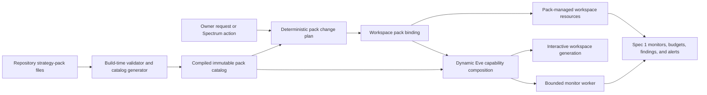

# Spec 2: Versioned strategy packs and workspace installation

Status: Ready for Sprint 0 implementation; local Spec 1 dependency complete

Date: 2026-08-14

Product target: `NORTH_STAR.md`

Dependency: `specs/01-independent-workspace-runtimes.md`

Reference pack: `IPO Filings`

## Plain-language objective

Make specialized strategy agents easy to create without rebuilding their
workspace plumbing each time.

Spec 1 provides the engine: durable workspaces, isolated workers, monitors,
schedules, capabilities, budgets, findings, and alerts. This specification adds
reusable recipes for that engine. A **strategy pack** says what a specialized
agent is for, which instructions and sources it uses, which abilities it needs,
which monitor templates it offers, what its findings look like, and which tests
prove it works.

The reusable pack and the owner's installed agent remain different things:

- `IPO Filings@1.0.0` is a versioned recipe in the repository.
- The owner's `IPO Filings` workspace is one configured installation of that
  recipe, with its own schedule, budget, conversation, monitors, and findings.

This specification builds the installation system and proves it with the small
public-data IPO workflow. It does not build every investment strategy.

## How to use this specification

Implement this specification only after the applicable local Spec 1 polling
milestone is merged and green. Owner-authorized Spec 1 production rollout and
its explicitly deferred post-Spec-6 hardening are not Spec 2 dependencies. Reuse
Spec 1's owner, workspace, capability, budget, monitor, finding, alert, ingress,
and lifecycle contracts rather than creating parallel stores.

Every implementation task is a checklist item. Complete the sprints in order.
Do not mark an item complete until its deterministic tests and exit gate pass.
If implementation requires weakening a Spec 1 invariant, stop and resolve the
conflict with the owner rather than widening this specification.

## Goal and acceptance experience

The completed feature must support this experience:

1. The owner asks Eve to create an IPO-filings session that checks for new SEC
   S-1 filings at 9:00 AM and 4:00 PM in the owner's timezone.
2. Eve selects the reviewed `IPO Filings` pack, pins its exact version and
   content digest, creates or configures the workspace, and applies only the
   capabilities and sources that the deployment and owner allow.
3. The pack supplies the workspace's compact purpose, detailed playbook,
   official SEC source definition, IPO monitor template, structured finding
   contract, and pack-specific evaluations.
4. The requested monitor is enabled because the owner explicitly requested its
   schedule. Merely browsing or installing a pack without requesting a monitor
   does not silently start background work.
5. Other workspaces remain general-purpose or use different packs. They do not
   see the IPO pack's instructions, skills, tools, configuration, or findings.
6. The session manager shows the installed pack, version, configuration,
   capabilities, sources, monitor health, and whether an update is available.
7. An update produces a deterministic change plan. It never applies silently,
   never increases cadence or paid access without an explicit owner action, and
   never deletes durable findings.
8. Applying, rolling back, or removing a pack safely advances the workspace
   session generation, preserves durable workspace data, and pauses affected
   pack-managed monitors until their resulting configuration is explicitly
   accepted or resumed.

## Agreed product decisions

- [ ] A strategy pack is a declarative, versioned repository package, not a
  permanently running model, remote agent, or independent user identity.
- [ ] A workspace may have zero or one installed strategy pack. A workspace
  with no pack remains a general-purpose Eve research session.
- [ ] The workspace owns its conversation, configuration overrides, monitors,
  findings, and budgets. The reusable pack never owns or receives that data.
- [ ] Packs are pinned to an exact semantic version and immutable content
  digest. Updates, downgrades, and removal are explicit control-plane actions.
- [ ] Pack content can request capabilities but cannot grant them. Effective
  access remains the intersection of deployment policy, owner authorization,
  workspace policy, pack requirements, monitor scope, and runtime hard denials.
- [ ] Packs may tighten shared safety and budget limits but never loosen them.
- [ ] A pack definition contains no credentials, owner data, executable scripts,
  provider tokens, or arbitrary remote code.
- [ ] Source adapters, tools, schemas, and migrations are reviewed application
  code referenced by stable IDs. A pack manifest cannot execute code by itself.
- [ ] Installing a pack does not silently activate preset monitors. Background
  work starts only when the owner's request or manager action explicitly enables
  the resulting monitor and schedule.
- [ ] A pack update does not rewrite or delete workspace findings. Removed pack
  resources become paused or orphaned for owner review.
- [ ] Pack changes use the existing workspace lifecycle and advance the session
  generation so old instructions and capabilities cannot remain active.
- [ ] User-facing copy continues to say **session**. **Strategy pack** is the
  user-facing term for the reusable recipe installed in a session.
- [ ] The first catalog is local and repository-owned. Do not build a public
  marketplace, remote download service, or automatic update service.
- [ ] The reference pack uses public SEC data only. No owner-private artifact
  system is needed or introduced by this specification.
- [ ] No pack can enable live broker mutations. Trading remains governed by a
  later workspace-aware financial control-plane specification.

## Vocabulary

| Term | Meaning |
| --- | --- |
| Strategy pack | A repository-owned, declarative and versioned recipe for one specialized research strategy. |
| Pack definition | The immutable manifest, instruction files, resource references, and eval declaration for one exact pack version. |
| Pack catalog | The build-generated, application-owned index of validated pack definitions available in the deployment. |
| Pack binding | The durable record pinning one workspace to one exact pack version, digest, configuration, and resource mapping. |
| Pack configuration | Owner-selected values accepted by the pack's bounded configuration schema, such as timezone, daily times, or watchlist references. |
| Pack-managed resource | A workspace monitor, source subscription, or bounded brief section created from a stable resource ID in the installed pack. |
| Owner override | A validated workspace-owned change to a field the pack explicitly declares configurable. |
| Change plan | A deterministic diff describing the exact binding, configuration, capabilities, and managed-resource changes before application. |
| Catalog status | `available`, `deprecated`, or `blocked` state assigned by reviewed application code to one pack version. |

## Scope

### In scope

- A versioned strategy-pack schema and repository layout.
- A deterministic build-time catalog and pack validation command.
- Exact version and content-digest pinning.
- Bounded pack identity, instructions, playbook, configuration fields, sources,
  capability requirements, monitor templates, finding schemas, and eval suites.
- Durable workspace pack bindings and change receipts.
- Installation into a new or existing workspace.
- Explicit update, downgrade, rollback, and non-destructive removal flows.
- Pack-managed resource provenance and deterministic upgrade reconciliation.
- Dynamic composition of only the installed pack's instructions, skills, and
  allowed tools for interactive and scheduled workspace sessions.
- Natural-language pack selection/configuration in the owning workspace.
- Strategy-pack visibility and controls in the existing Spectrum session manager.
- A complete `IPO Filings@1.0.0` reference pack using the Spec 1 SEC fixtures.
- Pack schema, lifecycle, isolation, runtime, and behavior evaluations.
- Moving the tracked strategy research, data-source research, and watchlists
  into stable repository locations that future pack specs can reference without
  loading the whole corpus into model context.

### Out of scope

- Complete Congressional Signals, Insider Clusters, Cramer Inverse, or other
  candidate strategy implementations.
- A remote pack registry, marketplace, billing system, signing authority, or
  automatic download/update mechanism.
- Arbitrary user-authored, uploaded, or third-party pack installation.
- Runtime execution of JavaScript, TypeScript, shell, or templates supplied by
  a pack manifest.
- More than one pack installed in one workspace.
- Automatic merging of two packs or their prompts, scores, findings, or rules.
- Cross-workspace evidence sharing or convergence scoring.
- Backtesting, historical performance claims, or strategy-alpha validation.
- Production activation of paid data providers for background work.
- Owner-private artifact storage or automatic paid-result retention.
- Live order placement, trading approvals, broker reservations, or reconciliation.
- General topic-change detection and held-message routing.
- Telegram or HTTP workspace routing and strategy-pack management.
- Cheaper worker-model routing or pack-selected model providers.
- A graphical strategy-pack editor.

## Dependency on Spec 1

Spec 2 extends these completed Spec 1 records and behaviors:

- stable deployment owner and immutable workspace identity;
- versioned workspace record and session generation;
- bounded workspace brief and structured findings;
- default-deny capability manifest and provider drift reporting;
- workspace budget policy and atomic reservations;
- workspace-owned monitor schema, leases, schedules, and checkpoints;
- isolated interactive and task-session runtime context;
- authenticated natural-language and Spectrum manager mutations;
- archive, restore, start-fresh, ingress, alert, and delivery invariants; and
- the deterministic and live-smoke `IPO Filings` source behavior.

- [ ] Refuse to enable strategy-pack feature flags if the required Spec 1 schema
  versions or runtime guards are absent.
- [ ] Add adjacent records and indexes; do not duplicate or fork Spec 1 stores.
- [ ] Keep a general-purpose workspace valid and fully usable without a pack.

## Non-negotiable invariants

- [ ] A pack ID, version, or workspace ID supplied by a model is never trusted as
  authorization. The control plane derives the current workspace and owner from
  authenticated routing or signed runtime context.
- [ ] A pack manifest is configuration, never authority. Every tool, skill,
  source, provider, budget, and data class is revalidated against authoritative
  deployment and workspace policy before exposure or execution.
- [ ] Pack versions are immutable. The same pack ID and version cannot resolve
  to different bytes or a different digest across builds.
- [ ] A workspace binds to exactly one version and digest at a time. There is no
  floating `latest`, version range, or silent production upgrade.
- [ ] No pack change activates a new monitor, increases polling cadence, adds a
  source, enables paid access, or broadens a capability without an explicit
  owner request or manager action describing that change.
- [ ] Pack instructions, research documents, and other packs are not loaded into
  a workspace unless required by its exact active binding.
- [ ] Pack instructions cannot override shared safety, authorization, approval,
  source-fencing, budget, privacy, or financial rules.
- [ ] Background pack workers never receive private chat history, interactive
  HITL, user OAuth, shell, filesystem, or broker-mutation tools.
- [ ] Installing, changing, or removing a pack never deletes workspace findings,
  alerts, audit records, or retained monitor history.
- [ ] Pack-managed records retain stable pack resource IDs and workspace IDs so
  upgrades cannot confuse one resource with another or cross workspaces.
- [ ] Every pack mutation and resource reconciliation is revision-checked and
  idempotent. Partial failure can be resumed or rolled back without duplicate
  monitors or repeated paid work.
- [ ] A missing, invalid, blocked, or digest-mismatched pack fails closed. Its
  pack-managed monitors pause before another worker starts.
- [ ] Pack configuration and instruction sizes remain bounded. Raw research
  documents never become durable conversation state or default prompt content.
- [ ] Logs and metrics contain no message text, instructions, configuration
  values, owner IDs, workspace IDs, source URLs, watchlists, or high-cardinality
  pack digests.

## Target architecture



The catalog is compiled into the deployment. Production runtime must not scan
untraced source files from the server filesystem. This follows the existing
production lesson used for Photon assets: build-time generation produces an
imported module that server functions can load reliably.

## Repository package format

Use a declarative layout similar to:

```text
strategy-packs/
  ipo-filings/
    1.0.0/
      pack.json
      workspace.md
      playbook.md
      monitors/
        detect-new-s1.md
      fixtures/
        initial-feed.xml
        one-new-s1.xml
        amendment.xml
```

The exact filenames may change, but these rules do not:

- [ ] `pack.json` is data validated by one authoritative application schema. It
  cannot import modules or contain executable expressions.
- [ ] `workspace.md` is a short, bounded always-on mission and interpretation
  contract for an interactive workspace using the pack.
- [ ] `playbook.md` is a load-on-demand Eve skill containing the detailed
  research procedure. Its description is a bounded routing hint.
- [ ] Each monitor instruction is a separate bounded file so a worker receives
  only the instructions for its claimed monitor, not the complete pack.
- [ ] Fixture files are test inputs and are never available to production model
  sessions or registered as arbitrary filesystem capabilities.
- [ ] All referenced paths stay inside the exact version directory, reject path
  traversal and symlink escape, and have per-file and aggregate byte ceilings.
- [ ] Pack files contain no secret placeholders that encourage credentials in
  tracked configuration. Provider connections are referenced by stable IDs and
  configured outside the pack.
- [ ] Generate a typed catalog module during repository preparation/build. Do
  not depend on runtime filesystem discovery in Vercel functions.

## Strategy-pack definition contract

`StrategyPackDefinition` contains the following versioned sections.

### Identity and compatibility

- schema version;
- stable lowercase pack ID;
- exact semantic pack version;
- canonical content digest;
- display name, bounded description, and maturity of `reference`,
  `experimental`, `stable`, or `deprecated`;
- compatible core/workspace/pack-schema version ranges;
- changelog summary and optional replacement pack ID; and
- repository-relative references to the bounded instruction files.

- [ ] Reject mutable aliases such as `latest`, URL-based pack IDs, build
  timestamps as versions, and duplicate ID/version pairs.
- [ ] Canonicalize and hash the manifest plus every referenced instruction and
  schema file in a deterministic order.
- [ ] Fail CI if an existing ID/version changes digest. A content change requires
  a new semantic version.
- [ ] Reject a pack whose compatibility range excludes the deployed workspace
  or strategy-pack schema.

### Configuration schema

The pack declares bounded owner-editable fields using an application-owned
discriminated schema. Initial field kinds should be limited to what the first
packs need:

- bounded string and string list;
- enum and boolean;
- IANA timezone;
- unique sorted local daily times;
- entity/watchlist reference;
- source selection from pack-declared source IDs; and
- numeric or monetary limits that can only tighten Spec 1 policy.

Each field declares its key, label, description, type, required/default state,
bounds, whether it may be changed after installation, and whether changing it
requires monitor pause or session-generation rollover.

- [ ] Reject unknown configuration fields and values outside declared bounds.
- [ ] Treat defaults as suggested configuration, not permission to activate a
  monitor or spend money.
- [ ] Keep owner overrides separate from pack defaults so an upgrade can compute
  a three-way diff between the old definition, owner choices, and new definition.
- [ ] Never permit credential, free-form executable instruction, URL template,
  arbitrary JSON Schema, or arbitrary code fields in owner configuration.

### Capability and source requirements

The definition lists stable references to:

- Eve skill IDs and exact pack-provided skill version;
- application-owned tool IDs;
- source-adapter IDs and allowed public origins;
- optional provider/connection IDs;
- maximum access classification;
- required and optional capabilities; and
- explicit hard denials for the pack.

- [ ] Resolve the effective manifest by intersection with Spec 1 policy. A pack
  requirement that is not granted remains unavailable and is reported with the
  typed reason from Spec 1.
- [ ] Distinguish `required` from `optional`. A missing required capability
  blocks activation; a missing optional capability produces a bounded degraded
  status without inventing an answer.
- [ ] Run provider tool-inventory/schema drift checks before declaring a pack
  healthy. Newly discovered tools remain disabled.
- [ ] Reject credentials, signed URLs, mutable redirectors, and unrestricted web
  origins in source definitions.
- [ ] Reject every broker mutation, transfer, withdrawal, leverage, credential,
  shell, and unrestricted filesystem capability from this specification's pack
  schema.

### Monitor templates

Each template includes:

- stable pack resource ID and display name;
- bounded monitor-instruction reference;
- supported schedule/configuration bindings;
- exact source references;
- required capability subset;
- finding schema ID and alert presentation ID;
- suggested budget limits that only tighten workspace policy; and
- activation default, which must always be `paused` or `draft`.

- [ ] Validate template schedules against Spec 1 cadence, timezone, source-count,
  concurrency, and run-budget limits.
- [ ] Materialize templates as ordinary Spec 1 workspace monitors with immutable
  workspace identity plus pack ID, version, resource ID, and binding revision.
- [ ] Let the owner edit only template fields declared overridable. Record those
  values as workspace-owned overrides rather than altering the pack definition.
- [ ] Treat owner-created monitors as separate resources that a pack update can
  never rewrite or remove.

### Findings, outputs, and evaluations

The pack references application-owned, versioned schemas for structured
findings and alert projections. It also declares the deterministic eval suite
required for that exact version.

- [ ] Require every production pack to declare at least one fixture-backed
  positive case, no-match case, replay/idempotency case, malformed-input case,
  and forbidden-capability case.
- [ ] Require provenance, source identity, observed/as-of time, producing
  workspace, pack version, monitor/run identity, and schema version on every
  pack-produced finding.
- [ ] Keep scoring and interpretation rules pack-specific. Do not add one shared
  universal investment score to the core schema.
- [ ] Keep wording-quality judges optional and non-authoritative. Isolation,
  schema, source, capability, and idempotency gates are deterministic.

## Compiled pack catalog

`StrategyPackCatalog` is the immutable deployment view of validated definitions.
It is not a mutable database and does not contain workspace installations.

- [ ] Add a generator that validates all pack versions, resolves files, computes
  digests, and emits one typed imported catalog module.
- [ ] Sort catalog entries deterministically by pack ID and semantic version.
- [ ] Detect duplicate resource IDs, missing references, path escape, oversize
  instructions, incompatible schemas, capability conflicts, and missing evals.
- [ ] Generate a compact model-safe catalog projection containing only pack ID,
  display name, version, description, maturity, configuration summary, and
  availability. Do not expose every instruction or schema while listing packs.
- [ ] Let reviewed application configuration mark a vulnerable or incorrect
  version `blocked` without editing historical pack bytes.
- [ ] Keep installed historical versions in the build until no durable binding
  references them or an explicit migration has completed.
- [ ] Add `verify:strategy-packs` and run it in `prebuild` and CI.

## Durable workspace pack binding

`WorkspaceStrategyPackBinding` is the authoritative installed state and contains:

- owner and immutable workspace IDs;
- pack ID, exact version, and content digest;
- binding lifecycle and revision;
- validated configuration and separate owner overrides;
- effective capability-manifest revision;
- map from pack resource IDs to workspace monitor/source IDs;
- current and previous binding snapshots needed for safe rollback;
- installation/change request IDs and mutation receipts;
- installed, activated, updated, and generation-rollover timestamps; and
- bounded health/degraded reason codes.

Do not copy full instruction files, research documents, fixture bodies, or pack
schemas into the binding or workspace brief. Store stable references, versions,
digests, and the bounded owner configuration.

### Binding lifecycle

```text
unbound -> installing -> active
active -> change_planned -> applying -> active
active -> removal_planned -> removing -> unbound
installing|applying|removing -> failed_recoverable
active|change_planned -> unavailable
unavailable -> active | change_planned
```

- [ ] Use compare-and-set on the workspace, binding, capability, and monitor
  revisions for every transition.
- [ ] Use one stable mutation ID for every install/change attempt and return the
  prior receipt on replay.
- [ ] Keep at most one active or applying binding per workspace.
- [ ] Bind all records to the authenticated owner and current workspace; never
  select a target by model-supplied display name alone.
- [ ] Prevent archive, start-fresh, pack changes, and monitor mutations from
  interleaving into a partially applied configuration.
- [ ] On unreconciled partial failure, pause affected pack-managed monitors and
  expose a recoverable status. Do not guess that application completed.

## Change planning and reconciliation

Every update, downgrade, rollback, or removal first produces an immutable
`StrategyPackChangePlan` against expected workspace and binding revisions.

The plan shows:

- current and target pack ID, version, and digest;
- configuration fields added, removed, changed, invalid, or needing owner input;
- instruction/playbook changes by digest and bounded changelog, not raw diff in
  model context;
- capabilities and sources added, removed, or changed;
- pack-managed monitors added, unchanged, changed, removed, or conflicted;
- cadence and budget effects;
- session-generation rollover; and
- resources that will remain paused or orphaned after application.

- [ ] Expire and supersede plans. Applying a stale plan is a harmless conflict,
  not a best-effort merge.
- [ ] Require an explicit owner action for a source/capability expansion, paid
  access, increased cadence/budget, incompatible configuration, pack
  replacement, rollback, or removal.
- [ ] Never auto-apply updates merely because a newer semantic version exists.
- [ ] Reconcile by stable pack resource ID, not display name or array order.
- [ ] Preserve owner overrides that remain valid. Surface conflicts for review
  rather than silently discarding or coercing values.
- [ ] Instantiate newly introduced monitor templates as `paused`.
- [ ] Convert removed monitor templates to `paused_pack_orphaned`; retain their
  findings, checkpoints, and history until the owner retires or adopts them.
- [ ] Pause every behaviorally changed pack-managed monitor before applying the
  new binding. Resumption is explicit after the owner accepts its configuration.
- [ ] Advance the workspace generation atomically with activation of the new
  binding. Old generations and stale workers fail revalidation.
- [ ] Preserve one prior valid binding snapshot for explicit rollback while its
  pack version remains in the deployment.

## Runtime capability composition

Eve remains one user-facing agent. Strategy packs specialize a workspace by
dynamically composing capabilities from the authenticated workspace binding.

### Interactive workspace sessions

- [ ] At workspace session start, resolve the exact pack binding and catalog
  digest from trusted routing context.
- [ ] Compose shared Eve safety instructions with the pack's bounded
  `workspace.md`; pack text always has lower authority than shared core rules.
- [ ] Advertise only the installed pack's `playbook.md` as a dynamic Eve skill.
  Do not advertise skills for every catalog entry.
- [ ] Dynamically expose only tools permitted by the effective Spec 1 capability
  manifest. Tool executors re-read authoritative scope before acting.
- [ ] Use Eve's dynamic-capability APIs at a lifecycle boundary compatible with
  durable replay. If dynamic tools are emitted, their `execute` functions follow
  Eve's inline-function requirement so replayed steps retain the executor.
- [ ] Pack install, change, rollback, and removal create a new workspace session
  generation rather than altering an already-running generation's identity.
- [ ] Keep pack catalog browsing a compact control-plane operation; it must not
  load all pack instructions into the model prompt.

### Scheduled workspace workers

- [ ] Add pack ID, version, digest, binding revision, and pack resource ID to the
  Spec 1 worker envelope and run snapshot.
- [ ] Resolve only the claimed monitor instruction, exact source definitions,
  bounded workspace brief, relevant findings, and effective tools.
- [ ] Revalidate the binding, capability, monitor, and pack digest immediately
  before source access and before committing findings.
- [ ] Mark a run stale before side effects if the pack changed, was blocked,
  became unavailable, or no longer matches the snapshotted digest.
- [ ] Preserve Eve step replay semantics: every source fetch, finding, alert, and
  external side effect retains an application-level idempotency key.
- [ ] Do not represent pack instances as Eve subagents. Spec 1's fresh bounded
  task session remains the worker isolation boundary.

## Natural-language management contract

Pack management operates only in the owning authenticated workspace. The model
never mutates another workspace by supplying an arbitrary ID.

Required application-owned operations:

- list compact available packs;
- inspect one pack's purpose, version, required capabilities, configurable
  fields, and suggested monitors;
- inspect the current workspace binding and health;
- install a pack into the current workspace;
- create a new workspace from a selected pack through a deterministic
  control-plane operation;
- configure declared owner-editable fields;
- plan and apply an update, downgrade, rollback, replacement, or removal; and
- explain missing capabilities or configuration without pretending the pack or
  provider lacks them.

- [ ] Use Eve call IDs and explicit request IDs as idempotency keys.
- [ ] Resolve ambiguous pack names by presenting compact candidates; never pick
  the nearest string match silently.
- [ ] A request such as “create an IPO agent that checks at 9 AM and 4 PM” may
  atomically create the workspace, install the pack, configure the times, and
  enable the exact requested monitor because activation was explicit.
- [ ] A request such as “show me the IPO pack” or “install the IPO pack” may
  create/bind configuration but cannot infer an active schedule the owner did
  not request; templates remain paused.
- [ ] A request to change strategy produces a change plan and identifies
  preserved, paused, orphaned, or conflicting resources before application.
- [ ] Pack-management tools cannot authorize financial actions or bypass the
  Spectrum manager's owner-bound mutation capabilities.

## Spectrum session-manager additions

Extend the existing session manager rather than building a separate pack app.
The selected session view shows:

- installed pack name, exact version, maturity, and health;
- compact purpose and configurable values;
- required/optional capabilities with available, denied, or degraded status;
- declared sources and pack-managed monitors;
- update availability and bounded changelog;
- pending change plan and its resource/cadence/budget effects; and
- install, configure, update, rollback, replace, and remove controls appropriate
  to current state.

- [ ] Preserve the manager's accepted grayscale visual language and user-facing
  **session** terminology.
- [ ] Keep catalog list responses compact and paginate or bound them even though
  the first catalog is small.
- [ ] Bind every mutation to owner, conversation, workspace, generation,
  binding revision, plan ID, expiry, and one-time request ID.
- [ ] Make stale, repeated, cross-workspace, and expired actions harmless.
- [ ] Do not reuse financial approval copy or state for strategy-pack changes.
- [ ] Keep pack details progressively disclosed so monitor controls remain easy
  to reach on mobile.

## Reference pack: IPO Filings 1.0.0

The reference pack converts Spec 1's hand-configured acceptance workspace into
the first reusable recipe. It is intentionally a monitor, not a complete
investment strategy.

### Pack definition

`IPO Filings@1.0.0` declares:

- pack ID `ipo-filings` and maturity `reference`;
- a compact purpose: detect newly published SEC S-1 registrations and
  distinguish amendments from new candidates;
- configuration fields for IANA timezone and one or more unique local daily
  check times;
- the application-owned official SEC latest-filings Atom adapter;
- one `detect-new-s1` monitor template, initially paused;
- the public-event-monitoring skill plus the minimum scoped source/finding/alert
  tools from Spec 1;
- explicit denials for general web search, Masterkey, Coinbase, shell,
  filesystem, private history, and interactive approval;
- `ipo-registration-filing/v1` structured finding schema; and
- the required deterministic eval suite.

The finding schema preserves accession number, CIK, company name, form type,
file number when present, filed/published/observed times, canonical filing URL,
classification of `new_registration` or `amendment`, content hash, pack version,
and source provenance.

### Installation fixture

- [ ] From a general-purpose workspace, install `ipo-filings@1.0.0` with
  timezone `America/Vancouver` and daily times `09:00` and `16:00`.
- [ ] Verify one pack binding, one pack-managed monitor, one exact version/digest,
  and no duplicate resources on replay.
- [ ] Verify the monitor is enabled only when the fixture owner request explicitly
  asks to begin that schedule; an inspect/install-only fixture leaves it paused.
- [ ] Verify another workspace sees neither the IPO skill nor its scoped tools,
  sources, configuration, or findings.

### Behavior fixtures

- [ ] Reuse Spec 1's initial-checkpoint, one-new-S-1, replay, S-1/A, malformed,
  oversized, stale, redirected, incomplete-source, and concurrent-workspace
  fixtures rather than creating conflicting source semantics.
- [ ] Assert the pack-specific skill is available in the installed workspace and
  unavailable in a general-purpose or differently packed workspace.
- [ ] Assert the worker receives only `detect-new-s1` instructions and exact SEC
  capabilities, not the full catalog or other strategy research.
- [ ] Assert every finding matches `ipo-registration-filing/v1` and records the
  exact pack version and digest.

### Upgrade and rollback fixtures

Use test-only catalog definitions under a fixture directory; do not publish fake
production versions solely for testing.

- [ ] A compatible fixture update preserves timezone/times overrides, creates a
  paused new monitor template, advances generation on apply, and does not delete
  prior findings.
- [ ] A fixture update that expands cadence, source access, or capabilities stays
  pending until explicit owner acceptance.
- [ ] An incompatible configuration change reports the exact field conflict and
  leaves the active binding unchanged.
- [ ] A removed monitor becomes `paused_pack_orphaned` with its checkpoint and
  findings preserved.
- [ ] Rollback restores the prior binding and effective runtime composition
  without duplicating monitors or replaying completed occurrences.
- [ ] A digest mismatch or blocked version pauses pack-managed monitors and fails
  closed before another worker executes.

## Research corpus organization

The current strategy and data-source documents are source research for future
pack specifications, not active instructions. Organize them without flattening
their disagreements:

```text
docs/strategies/
docs/data-sources/
config/watchlists/
```

- [ ] Move each `idea/*.md` strategy document independently into
  `docs/strategies/` and preserve its source history and title.
- [ ] Move each `idea/data/*.md` document independently into
  `docs/data-sources/`.
- [ ] Move canonical watchlists into `config/watchlists/` with an explicit schema
  version and provenance metadata where missing.
- [ ] Reconcile `idea/watchlist.json`: at this specification's snapshot it is
  byte-for-byte identical to `idea/congressional-leaders-watchlist.json`, so keep
  one canonical congressional watchlist and update references rather than
  preserving an unexplained duplicate.
- [ ] Update `NORTH_STAR.md`, `HANDOFF.md`, and repository links after the moves.
- [ ] Do not automatically convert research prose into an executable pack. Each
  future strategy still requires a focused source, scoring, safety, and eval
  specification.
- [ ] Do not load this corpus when listing packs or starting an installed
  workspace. A pack references only its reviewed bounded instruction files.

## Failure and recovery contracts

- [ ] Invalid pack at build: fail catalog generation with bounded file and error
  code; do not emit a partial production catalog.
- [ ] Missing installed version after deployment: mark the binding unavailable,
  pause its managed monitors, preserve workspace data, and offer rollback or a
  reviewed change plan.
- [ ] Same version/different digest: treat as an integrity failure, never an
  update.
- [ ] Missing required capability: keep the binding inactive or degraded and
  report the precise unavailable-capability reason.
- [ ] Duplicate install/apply request: return the original mutation receipt and
  never create duplicate resources or generations.
- [ ] Concurrent workspace mutation: reject the stale plan and recompute; do not
  merge blindly.
- [ ] Partial resource reconciliation: pause affected resources, retain the
  recoverable plan/receipt, and do not claim the target version is active.
- [ ] Deployment rollback: continue using the exact compiled historical version
  when present; otherwise fail closed as unavailable rather than substituting a
  different version.
- [ ] Pack blocked after activation: prevent new runs immediately, pause managed
  monitors, show a bounded owner-visible reason, and preserve evidence.
- [ ] Instruction or tool resolution failure: fail the turn/run before model or
  source execution; do not fall back to all global instructions or tools.

## Implementation sprints

### Sprint 0 — contracts and failing fixtures

- [ ] Define schemas and state diagrams for pack definition, catalog entry,
  workspace binding, change plan, mutation receipt, resource provenance, and
  unavailable/degraded health.
- [ ] Define canonical hashing, semantic-version immutability, compatibility,
  configuration, and resource-reconciliation rules.
- [ ] Add failing fixtures for malformed packages, duplicate versions, digest
  mutation, path escape, missing files, oversized instructions, unknown
  capability/source/schema IDs, and missing eval declarations.
- [ ] Add failing lifecycle tests for duplicate install, stale plan, concurrent
  mutation, partial apply, removed resource, incompatible configuration,
  missing version, blocked version, rollback, and removal.
- [ ] Add failing isolation tests proving a pack cannot expose its instructions,
  skill, tools, configuration, or findings to another workspace.
- [ ] Define low-cardinality operational error codes, feature flags, and rollback
  behavior.

Exit gate:

- [ ] Every allowed and forbidden transition plus every catalog-integrity rule
  is represented by a deterministic failing test before implementation begins.

### Sprint 1 — package schema, validator, and compiled catalog

- [ ] Implement the authoritative pack/configuration schemas and bounded file
  reader.
- [ ] Implement deterministic manifest/reference validation and canonical digest
  generation.
- [ ] Generate and import the typed catalog module during preparation/build.
- [ ] Implement compact catalog list/detail projections and reviewed
  available/deprecated/blocked status.
- [ ] Add `verify:strategy-packs`, package scripts, prebuild coverage, and CI
  coverage when CI exists.
- [ ] Add test-only pack definitions for lifecycle and upgrade fixtures.

Exit gate:

- [ ] A clean fork deterministically produces the same catalog and digests;
  malformed, mutated, incomplete, or incompatible definitions cannot build.

### Sprint 2 — workspace binding and resource reconciliation

- [ ] Implement the owner/workspace-scoped binding store, indexes, revisions,
  prior snapshot, and mutation receipts.
- [ ] Implement install and create-workspace-from-pack using Spec 1 stores and
  stable mutation IDs.
- [ ] Materialize pack-managed monitors and source references with stable
  provenance while leaving templates paused unless explicitly enabled.
- [ ] Implement deterministic change-plan generation, expiry, supersession, and
  compare-and-set application.
- [ ] Implement update, downgrade, rollback, replacement, and non-destructive
  removal reconciliation.
- [ ] Implement generation rollover, worker invalidation, monitor pause/orphan
  behavior, and partial-failure recovery.
- [ ] Complete Redis-backed race and replay tests.

Exit gate:

- [ ] Replaying or racing any pack mutation produces one valid binding and one
  copy of each resource, while conflicts and uncertain application fail closed
  without data loss.

### Sprint 3 — Eve runtime composition and isolation

- [ ] Add trusted pack-binding metadata to interactive and worker runtime
  contexts.
- [ ] Compose shared instructions with only the active pack's bounded workspace
  instructions.
- [ ] Expose only the active pack's playbook as an Eve dynamic skill.
- [ ] Resolve dynamic tools from the effective Spec 1 capability manifest and
  preserve Eve replay requirements for dynamic executors.
- [ ] Extend worker snapshots/revalidation with pack version, digest, binding
  revision, and resource ID.
- [ ] Implement fail-closed behavior for stale, missing, blocked, or mismatched
  bindings.
- [ ] Complete adversarial cross-workspace, stale-generation, tool-forgery,
  catalog-leakage, and worker-context tests.

Exit gate:

- [ ] Two workspaces with different bindings run simultaneously and expose only
  their own pack context and allowed capabilities; a general workspace receives
  neither pack.

### Sprint 4 — IPO Filings reference pack

- [ ] Author and validate `ipo-filings@1.0.0` as a declarative package.
- [ ] Define its compact workspace instructions, detailed playbook, monitor
  instruction, configuration fields, source/capability references, and finding
  schema.
- [ ] Reuse the Spec 1 SEC normalizer, monitor runtime, fixtures, findings,
  alerts, and live-source smoke rather than duplicating their implementation.
- [ ] Complete installation, inspect-only, explicit activation, behavior,
  isolation, change-plan, rollback, blocked-version, and clean-fork fixtures.
- [ ] Verify pack installation does not expose general search, paid providers,
  Coinbase, shell, filesystem, other packs, or private history.

Exit gate:

- [ ] The owner can create a 9 AM/4 PM IPO Filings session from the pack; it
  produces the same correct isolated findings and alerts as Spec 1 while a
  browse/install-only flow starts no monitor.

### Sprint 5 — natural language, Spectrum, corpus, and rollout

- [ ] Add authenticated natural-language pack discovery, inspection, install,
  configuration, change-plan, rollback, and removal tools.
- [ ] Extend the Spectrum session manager with compact pack details, health,
  configuration, capability/source visibility, changes, and controls.
- [ ] Complete stale/replayed/expired/cross-workspace manager action tests and
  mobile browser checks.
- [ ] Move and reconcile the research corpus and watchlists as defined above,
  then update repository references.
- [ ] Run typecheck, Eve build, application build, deterministic pack suites,
  Spec 1 regression suites, and clean-fork catalog/install verification.
- [ ] Deploy behind separate catalog, install, runtime-composition, and manager
  feature flags with owner authorization.
- [ ] Execute the real Photon install/configure/monitor/alert/update-plan flow
  using the read-only SEC reference and record rollback evidence.
- [ ] Update `HANDOFF.md`, `NORTH_STAR.md`, and `BACKLOG.md` with implemented
  facts and completing commits only after acceptance passes.

Exit gate:

- [ ] Strategy-pack creation, installation, isolation, configuration, explicit
  activation, update planning, rollback, and manager visibility are proven end
  to end without changing other workspaces or weakening Spec 1.

## Planned code areas

Final names may change, but responsibilities must remain separate:

- `strategy-packs/`: declarative versioned pack packages and pack-local fixtures.
- `agent/lib/strategy-pack-schema.ts`: authoritative definition/configuration
  schemas and bounded parsing.
- `agent/lib/strategy-pack-catalog.generated.ts`: build-generated immutable
  catalog imported by production runtime.
- `agent/lib/strategy-pack-catalog.ts`: compact lookup, compatibility, status,
  digest, and capability/source reference checks.
- `agent/lib/workspace-strategy-pack-store.ts`: durable binding, plans, receipts,
  revisions, and rollback snapshots.
- `agent/lib/strategy-pack-reconciliation.ts`: pure resource/configuration diff
  and change-plan logic.
- `agent/lib/strategy-pack-runtime.ts`: authenticated interactive/worker
  composition and revalidation.
- `agent/instructions/` and `agent/skills/`: dynamic pack instruction and skill
  adapters using the compiled catalog.
- `agent/tools/`: compact catalog inspection plus current-workspace pack install,
  configuration, and change-plan operations.
- `agent/channels/photon-workspace-app.ts`: existing manager pack section and
  owner-bound actions.
- `scripts/generate-strategy-pack-catalog.mjs`: deterministic validation and
  generated-module output.
- `scripts/verify-strategy-packs.mjs` and `evals/strategy-packs/`: schema,
  lifecycle, isolation, behavior, and clean-fork coverage.
- `docs/strategies/`, `docs/data-sources/`, and `config/watchlists/`: canonical
  research inputs for future focused pack specifications.

Do not duplicate Spec 1's workspace, monitor, budget, finding, alert, ingress,
or capability stores. Do not use Eve per-session `defineState` as the canonical
pack binding: that state is session-scoped, while bindings must survive
generation changes and be independently queryable by the control plane.

## Verification matrix

| Boundary | Required proof |
| --- | --- |
| Package integrity | Paths stay inside the version directory; bytes are bounded; ID/version/digest is immutable and reproducible. |
| Compatibility | Incompatible core, workspace, schema, capability, source, or finding references fail before activation. |
| Authorization | Pack tools derive owner/workspace from authenticated context; forged IDs and cross-workspace actions fail. |
| Installation | Replay and concurrent requests create one binding, generation transition, and resource set. |
| Configuration | Unknown or invalid values fail; owner overrides remain separate and survive compatible updates. |
| Capabilities | Pack requirements do not grant access; effective access remains default-deny and provider drift is visible. |
| Activation | Pack browsing/install-only starts no monitor; an explicit schedule request enables only the requested monitor. |
| Context isolation | Only the active pack mission/playbook/tools appear; other packs and raw research documents remain absent. |
| Worker isolation | A run receives one monitor instruction and exact sources, not interactive history, catalog contents, or other packs. |
| Change planning | Diffs are deterministic, revision-bound, expiring, and explicit about cadence, budget, source, capability, and resource effects. |
| Upgrade safety | Changed/new/removed resources pause or orphan safely; findings and history remain; generation rollover invalidates stale work. |
| Rollback | The prior exact binding can be restored without duplicate monitors, replayed occurrences, or deleted findings. |
| Unavailable/blocked | Missing, mismatched, or blocked versions pause managed work and never fall back to a different pack. |
| Eve durability | Dynamic executors survive replay; interrupted mutations and workers remain idempotent at application boundaries. |
| Reference behavior | IPO installation, S-1 detection, amendment classification, dedupe, alerts, and no-match behavior pass deterministic fixtures. |
| UX | Natural language and Spectrum display and mutate the same authoritative binding and plan state. |
| Regression | General workspaces and every accepted Spec 1 behavior continue to work without a strategy pack. |

## Observability and operations

- [ ] Emit low-cardinality counters for catalog validation, install applied,
  change planned/applied/conflicted, rollback applied, binding unavailable,
  resource orphaned, pack run stale, and capability unavailable.
- [ ] Use pack ID only where its catalog cardinality is deliberately bounded;
  never tag metrics with owner/workspace IDs, versions, digests, config values,
  source URLs, watchlists, or instructions.
- [ ] Emit bounded error codes rather than manifest bodies, prompts, owner
  configuration, or source data.
- [ ] Add operator reports for installed version counts, unavailable/blocked
  bindings, failed reconciliations, and orphaned resources without private
  workspace content.
- [ ] Add kill switches for pack installation/change, dynamic pack composition,
  and pack-managed monitor dispatch independently.
- [ ] Define retention for change plans, mutation receipts, prior binding
  snapshots, and orphaned resource metadata.
- [ ] Document how to block a faulty pack version, inspect affected bindings,
  roll back, and verify that no managed worker remains active.

## Rollout and rollback

- [ ] Keep the pack catalog visible only to the configured deployment owner.
- [ ] Enable catalog inspection first, then installation in fixture/dev, then
  runtime composition, then Spectrum controls, and finally the Photon live smoke.
- [ ] Keep general-purpose sessions and Spec 1 monitor behavior available while
  pack feature flags are disabled.
- [ ] Rollback may stop new pack installs/changes and pack-managed dispatch while
  preserving bindings, monitors, findings, plans, and receipts.
- [ ] Do not remove a compiled historical pack version during rollback if a
  durable active/prior binding still references it.
- [ ] Record the deployed commit, catalog digest, reference-pack digest, feature
  flag state, smoke result, and rollback verification without owner data.

## Definition of done

This specification is complete only when:

- [ ] Every sprint exit gate passes.
- [ ] A clean fork builds a deterministic validated pack catalog.
- [ ] A general-purpose session remains valid with no pack.
- [ ] The owner can create an IPO Filings session from the reference pack and
  explicitly configure its 9 AM/4 PM monitor through natural language or the
  manager.
- [ ] Browsing or installing a pack without an activation request starts no
  background monitor.
- [ ] Two differently bound workspaces and one general workspace run without
  cross-instruction, cross-skill, cross-tool, cross-config, or cross-finding
  leakage.
- [ ] Pack requirements cannot grant an unavailable or forbidden capability.
- [ ] The IPO pack passes Spec 1's source, run, finding, alert, concurrency, and
  live-read smoke behavior without duplicating it.
- [ ] Update, incompatible update, removal, unavailable version, blocked version,
  and rollback fixtures preserve durable data and fail safely.
- [ ] Natural-language and Spectrum operations agree on exact authoritative
  versions, configuration, plans, and health.
- [ ] The research corpus is organized, the duplicate congressional watchlist is
  reconciled, and no future candidate pack is silently treated as implemented.
- [ ] All approved Spec 1, Photon, financial-safety, build, and typecheck
  regressions remain green.
- [ ] Production feature flags have a tested rollback that stops new pack work
  without deleting durable state.
- [ ] `HANDOFF.md`, `NORTH_STAR.md`, and `BACKLOG.md` describe only implemented
  facts after rollout, with the completing commits and verification recorded.

## Follow-on specifications

Completion of this framework authorizes no strategy or financial action by
itself. Focused follow-on specifications may use it for:

1. [`Spec 3: Versioned public-source adapters and canonical facts`](03-public-source-adapters.md)
   for reviewed fetch, parse, normalize, checkpoint, and source-event plumbing.
2. [`Spec 4: Congressional Signals v1 — House PTRs`](04-congressional-signals-house.md)
   for House disclosure analysis, member history, clusters, and local scoring.
3. [`Spec 5: Insider Clusters`](05-insider-clusters.md) for official Form 4
   history, transaction classification, clusters, and local scoring.
4. [`Spec 6: Typed shared-signal plane`](06-shared-signal-plane.md) for explicit,
   bounded cross-strategy signal promotion and convergence without shared
   workspace context.
5. Cramer Inverse source acquisition, attributable statement extraction,
   stance classification, and signal rules.
6. Workspace-aware proposed-order, reservation, preview, approval, and broker
   reconciliation.
7. General topic-change detection and held-message recovery.
8. Telegram migration to the workspace broker and pack-aware session manager.
