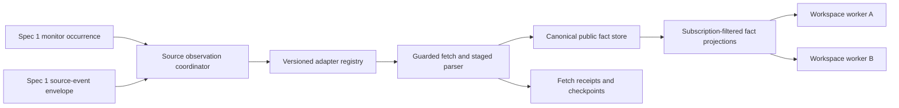

# Spec 3: Versioned public-source adapters and canonical facts

Status: Draft for implementation after Specs 1 and 2

Date: 2026-08-14

Product target: `NORTH_STAR.md`

Dependencies:

- `specs/01-independent-workspace-runtimes.md`
- `specs/02-versioned-strategy-packs.md`

Reference adapters:

- SEC EDGAR latest-filings Atom
- House Clerk financial-disclosure index and PTR documents

## Plain-language objective

Give Eve one safe, repeatable way to turn different public sources into bounded,
structured facts that strategy agents can monitor.

Spec 1 decides **when** a workspace runs and how it receives alerts. Spec 2
defines **which strategy recipe** a workspace installs. This specification
defines **how public evidence is fetched, validated, deduplicated, normalized,
checkpointed, and delivered** regardless of whether the source is an Atom feed,
JSON API, ZIP/XML index, public PDF, or verified webhook.

A source adapter does not decide whether a fact is a good investment signal. It
only establishes what the source published, when Eve observed it, how it was
parsed, and how the same public item can be reused safely without mixing
workspace state.

## How to use this specification

Implement only after Spec 1's polling and source-event contracts and Spec 2's
pack/source-reference contracts pass. Reuse their monitors, runs, budgets,
capabilities, source fencing, worker isolation, and pack catalog.

Every implementation task is a checklist item. Complete the sprints in order.
Do not treat a successful HTTP response as a complete source check until the
adapter proves coverage and commits a durable fact/checkpoint transaction.

## Goal and acceptance experience

The completed platform must support this scenario:

1. A `Congressional Signals` workspace and another authorized workspace both
   subscribe to the official House financial-disclosure source.
2. Spec 1's scheduler creates a due occurrence. The source layer downloads the
   current House yearly ZIP once, within strict public-origin and byte limits.
3. The House adapter safely extracts the XML index, compares DocIDs with its
   durable checkpoint, and discovers one new Periodic Transaction Report.
4. It downloads that exact public PTR PDF, validates and parses it into one
   canonical filing fact and bounded transaction facts with source provenance.
5. The source is not fetched or parsed twice merely because two workspaces
   subscribe. Each authorized monitor receives only the fact IDs it subscribed
   to, then performs its own isolated strategy evaluation.
6. Replaying the poll, webhook, worker, or delivery produces no duplicate facts,
   strategy calls, alerts, or checkpoint advancement.
7. A malformed ZIP, unsafe archive entry, incomplete XML, invalid PDF, ambiguous
   table, or uncertain fetch is quarantined or retried without claiming complete
   coverage or losing the discovered document.

## Agreed product decisions

- [ ] Source scheduling, leases, worker dispatch, source-event ingress, budgets,
  and alerts remain Spec 1 responsibilities.
- [ ] Pack installation and source-adapter references remain Spec 2
  responsibilities.
- [ ] Source adapters are reviewed application code registered by stable ID and
  version. A strategy pack may reference an adapter but cannot supply executable
  adapter code.
- [ ] Adapters produce public facts, not investment signals, scores, alerts,
  orders, or workspace prose.
- [ ] Prefer direct authoritative sources. Derived providers are explicit
  enrichment or fallback sources and never silently replace a primary source.
- [ ] A public source may be fetched once and reused across subscriptions only
  when its fact is source-global and contains no workspace or owner data.
- [ ] Canonical fact reuse does not grant cross-workspace access. Each monitor
  receives only facts matching its declared adapter, source, filter, and access
  policy.
- [ ] The raw public document may be processed ephemerally. This specification
  does not introduce owner-private artifacts or require permanent raw-document
  storage.
- [ ] Facts remain bounded structured records with canonical public URLs,
  hashes, extraction metadata, and correction lineage.
- [ ] Polling and push normalize through the same adapter/fact contract. A
  webhook is another observation path, not a second fact model.
- [ ] Do not build a generic crawler or unrestricted browser. Every adapter has
  reviewed origins, paths, request shapes, rate limits, and response formats.
- [ ] Model-assisted public-document extraction, if needed after deterministic
  parsing, runs as a bounded typed worker with fixtures and never determines
  authorization, checkpoint completeness, or source identity.
- [ ] House coverage is the first complex reference. Senate ingestion remains
  outside this specification.

## Vocabulary

| Term | Meaning |
| --- | --- |
| Source adapter | Reviewed application code that fetches or accepts one source family and emits canonical public facts. |
| Adapter version | Immutable version of the adapter's configuration, transport, parsing, and fact-output contract. |
| Source instance | One validated adapter configuration, such as the House Clerk 2026 financial-disclosure index. |
| Observation | One bounded attempt to inspect a source through polling or an authenticated source event. |
| Fetch receipt | Durable record of request identity, coverage, response metadata, stage outcome, and retry safety without response bodies. |
| Canonical public fact | Bounded source-global structured evidence with immutable identity, provenance, timing, schema, and content hash. |
| Fact projection | A subscription-filtered bounded view delivered to one workspace monitor. |
| Checkpoint | Adapter-owned durable cursor/watermark proving which source state has been safely captured. |
| Coverage | Explicit status showing whether every required stage/source in the evaluation window completed. |
| Extraction | Deterministic or bounded typed conversion of a public document into structured source fields. |

## Scope

### In scope

- A versioned source-adapter definition and registry.
- Adapter-specific configuration schemas and exact origin/path policies.
- Guarded HTTP fetching, conditional requests, redirects, timeouts, byte limits,
  content signatures, compression limits, and respectful rate limiting.
- Polling and Spec 1 `SourceEventEnvelope` normalization through one contract.
- Durable observations, stage receipts, checkpoints, facts, corrections, and
  subscription delivery receipts.
- Bounded RSS, Atom, JSON, XML, ZIP, and public-PDF processing contracts.
- Safe multi-stage acquisition such as ZIP → XML index → exact PTR PDF → facts.
- Source-global fetch coalescing and fact deduplication where safe.
- Per-monitor fact filtering and isolated projection.
- SEC Atom as the simple reference and House Clerk disclosures as the complex
  public-document reference.
- Deterministic fixtures, Redis race tests, and read-only live smoke tests.

### Out of scope

- Strategy thesis, signal scoring, recommendations, portfolio sizing, or order
  proposals.
- Congressional member tiers, committee relevance, disclosure-lag scoring, or
  clustering.
- Insider routine/opportunistic classification or cluster detection.
- General web crawling, arbitrary URL fetching, search-engine monitoring, or
  social-media scraping.
- Senate eFD ingestion, Capitol Trades scraping, or paid congressional APIs.
- Production use of paid source providers.
- Private files, authenticated owner documents, private artifacts, or private
  broker/provider results.
- Permanent storage of every raw ZIP, XML, PDF, feed, or HTTP body.
- OCR/model extraction as an unverified source of truth.
- Cross-workspace promoted strategy signals; Spec 6 owns that layer.
- A remote source-adapter marketplace or pack-supplied executable integrations.
- Additional schedulers, cron systems, webhooks, or alert protocols beyond Spec 1.

## Non-negotiable invariants

- [ ] An adapter ID or source URL supplied by a model never grants network
  access. The runtime resolves reviewed source configuration from authenticated
  monitor and pack state.
- [ ] Every outbound request is constrained by adapter-owned scheme, host, port,
  path, method, headers, redirect policy, response types, and byte limits.
- [ ] DNS/private-network and redirect checks remain in force for every request
  hop. Source configuration cannot weaken the shared SSRF boundary.
- [ ] Every observation, fetch stage, fact, checkpoint, subscription projection,
  and delivery has a durable idempotency key.
- [ ] A checkpoint advances only after required facts and stage receipts are
  durably committed or responsibility for later stages is durably transferred to
  an idempotent child record.
- [ ] A successful status code does not prove complete coverage. Truncation,
  parser ambiguity, schema mismatch, missing pages, or failed child documents
  remain explicit incomplete outcomes.
- [ ] Duplicate polling, webhooks, workflow replay, and concurrent subscribers
  cannot create duplicate canonical facts or repeated paid/model extraction.
- [ ] Shared facts contain public source data only. Workspace instructions,
  findings, notes, budgets, private results, and identities never enter the fact
  store.
- [ ] Facts are immutable except through explicit correction/supersession
  records. Updated source data never rewrites the historical observation.
- [ ] Published, updated, effective, transaction, filing, and observed times are
  kept distinct. Missing source times are never replaced silently with fetch
  time.
- [ ] Exact monetary values are never inferred from disclosed ranges. Unknown,
  illegible, or ambiguous fields remain typed unknowns with extraction status.
- [ ] Model extraction receives only the one bounded public document and target
  schema. It cannot access workspace histories, unrelated tools, or other facts.
- [ ] Logs and metrics never contain source URLs, query values, fact payloads,
  public-person names, document IDs, content hashes, workspace IDs, or owner IDs.

## Target architecture

Spec 1 owns occurrences and workers. Spec 3 may coalesce the public fetch, but
each workspace worker remains isolated and evaluates the resulting fact under
its own pack, brief, capabilities, and budget.

## Source-adapter definition

`PublicSourceAdapterDefinition` includes:

- stable adapter ID and exact semantic version;
- immutable implementation/configuration/fact-schema digest;
- source classification and authority level;
- bounded source-instance configuration schema;
- allowed request origins, paths, methods, content types, and redirect policy;
- minimum cadence, rate/concurrency limits, timeout, response-byte limit, and
  optional conditional-request support;
- polling stages and/or supported source-event types;
- checkpoint and canonical-fact schema versions;
- deterministic parser/extractor IDs and versions;
- correction/retraction behavior; and
- required deterministic fixture suite.

- [ ] Register adapters through an application-owned typed registry. Packs and
  models reference IDs only.
- [ ] Make an existing adapter version immutable. Behavior or schema changes
  require a new version plus an explicit compatibility/migration decision.
- [ ] Validate every source instance before it can be saved in a pack or monitor.
- [ ] Reject arbitrary headers, cookies, credentials, query templates, methods,
  URL fragments, and origins unless the adapter explicitly owns them.
- [ ] Distinguish primary, derived, enrichment, and fallback authority. Preserve
  that classification on every fact.
- [ ] Require at least positive, no-change, malformed, oversized, partial,
  replay, correction, and forbidden-origin fixtures for every production adapter.

## Adapter execution contract

The runtime calls a reviewed adapter with a typed observation request containing
only source-instance ID, adapter version, observation ID, evaluation window,
prior checkpoint revision, conditional metadata, and bounded runtime auth.

The adapter returns a typed `SourceObservationResult`:

- `complete`, `no_change`, `partial`, `retryable_failure`, or
  `terminal_failure` status;
- every attempted stage and its receipt ID;
- candidate facts and correction/retraction relationships;
- next checkpoint proposal and coverage evidence;
- conditional response metadata safe to retain; and
- bounded error codes and retry hints.

- [ ] Keep adapter network and parsing code outside model-visible tools. Workers
  receive facts, not arbitrary fetch authority.
- [ ] Make every stage abortable and propagate Spec 1 run cancellation without
  treating cancellation as complete coverage.
- [ ] Retry only explicitly retryable, idempotent stages and preserve backoff,
  rate-limit, and `Retry-After` semantics.
- [ ] Never automatically switch to a derived provider after a primary-source
  failure. Fallback use is explicit in source configuration and provenance.
- [ ] Bound arrays, strings, nesting, record counts, child fetch counts, and
  total bytes across the entire observation, not only each response.
- [ ] Make every declared maximum feed/page count fit the serialized durable
  record limits, or use deterministic lossless batching whose replay cannot
  skip or duplicate a record.
- [ ] Require child-stage fan-out to reserve run capacity before starting so one
  unusually large index cannot create unbounded fetch work.

## Guarded transport and format rules

### HTTP

- [ ] Permit HTTPS only except explicitly fixture-owned local test transports.
- [ ] Revalidate DNS and destination policy for every redirect and connection.
- [ ] When an adapter declares an exact URL fence, reject every redirect response
  before following it or making a second outbound request.
- [ ] Send a reviewed identifying user agent where the source requests one.
- [ ] Support `ETag` and `Last-Modified` only as optimization metadata; a `304`
  maps to no-change only for the exact same source instance/checkpoint.
- [ ] Read response bytes through a streaming cap before decompression, decoding,
  or parsing.
- [ ] Validate declared content type and file signature where available.

### ZIP and compressed input

- [ ] Limit compressed bytes, total uncompressed bytes, file count, per-entry
  bytes, nesting, and compression ratio.
- [ ] Reject encrypted archives, nested archives unless explicitly required,
  absolute paths, `..`, symlinks, devices, and unexpected entry names/types.
- [ ] Extract in memory or an isolated temporary directory with deterministic
  cleanup; never into the repository or a workspace sandbox.
- [ ] Parse only adapter-declared entries and treat missing/duplicate expected
  entries as incomplete coverage.

### XML, JSON, and feeds

- [ ] Disable DTDs, external entities, XInclude, and network resolution.
- [ ] Bound tokens, depth, attributes, text, entries, and total parsed records.
- [ ] Reject duplicate keys where their interpretation would be ambiguous.
- [ ] Preserve source identifiers and timestamps as strings until validated by
  schema-specific parsers.

### Public PDF

- [ ] Require HTTPS, adapter-approved paths, PDF signature, bounded bytes/pages,
  and timeout before extraction.
- [ ] Prefer deterministic text/table extraction with layout-specific fixtures.
- [ ] Mark scanned, password-protected, corrupt, truncated, or ambiguous tables
  as explicit extraction states.
- [ ] If bounded model extraction is enabled, validate its structured output
  against the same schema and require confidence/coverage fields; never accept
  invented rows or silently fill illegible values.
- [ ] Keep the canonical public URL and document hash. Raw PDF retention is not
  required by this specification.

## Durable source records

### Source instance

`PublicSourceInstance` contains adapter ID/version/digest, validated public
configuration, authority, active status, checkpoint revision, cadence bounds,
and created/updated revisions. Credentials and workspace subscriptions are not
embedded.

### Observation and stage receipts

`SourceObservation` and `SourceFetchReceipt` contain:

- deterministic observation and stage IDs;
- source instance and adapter version;
- occurrence/event and evaluation window;
- conditional metadata revision;
- request policy identifier, response status/type/byte count, and timing;
- parser/extractor ID/version and coverage counts;
- outcome, bounded error code, retry eligibility, and uncertainty state; and
- proposed/committed checkpoint and fact IDs.

They do not contain response bodies, full URLs, request headers, public-person
names, or extracted fact payloads.

### Canonical public fact

`CanonicalPublicFact` contains:

- immutable fact ID and schema version;
- adapter ID/version/digest and source-instance ID;
- source-native stable ID plus canonical public URL reference;
- authority classification;
- published, updated, effective, filed, transaction, and observed times when
  present, without conflating them;
- bounded typed payload and normalized entity references where deterministically
  known;
- source/document content hash and extraction method/version/status;
- correction, supersession, or retraction lineage; and
- first/last observation metadata and revision.

- [ ] Derive fact identity from source authority, source-native identity, fact
  schema, and stable row/subdocument identity—not model prose or array order.
- [ ] Keep observation, publication, update, and other source-version timestamps
  out of canonical fact identity unless the reviewed source contract defines one
  as part of its source-native identity.
- [ ] Validate semantic relationships among canonical IDs, source-native IDs,
  parent/child or amendment lineage, and canonical URL paths; field-shape
  validation alone is insufficient.
- [ ] Store a new revision/lineage record for materially changed source content.
- [ ] Keep unverified entity/ticker matches explicit. A strategy may decline to
  score an unresolved fact.
- [ ] Enforce strict serialized byte and field-count ceilings per fact schema.

### Checkpoint

`PublicSourceCheckpoint` contains adapter/source identity, schema version,
opaque bounded cursor/watermark state, conditional request metadata, complete
coverage window, committed fact IDs/counts, and revision.

- [ ] Commit checkpoint and required fact/child-stage responsibility atomically.
- [ ] Claim fact identity and commit its outcome/checkpoint through one atomic or
  explicitly recoverable protocol so a crash cannot strand the identity,
  duplicate the fact, or skip checkpoint advancement.
- [ ] Do not treat an in-memory seen set as authoritative.
- [ ] Support initial baseline without alerting on the complete historical source.
- [ ] Detect checkpoint schema/version mismatch and require an explicit adapter
  migration or safe rebaseline plan.

## Public fact reuse and subscription isolation

`SourceFactSubscription` maps an exact adapter/source/filter contract to one
workspace monitor. It does not copy workspace identity into canonical facts.

- [ ] Coalesce an observation only when adapter version, source instance,
  evaluation window, checkpoint revision, and access classification are
  identical and source-global.
- [ ] Create one canonical fact and separate idempotent projection receipts for
  each matching subscription.
- [ ] Apply deterministic adapter-owned filters before projection; never invoke a
  model to decide which workspaces may see a fact.
- [ ] Include only fact IDs and bounded projections in worker envelopes. Workers
  fetch the exact authorized fact through scoped runtime auth.
- [ ] A workspace cannot enumerate subscribers, facts outside its filters, or
  other workspaces' consumption/checkpoint state.
- [ ] Strategy findings remain workspace-owned and never flow backward into the
  canonical source store.

## Polling and source-event integration

- [ ] Spec 1's dispatcher remains the only recurring schedule trigger. Adapters
  do not create their own cron jobs or timers.
- [ ] A polling occurrence resolves exact source instances and calls the
  observation coordinator through the Spec 1 run/idempotency contract.
- [ ] Spec 1's authenticated `SourceEventEnvelope` resolves an exact adapter and
  source instance before adapter-specific signature/payload normalization.
- [ ] The adapter converts polling and source events into the same fact identity,
  so observing one through both paths remains a duplicate observation.
- [ ] Source-event HTTP handling validates/authenticates/bounds/enqueues only; it
  never runs parsing models or strategy logic synchronously.
- [ ] A source event with missing order guarantees relies on source-native IDs,
  update times, and correction lineage rather than arrival order.
- [ ] Keep polling enabled as fallback until each push adapter has proven
  signature, replay, outage, renewal, and delivery behavior.

## Reference adapter A: SEC latest-filings Atom

Reuse the Spec 1 `IPO Filings` behavior as the simple reference:

- exact SEC official origin and identifying user agent;
- bounded Atom/XML response and disabled external entities;
- accession/form identity, published/updated/observed times, CIK, company name,
  file number, canonical filing URL, and content hash;
- initial baseline, new S-1, S-1/A update, malformed, oversized, stale,
  redirected, incomplete, duplicate, and live-read fixtures.

- [ ] Move source acquisition/normalization behind the adapter interface without
  changing Spec 1 or Spec 2 reference behavior.
- [ ] Prove the same accession observed through poll and fixture source event
  produces one fact.

## Reference adapter B: House financial disclosures

The authoritative House Clerk source is a polling-only, two-stage public source.

### Index stage

- URL family:
  `https://disclosures-clerk.house.gov/public_disc/financial-pdfs/{YEAR}FD.zip`
- poll default: every six hours, owner-configurable only within reviewed cadence
  and budget bounds;
- archive content: one expected year-specific XML index plus optional text form;
- relevant record: `FilingType=P` Periodic Transaction Report; and
- source-native identity: filing year plus House `DocID`.

- [ ] Validate requested year, exact path, ZIP signature, archive bounds, expected
  entry name, and safe XML before record parsing.
- [ ] Preserve member name components, state/district, filing date, filing type,
  year, and DocID exactly as source fields.
- [ ] Initial setup stores the current PTR DocID baseline without treating all
  historical reports as new signals.
- [ ] A new DocID durably creates a document-stage job before the index checkpoint
  can advance past responsibility for that filing.

### PTR document stage

- URL family:
  `https://disclosures-clerk.house.gov/public_disc/ptr-pdfs/{YEAR}/{DOC_ID}.pdf`;
- one canonical filing fact per DocID; and
- zero or more bounded transaction facts per parsed table row.

Each transaction fact preserves:

- owner code and normalized known meaning when present;
- asset description, reported ticker, and asset-type code without guessing;
- reported transaction type;
- transaction date and notification/filing date;
- amount-range label plus exact lower/upper bounds when the bracket is known;
- capital-gains disclosure when present;
- row identity, extraction status, document URL, document hash, and provenance.

- [ ] Never convert a range midpoint into a reported exact amount.
- [ ] Do not infer that a ticker-like string is the correct listed security when
  the source text is ambiguous.
- [ ] If some rows parse and others are ambiguous, retain a `partial` filing fact
  and do not present the filing as completely normalized.
- [ ] A document parse failure remains a durable retryable/terminal child state;
  it does not cause repeated index discovery or silent loss.
- [ ] Corrections or changed PDFs create explicit fact revisions linked to the
  original DocID/row facts.

### House adapter fixtures

- [ ] Baseline ZIP with non-PTR and PTR records.
- [ ] One newly added PTR DocID.
- [ ] Duplicate index poll and concurrent observation.
- [ ] ZIP bomb, path traversal, duplicate XML, wrong year, malformed XML, and
  oversized index.
- [ ] Valid text PDF, multi-page/multi-row PDF, no-transaction PDF, amended PDF,
  scanned PDF, corrupt PDF, ambiguous ticker, unknown amount bracket, and partial
  table extraction.
- [ ] Child PDF transient failure followed by safe retry without index replay.
- [ ] Two subscribed workspaces receive isolated projections from one fetch/fact.
- [ ] Read-only live smoke downloads the current index and one explicitly selected
  public PTR without generating a strategy signal or alert.

## Failure and recovery contracts

- [ ] Uncertain HTTP completion before bytes: record uncertainty and retry only
  when the adapter proves the request is read-only and idempotent.
- [ ] Truncated/oversized body: abort before parse, record incomplete coverage,
  and never advance checkpoint.
- [ ] Parser/extractor crash: preserve fetch receipt/document hash and retry the
  bounded parser without refetch when safe within the active run; otherwise
  restart idempotently.
- [ ] Fact commit succeeds but checkpoint commit is uncertain: reconcile by fact
  and observation IDs before refetching or projecting.
- [ ] Projection delivery is uncertain: quarantine the projection receipt; do not
  duplicate strategy work blindly.
- [ ] Adapter version removed/blocked: stop new observations and projections,
  preserve facts/checkpoints, and require explicit migration or rollback.
- [ ] Source schema drift: mark adapter degraded, retain raw response metadata but
  not body, and fail closed until fixtures/parser are updated.
- [ ] Primary source unavailable: report degraded coverage. Never manufacture a
  no-change result or silently substitute a derived source.

## Implementation sprints

### Sprint 0 — contracts and failing fixtures

- [ ] Define versioned schemas/state diagrams for adapter, source instance,
  observation, stage receipt, fact, checkpoint, subscription, projection, and
  correction lineage.
- [ ] Define complete/no-change/partial/retryable/terminal/uncertain semantics.
- [ ] Add failing tests for origin escape, redirect/DNS escape, response limits,
  archive attacks, XML entities, parser ambiguity, duplicate observation,
  checkpoint uncertainty, schema drift, and cross-workspace fact access.
- [ ] Exercise exact-fence redirects, timestamp-independent identity,
  maximum-count durability, crash/replay recovery, and actually overlapping
  concurrent observations through the production observation caller; sequential
  helper fixtures are supporting evidence only.
- [ ] Add SEC and House fixture corpora with exact expected facts and coverage.
- [ ] Define low-cardinality error codes, retention, feature flags, and rollback.

Exit gate:

- [ ] Every allowed/forbidden transition and transport/parser failure is captured
  by a deterministic failing test before runtime implementation.

### Sprint 1 — adapter registry and guarded execution

- [ ] Implement adapter/source-instance schemas, registry, immutable versions,
  digest checks, and configuration validation.
- [ ] Implement the shared guarded HTTP executor and aggregate observation limits.
- [ ] Implement bounded RSS/Atom, JSON, XML, ZIP, and PDF input primitives.
- [ ] Add respectful rate/concurrency limits, conditional requests, cancellation,
  retry classification, and source authority metadata.
- [ ] Expose no model-facing arbitrary fetch surface.

Exit gate:

- [ ] Only a reviewed adapter/source instance can perform a request, and every
  format/transport attack fixture fails before unsafe parsing or network escape.

### Sprint 2 — canonical facts, checkpoints, and reuse

- [ ] Implement observation/stage receipts, fact and checkpoint stores, indexes,
  correction lineage, and compare-and-set commits.
- [ ] Implement initial baseline and atomic checkpoint/fact responsibility.
- [ ] Implement safe observation coalescing and source-global fact deduplication.
- [ ] Implement subscription filtering, scoped fact retrieval, and projection
  receipts.
- [ ] Complete Redis race, replay, checkpoint uncertainty, and isolation tests.

Exit gate:

- [ ] Concurrent subscribers and replay produce one canonical fact/checkpoint and
  one isolated projection per matching subscription without data loss.

### Sprint 3 — multi-stage public documents

- [ ] Implement bounded child-stage job/responsibility records.
- [ ] Implement safe ZIP extraction, XML index parsing, exact PDF retrieval, and
  deterministic PDF table extraction primitives.
- [ ] Add typed partial/ambiguous extraction and optional bounded model-extractor
  interface behind a disabled-by-default capability.
- [ ] Ensure child-stage retries do not redetect or duplicate parent records.
- [ ] Complete archive/document attack, partial, retry, correction, and resource
  budget tests.

Exit gate:

- [ ] A multi-stage source can safely advance its index while retaining durable
  responsibility for every discovered child, and ambiguous documents never look
  complete.

### Sprint 4 — Spec 1 polling and source-event integration

- [ ] Route due source observations through Spec 1 occurrence, lease, run, and
  budget contracts.
- [ ] Route authenticated Spec 1 source events through adapter normalization and
  the same canonical fact identity.
- [ ] Add polling/event duplicate, reordering, correction, fan-out, cancellation,
  and quarantine tests.
- [ ] Add source health and projection status to Spec 1 monitor management.
- [ ] Preserve polling fallback and independent kill switches.

Exit gate:

- [ ] Polling and source events create identical facts and wake exact subscribed
  workspaces through one idempotent path without strategy logic in ingress.

### Sprint 5 — reference adapters and production hardening

- [ ] Move SEC Atom behavior behind the versioned adapter without regression.
- [ ] Implement the House index/PTR adapter and every fixture above.
- [ ] Verify two workspaces reuse one House observation while remaining isolated.
- [ ] Run deterministic suites, Redis races, typecheck, Eve build, application
  build, SEC live read, and House index/PTR read-only smoke.
- [ ] Deploy behind adapter, fact-reuse, multi-stage, and live-source flags with
  rollback evidence.
- [ ] Update `HANDOFF.md`, `NORTH_STAR.md`, and `BACKLOG.md` only with implemented
  facts and completing commits.

Exit gate:

- [ ] SEC Atom and House ZIP/XML/PDF sources produce correct bounded canonical
  facts under replay, concurrency, failure, and live-read conditions without
  emitting strategy signals.

## Planned code areas

- `agent/lib/public-source-adapter-schema.ts`: adapter/source/result contracts.
- `agent/lib/public-source-adapters.ts`: reviewed immutable adapter registry.
- `agent/lib/public-source-http.ts`: origin-fenced bounded HTTP execution.
- `agent/lib/public-source-formats.ts`: bounded feed/JSON/XML/ZIP/PDF primitives.
- `agent/lib/public-source-observation-store.ts`: observations and stage receipts.
- `agent/lib/canonical-public-fact-store.ts`: facts, revisions, and lineage.
- `agent/lib/public-source-checkpoint-store.ts`: atomic checkpoints.
- `agent/lib/source-fact-subscriptions.ts`: filtering and scoped projections.
- `agent/lib/source-adapters/sec-latest-filings.ts`: SEC Atom reference.
- `agent/lib/source-adapters/house-financial-disclosures.ts`: House reference.
- `agent/channels/public-source-observer.ts`: Spec 1 run integration.
- `scripts/verify-public-source-adapters.mjs`: deterministic and attack fixtures.
- `evals/public-sources/`: runtime behavior and isolation evals.

Do not duplicate Spec 1's scheduler/monitor/worker/alert stores or Spec 2's pack
catalog/binding. Do not use model history as a source checkpoint or fact store.

## Verification matrix

| Boundary | Required proof |
| --- | --- |
| Registry | Unknown, changed, blocked, or incompatible adapters cannot execute. |
| Network | Exact origin/path/method and every redirect/DNS hop remain public and reviewed. |
| Bounds | Aggregate bytes, records, child requests, decompression, parsing, and extraction are capped before unsafe work. |
| Formats | Archive traversal/bombs, XML entities, malformed feeds/JSON, and invalid PDFs fail closed. |
| Coverage | Success, no-change, partial, failure, and uncertainty cannot be confused. |
| Checkpoints | Facts or durable child responsibility commit before advancement; replay cannot skip or duplicate. |
| Fact identity | Poll, push, replay, and concurrent subscribers converge on one canonical fact and correction lineage. |
| Isolation | A workspace can retrieve only subscribed fact projections and cannot enumerate other consumption. |
| Provenance | Authority, source identity, canonical URL, times, adapter/extractor versions, hashes, and status survive. |
| SEC reference | Spec 1 IPO behavior remains unchanged behind the adapter. |
| House reference | ZIP/XML/PTR discovery, parsing, ranges, partials, corrections, and retries match fixtures. |
| Live smoke | Read-only SEC and House fetches observe limits and create no strategy signal or broker action. |

## Observability and operations

- [ ] Emit low-cardinality counts for observations, no-change, complete, partial,
  retryable, terminal, uncertain, fact created/revised, checkpoint committed,
  projection created/quarantined, schema drift, and adapter blocked.
- [ ] Never use source instance, URL, DocID, accession, ticker, public-person name,
  fact ID, hash, workspace ID, or owner ID as metric tags.
- [ ] Add owner-visible source health, last complete observation, next poll,
  checkpoint status, degraded reason, and pending child counts.
- [ ] Add operator reports for degraded adapters, uncertain observations,
  checkpoint mismatches, failed child documents, and quarantined projections
  without payload contents.
- [ ] Add independent kill switches for adapter execution, fact reuse,
  multi-stage documents, model extraction, source events, and each live adapter.
- [ ] Document how to rebaseline safely without alerting on all historical items
  and how to migrate/rollback an adapter version.

## Definition of done

- [ ] Every sprint exit gate passes.
- [ ] Packs can reference stable adapter/source IDs without gaining arbitrary
  network access.
- [ ] Polling, source events, workflow replay, and concurrent subscriptions
  produce canonical facts exactly once.
- [ ] Facts remain public, bounded, provenance-bearing, correction-aware, and
  independent of workspace state.
- [ ] Each workspace receives only its authorized subscription projection.
- [ ] SEC Atom passes all existing Spec 1 reference behavior after migration.
- [ ] House ZIP/XML/PTR ingestion passes deterministic, attack, partial, retry,
  correction, concurrency, and read-only live-smoke coverage.
- [ ] A malformed or uncertain child document cannot be lost or presented as a
  complete normalized filing.
- [ ] No strategy score, alert, recommendation, or broker action is produced by
  the source layer.
- [ ] All Specs 1 and 2 regressions, typecheck, Eve build, and application build
  remain green.
- [ ] Rollback stops new observations/projections without deleting facts,
  checkpoints, subscriptions, or recovery state.

## Follow-on specifications

1. [`Spec 4: Congressional Signals v1 — House PTRs`](04-congressional-signals-house.md).
2. [`Spec 5: Insider Clusters`](05-insider-clusters.md).
3. [`Spec 6: Typed shared-signal plane`](06-shared-signal-plane.md).
4. Cramer Inverse source acquisition and strategy pack.
5. Additional reviewed source adapters only when a selected strategy requires
   them.
