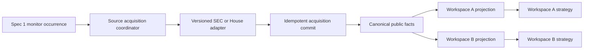

# Spec 3: Public-source adapters and canonical facts

Status: Ready for implementation after Specs 1–2

Current implementation base: `44128c6581296c7efebc1f8b37d783bcc407ecf2`

Product target: `NORTH_STAR.md`

Dependencies:

- `HANDOFF.md`
- `specs/01-independent-workspace-runtimes.md`
- `specs/02-versioned-strategy-packs.md`

First consumer: `specs/04-congressional-signals-house.md`

## Objective

Give Eve one channel-neutral way to acquire approved public sources, normalize
them into durable canonical facts, and deliver those facts independently to
subscribed workspaces.

This spec proves the architecture with two real adapters:

- the existing SEC latest S-1 Atom feed, migrated without user-visible
  regression; and
- House financial disclosures, from the official yearly index through selected
  PTR documents to canonical filing and transaction facts used by Spec 4.

Build the smallest production design that makes those two vertical paths work.
This is not a general scraping platform, webhook framework, document-AI system,
or exhaustive recovery project.

## Implementation workflow

This file is the authoritative progress ledger. Only the sprint checklists below
track completion; requirements elsewhere are intentionally not duplicated as
checkboxes.

For each sprint:

1. Read only the relevant current code and installed Eve/Next.js documentation.
2. Inspect the Eve registry before implementing an integration or parser.
3. Implement only that sprint.
4. Run its focused tests plus typecheck and the affected build when production
   code changed.
5. Update the sprint checklist with evidence, commit the sprint, and report the
   next sprint. Continue only when the owner says to continue.

Do not repeat whole-repository orientation or independent review between
sprints. Run one independent review and the broad regression suite at the final
exit gate. Production reads, deployment, flags, and external messages always
remain owner-authorized.

## Acceptance experience

When this spec is complete:

1. An approved source binding resolves to an immutable adapter version and
   validated source instance.
2. A Spec 1 monitor occurrence requests acquisition through the shared source
   coordinator rather than fetching inside strategy code.
3. The coordinator safely polls the source, commits an idempotent acquisition,
   and stores canonical facts before advancing the source cursor.
4. Two subscribed workspaces reuse the same acquisition and facts while
   receiving independent projections and delivery cursors.
5. SEC IPO monitoring still detects the same S-1 and S-1/A facts and produces
   the existing finding/alert behavior.
6. The House adapter observes the official index, retrieves a newly selected
   PTR, and emits sourced filing and transaction facts without inventing fields
   from unreadable content.
7. Spec 4 can consume House facts without downloading source documents,
   importing Photon code, or accessing another workspace.

## Scope

### In scope

- A small versioned adapter registry for reviewed production adapters.
- Validated source instances referenced by Spec 2 pack bindings and Spec 1
  monitors.
- Reuse of the existing guarded public-source transport, extended only where
  SEC and House require it.
- One source-global acquisition cursor and independent per-subscription delivery
  cursors.
- Idempotent acquisition commits, immutable canonical fact revisions, explicit
  correction lineage, and workspace-isolated fact projections.
- Migration of the existing SEC IPO path to the shared acquisition contract.
- Official House index ZIP/XML and selected PTR PDF ingestion.
- A bounded, representative House corpus that determines supported extraction
  behavior before the House fact schema is frozen.
- Low-cardinality health and failure state for operator and workspace-manager
  visibility.

### Out of scope for Spec 3

- Authenticated source-event/webhook ingress, WebSub, and push/poll parity. Keep
  the adapter boundary compatible with a future event trigger, but implement it
  only when a selected production source has a real push contract.
- Model or OCR extraction. Non-text or ambiguous PDFs return bounded partial or
  unsupported results; they never become confident facts.
- Generic RSS, JSON, HTML, CSV, XML, ZIP, or PDF features not used by the SEC or
  House reference adapters.
- Arbitrary URLs, user-authored adapters, general crawling, browser automation,
  or third-party congressional providers.
- Strategy scoring, signal ranking, alert wording, or channel-specific UI and
  delivery. Specs 1 and 4 own those concerns.
- Paid sources, account-linked sources, credentials, broker access, orders, or
  trade actions.
- Exhaustive crash matrices, every Redis race, DNS pinning/rebinding defense,
  long-term archive replay, and generalized quarantine/operator reports. Track
  these as deferred hardening after the ordinary vertical paths work.

## Architectural boundary

The adapter, acquisition, fact, and projection layers must not import Photon,
chat-session state, alert presentation, or channel destinations. A future web,
Telegram, or other channel uses the same workspace facts through its own
adapter; source ingestion is not rebuilt.

Spec 1 remains authoritative for monitor schedules, occurrences, isolated
workers, budgets, findings, and alerts. Spec 2 remains authoritative for pack
catalog, pack versions, bindings, and source contracts. Spec 3 adds only the
source acquisition and fact plane they need.

## Production contracts

### Adapter definition and source instance

Each registered adapter has an `adapterId`, semantic `adapterVersion`, immutable
definition digest, supported source-instance schema, acquisition method, output
fact schemas, and bounded limits. Only reviewed registry entries can execute.

A source instance contains the adapter identity and digest, validated immutable
configuration, exact authority/origin, cadence bounds, current acquisition
cursor revision, and lifecycle state. Pack and monitor records store a resolved
source-instance reference and configuration digest rather than an arbitrary URL.

Routine parser fixes that preserve canonical behavior may increment an internal
implementation revision. Changes to source configuration, fact identity,
payload meaning, or correction behavior require a new adapter or fact-schema
version and an explicit migration.

### Acquisition result

One acquisition returns a typed result with:

- `complete`, `no_change`, `partial`, `retryable_failure`,
  `terminal_failure`, or `uncertain` status;
- source instance, adapter version/digest, acquisition ID, observed time, and
  bounded stage receipts;
- candidate fact revision IDs and correction IDs;
- complete/partial coverage state with a fixed error code when applicable; and
- a proposed next source cursor only when coverage is complete enough to prove
  that advancing cannot skip facts.

Partial, retryable, terminal, and uncertain outcomes do not advance the source
cursor. Empty is a valid complete result; malformed input is not empty.

### Minimal commit protocol

The source-global acquisition journal is the recovery authority. It records
`prepared` then `committed` for one source instance, expected cursor revision,
adapter digest, window, fact revision IDs, correction IDs, and proposed cursor.

The production commit order is:

1. create or replay the deterministic `prepared` journal;
2. idempotently write immutable fact revisions and correction links;
3. mark the journal `committed` and compare-and-set the source cursor; and
4. make the committed acquisition discoverable to subscriptions.

A replay of a prepared journal completes the same writes. A cursor conflict
reloads committed state and either reuses the matching acquisition or starts a
new one; it never overwrites a newer cursor. Prove the normal retry boundary and
one interrupted-before-cursor recovery case. Exhaustive crash/race coverage is
deferred.

### Canonical facts and corrections

Each canonical fact has:

- a stable logical key derived from adapter, source instance, source-native ID,
  fact schema, and stable row identity;
- an immutable revision ID derived from the logical key and canonical payload
  digest;
- schema version, normalized payload, public provenance, source event times,
  extraction state, and fixed creation observation; and
- no workspace, owner, monitor, channel, strategy score, or alert fields.

Changing observation metadata stays on acquisition/lineage records rather than
mutating the fact. A changed payload creates a new revision connected by an
explicit correction or supersession record. Re-observing identical content
reuses the existing revision.

### Reuse and workspace delivery

The acquisition cursor belongs to the source instance. Each subscription has an
independent delivery cursor scoped to the workspace, monitor, pack binding,
source instance, adapter/fact-schema version, and optional validated filter.

One due monitor may trigger acquisition; other due monitors join or reuse the
same committed acquisition. Coalesce only an identical source instance, adapter
digest, acquisition window, access class, and expected cursor revision. Another
acquisition is allowed when those differ.

Projection writes are idempotent per subscription and fact revision. A
subscription cursor advances only after all matching projections are durable.
Workspace workers receive only authorized projections and cannot enumerate
global facts, source documents, or another workspace's subscriptions.

Existing SEC pack bindings and monitors require a compatibility migration from
their current source/checkpoint fields to resolved source-instance and
subscription records. Until verified, the current SEC path is the rollback path
and the new acquisition flag remains off.

## Transport and parsing rules

- Adapter execution accepts only registry-resolved HTTPS public-government
  source instances; model output and workspace input cannot supply destinations.
- Reuse Spec 1's timeouts, body bounds, SEC user-agent policy, exact-origin
  redirect fence, and sanitized errors. Do not build a second HTTP client.
- For House binary responses, stream with byte limits before buffering and
  validate expected content type/magic where available.
- ZIP handling rejects path traversal, duplicate expected entries, excessive
  entry counts/expanded bytes, and unreasonable compression ratios.
- XML parsing disables DTD/external entities and applies nesting, node, and text
  bounds.
- PDF processing applies byte, page, text, and execution-time bounds. Temporary
  files, if required, are isolated and removed after the attempt.
- Raw response bodies and extracted document text are ephemeral. Durable records
  retain digests, bounded stage metadata, safe public provenance, canonical
  facts, and extraction state.
- Logs and metrics use fixed codes and never include response bodies, extracted
  text, member names, document IDs, tickers, URLs, workspace IDs, owner IDs, or
  credentials.

## Reference adapter: SEC latest S-1 filings

The SEC adapter preserves the reviewed current behavior:

- official latest-filings Atom URL and SEC fair-access user agent;
- S-1 and S-1/A normalization, accession/CIK identity, amendment linkage,
  timestamps, and canonical public filing URL;
- baseline without retroactive alerts, then new/amended filing detection; and
- existing finding and Photon alert presentation through Spec 1, outside the
  adapter.

The new adapter must produce the same canonical SEC facts from current fixtures
before its live flag can replace the existing worker fetch/evaluator path.

## Reference adapter: House financial disclosures

### Feasibility and corpus gate

Before freezing the House schema, select Node/Eve-compatible ZIP and PDF
libraries or a deployed runtime already available to the project. Prove the
chosen stack in the compiled Eve build against a bounded checked-in corpus based
on real public House layouts, including:

- yearly index ZIP/XML;
- text PDFs with one and multiple transaction rows;
- multi-page and amended filings;
- a no-transaction filing; and
- scanned, malformed, or ambiguous documents that must produce partial or
  unsupported states without invented rows.

Record the observed support matrix and chosen v1 boundary. OCR/model extraction
is not required to turn unsupported layouts into complete ones.

### Index stage

The source instance resolves the official yearly House disclosure index. Safely
extract the expected XML, normalize PTR index rows, and ignore non-PTR filing
types for transaction ingestion.

A filing logical key uses year plus official DocID. A baseline records existing
rows without downstream live signals. Later acquisitions select only newly
observed or corrected PTR documents. Historical year transitions are explicit
source-instance changes, not arbitrary URL mutation.

### PTR document stage

Derive the exact official PTR URL from the validated index row, fetch the bounded
PDF, and emit:

- `house-ptr-filing/v1`: DocID/year, filer identity as disclosed,
  district/state, filing/amendment metadata, filing date, public document
  provenance, and extraction state; and
- `house-ptr-transaction/v1`: stable row identity, disclosed owner code, asset
  description, reported ticker when present, transaction type/date,
  notification date, disclosed amount bracket, capital-gains indicator, public
  provenance, and extraction state.

Amounts remain ranges, not exact values. Missing, illegible, or ambiguous fields
remain `unknown`; deterministic extraction never guesses. Transaction facts are
linked to their filing fact and retain stable row evidence for replay
deduplication and amendment correction.

## Sprint ledger

### Sprint 0 — reconcile WIP, contracts, and House feasibility

- [ ] Inspect existing uncommitted Spec 3 WIP against this revised scope; keep
  only aligned fixtures/contracts and report discarded or deferred pieces before
  changing them.
- [ ] Choose and prove the minimal ZIP/PDF stack in the compiled Eve environment
  using the House corpus and document the v1 support boundary.
- [ ] Define only the adapter, source-instance, acquisition journal/result,
  canonical fact revision/correction, subscription, and projection schemas used
  by the SEC and House verticals.
- [ ] Add deterministic positive and negative contract fixtures; the default
  suite remains green and negative fixtures pass by producing expected failures.
- [ ] Verify channel neutrality and the fixed error/log catalog.
- [ ] Run focused contract/feasibility tests, typecheck, affected build, update
  this ledger, and commit Sprint 0.

Exit: the deployed stack can read representative House inputs, and the minimum
contracts needed by both real adapters are executable. No production acquisition
path is required yet.

### Sprint 1 — acquisition kernel and SEC vertical

- [ ] Extend existing Spec 1/2 source contracts with reviewed registry and
  source-instance resolution rather than creating a parallel catalog.
- [ ] Implement the acquisition journal, idempotent fact revision/correction
  writes, source cursor compare-and-set, and interrupted-before-cursor replay.
- [ ] Implement the SEC adapter and prove parity for baseline, new S-1,
  amendment, no-change, malformed, and partial input.
- [ ] Keep the old SEC runtime path available behind the rollback flag.
- [ ] Run focused SEC/kernel tests, typecheck, Eve build, update this ledger, and
  commit Sprint 1.

Exit: the production caller completes one fixture-backed SEC acquisition and
persists equivalent canonical behavior without enabling production traffic.

### Sprint 2 — subscriptions, isolation, and SEC migration

- [ ] Extend pack bindings and monitors with resolved source-instance and
  subscription references, including migration for existing SEC records.
- [ ] Implement source-global acquisition reuse and independent per-subscription
  projections/delivery cursors.
- [ ] Prove two overlapping workspaces perform one eligible SEC acquisition,
  receive their own projections exactly once, and cannot read each other's data.
- [ ] Route the SEC workspace evaluator through authorized projections while
  preserving Spec 1 finding, alert, Discuss, and checkpoint behavior.
- [ ] Prove rollback, run focused integration tests, typecheck, affected builds,
  update this ledger, and commit Sprint 2.

Exit: SEC is a complete shared-acquisition-to-isolated-workspace vertical path.

### Sprint 3 — House index and PTR vertical

- [ ] Implement bounded House ZIP/XML index acquisition and
  baseline/new/corrected filing selection.
- [ ] Implement exact PTR retrieval and deterministic PDF extraction for the
  supported v1 corpus.
- [ ] Emit immutable House filing and transaction fact revisions with public
  provenance, range-preserving amounts, unknown/partial states, and corrections.
- [ ] Prove baseline, one new filing, multi-row, amendment, no-transaction,
  replay, partial/scanned, malformed ZIP/XML/PDF, and resource bounds.
- [ ] Run focused House tests, typecheck, Eve build, update this ledger, and
  commit Sprint 3.

Exit: a representative checked-in House PTR travels through the production
caller from index to canonical facts that meet Spec 4's input contract.

### Sprint 4 — runtime integration and operator visibility

- [ ] Route Spec 1 occurrences for SEC and House through the coordinator without
  adding a scheduler or channel dependency.
- [ ] Expose bounded adapter/source health, last complete acquisition, cursor
  state, partial/unsupported state, and subscription lag in the workspace
  manager without exposing global or private records.
- [ ] Add fixed counters for acquisition outcomes, fact revisions/corrections,
  reused acquisitions, projections, and fixed failure stages/codes.
- [ ] Prove disabled and partial flag configurations fail safely and do not
  regress ordinary Spec 1/2 behavior.
- [ ] Run focused runtime/manager tests, typecheck, affected builds, update this
  ledger, and commit Sprint 4.

Exit: both adapters participate in the normal runtime and can be diagnosed
without inspecting payloads or channel logs.

### Sprint 5 — final verification and controlled rollout

- [ ] Run one independent diff-scoped review of Sprints 0–4 and resolve only
  validated Spec 3 blockers; defer nonblocking hardening explicitly.
- [ ] Run focused adapter suites, Spec 1/2 regression suites, typecheck, Eve
  build, application build, and `git diff --check`.
- [ ] With owner authorization, run one read-only live SEC observation and one
  current House index plus explicitly selected PTR observation. Do not create a
  strategy signal, alert, Photon message, or paid call during source smokes.
- [ ] With owner authorization, enable the new SEC path first, verify parity and
  rollback, then enable House acquisition. Keep unrelated flags unchanged.
- [ ] Record production evidence and rollback state in `HANDOFF.md`, mark this
  spec complete, and commit the exit gate.

Exit: the acceptance experience is proven, Spec 4 has a stable House fact input,
and production can return to the pre-Spec path without data loss.

## Feature flags and rollout

Use the smallest flag set that supports rollback:

- shared adapter execution;
- source-global fact reuse/projection;
- SEC adapter live path; and
- House adapter live path.

All flags default off. An adapter requires shared execution/facts and complete
reviewed configuration. Partial or invalid configuration fails closed for that
adapter and cannot fall back to arbitrary fetch behavior. The old SEC path may
remain temporarily as an explicit rollback route, not an automatic error
fallback after a new-path acquisition starts.

## Completion contract

Spec 3 is complete only when every Sprint 0–5 item is checked with evidence and:

- SEC behavior is migrated without regression;
- House produces validated facts from the official source within the documented
  v1 extraction boundary;
- two workspaces reuse acquisition while remaining isolated;
- no channel-specific code exists in the source/fact plane;
- ordinary malformed, partial, replay, correction, and rollback paths work; and
- deferred hardening is filed in the appropriate later spec or `BACKLOG.md`
  before this spec is marked complete.

## Deferred follow-on work

- Spec 4 consumes House facts and owns congressional scoring and alerts.
- A later adapter with a documented push protocol may introduce authenticated
  source-event ingress and WebSub.
- Post-functional hardening may add exhaustive crash/race matrices, stale-claim
  recovery, DNS destination pinning, broader parser fuzzing, long-term archive
  replay, and generalized quarantine/operator tooling.
- Additional public-source formats or providers require a real product consumer
  and a separate reviewed adapter version.
