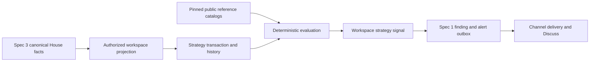

# Spec 4: Congressional Signals v1 — House disclosures

Status: Sprint 4 checklist complete; awaiting owner direction

Date: 2026-08-16

Product target: `NORTH_STAR.md`

Dependencies:

- `specs/01-independent-workspace-runtimes.md`
- `specs/02-versioned-strategy-packs.md`
- `specs/03-public-source-adapters.md`

Pack targets: foundational `congressional-signals@1.0.0`; committee-evidence revision
`congressional-signals@1.1.0`; history/cluster/correction revision
`congressional-signals@1.2.0`

## Objective

Build the first substantive research strategy on the completed workspace, pack,
and public-source platform. The strategy continuously evaluates official House
Periodic Transaction Report (PTR) facts, records an explainable priority
decision, and sends a neutral sourced alert when a filing deserves the owner's
attention.

This is a research triage tool, not a copy-trading bot. It does not infer intent,
wrongdoing, non-public knowledge, exact trade value, present holdings, or future
returns. It cannot place or authorize a trade.

## What the owner gets

1. The owner asks Eve to create a `Congressional Signals` session, monitor all
   House members or a selected set, and choose an alert threshold and schedule.
2. Spec 3 acquires official House filings once and projects authorized canonical
   facts into the strategy workspace.
3. The strategy evaluates each supported transaction once using a pinned,
   deterministic policy and evidence catalog.
4. A priority filing produces one compact alert with the member, disclosed owner
   relationship, security, direction, amount range, transaction and filing dates,
   disclosure lag, reasons, caveats, and official filing link.
5. **Discuss in Congressional Signals** opens the correct isolated session with
   bounded alert context. Other sessions and monitors continue independently.
6. Unsupported, ambiguous, stale, duplicate, baseline, and low-priority facts are
   recorded without a misleading alert.

## Implementation discipline

The sprint ledger is the only progress checklist. Complete it in order, update it
after verified work, commit one sprint at a time, and stop for owner direction.
Do not create a parallel plan or repeat independent review after every sprint.
Sprint 5 owns the one final independent review and broad regression pass.

Product viability comes before framework breadth. Sprint 0 first proves that the
current Spec 3 extractor produces non-empty transaction facts from a bounded
sample of real recent House PTRs. If it does not meet the gate below, stop and
finish the focused extraction compatibility slice before building this strategy.

## Scope

Version 1 includes:

- official House PTR filing and transaction facts from Spec 3;
- one versioned `congressional-signals` strategy pack;
- workspace-owned normalized transaction, history, cluster, signal, and
  correction records;
- official, effective-dated House member and committee context;
- a small reviewed security-to-industry and committee-jurisdiction catalog;
- deterministic eligibility and ordinal priority bands;
- historical baseline without retroactive alerts;
- same-member and same-committee disclosure clusters;
- natural-language and Spectrum configuration;
- neutral alerts through the existing Spec 1 outbox and channel adapter; and
- fixed low-cardinality health, outcome, and error reporting.

Version 1 excludes:

- Senate disclosures or any claim of complete congressional coverage;
- Capitol Trades, Quiver, FMP congressional feeds, or other derived sources;
- market-price, news, legislation, voting, valuation, or performance factors;
- subjective member tiers, accusation-oriented watchlists, or claims copied from
  the research notes;
- numeric alpha scores, multipliers, probabilities, or backtesting claims;
- exact portfolio reconstruction, returns, holdings, or transaction values;
- model/OCR extraction inside the strategy layer;
- generic rescoring infrastructure for old policy or catalog versions;
- cross-workspace signal convergence, which belongs to Spec 6; and
- investment advice, order sizing, broker access, or automatic trading.

The material in `idea/congressional-trading-signals.md` and
`idea/congressional-leaders-watchlist.json` remains research input only. It is
not a trusted runtime catalog and cannot affect a priority decision without a
separately reviewed primary-source record and a future policy revision.

## Architecture and ownership

- Spec 3 owns fetching, source provenance, canonical facts, corrections, and
  workspace projections. Spec 4 never downloads a filing or accepts an arbitrary
  source URL.
- Spec 4 owns the interpretation of authorized facts inside one workspace.
- Spec 2 owns pack installation, binding, configuration, and managed resources.
- Spec 1 owns schedules, workers, findings, alert delivery, Discuss, manager
  routing, isolation, and broker denial.
- Photon is the first delivery adapter, not part of the strategy or fact model.

Do not duplicate a source client, scheduler, monitor store, pack binding, alert
outbox, session router, or channel authorization path.

## Required source viability gate

The current Spec 3 boundary intentionally supports deterministic text-layer PTR
PDFs and returns `pdf_scanned_unsupported` for image-only documents. The latest
live PTR sampled during Spec 3 was image-only and produced no transaction rows.
A strategy that silently receives zero real transactions is not a working
product.

With explicit owner authorization, create and retain a bounded review corpus of
the newest 20 official current-year PTRs spanning at least 10 distinct members.
Classify each document independently as transaction-bearing, no-transaction,
unsupported, or malformed, then run the actual Spec 3 production parser.

The gate passes only when:

- at least 80% of the reviewed transaction-bearing documents produce one or more
  matching canonical `house-ptr-transaction/v1` facts;
- one retained official PTR with a verified transaction reaches the real Spec 3
  authorized projection and becomes one normalized Spec 4 transaction;
- no-transaction documents remain successful zero-row outcomes; and
- no unsupported, partial, or malformed document invents a transaction.

If the gate fails, stop Spec 4. Implement the smallest reviewed Spec 3 extraction
extension needed for the measured layouts, such as bounded OCR, prove the same
corpus again, and only then continue. Missing extraction can never be interpreted
as member inactivity or a low-priority disclosure.

## Data contracts

All records use strict schemas, stable IDs, bounded fields, owner/workspace
scope, creation time, and immutable version/digest references. The model may
explain validated records but cannot author identities, mappings, bands, reason
codes, or alert facts.

### Strategy transaction

One `HouseStrategyTransaction` records:

- source instance, canonical fact ID/revision, filing logical key, row identity,
  and public provenance;
- exact pack binding/version/digest and workspace projection identity;
- disclosed member fields plus canonical member resolution status;
- disclosed owner code/relationship without attributing intent;
- asset description, reported ticker, canonical security/industry resolution,
  and explicit ambiguity;
- transaction type, transaction date, filing date, observation time, calendar-day
  disclosure lag, and disclosed amount range;
- `baseline` or `live` processing mode;
- eligibility state and fixed reason codes; and
- correction/retraction lineage.

The disclosed amount remains a range. The implementation may compare published
range bounds but must never store a midpoint as an exact value.

### Reference catalogs

Application-owned, checked-in catalogs contain only the data needed by the
policy:

- official current House roster with Bioguide ID, public name, state, district,
  party, term/effective dates, primary-source provenance, version, and digest;
- official effective-dated committee and subcommittee assignments;
- reviewed committee-jurisdiction rules; and
- a bounded reviewed security/issuer-to-industry mapping used by fixtures and
  the initial live scope.

Unmapped members, securities, industries, or committee relationships remain
`unknown`. Broad committee language cannot make every security relevant. A
catalog is immutable by ID, version, and digest; the same ID/version with
different bytes fails closed. Catalog and policy digests are pinned by the pack
and copied into every affected transaction and signal.

The old watchlist is not migrated wholesale. Selected-member configuration uses
canonical Bioguide IDs, not research-authored tiers.

### Filing signal and factor trace

One `CongressionalFilingSignal` records:

- signal ID/revision, workspace, pack/policy/catalog versions and digests;
- filing logical key/revision plus its sorted constituent strategy transaction
  revisions and related cluster IDs;
- each transaction's eligibility and band plus the filing's highest
  `record_only`, `review`, or `priority` band;
- every evidence flag as `applied`, `unavailable`, or `not_applicable` with its
  fixed reason code and source record;
- strongest supporting evidence, important counterevidence, source freshness,
  and public provenance;
- alert eligibility and delivery identity; and
- correction/retraction lineage.

Signals and prior alerts do not change in place. Source corrections produce a
new revision. A policy or catalog behavior change requires a new pack version;
v1 does not retroactively rescore old history.

The filing signal is the alert aggregate. Its outbox identity is derived from
the workspace binding, filing logical key/revision, signal revision, and pinned
policy/catalog digests. A multi-row filing therefore sends at most one alert;
cluster evidence is context in the current filing's alert rather than a second
delivery.

## Deterministic policy v1

The policy produces an ordinal triage band, not an investment score.

### Eligibility

A transaction is eligible only when it has:

- a complete supported canonical transaction fact;
- a resolved canonical House member and security classification;
- a purchase or sale transaction type;
- valid transaction and filing dates with lag from 0 through 45 calendar days;
  and
- a security that is not a broad pooled/index fund or non-security asset under
  the pinned classification catalog.

All other facts are `record_only` with exact reasons such as unsupported source,
unresolved member, unresolved security, unclassified direction, invalid date,
stale disclosure, broad fund, non-security asset, duplicate, superseded, or
baseline. Unknown is never converted to buy, sell, relevant, or complete.

### Evidence flags

For an eligible live transaction:

- `timely`: disclosure lag is 0–15 days;
- `material_range`: the published lower bound is at least `$50,001`;
- `committee_relevant`: the member's assignment on the transaction date and the
  reviewed security-industry mapping produce exact relevance `yes`;
- `pattern_break`: adequate history proves at least one exact rule below;
- `same_member_cluster`: the transaction belongs to a qualifying same-member
  cluster; and
- `committee_cluster`: the transaction belongs to a qualifying committee
  cluster.

`pattern_break` requires at least 90 consecutive days of complete source
coverage and five prior eligible transactions for the member. It applies only
when the current amount range is strictly above every prior range, the mapped
industry was absent from that covered history, or the current direction was
absent from the five prior eligible transactions. Otherwise it is false or
`unavailable`; incomplete history is never evidence of a break.

### Bands

An eligible live transaction is `priority` when any one rule is true:

1. it belongs to a committee cluster;
2. it is committee-relevant and also material, a pattern break, or part of a
   same-member cluster; or
3. it is both timely and material.

It is `review` when it is not `priority` and at least one evidence flag is true.
It is otherwise `record_only`.

The default alert threshold is `priority`. A workspace may choose `review`.
Historical baseline facts never alert, regardless of their counterfactual band.
Party diversity and disclosed ownership are descriptive metadata only and never
raise a band.

### Clusters

- A same-member cluster contains at least three distinct eligible facts for one
  canonical member, in the same canonical security or reviewed industry and the
  same direction, within 30 transaction-date days.
- A committee cluster contains at least three distinct canonical members whose
  effective assignments share the same committee or subcommittee, with eligible
  transactions in the same reviewed industry and direction within 30
  transaction-date days.
- Distinct canonical fact and member IDs are required. Replays, duplicates,
  amendments, and repeated filing copies cannot inflate membership.
- Party diversity may be shown as descriptive public context but never as proof
  of coordination or additional signal strength.

## Corrections and retractions

Spec 4 needs an explicit Spec 3 projection when an amended filing removes a
previously projected transaction. Sprint 0 adds the smallest compatible
retraction/tombstone contract before cluster or alert logic.

A correction or retraction:

- creates a new normalized transaction and signal revision linked to the prior
  record;
- deterministically removes superseded contributions from history and clusters;
- never deletes canonical evidence or rewrites a delivered alert; and
- sends at most one neutral correction alert only when a previously delivered
  signal changes member/security identity, direction, eligibility, or band.

## Alert contract

Alerts are rendered deterministically from validated structured fields and a
versioned allowlist of fixed reason-code templates. Model-authored prose cannot
enter a public-person alert.

One bounded alert contains:

- `Congressional Signals` and the correct session name;
- member and disclosed owner relationship;
- security/issuer, purchase or sale, and disclosed amount range;
- transaction date, filing date, disclosure lag, and observation time;
- priority band, strongest fixed reasons, unavailable evidence, and material
  caveats;
- canonical official House filing link and source authority;
- a statement that this is a delayed public disclosure and research signal, not
  proof of wrongdoing or a trade instruction; and
- existing **Discuss** and **Manage** actions.

Send at most one alert per filing-signal revision while retaining every
transaction's provenance in workspace state. Delivery deduplication uses the
filing-signal identity through the existing Spec 1 outbox.

## Configuration and UI

The pack reuses the existing timezone and schedule configuration. Add only the
two general Spec 2 configuration kinds needed here:

- bounded enum for minimum alert band (`priority` or `review`); and
- bounded canonical-ID list for selected Bioguide IDs, where an empty list means
  all current House members.

The same typed configuration must work through pack installation, the shared
application service, natural-language tools, persisted binding, worker runtime,
and Spectrum. Do not add Congressional-only mutation paths.

Spectrum shows the active pack version, House-only coverage, monitor health,
source extraction coverage, pinned policy/catalog versions, selected-member
scope, threshold, latest signal, and bounded outcome counts. Signal inspection
shows evidence and caveats without exposing unrelated workspace history.

## Safety and observability

- The worker receives only authorized canonical projections and pinned catalogs.
- No strategy path can reach Coinbase, paid providers, shell, filesystem,
  arbitrary network access, another workspace, or a financial mutation.
- Alerts and manager reads derive workspace/owner scope from authenticated
  runtime context, never caller-supplied identity.
- Logs use fixed counters, stages, and error codes. They never include names,
  Bioguide IDs, DocIDs, tickers, URLs, amounts, signal IDs, workspace IDs, owner
  IDs, record payloads, or exception text.
- Use existing public-source, strategy-pack, worker-dispatch, and alert flags plus
  one Congressional strategy execution flag. Policy features are not separate
  deployment switches.

## Sprint ledger

### Sprint 0 — prove viability and close dependencies

- [x] Run the owner-authorized real-PTR source viability gate and record the
  bounded corpus result. On 2026-08-16 the literal newest 20 official current-
  year PTRs spanned 18 members; independent visual review found transactions in
  all 20, while the production parser produced transaction facts from 0/20.
  Seventeen current text-backed e-filing tables returned `parser_incomplete`,
  two scanned legacy forms returned `pdf_scanned_unsupported`, and one 13-page
  scanned attached-schedule form returned `pdf_page_limit_exceeded`. The
  retained corpus and hashes are under
  `scripts/fixtures/public-source-adapters/house/live-review-2026-08-16/`. After
  the focused extension below, the same production regression produced
  transaction facts from 17/20 documents (85%), above the required 80%; the two
  image-only documents and one page-limit document remained explicit zero-row
  unsupported outcomes.
- [x] Implement and verify the focused Spec 3 extraction extension for the
  measured current digital e-filing layout, without adding extraction to the
  strategy layer. The production parser now shares bounded positioned-row
  recognition between feasibility inspection and canonical fact parsing.
- [x] Add the Spec 3 transaction retraction/tombstone projection required for
  amended filings that remove prior rows. A checked-in amended-filing fixture
  proves the removed row remains immutable evidence, its latest head is a
  tombstone, and the authorized workspace receives the retraction projection.
- [x] Freeze the minimal transaction, signal, reason-code, policy, and immutable
  catalog contracts required by the first vertical, with positive and negative
  fixtures. Contracts use ordinal bands, fixed reason codes, deterministic IDs,
  pinned digests, amount ranges, and fail-closed catalog immutability.
- [x] Prove one retained official transaction passes through the real Spec 3
  projection into one normalized strategy record, while checked-in zero-row and
  unsupported documents remain explicit non-transactions. The normalized record
  preserves the official URL, fact/projection lineage, disclosure lag, amount
  range, unresolved catalog state, and fixed `record_only` reasons.

Exit: the real source can supply non-empty trustworthy transactions, amendments
can retract rows, and the smallest vertical contracts are executable.

### Sprint 1 — ship the first filing-to-alert vertical

- [x] Extend the shared Spec 2 configuration schema/service with bounded enum and
  canonical-ID-list fields, including compatibility and invalid-input tests,
  before generating the immutable pack.
- [x] Author and generate `congressional-signals@1.0.0` using those configuration
  kinds, the Spec 2 catalog, and the existing House source instance.
- [x] Add the primary-sourced member record and reviewed security classification
  needed by the retained official first-vertical transaction; broader reference
  coverage remains Sprint 2 work.
- [x] Consume an authorized projected House transaction exactly once and persist
  the minimal normalized strategy transaction.
- [x] Implement eligibility, disclosure lag, `timely`, `material_range`, and the
  initial ordinal band policy with complete fixed reason traces.
- [x] Establish a historical baseline that records prior facts and coverage but
  never alerts.
- [x] Persist one filing-level strategy signal and deliver at most one
  deterministic neutral alert through the existing finding/outbox/Photon adapter
  and Discuss path, including a multi-row filing dedupe fixture.
- [x] Add representative qualifying, stale, broad-fund, unresolved, duplicate,
  baseline, and forbidden-capability fixtures; run focused tests and affected
  builds.

Exit: one verified official House transaction can produce one accurate sourced
priority alert, and ordinary non-qualifying facts are recorded without noise.

Sprint 1 evidence note: the retained official Kevin Hern multi-row PTR is timely
but its published lower bounds are below the material threshold, so the pinned
policy correctly produces `review`, not `priority`. A deterministic material and
timely fixture proves the `priority` branch, while stale, broad-fund, unresolved,
duplicate, baseline, and forbidden paths remain quiet. None of the authorized
retained official transactions is both timely and material, so the official
priority-alert portion of this exit remains unverified rather than relabeling a
real filing or weakening the policy.

### Sprint 2 — add official member and committee evidence

- [x] Add the bounded official House roster and effective-dated committee
  assignment catalogs with primary-source provenance, immutable versions, and
  digests.
- [x] Add reviewed committee-jurisdiction and limited security-industry mappings;
  keep everything else explicitly unresolved.
- [x] Resolve committee relevance on the transaction date and add its evidence
  trace to the ordinal band policy.
- [x] Prove former/changing assignments, ambiguous member/security mappings,
  broad jurisdictions, stale catalogs, and same-version/different-digest failure.

Exit: official effective-dated evidence can raise a band without subjective
member tiers, unsupported mappings, or mutable catalog content.

Completion evidence: the immutable `1.0.0` pack and its original catalog/policy
identities remain unchanged. `1.1.0` pins the reviewed policy plus member,
security, assignment, and jurisdiction digests. The deterministic Sprint 2
fixture proves that an exact transaction-date assignment and narrow industry
rule raise a material, non-timely transaction from `review` to `priority`, while
former/replaced assignments, broad language, ambiguity, and catalogs older than
90 calendar days cannot apply committee evidence. No live source read or alert
delivery was performed in this sprint.

### Sprint 3 — add history, clusters, and corrections

- [x] Implement measured coverage and the exact pattern-break rules; incomplete
  history leaves the factor unavailable.
- [x] Implement same-member and committee clusters with distinct-fact/member,
  direction, mapping, and 30-day window rules.
- [x] Apply projected corrections and retractions to normalized history,
  clusters, signals, and at-most-once correction alerts.
- [x] Add deterministic fixtures for coverage boundaries, each pattern rule,
  cluster membership/dedupe, descriptive party diversity, replay, and correction
  removal.

Exit: history and clusters are reproducible from versioned records, and amended
facts cannot leave stale evidence or inflate a signal.

Completion evidence: immutable `congressional-signals@1.2.0` pins the measured
90-day/five-transaction pattern policy and 30-day/three-evidence cluster policy
without changing the `1.0.0` or `1.1.0` pack digests. Workspace-scoped history
uses immutable revisions behind a compare-and-set head; corrections replace the
active fact contribution, retractions persist neutral superseding transaction
and signal revisions, and deterministic correction identities reuse the shared
at-most-once finding path. The Sprint 3 fixture covers 89/90-day boundaries,
coverage reset, all three pattern rules, distinct-fact/member cluster dedupe,
descriptive-only party diversity, replay, correction lineage, retraction-driven
cluster removal, and correction-alert gating. Focused Sprints 0–3 tests,
strategy-pack verification, TypeScript, Eve build, Next build, and diff checks
passed without a live source read or alert delivery.

### Sprint 4 — owner configuration and manager experience

- [x] Expose threshold and selected-member configuration through the existing
  natural-language and Spectrum pack mutation paths.
- [x] Render source/extraction health, pinned evidence versions, configuration,
  latest signal, and fixed outcome counts in the workspace manager.
- [x] Add one pack-specific end-to-end test proving alert delivery, Discuss,
  selected-workspace routing, and isolation through the existing Spec 1 paths;
  rely on Specs 1–2 for generic lifecycle regression coverage.
- [x] Add bounded read-only signal explanation using only validated traces.

Exit: the owner can install, configure, understand, and discuss the strategy
without code changes or access to unrelated session state.

Completion evidence: the shared natural-language and Spectrum mutation inputs
now carry all four reviewed configuration kinds, and Spectrum renders the
Congressional threshold and canonical selected-member controls from the exact
pack manifest rather than a Congressional-only mutation path. The existing
manager shows authenticated House adapter/extraction health plus immutable
evidence versions, labeled configuration, measured coverage, one validated
latest signal, and a fixed five-counter signal outcome shape. A read-only tool
revalidates the stored signal and returns bounded deterministic reason,
evidence, committee, cluster, and pattern traces without raw filing content or
cross-session identifiers. The Sprint 4 end-to-end fixture delivers a neutral
Congressional alert through the Spec 1 Photon adapter, applies Discuss, proves
selection and pending-context isolation, and rejects a cross-session delivery
scope. Focused Sprints 0–4, pack mutation/runtime, manager, alert, Spectrum
browser, TypeScript, Eve build, Next build, and diff checks passed without a
live source read or real alert delivery.

### Sprint 5 — final verification and controlled rollout

- [ ] Run one independent diff-scoped review, fix validated Spec 4 blockers, and
  place nonblocking hardening in the appropriate spec or `BACKLOG.md`.
- [ ] Run focused strategy/source/correction tests, relevant Specs 1–3
  regressions, typecheck, Eve build, application build, and `git diff --check`.
- [ ] With owner authorization, run one controlled live official-source to
  strategy signal smoke and one real Photon alert/Discuss smoke; do not use paid
  services or broker capabilities.
- [ ] Prove two active strategy sessions with different settings consume shared
  public facts while their state, decisions, alerts, context, and tools remain
  isolated.
- [ ] Roll out with existing dependency and alert flags plus the single
  Congressional strategy execution flag, verify rollback, and leave production
  flags in the owner-approved final state.
- [ ] Record exact production evidence and rollback state in this spec and
  `HANDOFF.md`; update `NORTH_STAR.md` or `BACKLOG.md` only where reality changed.

Exit: Congressional Signals continuously turns supported official House PTRs
into isolated, explainable, neutral research alerts and cannot perform or
authorize a financial action.

## Planned code areas

Use these as likely ownership boundaries, not a mandate to create empty layers:

- `strategy-packs/congressional-signals/1.0.0/`
- `agent/lib/congressional-signal-schema.ts`
- `agent/lib/congressional-reference-catalog.ts`
- `agent/lib/congressional-strategy.ts`
- `agent/lib/congressional-signal-store.ts`
- existing public-source projection, pack service, runtime, finding, alert, and
  manager modules where their shared contract needs a focused extension
- `evals/strategy-packs/congressional-signals/`
- `scripts/verify-congressional-signals-*.ts`

Split pure policy, persistence, and UI modules only when implementation size or
reuse warrants it.

## Verification boundaries

| Boundary | Required proof |
| --- | --- |
| Source usefulness | A retained official transaction-bearing PTR produces non-empty matching canonical facts and one projected strategy transaction. |
| Source safety | Unsupported, malformed, and zero-row documents never invent transactions or imply inactivity. |
| Identity | Member, security, owner relationship, and committee ambiguity stay explicit and cannot earn evidence. |
| Values | Published amount brackets remain ranges; no exact amount or fake probability is created. |
| Time | Transaction, filing, observation, assignment-effective, and processing times remain distinct. |
| Baseline | Historical facts establish measured coverage without alerts. |
| Policy | Every band follows the pinned ordinal rules and a complete reason trace. |
| Corrections | Retractions revise dependent state and cannot leave stale cluster or alert evidence. |
| Language | Alerts are fixed-template, neutral, sourced, and make no intent, illegality, certainty, or trading claim. |
| Isolation | Two workspaces can evaluate shared facts differently without sharing settings, findings, context, or tools. |
| Financial safety | No pack path reaches a broker mutation or treats a research signal as approval. |
| Coverage claim | UI and alerts say House v1 and never imply Senate or complete Congress coverage. |

## Follow-on work

- Senate coverage requires a separate primary-source decision and extension spec.
- Price, news, legislation, voting, valuation, and performance evidence require
  reviewed adapters and policies before affecting a signal.
- Numeric scoring or historical-alpha claims require a separate validation plan;
  versioning alone is not evidence.
- The research watchlist may become an owner-selected scope only after stable
  identity, primary-source provenance, and independent claim review.
- Cross-strategy convergence uses Spec 6 after explicit typed-signal promotion.
- Parser fuzzing, broader OCR layout support, source-year rollover automation,
  exhaustive races, and generalized rescoring belong in the appropriate source
  or hardening backlog unless live acceptance proves them necessary.
