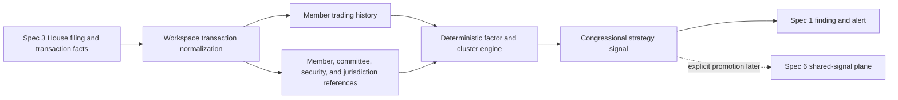

# Spec 4: Congressional Signals v1 — House PTRs

Status: Draft for implementation after Specs 1–3

Date: 2026-08-14

Product target: `NORTH_STAR.md`

Strategy research:

- `idea/congressional-trading-signals.md`
- `idea/congressional-leaders-watchlist.json`
- `idea/data/house-disclosures-api.md`
- `idea/data/congressional-data-sources.md`

Dependencies:

- `specs/01-independent-workspace-runtimes.md`
- `specs/02-versioned-strategy-packs.md`
- `specs/03-public-source-adapters.md`

Pack target: `congressional-signals@1.0.0`

## Plain-language objective

Create Eve's first substantive investment-signal agent: a House-first monitor
that detects newly filed Periodic Transaction Reports, understands the disclosed
transactions, measures how delayed and unusual they are, compares them with
versioned member/committee context, and alerts the owner only when the public
filing deserves investigation.

This is not a Nancy Pelosi copy-trading bot. It monitors all configured House
members and explicitly discounts stale, crowded, routine, diversified, or weakly
mapped disclosures. It produces sourced research signals, not trade instructions
or automatic orders.

## How to use this specification

Implement only after the House adapter in Spec 3 produces validated canonical
filing and transaction facts. This specification consumes those facts; it does
not download ZIP/XML/PDF sources directly or introduce another scheduler.

Every implementation task is a checklist item. Scoring behavior must be
deterministic, versioned, explainable factor by factor, and covered by fixtures.
When evidence is missing or ambiguous, the strategy reports `unknown` and lowers
confidence rather than inventing a member, ticker, committee relationship, or
amount.

## Goal and acceptance experience

The completed strategy must support this scenario:

1. The owner creates a `Congressional Signals` session from
   `congressional-signals@1.0.0` and asks it to monitor new House PTRs every six
   hours.
2. Spec 3 observes one new official House PTR and produces canonical transaction
   facts.
3. The workspace consumes each fact exactly once, resolves the member and
   security where evidence permits, calculates disclosure lag, and evaluates
   committee relevance, member tier, ownership, direction, concentration,
   pattern break, and cluster context.
4. The strategy records a complete factor trace including every factor that was
   applied, unavailable, not applicable, or excluded because evidence was weak.
5. A qualifying disclosure generates one alert headed **Congressional Signals**
   with the public filing, transaction date, filing date, disclosed amount range,
   why it was prioritized, important caveats, and **Discuss in Congressional
   Signals**.
6. A low-priority, duplicate, corrected, or insufficiently mapped disclosure is
   retained as structured strategy state but does not produce a misleading alert.
7. Another workspace remains active and isolated while the Congressional Signals
   monitor continues running.

## Agreed product decisions

- [ ] Version 1 covers official House PTR filings only.
- [ ] Senate eFD, Capitol Trades, FMP congressional feeds, Quiver, and other
  derived sources remain outside v1 and cannot silently fill House-source gaps.
- [ ] The House Clerk source and canonical facts come exclusively through Spec 3.
- [ ] The pack monitors public disclosures; it never claims to know a lawmaker's
  intent, non-public information, current holdings, exact trade value, or future
  return.
- [ ] A disclosure is an investigative signal, not investment advice or trading
  authorization.
- [ ] The strategy analyzes buys and sells. It preserves the research hypothesis
  that sells may deserve different weighting but tests that as an explicit
  versioned factor rather than a universal truth.
- [ ] Spouse, joint, dependent, trust, and unknown ownership are preserved as
  disclosed. Ownership does not become proof of who made the decision.
- [ ] Member tiers and watchlists are versioned research inputs with evidence and
  effective dates, not permanent facts or model-authored labels.
- [ ] Committee relevance is a versioned, auditable mapping from effective-dated
  committee assignments and issuer/industry jurisdiction. Ambiguity remains
  `unknown` and receives no relevance multiplier.
- [ ] The amount is a disclosed range. The strategy never substitutes midpoint,
  upper bound, or lower bound as an exact transaction value.
- [ ] Historical backfill establishes baselines without generating retroactive
  live alerts.
- [ ] Natural-language configuration and Spectrum controls use Spec 1 and Spec 2
  mutation contracts.
- [ ] No background or interactive pack tool can submit a broker mutation.
- [ ] Cross-strategy convergence is deferred to Spec 6 and uses promoted typed
  signals, never direct access to another workspace's findings.

## Vocabulary

| Term | Meaning |
| --- | --- |
| PTR | House Periodic Transaction Report filed under STOCK Act disclosure rules. |
| Filing fact | Spec 3 canonical fact for one House filing DocID. |
| Transaction fact | Spec 3 canonical fact for one disclosed row in a PTR. |
| Member profile | Versioned strategy state linking one House member to public identity, watchlist, role, and observed trading history. |
| Committee assignment | Effective-dated public record connecting a member to a House committee/subcommittee and role. |
| Jurisdiction mapping | Versioned evidence-based mapping between a committee and issuer industry/sector/exposure. |
| Disclosure lag | Calendar-day difference between reported transaction date and public filing date. |
| Pattern break | A transaction materially different from the member's sufficiently covered prior behavior. |
| Congressional cluster | Multiple qualifying disclosed transactions related by member, committee, sector, direction, and time window. |
| Factor trace | Complete deterministic record of scoring inputs, versions, evidence, applicability, and contribution. |
| Strategy signal | Workspace-owned interpretation of one or more public transaction facts; not a canonical source fact or order. |

## Scope

### In scope

- The versioned `congressional-signals@1.0.0` strategy pack.
- Consumption of House filing/transaction facts from Spec 3.
- Durable normalized strategy transaction records and correction handling.
- Versioned House member identity, chamber/party/role, watchlist, and committee
  assignment inputs.
- Versioned committee-to-industry jurisdiction mapping.
- Security/entity resolution with explicit ambiguity.
- Disclosure-lag and member-history baselines.
- Deterministic member tier, ownership, direction, concentration, pattern-break,
  committee relevance, and cluster factors.
- Same-member, same-committee, and bipartisan cluster detection where evidence
  supports it.
- Configurable alert thresholds and watch scope.
- Sourced alerts, manager visibility, natural-language configuration, and
  pack-specific evaluations.
- Optional read-only market-price enrichment only if an already reviewed free
  adapter exists; missing enrichment must not block core disclosure processing.

### Out of scope

- Senate disclosures or a claim of complete congressional coverage.
- Scraping Capitol Trades or any third-party website.
- Paid congressional, market-data, news, or legislative providers.
- Automatic committee-roster crawling if no reviewed adapter exists; v1 may use
  checked-in effective-dated reference data with provenance.
- Full legislation/vote timing correlation.
- Claims that a member traded on material non-public information or broke a law.
- Exact portfolio reconstruction, current holdings, realized returns, or
  performance attribution from range disclosures.
- Backtesting or validating historical alpha.
- General news, valuation, insider, social, or fundamental convergence.
- Senate/House cross-chamber clusters.
- Personalized investment advice, order sizing, or automatic/live trading.
- Cross-workspace access outside the Spec 6 promoted-signal plane.

## Non-negotiable invariants

- [ ] Only canonical House facts authorized to this workspace enter the strategy.
  Raw source documents and arbitrary URLs never arrive through model input.
- [ ] Each source fact is consumed exactly once per pack binding/scoring-policy
  version, with explicit rescoring records when policy or reference data changes.
- [ ] Source facts remain immutable. Strategy normalization and scoring create
  adjacent workspace-owned records rather than rewriting canonical evidence.
- [ ] Member, committee, security, ownership, and industry mappings preserve
  provenance, effective dates, versions, and ambiguity.
- [ ] No factor applies without its required evidence. Missing evidence is not
  equivalent to a neutral or negative finding unless the policy says so explicitly.
- [ ] The score stores every factor input and contribution. A model cannot supply
  or alter numeric factors, tiers, thresholds, or cluster membership.
- [ ] A changed score policy, watchlist, mapping, or fact revision never silently
  changes an already delivered alert. Rescoring creates a new revision and emits
  a correction only under explicit policy.
- [ ] Historical baseline records never emit live alerts.
- [ ] A cluster counts distinct canonical members and distinct qualifying facts;
  duplicate rows, amendments, replays, or one member's repeated filing copies do
  not inflate it.
- [ ] Alerts use neutral language: `disclosed`, `reported`, `committee-related
  mapping`, and `signal`. They do not say `illegal`, `inside information`,
  `guaranteed`, or `copy this trade` as unsupported fact.
- [ ] The pack cannot access Coinbase, paid providers, shell, filesystem,
  interactive history from another workspace, or live broker tools.
- [ ] Logs and metrics never contain member names, document IDs, tickers, filing
  URLs, transaction amounts, workspace IDs, owner IDs, or score-factor payloads.

## Target architecture

The strategy workspace owns normalized history and signals. Canonical public
facts remain in Spec 3. The pack never reads another workspace.

## Pack definition

`congressional-signals@1.0.0` declares:

- compact workspace mission and detailed congressional-signals playbook;
- House disclosure source adapter/version from Spec 3;
- one House PTR monitor template, initially paused, with a suggested six-hour
  cadence;
- optional reference-data health check, not an independent cron system;
- required fact-read, strategy-state, finding, alert, and completion tools;
- explicit denial of general search, paid providers, Coinbase, shell,
  filesystem, and financial mutations;
- transaction, member-profile, committee-mapping, cluster, signal, and factor
  schema versions; and
- deterministic pack eval suite.

Owner-editable configuration includes:

- timezone and poll cadence within reviewed Spec 1/Spec 3 bounds;
- watch scope of `all_house`, `versioned_watchlist`, or selected canonical member
  IDs;
- transaction directions to analyze;
- minimum alert band;
- whether to alert on corrections to previously alerted signals; and
- optional strategy limits that only tighten workspace budgets.

- [ ] Installing the pack starts no monitor unless the owner explicitly requests
  activation and cadence.
- [ ] Reject display-name-only selected-member configuration. Resolve and store
  canonical member IDs with a confirmation step for ambiguity.
- [ ] Pack configuration cannot edit member tiers, committee mappings, scoring
  weights, or hard safety policy.

## Durable strategy records

### House strategy transaction

`HouseStrategyTransaction` references one canonical transaction fact and stores:

- workspace, pack, policy, and source-fact identity/revisions;
- resolved member ID and resolution status;
- owner type as reported and normalized where known;
- issuer/security/entity candidates and resolution status;
- asset class and broad/passive-fund classification;
- direction and transaction subtype;
- transaction, filing, and observation dates plus disclosure lag;
- amount-range lower/upper bounds and bracket identity;
- correction/supersession relationship;
- eligibility/exclusion reason codes; and
- normalized-record revision and timestamps.

- [ ] Preserve source strings alongside canonical references without placing
  unbounded source text in strategy state.
- [ ] Quarantine negative date ordering, impossible ranges, unsupported
  directions, unresolved duplicate members, and ambiguous row identity.
- [ ] Do not discard excluded transactions. Store their exclusion reasons so
  coverage and future policy changes remain auditable.

### Member profile and history

`HouseMemberProfile` contains:

- stable canonical member ID and public name variants;
- House term/congress, state/district, party, leadership/committee roles, and
  effective dates;
- watchlist category/tier with evidence references, rationale, policy version,
  review date, and confidence;
- observed transaction-history coverage window and completeness;
- computed cadence, diversification, sector concentration, direction mix,
  typical amount brackets, and last transaction dates; and
- reference-data revision.

- [ ] Treat checked-in watchlist claims as research requiring provenance and
  review, not immutable truth.
- [ ] Never allow the model to add a member to a high-signal tier directly.
- [ ] Separate source-observed behavior from research-authored tiers.
- [ ] Require adequate history coverage before applying rare-trader, pattern-
  break, or high-volume classifications.
- [ ] Mark former members and changed offices/committees with effective dates
  rather than rewriting historical context.

### Committee and jurisdiction references

`HouseCommitteeAssignment` and `CommitteeJurisdictionMap` contain effective-
dated committee/subcommittee roles, authority/source references, issuer
industry taxonomy version, applicable sectors/entities, mapping rationale,
specificity, and confidence.

- [ ] Match a transaction using the member's assignment and party/chamber state
  effective on the transaction date, not the current date.
- [ ] Require a reviewed issuer-industry/entity mapping before committee
  relevance can be `yes`.
- [ ] Support `yes`, `no`, `ambiguous`, and `unknown`; only `yes` earns a positive
  factor.
- [ ] Keep broad committees/jurisdictions from making every market transaction
  relevant. Record the exact committee, jurisdiction rule, and entity exposure.

### Congressional strategy signal

`CongressionalSignal` contains:

- signal ID, revision, pack/policy version, producing workspace, and status;
- one primary transaction plus related transaction/cluster IDs;
- canonical member/security/entity/sector references;
- factor trace and raw/normalized score band;
- strongest evidence and counterevidence reason codes;
- source/fact provenance and as-of/freshness times;
- alert eligibility, alert revision, correction lineage, and expiry; and
- optional Spec 6 promotion status added only after Spec 6 exists.

## Transaction eligibility

Before scoring, deterministically classify each transaction:

- `eligible_directional_security`;
- `excluded_broad_fund`;
- `excluded_non_security_asset`;
- `excluded_routine_diversified_activity` only when adequate history proves it;
- `unresolved_member`;
- `unresolved_security`;
- `ambiguous_transaction`;
- `invalid_or_incomplete_source`; or
- `superseded_or_duplicate`.

- [ ] Do not treat mega-cap status alone as an exclusion. It may weaken a signal,
  while a concentrated pattern break may remain relevant.
- [ ] Distinguish purchases, sales, exchanges, option activity, and unclassified
  transaction types. Never map unknown to buy or sell.
- [ ] Passive/index/broad ETF exclusions use versioned security classification,
  not ticker-name heuristics alone.
- [ ] Keep disclosed spouse/joint/dependent ownership eligible under explicit
  policy while labeling it accurately.

## Disclosure lag and history features

- [ ] Calculate calendar-day lag from source transaction date to filing date and
  store input dates and calculation version.
- [ ] Use explicit lag bands from the versioned scoring policy. The initial
  research bands are `0–7`, `8–15`, `16–30`, `31–45`, and `>45` days.
- [ ] Treat negative/missing lag as invalid/unknown, not fast disclosure.
- [ ] Track member median/distribution and coverage, not only average lag.
- [ ] Define pattern break from prior covered behavior: long inactivity, unusual
  concentration, uncommon sector, unusual direction, or materially different
  amount bracket.
- [ ] Do not apply a pattern-break factor when the member-history baseline is too
  short or incomplete.
- [ ] Calculate portfolio/concentration proxies from disclosed ranges and counts
  without pretending exact values are known.

## Cluster detection

Version 1 supports:

- same-member concentration: multiple qualifying transactions in the same
  security/sector within a 30-day window;
- committee cluster: at least three distinct members assigned to the same
  committee/subcommittee transact in the same sector/direction within 30 days;
- bipartisan committee cluster: a committee cluster containing members of at
  least two parties; and
- watchlist cluster: multiple high-priority members transact in the same
  security/sector/direction within the configured window.

- [ ] Use transaction date for cluster windows and filing/observed time for
  freshness/alert timing. Preserve both.
- [ ] Require canonical distinct member IDs and security/sector mappings.
- [ ] A correction removes/replaces the old contribution through deterministic
  cluster revision rather than decrementing by guesswork.
- [ ] Store cluster membership and versions so every alert is reproducible.
- [ ] Do not interpret cross-party participation as proof of shared information;
  label it as a descriptive public-disclosure cluster.

## Scoring policy v1

The research document proposes a multiplicative model. Implement it as a
versioned deterministic policy with a complete factor trace and an explicit cap
or normalized alert band so one uncertain multiplier cannot produce misleading
precision.

Initial factor families are:

- member tier/watchlist category;
- committee relevance;
- disclosure-lag band;
- trade concentration;
- adequately supported pattern break;
- security crowding/coverage class when a reviewed input exists;
- same-member, committee, or bipartisan cluster;
- transaction direction, including the research sell-bias hypothesis;
- party-control status effective on transaction date;
- disclosed spouse/proxy ownership; and
- freshman/high-volume burst only with adequate term/history coverage.

Legislative timing, historical performance, price movement since transaction,
valuation, news, and other strategy signals are not core v1 factors unless a
later reviewed adapter/schema supplies them. Their absence is recorded as
`unavailable`, not assumed neutral evidence.

- [ ] Store for each factor: ID/version, required inputs, evidence references,
  raw values, applicability, contribution, confidence, and exclusion reason.
- [ ] Keep the raw research score separate from the owner-facing band of `low`,
  `moderate`, `high`, or `very_high`.
- [ ] Put all multipliers, thresholds, caps, and band boundaries in versioned
  deterministic policy—not pack prose or model instructions.
- [ ] Add sensitivity fixtures proving one factor change changes only its stated
  contribution and cannot overflow or create `NaN`/infinite scores.
- [ ] Alert text explains factors in plain language and never exposes a fake
  probability or unsupported legal/intent conclusion.

## Corrections, rescoring, and alert policy

- [ ] Source-fact correction creates a new normalized transaction and signal
  revision linked to the prior version.
- [ ] Reference-data or scoring-policy changes use an explicit bounded rescore
  job with old/new policy versions and idempotency keys.
- [ ] Rescoring cannot convert historical baseline records into new live alerts.
- [ ] Emit a correction alert only if a previously delivered material signal
  changes band, direction, member/security identity, or eligibility and the
  workspace configuration permits corrections.
- [ ] Deduplicate alert identity by signal/revision/threshold policy and route it
  through Spec 1's durable alert outbox.
- [ ] Signal expiry/freshness reflects filing/observation delay and does not
  delete the historical record.

## Alert contract

A qualifying alert includes:

- workspace and strategy name;
- public member and disclosed owner relationship;
- security/issuer and transaction direction;
- transaction date, filing date, disclosure lag, and amount range;
- signal band and the strongest applied factors;
- material unknowns, exclusions, crowding/staleness, and counterevidence;
- canonical House filing link and source authority;
- clear statement that this is a delayed public disclosure and research signal,
  not proof of wrongdoing or a trade instruction; and
- **Discuss in Congressional Signals** and manager actions from Spec 1.

- [ ] Do not send one alert per transaction when one filing/cluster summary is
  clearer; keep individual transaction provenance available in the workspace.
- [ ] Bound alerts and rank factors deterministically.
- [ ] A low/no-alert result still records complete evaluation and advances the
  workspace strategy checkpoint safely.

## Deterministic fixture suite

- [ ] Initial historical baseline creates profiles/history but no alerts.
- [ ] Fast-disclosed committee-relevant concentrated transaction produces the
  expected factor trace and band.
- [ ] Stale diversified broad-fund activity records exclusions and no alert.
- [ ] Spouse-owned transaction is labeled and scored under explicit ownership
  policy without attributing intent.
- [ ] Missing ticker and ambiguous issuer remain unresolved and do not receive
  committee/security factors.
- [ ] Member changed committee between transaction and filing; transaction-date
  assignment is used.
- [ ] Three distinct same-committee members form a cluster; duplicate/replayed
  facts do not increase the count.
- [ ] Bipartisan cluster is descriptive and deterministic.
- [ ] A single prolific member cannot impersonate a multi-member cluster.
- [ ] Corrected filing revises/removes cluster membership and sends at most one
  configured correction alert.
- [ ] Scoring-policy rescore preserves source/history and creates no retroactive
  baseline alerts.
- [ ] Concurrent workspaces with different thresholds/watch scopes consume the
  same canonical facts but create isolated findings and alert decisions.
- [ ] Forged member/tier/score/tool input cannot bypass deterministic records.

## Implementation sprints

### Sprint 0 — contracts, policy, and failing fixtures

- [ ] Define schemas/state diagrams for transactions, member profiles, reference
  data, histories, clusters, factor traces, signals, corrections, and rescoring.
- [ ] Freeze the v1 eligibility, factor, band, alert, baseline, and correction
  policies with explicit unknown/unavailable semantics.
- [ ] Add failing fixtures for identity ambiguity, range handling, dates,
  effective committees, pattern coverage, clusters, duplicate facts, corrections,
  rescoring, isolation, and forbidden capabilities.
- [ ] Define pack configuration, feature flags, low-cardinality errors, rollback,
  and retention.

Exit gate:

- [ ] Every scoring/cluster/alert decision and forbidden transition is represented
  by deterministic failing fixtures before implementation.

### Sprint 1 — pack and versioned reference data

- [ ] Author `congressional-signals@1.0.0` under the Spec 2 schema.
- [ ] Normalize the checked-in House watchlist into a versioned schema with
  evidence, effective/review dates, stable member IDs, and validation.
- [ ] Add versioned House member, committee assignment, party-control, issuer
  industry, and jurisdiction mapping inputs required by fixtures.
- [ ] Implement reference-data health, compatibility, effective-date lookup, and
  explicit unresolved states.
- [ ] Prove no research corpus or Senate data is loaded into runtime context by
  default.

Exit gate:

- [ ] The pack installs with bounded validated House reference data, and every
  fixture lookup is effective-dated, provenance-bearing, and ambiguity-safe.

### Sprint 2 — transaction normalization and member history

- [ ] Implement scoped canonical-fact consumption and exactly-once strategy
  transaction normalization.
- [ ] Implement member/security/ownership/range/direction resolution and
  exclusion records.
- [ ] Implement historical baseline/backfill mode and coverage accounting.
- [ ] Implement member disclosure-lag, cadence, concentration, diversification,
  direction, sector, and pattern-break features.
- [ ] Complete correction, replay, partial-fact, and concurrent-consumption tests.

Exit gate:

- [ ] Every canonical House transaction becomes one auditable strategy record or
  explicit quarantine/exclusion, and baseline history produces no live alert.

### Sprint 3 — committee relevance, clusters, and deterministic scoring

- [ ] Implement transaction-date committee/jurisdiction resolution.
- [ ] Implement same-member, committee, bipartisan, and watchlist clusters with
  stable membership/versioning.
- [ ] Implement scoring-policy v1, factor traces, caps/bands, and sensitivity
  tests.
- [ ] Implement signal records, freshness/expiry, correction lineage, and bounded
  rescoring.
- [ ] Complete adversarial score injection, ambiguous evidence, overflow, cluster
  duplication, and effective-date tests.

Exit gate:

- [ ] Signals and clusters are reproducible entirely from versioned records and
  never apply an unsupported factor or model-authored number.

### Sprint 4 — alerts, natural language, and Spectrum

- [ ] Create bounded neutral alert projections and Spec 1 outbox integration.
- [ ] Add natural-language pack/watch-scope/cadence/threshold/correction controls
  operating only in the owning workspace.
- [ ] Extend the Spectrum manager with pack health, source coverage, reference
  versions, watch scope, threshold, latest signal, and monitor status.
- [ ] Add **Discuss**, stale action, duplicate delivery, archive/restore,
  start-fresh, and non-selected-workspace alert tests.
- [ ] Add read-only signal explanation tools that expose evidence/factor trace
  without raw unrelated history.

Exit gate:

- [ ] A qualifying House disclosure produces one accurate sourced alert while
  low/ambiguous/corrected cases follow configured behavior and other workspaces
  remain isolated.

### Sprint 5 — end-to-end validation and rollout

- [ ] Run pack, source, normalization, scoring, cluster, correction, Redis race,
  Photon integration, Spec 1–3 regression, typecheck, Eve build, and app build.
- [ ] Run the Spec 3 House live read-only smoke and evaluate a controlled injected
  post-baseline fixture through real Photon delivery.
- [ ] Verify two active strategy workspaces with different configurations and no
  context/tool/state leakage.
- [ ] Deploy behind pack, scoring, clustering, alerts, and live-source flags with
  recorded rollback evidence.
- [ ] Update `HANDOFF.md`, `NORTH_STAR.md`, and `BACKLOG.md` only after acceptance
  with completing commits and exact verification.

Exit gate:

- [ ] House-first Congressional Signals runs continuously as an isolated
  installable strategy pack, explains every decision, and never produces an
  automatic financial action or claim of complete congressional coverage.

## Planned code areas

- `strategy-packs/congressional-signals/1.0.0/`: manifest, instructions,
  playbook, monitor instructions, and fixtures.
- `agent/lib/congressional-signal-schema.ts`: normalized strategy records,
  factors, clusters, and signals.
- `agent/lib/congressional-reference-data.ts`: effective-dated member/watchlist,
  committee, party, industry, and jurisdiction lookups.
- `agent/lib/congressional-transaction-store.ts`: scoped normalized history.
- `agent/lib/congressional-clusters.ts`: pure deterministic cluster logic.
- `agent/lib/congressional-scoring.ts`: pure versioned policy and factor trace.
- `agent/lib/congressional-signal-store.ts`: signals, revisions, corrections,
  rescoring, and alert eligibility.
- `agent/tools/`: scoped signal inspection and pack configuration operations.
- `evals/strategy-packs/congressional-signals/`: pack behavior/eval fixtures.
- `config/watchlists/congressional-leaders.v1.json`: validated canonical input
  after Spec 2 corpus migration.

Do not duplicate the House source adapter/facts, Spec 1 monitor/alert stores, or
Spec 2 pack binding.

## Verification matrix

| Boundary | Required proof |
| --- | --- |
| Source | Only authorized Spec 3 House facts are consumed; no direct fetching occurs in the strategy. |
| Identity | Member/security/owner ambiguity remains explicit and cannot earn unsupported factors. |
| Ranges | Disclosed brackets remain ranges; no exact amount is invented. |
| Time | Transaction, filing, observation, effective assignment, and lag remain distinct. |
| Baseline | Historical backfill builds coverage without alerts. |
| History | Pattern features require adequate measured coverage and remain reproducible. |
| Committee | Relevance uses transaction-date assignments and reviewed jurisdiction/entity mappings. |
| Clusters | Distinct-member rules, windows, corrections, and dedupe are deterministic. |
| Score | Every contribution is versioned and traced; unavailable evidence does not apply. |
| Language | Alerts avoid intent, illegality, certainty, exact value, or trade-direction claims not supported by facts. |
| Isolation | Different workspaces may score the same public fact differently without sharing settings/findings. |
| Financial safety | No pack path can reach live broker mutations or treat a signal as approval. |
| Coverage | Product/UI says House v1 and never implies Senate or complete Congress coverage. |

## Observability and operations

- [ ] Emit low-cardinality counts for fact consumed, normalized, excluded,
  unresolved, baseline, cluster created/revised, signal by band, alert eligible,
  correction, rescore, and reference-data degraded.
- [ ] Never tag member, committee, ticker, security, DocID, transaction, signal,
  score, workspace, or owner identifiers.
- [ ] Show owner-visible House source health, reference-data versions, history
  coverage, last evaluation, signal/alert counts, and degraded reasons.
- [ ] Add operator reports for unresolved mappings, partial source facts, stale
  reference data, rescore jobs, and correction backlogs without payload details.
- [ ] Add independent kill switches for fact consumption, scoring, clusters,
  alerts, and optional enrichments.
- [ ] Document watchlist/reference updates, policy version changes, rebaseline,
  rescore, pack block, and rollback procedures.

## Definition of done

- [ ] Every sprint exit gate passes.
- [ ] `congressional-signals@1.0.0` installs and runs only with explicit owner
  activation.
- [ ] The pack continuously consumes official House PTR facts through Specs 1
  and 3 without implementing another scheduler or fetch path.
- [ ] Every transaction is normalized, excluded, unresolved, or quarantined
  exactly once with complete provenance.
- [ ] Disclosure lag, member history, committee relevance, clusters, and score
  factors are deterministic, versioned, and uncertainty-aware.
- [ ] Qualifying signals produce one neutral sourced alert and low/ambiguous
  signals do not create noisy or misleading alerts.
- [ ] Baseline, replay, correction, rescore, concurrency, archive, restore,
  start-fresh, and rollback tests pass.
- [ ] The pack never claims Senate coverage, exact trade value, illegality,
  intent, guaranteed performance, or automatic trade authorization.
- [ ] Other workspaces remain isolated and live broker mutations remain
  unavailable.
- [ ] All Specs 1–3 regressions, typecheck, Eve build, and application build stay
  green.

## Follow-on work

- Senate coverage requires its own reviewed primary/derived source decision and
  focused extension specification.
- Legislative timing, valuation, price movement, news, and performance factors
  require reviewed adapters and separate evals before entering a score.
- Cross-strategy convergence uses Spec 6 after explicit signal promotion.
- Workspace-aware broker proposals and approvals remain separate financial
  specifications.
