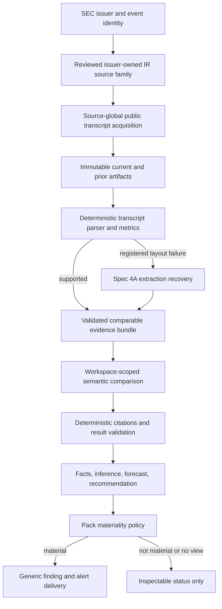

# Spec 4B: Earnings Call Changes

Status: Ready for implementation

Date: 2026-08-16

Product target: `NORTH_STAR.md`

Dependencies:

- `specs/01-independent-workspace-runtimes.md`
- `specs/02-versioned-strategy-packs.md`
- `specs/03-public-source-adapters.md`
- `specs/04a-hybrid-evidence-reasoning.md`

Research inputs:

- `agent/skills/earnings-call-analysis.md`
- `idea/earnings-call-language-analysis.md`
- SEC EDGAR submissions and company-facts APIs: <https://www.sec.gov/search-filings/edgar-application-programming-interfaces>
- SEC automated-access rules: <https://www.sec.gov/about/developer-resources>
- SEC ticker/CIK resources: <https://www.sec.gov/search-filings/edgar-search-assistance/accessing-edgar-data>

## Objective

Ship `earnings-call-changes@1.0.0`, the first full strategy pack that uses the
Spec 4A hybrid evidence foundation. The owner selects companies. Eve monitors
authoritative public earnings-call materials, compares each new call with a
comparable prior call, measures reproducible language changes, and uses a
bounded model worker to interpret changes that require judgment.

The result is more than a transcript summary. Eve separates cited facts,
inferences, forecasts, and recommendations; explains the evidence behind its
view; identifies counterevidence and invalidation conditions; and alerts only
when a material accepted change is present. The owner decides whether to act.
The strategy never places a trade.

## What the owner gets

After this spec, the owner can:

1. create an Earnings Call Changes workspace from the strategy catalog without
   adding code;
2. select up to eight public companies by stable SEC issuer identity and choose
   a schedule and materiality threshold;
3. see before activation whether each company has enough authoritative public-
   transcript coverage for a valid comparison;
4. receive a workspace-labeled alert when management language, guidance,
   priorities, risks, or Q&A behavior changes materially;
5. inspect the current and prior evidence, deterministic metrics, model
   interpretation, directional scenarios, likely market interpretation,
   research recommendation, confidence, horizon, counterevidence, and
   invalidation conditions; and
6. tap **Discuss** and continue in the correct isolated workspace with the
   accepted finding as bounded context.

## Implementation workflow

This file is the authoritative progress ledger. Keep one
`codex/spec-04b-earnings-call-changes` branch and one associated worktree from
current GitHub `main` for all sprints. Do not restart orientation or create a
new branch/worktree after every sprint.

For each sprint:

1. Read only the relevant current code and installed Eve/Next.js documentation.
2. Search the Eve registry before implementing an integration or parser.
3. Implement the current sprint and the smallest inseparable dependency fix.
4. Run its focused verifier, typecheck, and the affected build when production
   code changed.
5. Mark only verified items, commit the sprint, report the next sprint, and stop
   until the owner says to continue.

Do not run a new independent review after each sprint. Sprint 5 owns one final
independent review and one broad regression gate.

When Sprint 5 is green, complete the landing pass in the same context: mark all
verified items, move only genuine deferred hardening to `BACKLOG.md`, update
`HANDOFF.md` and `NORTH_STAR.md`, commit, push, open and merge the PR, confirm
the accepted commit is on GitHub `main`, and verify the resulting production
deployment. Do not rerun an already-green broad suite merely because later
changes were documentation or Git operations. Rerun affected checks only if
code changed during review, conflict resolution, or landing.

The final push, PR, merge, and automatic Git-backed deployment are authorized
by this workflow. Live source/model calls, Photon messages, production flag
changes, paid services, and manual deployments still require explicit owner
authorization at the point of use.

## Scope

### In scope

- One immutable Earnings Call Changes strategy pack and its deterministic
  evaluator, findings, presentation, explanation tool, and evals.
- A versioned SEC issuer catalog keyed by CIK, with ticker and display name as
  mutable labels rather than durable identity.
- Reusable reviewed issuer-owned IR source families that derive exact per-CIK
  transcript instances without permitting arbitrary URLs.
- Scheduled acquisition of SEC submissions for issuer/event identity plus
  reviewed issuer-owned IR transcript artifacts under the existing
  source-global coordinator and source-specific access limits.
- Detection of qualifying authoritative public transcripts containing prepared
  remarks and Q&A; explicit coverage-unavailable results when required material
  is absent.
- Deterministic transcript normalization, section/speaker/Q&A extraction,
  comparable-period selection, language metrics, corrections, replay, and
  citations.
- Spec 4A extraction recovery for a registered, authoritative transcript whose
  layout changed but whose identity and bounds remain valid.
- A reusable bounded ordered-evidence extension to Spec 4A's workspace semantic
  lane so current and prior artifacts retain separate authorization, lineage,
  and citations.
- Model interpretation of semantic changes, implications, scenarios, likely
  directional market interpretation, research recommendations, catalysts,
  risks, counterevidence, confidence, horizon, and invalidation conditions.
- Owner-visible coverage, baseline, no-change, abstained, quarantined, failed,
  and accepted states.
- Material accepted alerts through the existing generic workspace/Photon path.

### Out of scope

- Automatic trade placement or treating a model view as approval.
- Account-specific position sizing, portfolio inspection, or broker access.
- Fabricated price targets or valuation precision without cited market and
  valuation inputs. Spec 4B may produce directional forecasts and a bounded
  research stance; exact targets remain `not_assessed` in this source profile.
- Durable use of paid/licensed transcripts, private research, social sources,
  arbitrary websites, or generic web search. Their future evidence roles must
  fit the same contracts, but their connectors and retention rights are not
  added here.
- Claiming call-language or Q&A conclusions from an earnings release, prepared
  remarks, or webcast notice that does not contain a qualifying authoritative
  transcript with Q&A, or claiming that a public transcript proves nothing was
  omitted from the live call unless the source explicitly attests completeness.
- Cross-workspace signal promotion, automatic strategy activation, backtesting,
  historical-alpha claims, or exhaustive crash/race hardening.

## Product contract

### Company selection and coverage

- Empty selection means configuration is incomplete; it never means “monitor
  every issuer.”
- The initial pack accepts one to eight selected issuer CIKs through a shared
  catalog-backed ID-list configuration kind. It pins the catalog ID, immutable
  revision, and digest; stores only selected CIKs; and leaves existing inline
  canonical-ID-list configurations readable unchanged. Ticker/name input
  resolves to CIK before save.
- The selector covers search/loading, exact and ambiguous matches, no result,
  selected and duplicate states, the eight-company limit, catalog failure,
  dirty/saving/saved state, and stale-revision conflict. It labels verified,
  unverified, and unsupported transcript coverage before activation.
- A new monitor remains paused until the owner explicitly enables it. Enabling
  requires at least one selected coverage-verified issuer and records an
  activation watermark before any acquisition can become alert-eligible.
- A ticker or company-name change does not create a new issuer. A catalog update
  creates a new immutable revision and never rewrites an existing monitor.
- A company-list update atomically advances the configuration generation and
  reconciles its per-CIK subscriptions. Removed issuers retain historical
  findings; stale in-flight work cannot commit against the new generation.
- The manager shows, per issuer, `baseline_ready`, `awaiting_comparable_call`,
  `coverage_unavailable`, `current`, `degraded`, or `paused_failure` with a
  bounded reason code and last successful event time.
- An issuer without two comparable qualifying authoritative public transcripts remains
  visible but produces no semantic comparison or alert.

### Comparable-call policy

- A stable logical call event is identified by issuer CIK, earnings-call date,
  and fiscal year/quarter or period end. Its separately versioned source record
  contains SEC filing context when available, reviewed source instance,
  artifact digest, and observed time, so a corrected artifact revises the event
  rather than impersonating a new call.
- The primary comparison is current versus the immediately prior comparable
  fiscal-quarter call for the same issuer. Prepared remarks compare with
  prepared remarks; Q&A compares with Q&A.
- A year-ago call is secondary context only and never satisfies the required
  prior-quarter baseline. Available year-ago/trailing evidence must be considered
  before accepting a forecast or recommendation; a plausibly seasonal change
  without adequate seasonal context lowers confidence or becomes `no_view`
  under the frozen policy.
- Initial enablement may backfill at most four transcript-bearing events per
  issuer. Existing historical events establish the baseline and never generate
  retroactive alerts. Only a call whose authoritative source publication time
  (falling back to SEC acceptance time for the associated results filing) is
  after the activation watermark, and which is not part of baseline backfill,
  is alert-eligible.
- Multiple events discovered in one catch-up run are processed chronologically
  and deduplicated by issuer, event revision, and comparison revision.
- A new source revision or corrected artifact creates new lineage. It emits a
  corrective alert only when an already-alerted conclusion changes materially.
  A model, prompt, validator, or pack-version change creates new analytical
  lineage but is not presented as a source correction.

### Accepted analysis

Every accepted finding must keep these classes distinct:

1. **Facts:** event identity, exact cited management language, coverage,
   deterministic counts/deltas, and authoritative public-source facts.
2. **Inferences:** what changed in guidance, specificity, confidence, caution,
   external attribution, priorities, risks, or Q&A directness, and why the
   evidence supports that interpretation.
3. **Forecasts:** bounded directional scenarios, expected horizon, likely
   market interpretation, catalysts, risks, and invalidation conditions.
4. **Recommendation:** one evidence-scoped research stance such as constructive,
   watch, cautious, or no view, with cited support and explicit assumptions.
   Conditional portfolio implications may explain what a holder or prospective
   buyer should investigate, but add/hold/reduce, sizing, and account-aware
   directions require later market, valuation, risk, and portfolio evidence.

The model returns concise evidence-to-conclusion rationale, not hidden
chain-of-thought. Each material inference, forecast, and recommendation cites
one or more accepted evidence spans. Confidence is `low`, `medium`, or `high`;
unsupported numeric confidence is rejected. Conflicting evidence must be
included, not silently discarded.

Coverage of the entire authoritative transcript document's prepared remarks and Q&A must
be recorded, including any omission/edit notice in the source. This is
`document_complete`, not `live_call_complete`, unless the authoritative source
explicitly attests completeness. Claims based on the absence of language must
downgrade or abstain when live-call completeness is unverified.

When the reviewed single-job bound is exceeded, deterministic sectioning may
run at most four section jobs followed by one cited synthesis job. One event may
consume at most 24,000 aggregate model input tokens and 4,000 aggregate output
tokens across those jobs, within the pack's per-run and per-day ledgers. Overflow
is explicit; silent truncation or incomplete document coverage cannot produce a
research alert.

When evidence is insufficient or contradictory, the valid outcome is
`abstained` or `no_view`. The user experience should explain the missing
coverage or conflict directly; it should not add generic model-disclaimer
boilerplate to every valid result.

### Materiality and alerts

- Deterministic pack policy, not the model, decides whether an accepted result
  crosses the configured materiality threshold.
- The baseline, ordinary no-change, below-threshold, abstained, quarantined,
  failed, and coverage-unavailable outcomes remain inspectable but send no
  research alert.
- A newly detected call that cannot be analyzed because a qualifying transcript
  or Q&A is unavailable may generate one deduplicated operational health
  notice through the existing workspace health path. It is labeled **Coverage
  issue**, contains issuer/period, bounded reason, last successful event, and a
  **Manage** action, and omits direction, forecast, confidence, recommendation,
  and research-signal styling.
- A material alert identifies the workspace, issuer, call period, dominant
  change, direction, confidence, horizon, and source time. It links to safe
  allowlisted public evidence and includes **Discuss** and **Manage** actions through the existing
  generic alert path.
- The alert remains scannable: workspace, issuer/period, dominant change,
  evidence-scoped stance, confidence, horizon, and actions only. The manager
  detail orders stance and conditional forecast first, then supporting changes
  and metrics, counterevidence/invalidation, coverage, and expandable current/
  prior citations.
- **Discuss** consumes only the bounded finding context in the bound workspace.
  It never moves another workspace's history or changes the active workspace
  silently.

## Architecture and ownership

Reuse the existing scheduler, compiled workspace worker, public-source
coordinator, hybrid worker, budget ledgers, finding store, and alert delivery.
Do not add a permanent earnings agent, another scheduler, an earnings-specific
message sender, or a second evidence store.

### Shared extensions

The following work is shared infrastructure, not pack-local plumbing:

- **Reviewed parameterized source instances:** a source family pins allowed
  origins, path templates, adapter/version, limits, and issuer-catalog
  revision across the pack schema, capability manifest, monitor transaction,
  and reviewed-source resolver. Configuration expansion derives each exact
  per-CIK source ID, URL, instance ID, and digest; runtime authorization
  re-derives them. Existing fixed-source manifests remain readable.
- **Role-bound semantic evidence bundles:** a backward-compatible semantic v2
  record labels each member `current`, `prior`, optional `year_ago`, or
  `section`. The sorted artifact-digest set remains worker authorization input,
  while role/member bindings enter the projection and input digest. Stores read
  v1 and write v2 for bundles; reversing roles changes identity and any member
  revision invalidates the result.
- **Language metrics library:** extract the pure implementation behind
  `calculate_language_metrics` so interactive and scheduled analysis use the
  same deterministic definitions.

These contracts must be strategy-neutral enough for Spec 4C to reuse without
depending on earnings-specific schemas.

### Deterministic versus model responsibility

Deterministic code owns source trust, issuer/event identity, chronology,
comparable-period selection, section boundaries, reproducible metrics,
authorization, citations, deduplication, materiality, budgets, replay, and alert
delivery.

The model owns semantic comparison and judgment: indirect changes in stance,
guidance, confidence, evasiveness, priorities, risks, implications, scenarios,
likely reaction, and recommendation. The model cannot choose its sources,
change policy, message the owner, call a broker, or convert an unsupported
document into accepted evidence.

## Source and evidence contract

The production reference path uses SEC identity/event data plus exact reviewed
issuer-owned public transcript families:

- `data.sec.gov/submissions/CIK##########.json` for filing discovery;
- exact reviewed issuer IR origins and path grammars for transcript discovery
  pages and artifacts; and
- SEC company ticker/CIK data for a reviewed issuer-catalog snapshot.

Requests identify Eve with the configured user agent, use conditional requests
where available, reuse source-global acquisitions, remain below the SEC's
published aggregate fair-access ceiling, and obey source-specific bounds.
Redirects and derived URLs must remain inside the exact reviewed origin and
path grammar. A reviewed IR page may link to its exact reviewed CDN tenant; no
generic web search or arbitrary runtime URL enters scheduled evidence.

An 8-K, 6-K, 10-Q, earnings release, slide deck, or webcast notice is not by
itself a qualifying transcript. Production acceptance must lock multiple issuer
corpora containing comparable issuer-published transcripts with prepared
remarks and Q&A, plus negative fixtures for release-only, missing Q&A, ambiguous
period, corrected artifact, changed layout, hostile instructions, and oversized
content.

Sprint 0 audits a predeclared cohort of at least 50 active issuers across major
US exchanges, varied sectors, and fiscal calendars. At least five issuers across
three sectors must have two comparable qualifying public transcripts. If this
gate fails, implementation stops for a source-profile decision rather than
presenting the entire SEC catalog as supported. The resulting catalog publishes
measured coverage and the selector distinguishes verified from unsupported or
not-yet-verified issuers.

The corrected 2026-08-16 gate found zero qualifying pairs in 408 recent SEC exhibit
candidates across the 50-issuer cohort. The owner approved the narrow corrected
profile: SEC remains authoritative for issuer/event identity, while only exact
reviewed issuer-owned IR transcript families may supply transcript evidence.
The revised audit passed with five current/prior pairs across four sectors.
Raw transcript bytes remain ephemeral because public access does not imply
redistribution rights; the locked corpora retain exact URLs, path grammars,
digests, bounds, and human-review outcomes.

Interactive paid-provider research may still occur under an authorized owner
session, but it cannot silently become scheduled durable evidence until a later
owner-private/licensed-evidence contract permits its retention and auditing.

## Durable records

Use immutable, versioned schemas for:

- issuer catalog entry and revision;
- reviewed source family and derived source instance;
- earnings event, transcript identity, normalized section, speaker turn, and
  Q&A pair;
- comparable evidence bundle and deterministic metric set;
- semantic section and synthesis results, including explicit coverage; and
- earnings-call finding and materiality decision.

A semantic comparison key binds owner, workspace, monitor, exact pack binding,
definition/version/digest, current and comparison event identities, ordered
artifact digests, parser/metric versions, configuration revision, model ID, and
budget attempt. Replays converge on the same outcome; a changed input creates a
new result rather than mutating history.

No durable record or log may contain Photon identity, private chat, hidden
chain-of-thought, secrets, raw paid-provider output, or another workspace's
interpretation.

## Feature flags and rollout

Add only two strategy-specific flags:

- `EVE_EARNINGS_CALL_SOURCE_ADAPTER_ENABLED`
- `EVE_EARNINGS_CALL_CHANGES_EXECUTION_ENABLED`

The source flag depends on the existing public-source foundation. Execution
also depends on the strategy-pack runtime and the existing hybrid parent and
semantic flags. Invalid parent/child combinations fail closed. All new flags
default off; all-off preserves Specs 1–4A behavior exactly.

Rollout order is source acquisition/projections, hybrid semantic processing,
pack execution without alerts, then existing workspace dispatch/Photon alerts.
Rollback reverses that order and preserves durable findings for inspection.

## Sprint ledger

### Sprint 0 — freeze contracts and prove source viability

- [x] Audit the defined 50-issuer cohort, meet the five-issuer/three-sector
  viability floor, and lock multiple qualifying current/prior public corpora
  plus negative fixtures for every required coverage and safety state.
- [x] Freeze issuer, source-family, event, transcript, comparison, finding,
  forecast, recommendation, and materiality schemas with explicit bounds.
- [x] Freeze deterministic/model ownership, comparable-period rules, accepted
  stance vocabulary, activation watermark, citation/coverage rules, abstention
  rules, source/model correction semantics, semantic fan-out/token envelope,
  and flag matrix.
- [x] Freeze a human-reviewed semantic benchmark covering positive/negative
  material change, no change, contradiction, seasonal context, incomplete
  evidence, and required abstention. Across repeated runs require zero unsafe
  accepts/invalid citations, at least 85% material-change and direction
  agreement, at least 90% appropriate-abstention agreement, and at least 80%
  useful evidence/rationale/conditional-implication ratings under the rubric.
- [x] Add `verify:earnings-call-changes:sprint-0` and register all intended
  fixture outcomes before production implementation.

Exit: source viability is proven against authoritative public evidence and the
contracts fail red only at the missing implementation seams.

### Sprint 1 — reusable public issuer acquisition

- [x] Add an immutable reviewed SEC issuer catalog and owner configuration that
  uses the shared catalog-backed ID-list kind, stores CIKs, validates one-to-eight
  selections, pins the catalog revision/digest, preserves inline-list
  compatibility, and renders useful labels and coverage state.
- [x] Add reusable reviewed source-family/per-issuer instance contracts with
  exact SEC/issuer-IR origins, path grammar, digests, limits, and subscription
  reuse across pack/capability/monitor/resolver contracts while preserving
  fixed sources.
- [x] Reconcile company-list additions/removals and derived subscriptions in one
  configuration-generation transition; reject stale in-flight commits.
- [x] Implement scheduled SEC submissions plus reviewed issuer-IR transcript
  acquisition under the existing coordinator with fair access, correction
  lineage, idempotency, and bounded failure states.
- [x] Prove two workspaces selecting the same issuer reuse source-global
  acquisition while retaining isolated projections and interpretations.
- [x] Add and pass `verify:earnings-call-changes:sprint-1`.

Exit: selected issuers produce immutable source-global earnings events and
artifacts through production acquisition paths, without semantic analysis.

### Sprint 2 — transcript normalization and deterministic evidence

- [x] Normalize supported qualifying transcripts into prepared remarks, speakers,
  Q&A pairs, and bounded cited spans; distinguish non-transcript and partial
  coverage without guessing.
- [x] Extract the existing language-metric implementation into a shared pure
  library and compute like-for-like current/prior metrics deterministically.
- [x] Implement bounded four-event baseline/backfill, comparable-call selection,
  no-retroactive-alert behavior, and corrected-exhibit lineage.
- [x] Register transcript layout recovery through Spec 4A for supported
  authoritative evidence; validate every recovered boundary/span before use.
- [x] Record full prepared/Q&A coverage and deterministically section content
  that exceeds one reviewed job bound within the four-job/aggregate-token
  envelope; distinguish filed-document coverage from live-call completeness and
  never silently truncate.
- [x] Prove familiar layouts use no model recovery, changed supported layouts
  recover or quarantine, and hostile/oversized inputs cannot create facts.
- [x] Add and pass `verify:earnings-call-changes:sprint-2`.

Exit: current and prior calls become valid comparable evidence or an explicit
coverage/quarantine state, with reproducible metrics and citations.

### Sprint 3 — multi-artifact semantic judgment

- [x] Extend the shared workspace semantic lane with backward-compatible v2
  role-bound evidence sets, per-source authorization, separate citations, exact
  lineage, role-sensitive identity, and invalidation when any member changes.
- [x] Register an immutable earnings comparison definition, prompt, output
  schema, and deterministic validator referenced by exact pack digest.
- [x] Produce distinct facts, inferences, forecasts, and recommendations with
  concise rationale, confidence, horizon, assumptions, counterevidence,
  catalysts, risks, and invalidation conditions.
- [x] Support bounded section analyses plus one cited synthesis when a complete
  call exceeds the single-job limit; invalidate the synthesis when any section
  or source revision changes.
- [x] Reject unsupported claims/citations, fake precision, source instructions,
  forbidden tools, cross-workspace access, and recommendations without evidence;
  preserve abstention as a successful no-view outcome.
- [x] Charge every attempt to the existing workspace/global hybrid budgets and
  preserve same-run versus retry accounting.
- [x] Add and pass `verify:earnings-call-changes:sprint-3` plus a repeated
  real-model eval corpus meeting every Sprint 0 safety, change/direction,
  abstention, and usefulness threshold.

Exit: a bounded current-versus-prior evidence bundle produces an accepted,
cited judgment or a durable safe abstention/quarantine in the correct workspace.

### Sprint 4 — strategy pack and owner vertical

- [x] Publish immutable `earnings-call-changes@1.0.0` files, catalog entry,
  monitor definition, configuration, playbook, risk defaults, and evals.
- [x] Route the compiled workspace worker through acquisition, baseline,
  deterministic evidence, semantic judgment, finding, checkpoint, and generic
  alert staging with replay and stale-revision protection.
- [x] Render company coverage/status and accepted analysis in workspace
  management; implement the defined issuer-selector states and analysis detail
  hierarchy; add a read-only explanation tool that cites the exact finding.
- [x] Keep the supported Photon webview responsive and keyboard-operable; provide
  programmatic labels/status semantics, visible focus, focus placement after
  validation errors, and announced loading/save/status changes.
- [x] Present material alerts with workspace/issuer identity, dominant change,
  forecast/recommendation, safe sources, **Discuss**, and **Manage**; suppress
  all defined non-alert outcomes. Discuss resolves the exact accepted finding
  and evidence revisions after entering the bound workspace.
- [x] Prove two workspaces with overlapping issuers do not share strategy
  settings, semantic results, budgets, findings, alert context, or chat history.
- [x] Add and pass `verify:earnings-call-changes:sprint-4` and the affected
  strategy-pack, runtime, alert, and isolation gates.

Exit: an owner can configure and inspect the pack end to end, and one new
material call produces one correctly routed alert without a trading capability.

### Sprint 5 — final acceptance, rollout, and landing

- [ ] Run one independent whole-spec review of the complete branch; fix every
  validated ordinary-path, safety, isolation, source-trust, or citation issue.
- [ ] Run one broad regression gate covering earnings Sprints 0–4, strategy
  packs, public sources, hybrid evidence, workspace authorization/isolation,
  budgets, findings, alerts/replies, typecheck, Eve build, and Next build.
- [ ] With explicit owner authorization, run one controlled live SEC/issuer-IR
  source-to-finding smoke and one real Photon alert/**Discuss** smoke; record
  bounded receipts without private content.
- [ ] With explicit owner authorization, stage flags in dependency order,
  verify health and rollback at the alert and full levels, then leave production
  flags in the owner-selected final state.
- [ ] Mark verified items complete, move deferred hardening to `BACKLOG.md`,
  update `HANDOFF.md` and `NORTH_STAR.md`, commit, push, open and merge the PR,
  confirm GitHub `main`, and verify the Git-backed production deployment.

Exit: the accepted implementation is merged to GitHub `main`, production is
healthy in the recorded flag state, the worktree is clean, and Spec 4C can
reuse the shared source-family and ordered-evidence contracts.

## Planned code areas

Likely ownership boundaries, not mandatory filenames:

- focused shared extensions under `agent/lib/public-source-*` and
  `agent/lib/hybrid-evidence-*`;
- earnings modules under `agent/lib/earnings-call-*` and one read-only
  `agent/tools/explain_earnings_call_change.ts` tool;
- `agent/catalogs/sec-issuers/` and
  `strategy-packs/earnings-call-changes/1.0.0/`;
- `scripts/fixtures/earnings-call-changes/`, focused sprint verifiers, and
  model-backed eval fixtures; and
- narrow configuration/status/presentation extensions in the existing
  strategy-pack and workspace manager surfaces.

Do not create empty abstraction layers. Prefer the existing Redis CAS stores,
Vercel Blob artifacts, compiled Eve worker, capability manifests, budget
ledgers, finding/alert stores, and fixed observability catalog.

## Verification boundaries

| Boundary | Required proof |
| --- | --- |
| Source trust | Only exact reviewed SEC identity sources and issuer-owned IR/CDN families enter the scheduled pipeline; redirects, arbitrary URLs, and non-transcript artifacts cannot impersonate coverage. |
| Deterministic first | Supported transcripts and metrics use no extraction-recovery model; only registered failures may invoke recovery. |
| Comparison | Current and prior events are the same issuer and correct comparable periods, with like-for-like sections and separate citations. |
| Judgment | Every material inference, forecast, and recommendation has accepted evidence, counterevidence handling, horizon, confidence, and invalidation conditions. |
| Safety | Prompt injection, invalid citations, fake precision, budget overflow, and forbidden tools abstain/quarantine without finding, alert, or trade mutation. |
| Isolation | Shared source artifacts may be reused; workspace semantic jobs, settings, budgets, findings, alert context, and chats never are. |
| Lifecycle | Baseline is silent, replay is idempotent, corrections preserve lineage, stale pack/config/input revisions cannot commit, and ambiguous execution is not replayed blindly. |
| Owner UX | Company coverage and no-view states are visible; one material result sends one workspace-labeled alert whose Discuss action enters the bound workspace. |
| Financial boundary | The pack may advise and forecast but has no broker tools; no research output is approval or an executable order. |
| Compound reuse | Spec 4C can register another reviewed source family or ordered comparison definition without changing the stores, scheduler, worker, or channel path. |

## Definition of done

Spec 4B is complete only when every Sprint 0–5 item has evidence, one real
authoritative current/prior vertical and repeated model gate pass, all accepted
judgments remain cited and isolated, the final review/regression/rollbacks are
green, deferred work has an explicit home, and the accepted commit is merged to
GitHub `main` with production state verified.
