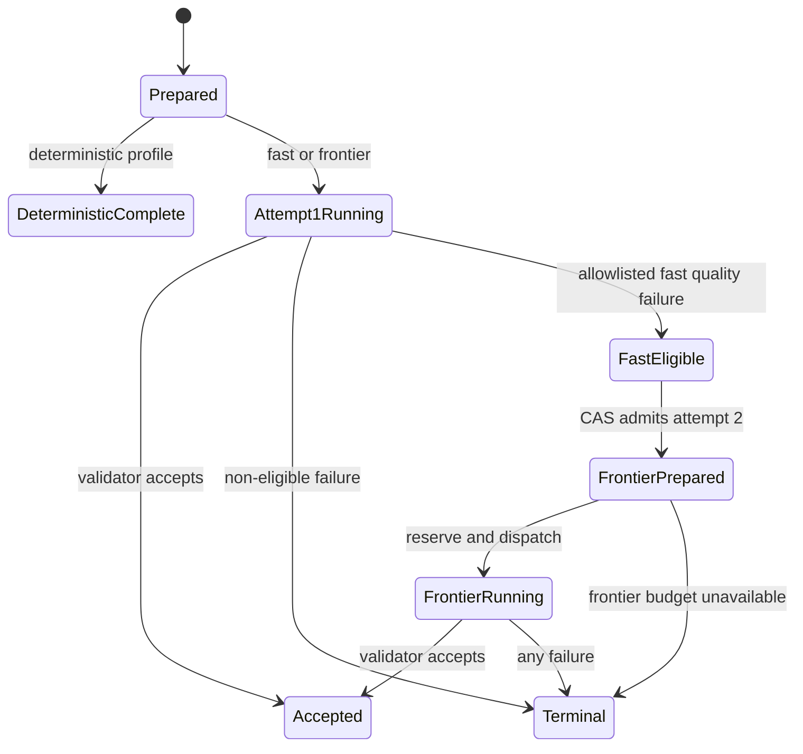

# Spec 4B.1: Adaptive Model Routing

Status: Planned

Date: 2026-08-17

Product target: `NORTH_STAR.md`

Dependencies:

- `specs/04a-hybrid-evidence-reasoning.md`
- `specs/04b-earnings-call-changes.md`

Research inputs:

- installed Eve 0.33 model, task, budgeting, and instrumentation guides;
- [Vercel: Best AI Models for Developers](https://vercel.com/i/best-ai-models-for-developers);
- [Vercel: AI Gateway Architecture Reference Patterns](https://vercel.com/i/ai-gateway-architecture-reference-patterns);
- [Vercel: Cost-Aware Model Routing with AI Gateway](https://vercel.com/kb/guide/cost-aware-model-routing-with-ai-gateway);
- [Vercel: Provider Sorting](https://vercel.com/changelog/sort-providers-by-cost-latency-or-throughput-on-ai-gateway); and
- current Spec 4A/4B hybrid definitions, jobs, workers, budgets, evals, and
  production receipts.

## Objective

Route Eve's fresh, bounded model tasks to the least expensive qualified model
that can safely perform the work. Objective extraction uses a fast model;
semantic judgment, forecasting, and recommendations use a frontier model;
deterministic work makes no model call. A failed fast result may escalate once
to the frontier model only when an independent deterministic validator reports
an explicitly eligible output-quality failure.

This is shared execution infrastructure, not a new user-facing agent. Eve's
conversational model remains stable, strategy packs never name provider models,
and a stronger model never gains broader evidence, tools, permissions, or
financial authority.

## What changes

After this spec:

1. registered tasks declare what kind of cognition and validation they need;
2. one central, versioned policy selects the exact qualified model and reasoning
   setting for each new bounded task;
3. objective extraction normally uses the fast lane, while consequential
   interpretation starts on the frontier lane;
4. deterministic work bypasses the model runtime and model budget entirely;
5. one recoverable fast-lane quality failure can create one separately budgeted
   frontier attempt without duplicating work during replay or concurrency;
6. every attempt records why it was routed, what actually ran, its validation
   result, latency, token usage, and attributable cost; and
7. existing Spec 4A records and `earnings-call-changes@1.0.0` continue to run
   unchanged while a new `1.1.0` pack proves the routed path.

## Implementation workflow

This file is the authoritative implementation and progress ledger. Keep one
`codex/spec-04b1-adaptive-model-routing` branch and one Project task from
current GitHub `main` through all sprints. Do not create per-sprint worktrees or
repeat orientation.

For Sprints 0-3:

1. implement only the current sprint and the smallest inseparable dependency;
2. run the new sprint verifier plus typecheck and the affected build when
   production code changed;
3. rerun an earlier focused verifier only when that verifier's production seam,
   contract, fixture, configuration, or dependency changed;
4. mark only verified checklist items, commit the sprint, report the next
   sprint and any authorization needed, and wait for owner direction.

A passing receipt remains valid while its relevant code, configuration, base,
environment, fixtures, and test command are unchanged. Do not reopen a finished
sprint with another orientation, independent review, or identical test run.

Sprint 4 owns exactly one independent whole-spec review, targeted remediation,
one broad regression gate after the final code change, and the routing-specific
production acceptance. Source acquisition and Photon alert/Discuss already
passed Spec 4B production acceptance and must not be repeated unless this work
changes those paths.

When Sprint 4 is green, finish in the same task: update this checklist,
`BACKLOG.md`, `HANDOFF.md`, and `NORTH_STAR.md`; commit; push; open and merge the
PR; confirm the accepted commit is on GitHub `main`; and verify the resulting
deployment. Documentation, Git operations, and an automatic Git-backed deploy
do not invalidate a green code gate. Rerun affected checks only if review,
conflict resolution, or landing changed production code or configuration.

The final push, PR, merge, and automatic Git-backed deployment are authorized.
Real-model calls, paid calls, production flag changes, and manual deployments
require grouped owner authorization at the point of use.

## Scope

### In scope

- Shared typed task profiles for deterministic, objective, and judgment work.
- One centrally reviewed, immutable routing and model-qualification policy.
- A model-independent v2 hybrid definition and logical route chain with
  separately signed and budgeted attempts.
- Fast-lane execution and one validator-driven escalation to the frontier lane.
- Durable routing provenance and low-cardinality cost, quality, and latency
  telemetry without prompts, outputs, identifiers, or provider payloads.
- Backward-compatible v1 readers and execution.
- Immutable `earnings-call-changes@1.1.0` as the first routed strategy-pack
  consumer; existing `1.0.0` bindings do not move.
- Feature-flagged rollout, rollback, and one controlled routed production task.

### Out of scope

- Changing Eve's root conversational model during a conversation.
- A model call that chooses a model for typed scheduled work.
- A permanent fleet of model-specific agents or user-visible workspaces.
- A middle model tier before workload evals show a useful quality/cost boundary.
- Cross-model fallback for provider outages. AI Gateway may route or fail over
  providers behind the same selected model; quality escalation is separate.
- Automatic pack migration or a generalized pack-upgrade interface.
- Semantic caches, shadow traffic, continuous online optimization, or a model
  marketplace UI.
- New source connectors, paid research, Photon UX, Spec 4C, broker access, or
  automated trading.

## Product contract

### Task profiles

Every v2 task definition pins one immutable profile:

| Profile | Use | Execution |
| --- | --- | --- |
| `deterministic` | Code can produce and validate every material field | No model job, route attempt, or model-budget charge |
| `objective_extraction` | A model may recover or map bounded evidence, and code can independently prove every material output field | Fast qualified model, with one eligible quality escalation |
| `semantic_judgment` | Inference, ambiguity resolution, sentiment/materiality judgment, forecasting, recommendations, or any field code cannot independently prove | Frontier qualified model, one attempt |

Task names and verbs do not determine the lane. A “classification” involving
market meaning or recommendation is semantic judgment, not objective work.
Registered definitions declare the profile; a scheduled task does not spend a
second model call deciding how difficult it is.

The profile is immutable for a definition version. Strategy packs reference a
task definition and profile contract, never a model ID or provider. Adding a
future profile or middle tier is additive and requires its own qualification
evidence.

### Routing and qualification policy

- A routing-policy record has an immutable ID, version, digest, activation
  time, and qualification revision. It maps each model-backed profile to an
  exact AI Gateway model ID, reasoning setting, capability requirements,
  maximum context/output, per-attempt cost ceiling, and provider-routing
  preference.
- Model IDs are replaceable central configuration. Activating a new model or
  changing reasoning creates a new reviewed policy revision; it does not mutate
  an old policy.
- A model qualifies only when a recorded artifact ties that exact model,
  reasoning, prompt/schema/validator versions, and evaluation corpus digest to
  the required safety and quality thresholds. An environment variable alone
  cannot qualify a model.
- Resolution intersects the task definition, active policy, model capability
  catalog, deployment/workspace capability manifest, and available budgets. A
  missing, partial, stale, incompatible, or unqualified configuration fails
  closed before dispatch.
- Capability matching covers required modality, structured output/tool support,
  context/output bounds, reasoning compatibility, and lane qualification.
- AI Gateway may choose or fail over providers behind the same concrete model.
  Provider preference may optimize cost, latency, or throughput only among
  qualified routes. It must not silently replace the selected model with a
  different model in this version.
- An already-created route pins its policy digest. Later policy activation
  applies only to a newly created logical route.

### v1 compatibility and v2 definitions

- Current v1 definitions, definition digests, jobs, signed envelopes, results,
  storage keys, and accepted findings remain readable and executable without
  rewriting or re-digesting them.
- v2 definitions replace `allowedModelIds` with the task profile, required
  capabilities, validator ID/version, and an escalation-policy digest.
- Durable readers parse explicit v1/v2 unions. New v2 records use distinct
  schema versions and key spaces; missing v2 fields never receive inferred
  defaults in old records.
- `earnings-call-changes@1.0.0` remains immutable and operational. Version
  `1.1.0` is a new catalog entry that pins v2 definition digests. Proving
  `1.1.0` uses a new binding; no existing workspace is silently upgraded.

### Logical route and attempts

The logical route is independent of the selected model:

- `routeId` is deterministically derived from the v2 definition digest,
  evidence/projection/locator digests, normalized authorized scope, and task
  input identity. It excludes model ID and active-policy choice.
- Route creation pins the active routing-policy digest. Replay of the same
  logical input reuses that route and policy until its evidence or definition
  is invalidated.
- `attemptJobId` is derived from `routeId`, attempt index, pinned policy digest,
  exact model ID, reasoning setting, and execution-contract digest.
- Each attempt has its own signed fresh-worker envelope, one-attempt job,
  budget reservation/reconciliation, result, validation outcome, usage, and
  cost provenance.
- A route has at most two attempts. A compare-and-set transition is the only
  operation allowed to admit the second attempt, so replay and concurrent
  callers cannot duplicate frontier work.
- Only one accepted result becomes the route's authoritative head. Rejected
  candidates remain durable and cannot be promoted or silently overwritten.
- Evidence invalidation invalidates the entire route. A model-policy update by
  itself does not invalidate or rerun an accepted route.

The first attempt must be terminal and its budget reconciled before a frontier
reservation begins. The system does not reserve both attempts in advance. If
frontier admission lacks budget, the route ends durably as `budget_exhausted`;
it is not reported as a successful fallback and is not retried automatically.

### Quality escalation

- Only `objective_extraction` may escalate, once, from fast to frontier.
- The v2 definition pins an escalation-policy digest containing the exact
  validator ID/version and eligible post-model output-quality codes.
- Eligible codes must mean that bounded evidence and authorization were valid,
  the model completed, and deterministic validation found a recoverable
  format, schema-mapping, or required-field coverage defect.
- Evidence, citation, provenance, hostile-input, unsupported-field, abstention,
  scope, authorization, capability, budget, provider, timeout/uncertainty, and
  worker-integrity failures are terminal and never become “quality” failures.
- A frontier-first semantic task does not cross-model escalate.
- The frontier attempt receives the same bounded evidence and task contract;
  it cannot see the rejected candidate as new evidence or gain additional tools.

### Safety, provenance, and observability

- Routing changes compute, not authority. Existing workspace isolation,
  evidence bounds, tool allowlists, citation rules, sanitization, financial
  denials, budgets, and deterministic validators apply identically to every
  tier.
- Every attempt durably records route ID, attempt index, requested profile,
  policy and qualification digests, selection reason, exact model and reasoning,
  Gateway/provider route metadata when safely available, validator version and
  outcome, token usage, attributable cost, latency, and accepted-head status.
- Findings retain the accepted attempt and route provenance. Explanation paths
  can identify which lane produced a conclusion without exposing private
  prompts, hidden reasoning, or provider payloads.
- Runtime logs and counters use fixed low-cardinality profile, lane, reason,
  attempt, and outcome codes. They never contain workspace IDs, evidence text,
  prompts, model outputs, source URLs, credentials, arbitrary exceptions, or
  provider bodies.
- Required aggregates include attempt count, acceptance and abstention rate,
  escalation rate, cost per accepted result, token use, latency, and validator
  failures by policy revision and task profile.

## Flags and configuration

Add a parent routing flag and a child escalation flag:

- `EVE_ADAPTIVE_MODEL_ROUTING_ENABLED`
- `EVE_ADAPTIVE_MODEL_ESCALATION_ENABLED`

Add centrally resolved fast/frontier model and reasoning configuration plus the
active policy/qualification digests. Exact names are frozen in Sprint 0. The
configuration contract must provide these modes:

1. both flags off: current v1 behavior and current v2 callers remain disabled;
2. routing on, escalation off: v2 tasks route once by profile;
3. routing and escalation on: eligible fast failures may create attempt two;
4. child on while parent off, partial model configuration, missing
   qualification, or digest mismatch: configuration error and fail closed.

No flag silently migrates pack bindings or changes the root conversational
model. Rollback disables new routed dispatch without deleting route, attempt,
budget, or finding records.

## Sprint ledger

### Sprint 0 — Freeze contracts and fixtures

- [ ] Define v2 task profiles, capability requirements, routing policy,
  qualification artifact, escalation policy, route, attempt, provenance, and
  terminal-outcome schemas.
- [ ] Freeze route/attempt identity derivation, policy-pinning, invalidation,
  accepted-head, replay, and CAS escalation rules.
- [ ] Freeze the exact eligible/non-eligible validator failure matrix and the
  separate per-attempt budget behavior.
- [ ] Add declarative v1/v2 compatibility, malformed-record, concurrent replay,
  crash-boundary, and flag/configuration fixtures before production routing.
- [ ] Add `verify:model-routing:sprint-0` and record the intended initial red
  seam before implementing only the contracts needed to make it green.
- [ ] Update `specs/IMPLEMENTATION_PROTOCOL.md` and
  `specs/IMPLEMENTATION_AGENT_PROMPTS.md` so this spec's continuous-sprint and
  verification-reuse workflow is unambiguous.

Exit gate: schemas and state diagrams cover every route transition; fixtures
prove old v1 records remain valid and invalid v2 configurations fail closed.

### Sprint 1 — Central policy, qualification, and provenance

- [ ] Implement the immutable policy/qualification registry and pure resolver
  for deterministic, objective-extraction, and semantic-judgment profiles.
- [ ] Filter candidates by recorded eval qualification, modality, structured
  output/tools, context/output bounds, reasoning support, workspace/deployment
  capability, and budgets before applying provider preference.
- [ ] Implement all-off compatibility and strict partial/on failure behavior.
- [ ] Add v2 signed envelopes and durable provenance without weakening v1
  readers, authentication, or execution.
- [ ] Add bounded routing counters and attempt-level usage/cost/latency records
  without sensitive or high-cardinality logging.
- [ ] Add `verify:model-routing:sprint-1` covering selection, denial, policy
  immutability, provenance, and legacy compatibility.

Exit gate: the resolver is deterministic and makes no model call; an
unqualified or misconfigured candidate cannot dispatch; v1 execution remains
unchanged.

### Sprint 2 — Route orchestration and bounded escalation

- [ ] Implement the v2 route store, separate attempt jobs, authoritative head,
  replay/invalidation behavior, and real-store CAS escalation admission.
- [ ] Route deterministic tasks around the model runtime and model budget.
- [ ] Dispatch objective tasks to fast and semantic tasks to frontier through
  fresh bounded workers using the pinned policy and exact attempt envelope.
- [ ] Reconcile attempt one before admitting/reserving attempt two; enforce one
  eligible fast-to-frontier escalation and a two-attempt chain maximum.
- [ ] Make non-eligible failures terminal and make unavailable frontier budget a
  durable non-retrying `budget_exhausted` outcome.
- [ ] Add `verify:model-routing:sprint-2` covering concurrent callers, replay,
  crashes before/after reconciliation and reservation, budget accounting,
  route invalidation, and accepted-result provenance.

Exit gate: compiled fresh workers prove deterministic bypass, fast acceptance,
frontier-first judgment, one eligible escalation, no unsafe escalation, and no
duplicate second attempt under concurrency.

### Sprint 3 — Qualify models and prove Earnings `1.1.0`

- [ ] Select exact fast and frontier AI Gateway models from the then-current
  catalog based on required capabilities, price, latency, and repository-owned
  workload evals rather than public leaderboard rank alone.
- [ ] Qualify the fast lane on the objective Spec 4A extraction-recovery corpus:
  zero unsafe accepts, zero invalid citations, at least the accepted Spec 4A
  supported-recovery threshold, and lower cost per accepted objective result
  than the qualified frontier candidate.
- [ ] Qualify the frontier lane on the Spec 4B judgment corpus: zero unsafe
  accepts and invalid citations, at least 85% supported materiality/direction,
  at least 90% required abstention, and at least 80% blinded usefulness.
- [ ] Run each new or stale real-model qualification at least twice and persist
  exact model/reasoning/prompt/schema/validator/corpus digests with tokens,
  cost, and latency. An existing repeated Spec 4A/4B receipt may satisfy a lane
  only when every required digest and model setting matches exactly. Do not
  rerun an identical accepted corpus merely because routing consumes its
  qualification, and do not activate a lane that misses its threshold.
- [ ] Publish immutable `earnings-call-changes@1.1.0` with v2 definitions while
  retaining `1.0.0`, and prove a new binding uses routed objective and judgment
  tasks without migrating an existing binding.
- [ ] Add `verify:model-routing:sprint-3` for the compiled Earnings route,
  provenance, isolation, replay, budget, and pack-version coexistence.

Exit gate: local deterministic tests pass and owner-authorized real-model runs
produce qualifying artifacts for both active model lanes. If the fast model is
not materially cheaper at accepted quality, keep routing disabled and report
the evidence rather than forcing activation.

### Sprint 4 — Final review, rollout, and landing

- [ ] Run one independent, report-only whole-spec review after Sprints 0-3 are
  complete. Validate findings once; fix only confirmed findings and run their
  focused checks.
- [ ] After the last code fix, run one broad regression gate covering routing,
  hybrid evidence, Earnings, strategy packs, workspace isolation/auth/budgets,
  typecheck, Eve build, and application build.
- [ ] With grouped owner authorization, run one controlled production routed
  hybrid task proving the pinned policy, selected lane/model, accepted
  provenance, budget reconciliation, telemetry, and replay.
- [ ] Stage routing on with escalation off, then on; verify partial-config and
  child-without-parent denial; roll both flags back off without losing records.
- [ ] Do not repeat SEC/IR acquisition or Photon alert/Discuss acceptance unless
  routing changed those previously accepted paths.
- [ ] Mark verified items, move only genuine deferred hardening to
  `BACKLOG.md`, update `HANDOFF.md` and `NORTH_STAR.md`, commit, push, open and
  merge the PR, confirm GitHub `main`, verify production health, and remove the
  feature branch/worktree.

Exit gate: one accepted routing-specific production task is attributable from
logical route through model attempt and finding; rollout and rollback pass;
flags finish off; the accepted commit is on clean local/remote `main`.

## Planned code areas

Expected new seams:

- `agent/lib/model-routing-schema.ts`
- `agent/lib/model-routing-policy.ts`
- `agent/lib/model-routing-store.ts`
- `agent/lib/model-routing-observability.ts`

Expected extensions:

- hybrid evidence schemas, registry, auth, jobs, budgets, worker, and flags;
- workspace capability and dispatch-budget resolution;
- Earnings worker, policy, strategy-pack catalog, and `1.1.0` artifacts;
- `.env.example`, package scripts, deterministic fixtures, and real-model eval
  receipts.

These names are implementation guidance, not permission to duplicate an
existing compatible abstraction discovered during Sprint 0.

## Definition of done

Spec 4B.1 is complete only when:

- [ ] Deterministic, objective-extraction, and semantic-judgment profiles route
  respectively to no model, a qualified fast model, and a qualified frontier
  model.
- [ ] Strategies declare model-independent v2 task contracts and cannot select
  arbitrary models or providers.
- [ ] A route pins an immutable policy and has at most two separately signed,
  budgeted, and provenance-bearing attempts.
- [ ] Only an exact allowlisted deterministic output-quality failure can
  escalate fast to frontier once; unsafe or uncertain failures cannot escalate.
- [ ] Replay, concurrency, crash boundaries, invalidation, and budget exhaustion
  cannot duplicate work, double-charge, or promote a rejected result.
- [ ] Exact model/reasoning, route reason, policy/qualification, validator,
  usage, cost, latency, and accepted-head provenance are durable and observable
  without sensitive logs.
- [ ] v1 jobs and `earnings-call-changes@1.0.0` remain readable and executable;
  `1.1.0` proves the routed path without automatic migration.
- [ ] Repository-owned repeated evals qualify the active fast/frontier models
  at the stated safety, quality, and cost thresholds.
- [ ] All-off behavior, staged activation, failure modes, rollback, one final
  review, one broad gate, and one routing-specific production task pass.
- [ ] Documentation and backlog are current; the accepted commit is merged to
  GitHub `main`; production is healthy; all routing flags finish off.
