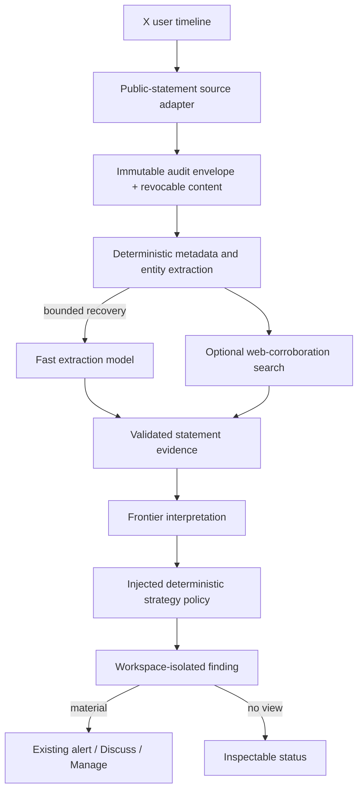

# Spec 4C: Public Commentary Signals — Inverse Cramer

Status: Proposed

Date: 2026-08-17

Product target: `NORTH_STAR.md`

Implementation base: current GitHub `main` at `c6a9ee8` (a documentation-only
descendant of the originally named `0f6c810` base)

Dependencies:

- `specs/01-independent-workspace-runtimes.md`
- `specs/02-versioned-strategy-packs.md`
- `specs/03-public-source-adapters.md`
- `specs/04a-hybrid-evidence-reasoning.md`
- `specs/04b-earnings-call-changes.md`
- `specs/04b1-adaptive-model-routing.md`

Primary source references:

- X user-post timeline: <https://docs.x.com/x-api/users/get-posts>
- X pricing: <https://docs.x.com/x-api/getting-started/pricing>
- X edit behavior: <https://docs.x.com/x-api/fundamentals/edit-posts>
- X developer policy: <https://docs.x.com/developer-terms/policy>
- X developer agreement: <https://docs.x.com/developer-terms/agreement>
- Exa Search API: <https://exa.ai/docs/reference/search>
- Exa pricing: <https://exa.ai/pricing?tab=api>
- Exa terms: <https://exa.ai/assets/Exa_Labs_Terms_of_Service.pdf>
- White House copyright policy: <https://www.whitehouse.gov/copyright/>

Credential provisioning note: Spec 4C's scheduled provider integrations are
limited to the direct X API and direct Exa Search API. `X_API_KEY`,
`X_API_SECRET`, `X_BEARER_TOKEN`, and `EXA_API_KEY` are already present in the
owner's gitignored local `.env.local` and were provisioned as Sensitive Vercel
variables for Production and Preview on 2026-08-17. No credential value enters
Git. Secret presence is complete; Sprint 0 must still validate live
authentication, access tier, declared use-case approval, and provider lifecycle
terms before enabling either connector.

## Objective

Build the second real specialized research strategy on Eve's shared hybrid
evidence foundation. The reusable product capability is **Public Commentary
Signals**: monitor a named person's direct public statements, preserve exactly
what was said and where, extract the mentioned investment target and stance,
apply a versioned strategy policy, reason about implications, and produce a
cited research finding and alert.

The first production pack is `inverse-cramer@1.0.0`. It monitors Jim Cramer's
direct public X posts. When he expresses a clear bullish or bearish investment
view, the pack evaluates the opposite direction as a research hypothesis:

- explicit bullish view -> bearish/short research candidate;
- explicit bearish view -> bullish/long research candidate; and
- mixed, quoted, joking, neutral, irrelevant, or unclear view -> no view.

This is intentionally a simple strategy thesis, not a claim of proven alpha.
The finding explains that its direction comes from the pack's inversion rule,
not from independent fundamental analysis. It never places a trade, sizes a
position, or represents a recommendation as execution approval.

## What the owner gets

After this spec, the owner can:

1. create an Inverse Cramer workspace from the strategy catalog;
2. enable a bounded scheduled monitor after the deployment has an approved X
   credential and has verified Cramer's stable numeric X identity;
3. receive a cited alert when a new, final, directly attributable Cramer post
   contains a clear investment stance that crosses the configured threshold;
4. see the original stance, mentioned asset, inversion rule, resulting research
   direction, explanation, confidence, horizon, assumptions, risks,
   counterevidence, invalidation conditions, and source links;
5. see whether related reporting was found, absent, conflicting, not checked,
   or unavailable without Eve silently discarding the original statement;
6. inspect edits, deletions, corrections, abstentions, budget failures, and
   source health in Manage; and
7. tap **Discuss** and continue in the correct isolated workspace with the exact
   accepted finding and currently permitted evidence.

In plain language, the useful signal is not “oil supply is tighter.” It is:
“Cramer publicly expressed a clear view about this asset, the configured
strategy says to investigate the opposite view, and here is the evidence and
reasoning needed for the owner to decide whether that idea is worth pursuing.”

## Why this strategy and source

Spec 4C deliberately did not preselect the second strategy. The final choice
optimizes for a materially different content shape, a simple owner-understandable
thesis, and reusable strategy construction rather than for the easiest existing
connector.

| Candidate | Decision | Reason |
| --- | --- | --- |
| Direct Cramer X posts | Production primary source | First-party evidence that the speaker made the statement; structured JSON, stable post IDs, timestamps, edit history, and a bounded user timeline. It requires authenticated access, usage cost, and deletion-aware retention. |
| CNBC pages or Mad Money audio | Not automated in v1 | Useful discovery/manual context, but NBC terms do not provide a suitable automated extraction, archival, transcription, and model-processing grant for this implementation. |
| Exa search | Optional corroboration only | Cheap, testable discovery of related public reporting. It does not prove a claim, clear third-party content rights, or replace the direct statement source. |
| EIA petroleum data | Not selected for 4C | Highly reliable and easy to test, but it would prove a narrow data monitor rather than the reusable public-figure commentary strategy the owner wants to create next. |

The production connector uses the reviewed X user-post timeline for discovery
and only the minimum exact-post/compliance endpoint needed to recheck retained
post lifecycle, all for a pinned numeric user ID. Sprint 0 must freeze the exact
endpoint set. It does not scrape X, search all of X, automate CNBC, or accept
arbitrary profiles or URLs at runtime.

Source authorization and source truth are different decisions:

- the source registry answers whether Eve is technically and legally allowed
  to call a source;
- attribution answers whether the statement is directly the speaker's, quoted,
  alleged, or conflicting; and
- corroboration describes what additional evidence was or was not found.

The UI must not label a technically allowed source “trusted” as though every
claim in it is true. Weak or unfamiliar sources remain cited and visible with a
clear label. The model may lower confidence or abstain, and deterministic alert
policy may suppress an alert, but the system must not silently erase contrary
or low-quality evidence.

## Implementation workflow

This document is the authoritative implementation ledger. Use one branch and
one worktree from then-current GitHub `main` for all sprints. Keep one coherent
implementation context unless a genuine blocker requires a handoff.

For Sprints 0–3:

1. implement only the current sprint and the smallest inseparable shared fix;
2. run its focused verifier, typecheck, and only the affected build or contract
   gates;
3. record concise exit evidence, mark only verified boxes, commit the sprint,
   and stop for the owner's next instruction; and
4. do not run a fresh independent review or the full regression suite after
   every sprint.

Sprint 4 owns one independent whole-diff review, fixes for validated findings,
one final relevant regression gate, controlled end-to-end acceptance, rollback
proof, documentation, and landing. Repeat a broad check only when a subsequent
code change can affect it. Paid calls, production secrets, Photon messages,
production flag changes, and merge remain owner-authorized operations at the
point of use.

## Scope

### In scope

- A reusable public-commentary fact, evidence, interpretation, policy, finding,
  presentation, and worker path.
- One authenticated X user-timeline connector for stable, preconfigured public
  identities, with Jim Cramer's account as the only v1 production identity.
- A reusable deletion-aware `revocable_evidence` retention class for provider
  content whose terms require edits, deletions, protection, withholding, or
  account-state changes to be honored.
- Deterministic post identity, chronology, attribution metadata, revision
  chains, links, cashtags, bounds, deduplication, activation watermarks,
  correction/retraction handling, and citations.
- Fast-model extraction for bounded entity, target, stance, voice ownership,
  topic, horizon, ambiguity, and claim recovery when deterministic parsing is
  insufficient.
- Frontier-model interpretation of meaning, implications, scenarios, risks,
  counterevidence, confidence, horizon, and invalidation conditions.
- A strategy-neutral deterministic commentary-policy interface, with the
  Inverse Cramer inversion policy as its first registered implementation.
- An optional reusable `web_corroboration_search` interface, with direct Exa
  Search as its first provider, bounded to metadata and links.
- Versioned `inverse-cramer@1.0.0` pack files, evals, owner settings, status,
  findings, alerts, Discuss, and Manage integration.
- One acceptance-only Trump/Iran configuration through the same normalized
  statement, semantic, policy, finding, alert, and Discuss path before merge.

### Out of scope

- Automated trading, broker tools, order drafting, position sizing, account
  inspection, or portfolio-aware advice.
- Claims that Inverse Cramer is profitable, a historical backtest, or an alpha
  evaluation. Spec 4C proves product and architecture behavior, not returns.
- A universal social listener, arbitrary X search, arbitrary account entry,
  arbitrary prompt-authored strategies, or a universal web crawler.
- Automated extraction from CNBC pages, shows, podcasts, or transcripts.
- Treating Exa results as verified truth or as permission to copy the linked
  article. Bloomberg, Reuters, CNBC, CNN, BBC, unknown sites, and all other
  linked publishers retain their own access and content terms.
- A second production Trump strategy pack, political profiling, X-based
  conflict monitoring, or a production White House webpage connector.
- Cross-strategy sharing from Spec 6, Spec 5 Insider Clusters, live market-price
  execution logic, or unrelated infrastructure hardening.

## Product contract

### Activation and identity

- The pack pins Jim Cramer's numeric X user ID, display label, expected handle,
  identity-catalog revision, source adapter version, and policy version. The
  implementation must verify the numeric identity with the owner during Sprint
  0; a handle alone is not durable identity.
- The X credentials are deployment secrets named `X_API_KEY`, `X_API_SECRET`,
  and `X_BEARER_TOKEN`, never strategy configuration, model input, durable
  evidence, log data, or chat context. A missing or invalid required credential
  leaves the monitor visibly unavailable and produces no alert.
- A new monitor is paused until explicitly enabled. Enabling records an
  activation watermark. The first successful fetch establishes a baseline;
  older posts may be inspected but cannot create retroactive research alerts.
- The reference cadence is ten minutes, constrained by pack minimum/maximum
  bounds. The source adapter uses `since_id`, bounded pagination, completeness
  checks, conditional retries, and the existing scheduler rather than a new
  polling service.
- Original posts are in scope. Reposts are excluded by default. Replies and
  quote posts are owner-configurable only within pack-declared options; the
  model must distinguish Cramer's own words from quoted text.

### Statement and trust model

Each normalized `public-statement/v1` fact records at least:

- provider, stable speaker ID, display label, canonical URL, stable post ID,
  conversation/reference IDs, published time, observed time, and lifecycle;
- edit-chain IDs, editable-until time when available, revision, content digest,
  and a revocable content reference rather than permanent raw text;
- deterministic cashtags, mentions, URLs, reply/repost/quote role, and exact
  text-span locators while the content remains permitted; and
- attribution status (`direct`, `quoted`, `alleged`, or `conflicting`) separate
  from the truth of any underlying claim.

Statements remain provisional during the provider's edit window. A provisional
statement is visible in source health but cannot become an alertable research
recommendation. The default finalization delay is 30 minutes and must be
validated against current X edit behavior in Sprint 0.

For an underlying factual claim, related-source coverage uses explicit states:

- `not_applicable`: the statement is an opinion with no claim to check;
- `candidates_found`: the bounded search returned possibly relevant links;
- `no_established_source_found`: a completed search found no official or
  established-newsroom candidate under the recorded classification policy;
- `not_found`: the completed search returned no candidate at all;
- `not_run`: corroboration was disabled, unconfigured, or not required;
- `unavailable`: the provider failed, timed out, rate-limited, or exhausted its
  budget; and
- `conflicting`: permitted evidence available to the run materially conflicts.

`candidates_found` does not mean confirmed. Titles and links are discovery
metadata. A future connector with lawful access to article content may produce
a separate supported/conflicted claim assessment, but Spec 4C must not infer
article support from a search result title.

### Direct Exa corroboration

Spec 4C uses the direct Exa API rather than a paid-tool broker. It adds the
smallest reusable application-owned provider contract:

```text
web_corroboration_search(input)
  -> provider, request ID, query digest, queried time, status,
     bounded result metadata, completeness, and exact cost
```

Exa is the first replaceable provider. It calls `POST https://api.exa.ai/search`
with a server-side `EXA_API_KEY`, a deterministic time window, news category,
and at most five results in v1. It returns only bounded metadata such as title,
URL, author, published date, provider result ID, request ID, and cost. It does
not use Exa Answer, Deep, generated summaries, subpage crawling, or full-page
content.

The query is compiled from resolved public target/topic terms and time, for
example `Apple latest material news`; it must not send the exact X quote, X post
ID, owner chat, private workspace context, or secret data to Exa. All returned
links are preserved and classified. A versioned publisher classification may
help the UI say “no official or established-newsroom coverage found,” but it is
transparent metadata, not an agent truth whitelist.

Exa is optional and separately flagged and budgeted. Missing key, 401/403, 402
budget exhaustion, 429, timeout, or zero results never suppresses the primary
statement fact. It changes the coverage label and may cause deterministic pack
policy to lower alert eligibility for an externally asserted fact. The direct
statement remains inspectable and cited.

As of this spec date, X documents pay-per-use Post reads at $0.005 per returned
resource and Exa lists search at $7 per 1,000 requests for up to ten results.
Prices are not hard-coded as eternal facts. Sprint 0 records current prices and
provider caps; runtime reserves and reconciles actual cost under the existing
source/model budget ledgers.

### Semantic analysis and policy

The semantic unit is one bounded statement event, not an arbitrary social-feed
bundle. Its role-bound input contains one `subject_statement` plus zero to five
`context_reference` records. A context reference is explicitly metadata-only
unless a separately authorized connector supplied retained evidence.

Deterministic code first extracts stable metadata, cashtags, obvious entities,
URLs, speaker ownership, and source lifecycle. A fast, inexpensive model is
used for bounded recovery or extraction when investment target, stance, topic,
voice ownership, or horizon cannot be established reliably from known
structure. It must cite exact permitted spans and may return unknown.

A frontier model is used only for a statement that plausibly contains an
investment-relevant view. It separates:

1. facts about what was said and the source state;
2. inferences about the speaker's stance and meaning;
3. bounded scenarios or forecasts about possible implications; and
4. a research recommendation produced after applying the pack's declared
   transform policy.

The frontier result includes concise evidence-to-conclusion reasoning,
confidence (`low`, `medium`, or `high`), horizon, assumptions, catalysts, risks,
counterevidence, and invalidation conditions. It may not invent a price target,
claim a causal market edge, treat search metadata as proof, or expose hidden
chain-of-thought.

The model does not decide the transform. A registered deterministic policy maps
validated semantic labels to a research direction. The interface receives a
validated stance/topic plus pack configuration and returns a named policy
decision with version/digest. It must contain no speaker-specific branches.

The first policy is:

| Validated Cramer stance | Inverse Cramer result |
| --- | --- |
| `bullish` | `bearish_research_candidate` |
| `bearish` | `bullish_research_candidate` |
| `mixed`, `neutral`, `unclear`, or quotation-only | `no_view` |

The result must always state: “This direction is produced by the Inverse Cramer
policy.” It must not disguise the inversion as a fundamental forecast.

### Findings, materiality, and alerts

Every accepted finding preserves:

- exact statement attribution and current lifecycle;
- target/entity resolution and original stance;
- related-source coverage, every returned link, conflicts, and limitations;
- policy name/version, transform explanation, resulting research direction;
- facts, inference, scenario/forecast, recommendation, confidence, horizon,
  assumptions, risks, counterevidence, and invalidation conditions; and
- exact evidence, model, pack, configuration, budget, and workspace lineage.

A multi-target post produces one bounded finding with a `targets[]` list and at
most one alert. It does not create an alert storm. Each target must have its own
stance and citation or be marked unresolved.

A research alert is eligible only when all of the following are true:

1. the post is newer than the activation watermark and outside its edit window;
2. direct attribution, current source lifecycle, target resolution, and exact
   citation validation pass;
3. the speaker's own stance is explicitly bullish or bearish;
4. the policy yields a non-`no_view` direction and materiality crosses the
   configured threshold;
5. required source, model, and cost budgets are available;
6. the result is accepted rather than abstained, failed, uncertain, or
   quarantined; and
7. the event/policy/configuration revision has not already alerted.

Jokes, sarcasm that cannot be resolved, quotation-only text, mixed or neutral
views, vague macro remarks, irrelevant posts, unresolved targets, and weak
externally asserted facts remain inspectable as `no_view` or abstention and send
no research alert. A direct personal opinion does not require news confirmation
merely to prove that Cramer expressed it. A concrete external allegation may
require related coverage under deterministic pack policy before alerting.

The alert identifies the workspace, speaker, target, original stance, inverse
research direction, confidence, horizon, coverage label, and primary source.
It offers **Discuss** and **Manage**. It never includes an order button or
language claiming the user should blindly buy or short the asset.

### Owner configuration

The owner may configure only pack-declared choices:

- schedule/cadence and timezone within bounded options;
- a bounded supported asset/ticker watchlist, or all pack-supported targets;
- whether replies and quote posts are considered;
- minimum materiality and confidence for alerts;
- optional related-source search on/off and optional transparent domain
  preferences;
- per-run, daily, and monthly source/model cost caps within platform ceilings;
  and
- alerts on/off and monitor pause/resume.

Cramer's identity, the production connector, semantic vocabulary, inversion
mapping, safety rules, maximum bounds, model class, and capabilities are pack
or platform owned. A conversational prompt may discuss or propose a new pack,
but cannot silently turn this monitor into a soybean, Trump, or arbitrary-person
tracker. A new strategy is created by a reviewed versioned pack/configuration
that reuses the shared public-commentary units.

## Architecture and reuse boundary



Most of the build is application layer. Reuse the existing scheduler,
source-global coordinator, jobs, signed worker, model routing, budgets,
provenance, validation, quarantine, replay, configuration generations,
workspace isolation, findings, alerts, Photon delivery, Discuss, Manage, and
strategy-pack runtime.

Only three new shared atomic units are justified:

1. **`public_statement` fact and semantic contract.** A platform-neutral
   normalized statement, attribution, entity/stance extraction, evidence roles,
   and interpretation shape. Future Cramer, Trump, executive, regulator, or
   other public-commentary packs can reuse it.
2. **`revocable_evidence` retention.** An immutable audit envelope retains
   provider/source IDs, digests, acquisition events, lifecycle state, and
   non-content operational facts. The hydrated provider text lives in an
   encrypted deletable payload. Edits create a new revision; deletion,
   protection, withholding, or required purge destroys content and exact quotes,
   leaves a tombstone, invalidates derived support, and may issue one correction
   for a previously alerted conclusion. This unit is reusable for social posts
   and other licensed or correction-sensitive sources.
3. **`web_corroboration_search` provider interface.** A bounded, budgeted,
   provenance-bearing metadata search with Exa as the first optional provider.
   It authorizes only the configured Exa provider and does not create a generic
   scheduled paid-tool permission.

Everything else that is specific to Cramer belongs in
`inverse-cramer@1.0.0`: identity binding, allowed content roles, inversion map,
asset universe, materiality thresholds, wording, schedule defaults, and eval
examples. Shared modules must not contain `if inverse-cramer`, `if Jim Cramer`,
`if Trump`, or `if Iran` branches.

### Revocable evidence lifecycle

Raw X text must not enter the permanent content-addressed public artifact path
until Sprint 0 proves that lifecycle complies with the current X agreement.
The retention unit must support:

```text
observed/provisional -> active/final -> edited | deleted | protected |
withheld | unavailable -> purged/tombstoned
```

- Every lifecycle transition is append-only in the audit envelope.
- The current hydrated payload is encrypted and addressable only by authorized
  source and workspace jobs; it is never copied into logs or permanent finding
  prose outside the revocable reference.
- A daily bounded rehydration check covers the active statement set and runs
  again before display/replay. If the available X tier supplies a suitable
  compliance mechanism, Sprint 0 may select it instead and record the contract.
- Derived facts that do not quote content may remain with provenance and a
  tombstone, but the finding clearly says its source content is no longer
  available. Exact excerpts disappear wherever X terms require deletion.
- A materially changed or purged statement that previously alerted produces at
  most one deduplicated correction/retraction alert and invalidates the old
  recommendation. It is never silently rewritten.
- Provider termination or owner credential removal runs a bounded purge of all
  licensed X payloads while retaining only permitted audit tombstones.

If Sprint 0 cannot demonstrate a compliant deletion and processor contract,
implementation stops for an owner source decision. It does not quietly fall
back to scraping X, CNBC, or another unapproved source.

## Failure, abstention, and quarantine

- Transport timeouts, invalid credentials, provider budget exhaustion, rate
  limits, incomplete pagination, and lifecycle-check failures preserve the last
  known state and produce bounded source-health reasons. They do not fabricate
  a “no new posts” success.
- A pagination gap, ambiguous author identity, invalid edit chain, content
  digest mismatch, stale configuration generation, or uncertain commit cannot
  create a finding or alert.
- Unsupported or hostile post content remains untrusted data. Prompt
  instructions inside a post, search title, or linked page cannot add tools,
  change policy, access another workspace, or message the owner.
- Invalid citations, unsupported stance/target, missing required fields,
  invented corroboration, output-schema failure, or incomplete evidence causes
  deterministic rejection and quarantine or a safe abstention.
- Model/provider failure after a charged attempt uses existing budget and retry
  semantics. Replays never duplicate source charges, model jobs, findings,
  corrections, or alerts when a durable receipt already exists.
- Weak and conflicting evidence is retained and shown. `no_view` and abstention
  are successful research outcomes, not reasons to hide the source.
- Source-global acquisitions and revocation events may be shared. Raw model
  inputs, semantic results, configuration, budgets, findings, alerts, and
  Discuss context remain workspace isolated.

## Durable records

Use bounded, versioned schemas for:

- public-commentary identity catalog and exact source instance;
- `public-statement/v1` fact, edit/revision chain, and lifecycle events;
- revocable evidence envelope, encrypted payload reference, purge receipt, and
  tombstone;
- context-search request, status, result metadata, cost, and provenance;
- role-bound commentary evidence input and fast extraction result;
- frontier commentary interpretation and validator outcome;
- strategy-policy definition, decision, version, and digest; and
- public-commentary finding, materiality decision, correction, and alert
  projection.

The semantic identity binds owner, workspace, monitor, exact pack/configuration
generation, source fact and content revision, evidence-role bindings, context
search revision, extraction/semantic definition digests, policy digest, model
IDs, and budget attempt. A changed input produces a new immutable analytical
revision. A provider edit is a source revision; a prompt/model/policy change is
an analytical revision and must not be presented as a source correction.

No durable record or log may contain credentials, private chat, hidden
chain-of-thought, another workspace's context, unbounded linked-page content,
or provider text whose lifecycle requires purge.

## Feature flags and rollout

Add only these strategy/source-specific flags, all default off:

- `EVE_X_PUBLIC_STATEMENT_SOURCE_ENABLED`
- `EVE_EXA_CORROBORATION_ENABLED`
- `EVE_INVERSE_CRAMER_EXECUTION_ENABLED`

The X source flag depends on the public-source and revocable-evidence contracts.
Execution depends on the source, strategy-pack runtime, and existing hybrid
semantic/model-routing parents. Exa depends only on the web-corroboration
provider and source/model budget parents; when off, execution continues with
`not_run` corroboration.

Roll out in this order:

1. X acquisition and lifecycle checks with no workspace execution;
2. workspace semantic execution with findings visible and alerts off;
3. optional Exa metadata search under a small explicit budget;
4. one controlled alert and Discuss acceptance; and
5. owner-selected production alert state.

Rollback reverses alert delivery, execution, Exa, and X acquisition in that
order. Disabling acquisition must still permit required deletion/purge handling;
a kill switch cannot strand licensed content. Existing findings remain
inspectable only to the extent current evidence rights permit.

## Sprint ledger

### Sprint 0 — freeze source, retention, and product contracts

- [x] Provision `X_API_KEY`, `X_API_SECRET`, `X_BEARER_TOKEN`, and
  `EXA_API_KEY` as Sensitive Vercel variables for Production and Preview, with
  matching empty names in `.env.example` and no values in Git.
- [ ] Verify the owner-approved X developer use case permits this scheduled
  public-commentary analysis, the selected model processors, required storage,
  edits/deletions, and display. Record current pricing, quotas, rate limits,
  termination obligations, and whether a suitable compliance endpoint is
  available on the chosen tier.
- [x] Verify and pin Jim Cramer's numeric X user ID with the owner; lock the
  exact endpoint, fields, expansions, post-role filters, ten-minute cadence,
  edit-finalization delay, pagination bounds, and activation baseline rules.
- [x] Freeze the `public-statement/v1`, revocable-evidence, extraction,
  interpretation, context-search, policy, finding, materiality, correction,
  cost, and flag schemas with explicit size/cardinality limits.
- [x] Freeze source-authorization versus attribution versus related-coverage
  vocabulary and the exact user-facing copy for weak, conflicting, missing,
  unrun, and unavailable corroboration.
- [ ] Lock a compact human-reviewed fixture/eval corpus covering explicit
  bullish/bearish views, no view, cashtags, implicit entities, quote posts,
  quotation-only text, replies, repost exclusion, jokes/sarcasm, mixed stance,
  multiple targets, external allegations, unknown sources, conflicting links,
  edits, deletion/protection/withholding, duplicates, pagination gaps,
  oversized/hostile content, budget failure, and Trump/Iran reuse.
- [x] Add `verify:public-commentary-signals:sprint-0` so the intended contracts
  fail only at unimplemented seams.

Exit: X access and revocable retention are demonstrably viable, Exa's optional
boundary is frozen, and the product/evidence contracts are reviewable before
production code. If X terms, app approval, processor use, or purge behavior
remain incompatible, stop for an owner decision.

Sprint 0 evidence (2026-08-17): the focused verifier passes 24 bounded intended-
outcome cases and reports only the six explicitly deferred production seams;
TypeScript passes for the application and focused verifier. The source contract
records the current official X/Exa boundary. Source authorization and lifecycle
access remain fail-closed as `pending_owner_evidence` and
`chosen_tier_unverified`. The corpus remains unchecked until human review, and
Sprint 0 has not met its exit gate.

Live X evidence (2026-08-18): after the owner authorized the previously stated
`$0.04` ceiling, one exact username lookup and one five-result user-timeline
request succeeded for numeric user ID `14216123`. Both returned `200`; all five
timeline authors matched the pinned ID, documented edit fields were present,
pagination was available, and the response reported app-window limits of `300`
for identity lookup and `10,000` for the timeline. Maximum operation cost was
`$0.035`; no credential value, post ID, or post text was logged or committed.

### Sprint 1 — public statements, X acquisition, and revocable lifecycle

- [ ] Extend the closed public-source adapter/fact registries with one X public-
  statement adapter and `public-statement/v1`, preserving existing adapters and
  source-global acquisition behavior unchanged.
- [ ] Implement deployment-secret authentication, exact-origin/endpoint and
  pinned-user enforcement, `since_id`, bounded pagination, completeness,
  rate-limit/cost receipts, deterministic JSON parsing, content bounds,
  canonical links, post roles, edit chains, activation baseline, and replay.
- [ ] Add the reusable revocable-evidence envelope/payload interface without
  copying raw X text into permanent blobs, logs, or immutable finding prose.
- [ ] Implement provisional/final, edit, delete, protection, withholding,
  rehydration/compliance, purge, tombstone, invalidation, and correction events.
- [ ] Prove two workspaces reuse one source acquisition and lifecycle event while
  retaining separate configuration generations, model jobs, budgets, findings,
  and chat context.
- [ ] Pass `verify:public-commentary-signals:sprint-1` plus focused public-source,
  artifact-lifecycle, replay, budget, and isolation checks.

Exit: new Cramer posts become bounded normalized statement facts with compliant
lifecycle and exact lineage, but no semantic recommendation or alert exists.

### Sprint 2 — extraction, corroboration, interpretation, and policy

- [ ] Register commentary semantic evidence roles and an immutable commentary
  definition/output validator without creating a second hybrid execution lane.
- [ ] Implement deterministic metadata/entity extraction, bounded fast-model
  recovery, exact permitted citations, voice ownership, unknown handling, and
  model routing through Spec 4B.1.
- [ ] Add the provider-neutral `web_corroboration_search` contract and direct
  Exa metadata-only provider with secret isolation, generic query compilation,
  result/domain bounds, provenance, exact cost, no blind retries, and explicit
  success/not-found/disabled/unavailable states.
- [ ] Register a speaker-neutral deterministic commentary-policy interface and
  the versioned inversion map; reject any unregistered transform or model-
  invented action.
- [ ] Produce validated facts, inference, scenarios/forecast, recommendation,
  confidence, horizon, assumptions, catalysts, risks, counterevidence, and
  invalidation conditions while clearly labeling rule-derived direction.
- [ ] Prove weak/unknown/conflicting sources stay visible, Exa metadata is not
  promoted to proof, missing Exa never drops the statement, hostile content
  cannot change policy/tools, and invalid citations quarantine safely.
- [ ] Pass `verify:public-commentary-signals:sprint-2` and a focused repeated
  model benchmark with zero invalid citations/unsafe accepts and frozen minimum
  stance, target, quotation, abstention, and explanation thresholds.

Exit: one final statement deterministically produces a cited interpretation and
policy decision, a safe no-view, or a durable quarantine in the correct
workspace, within source and model budgets.

### Sprint 3 — Inverse Cramer pack and owner vertical

- [ ] Publish immutable `inverse-cramer@1.0.0` strategy files, catalog entry,
  identity binding, source reference, monitor, configuration, playbook, risk
  defaults, policy reference, and evals.
- [ ] Route the compiled workspace worker through acquisition projection,
  extraction, optional related-source search, frontier interpretation, policy,
  finding, checkpoint, and generic alert staging with stale-generation and
  replay protection.
- [ ] Render monitor/source/credential/cost/lifecycle/coverage status, accepted
  findings, no-view/abstention/quarantine states, and corrections in Manage.
- [ ] Add one read-only public-commentary explanation capability and presentation
  path; Discuss must enter the bound workspace and resolve the exact current
  finding/evidence revision without importing another workspace's context.
- [ ] Present at most one material workspace-labeled alert per statement policy
  revision with primary citation, coverage label, direction, rationale,
  confidence, horizon, **Discuss**, and **Manage**; expose no broker capability.
- [ ] Prove overlapping workspaces do not share settings, semantic results,
  budgets, findings, alert context, or chat history, including after an edit or
  deletion correction.
- [ ] Pass `verify:public-commentary-signals:sprint-3` plus focused pack/runtime,
  finding/alert, owner-surface, correction, budget, and isolation checks.

Exit: an owner can configure and use Inverse Cramer end to end locally, and one
qualifying statement creates one cited research alert without an executable
trade.

### Sprint 4 — one final audit, two acceptances, rollout, and landing

- [ ] Run one independent whole-spec/whole-diff review covering ordinary-path
  correctness, source terms, revocation, citations, trust labels, prompt safety,
  cost control, workspace isolation, owner workflow, and financial boundaries;
  fix every validated material issue.
- [ ] Run one final relevant regression gate covering Sprints 0–3, existing
  public-source adapters, hybrid evidence/model routing, strategy packs,
  compiled worker capabilities, workspace authorization/isolation, budgets,
  findings, alerts/replies, typecheck, Eve build, and affected Next build.
- [ ] With explicit owner authorization and configured secret, run one bounded
  live X source smoke against the pinned Cramer identity. It must validate
  authentication, schema, cursor, current lifecycle, cost receipt, and source
  lineage without waiting indefinitely for a new post or sending a live alert.
- [ ] Run one controlled real-model Cramer acceptance from an owner-approved
  current post or frozen real-source fixture in an isolated acceptance
  workspace. Stage exactly one captured/test alert, open Discuss, verify Manage,
  replay idempotently, and exercise one correction or revocation case.
- [ ] If the owner enables Exa, run at most one bounded paid live query and
  record request ID, exact cost, returned URLs/metadata, and correct
  candidate/not-found/unavailable semantics. Primary acceptance must also pass
  with Exa disabled.
- [ ] Run the required reuse proof with a temporary unpublished Trump/Iran
  acceptance configuration and a signed capture of a real official
  `whitehouse.gov` statement. Use the same `public-statement` schema, extraction,
  semantic definition, policy interface, finding store, materiality, alert,
  Discuss, Manage, budgets, and isolation path. Only source transport/identity
  configuration and the injected policy change: escalation maps to a bullish
  oil research candidate, de-escalation maps to bearish, and uncertainty maps
  to no view.
- [ ] Assert the shipped runtime has no Trump/Iran branch, no production Trump
  pack, no Cramer/speaker branch in shared evaluators, and no residual temporary
  binding or acceptance alert after cleanup.
- [ ] With owner authorization, stage flags in dependency order, prove alert
  rollback and full rollback including licensed-content purge behavior, update
  `HANDOFF.md`, `NORTH_STAR.md`, and `BACKLOG.md`, then commit, push, open/merge
  the PR, confirm GitHub `main`, and verify the Git-backed deployment.

Exit: the complete second strategy is independently reviewed, passes one final
relevant regression gate and both Cramer and Trump reuse acceptances, rolls back
safely, is documented, and is merged only after the owner approves landing.

## Planned code areas

Likely ownership boundaries, not mandatory filenames:

- narrow extensions to `agent/lib/public-source-*`,
  `agent/lib/hybrid-evidence-*`, strategy-pack reference catalogs, feature flags,
  workspace finding fact kinds, and worker capability registries;
- reusable `agent/lib/public-commentary-*`, `agent/lib/revocable-evidence-*`,
  and `agent/lib/web-corroboration-*` modules;
- an application-owned X transport and direct Exa provider implementation;
- `strategy-packs/inverse-cramer/1.0.0/` and one read-only
  `agent/tools/explain_public_commentary_signal.ts` capability;
- focused fixtures/evals and one verifier per sprint; and
- narrow status/presentation additions in the existing Photon workspace app.

Do not create a separate scheduler, worker, model lane, budget ledger, finding
store, alert dispatcher, chat router, paid-tool permission system, or permanent
social-agent process. Prefer the existing Redis CAS stores, signed compiled
worker, Vercel-backed evidence facilities, model router, strategy runtime, and
generic owner delivery path.

## Verification boundaries

| Boundary | Required proof |
| --- | --- |
| Direct attribution | The pinned numeric user and exact post/revision prove who made the statement; quoted text cannot impersonate the speaker's view. |
| Rights and lifecycle | Raw provider text uses revocable storage; edits/deletions/protection/withholding/termination purge content, preserve permitted tombstones, invalidate support, and correct prior alerts. |
| Trust transparency | Source authorization is not truth approval; weak, conflicting, missing, unrun, and unavailable evidence remains accurately labeled and cited. |
| Deterministic first | Known JSON structure, metadata, identity, chronology, lifecycle, cashtags, policy, materiality, budgets, dedupe, and alerts are code-owned. Models perform only bounded extraction/recovery and judgment. |
| Citation integrity | Every stance, target, inference, forecast, and recommendation resolves to currently permitted evidence; Exa metadata cannot masquerade as article proof. |
| Strategy honesty | The output identifies inversion as a pack rule, supports no-view, makes no alpha claim, and exposes no broker or execution capability. |
| Cost and failure | X, Exa, and models are separately bounded; missing credentials, 402/429, gaps, or ambiguous commits fail visibly without false “nothing happened” success. |
| Isolation | Source-global statement acquisition may be reused; configuration, semantic jobs, budgets, findings, alert context, and chat never cross workspaces. |
| Owner workflow | A material result yields one workspace-labeled alert whose Discuss and Manage actions resolve the correct current revision; non-alert outcomes remain inspectable. |
| Compound reuse | The Trump/Iran acceptance changes only identity/source transport configuration and injected policy while traversing the same normalized downstream pipeline. |

## Genuine pre-implementation gates

The product choice is settled. These are not design questions, but facts Sprint
0 must prove before code proceeds past contracts:

1. X approves the declared use case and selected processor/model handling.
2. The selected X tier provides enough lifecycle visibility to meet edit,
   deletion, protection, withholding, and termination obligations.
3. The owner verifies the stable Cramer user ID; the pre-provisioned X secrets
   must pass live authentication when testing is authorized.
4. Exa remains optional; its pre-provisioned key enables only bounded scheduled
   metadata search through the new provider interface after implementation.

Failure of an optional Exa gate does not block Inverse Cramer. Failure of the X
access or lifecycle gates does block this source and requires an explicit owner
decision rather than an improvised fallback.

## Definition of done

Spec 4C is complete only when every verified ledger item has evidence;
`inverse-cramer@1.0.0` produces cited, workspace-isolated research through the
existing monitor-to-alert-to-Discuss/Manage path; edited/deleted provider
content is handled compliantly; weak evidence is shown rather than silently
dropped; Exa is optional and replaceable; no trade can execute; the one final
review and relevant regression gate pass; and the temporary Trump/Iran proof
demonstrates that the new shared units are reusable rather than Cramer-specific
before the accepted commit reaches GitHub `main`.
